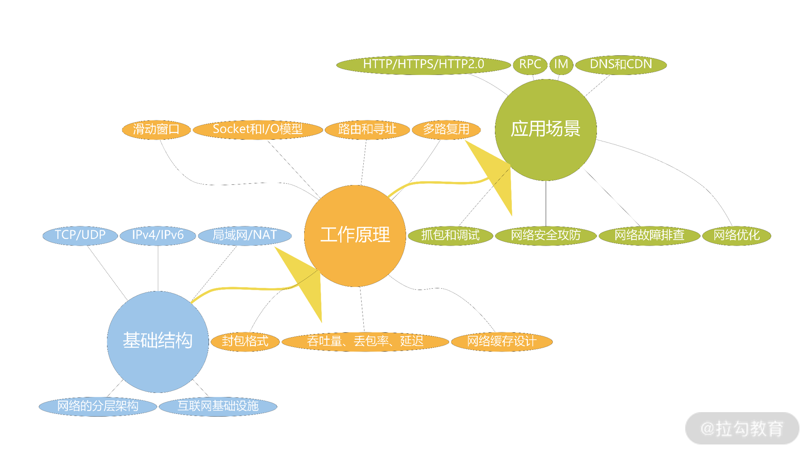
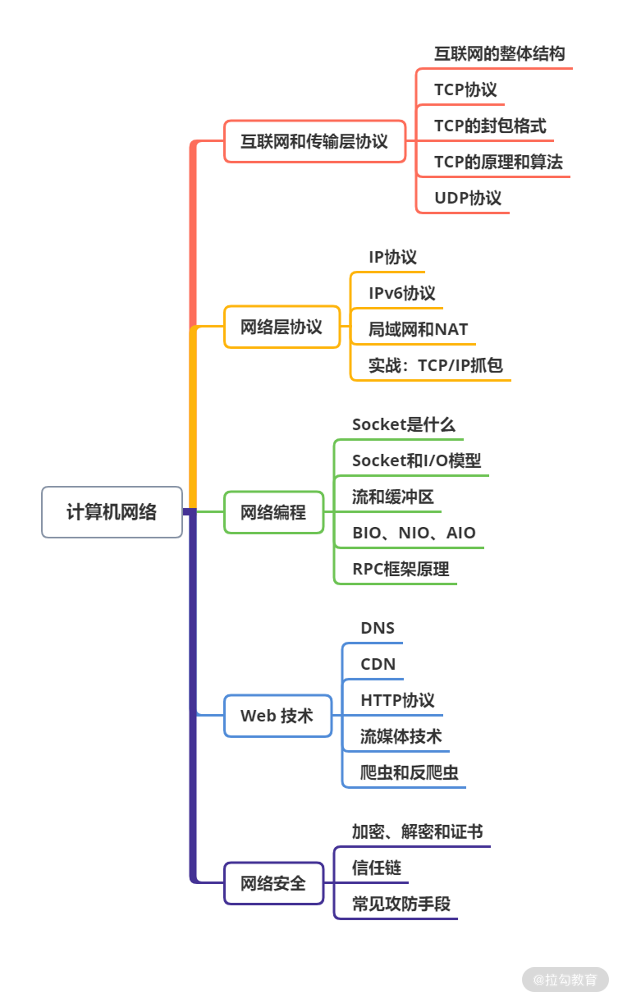
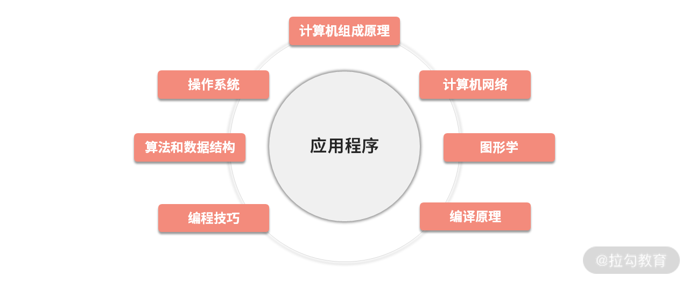

# begin

作为一名程序员，无论是应对日常开发、日常排查，还是解决突发的网络问题(网络调试、网络优化)都离不开计算机网络。

对程序员来说，计算机网络解决的是常识问题，有了这些常识，才能更好地利用工具解决工作中的问题。比如用 telnet 调试远程服务、用 Whireshark 抓包定位网络故障；再比如把 ulimit 设置成多少？Dubbo
异步单一连接扛不住了该怎么办？用 HTTP 协议的 Keep-Alive 维持心跳可不可行？等等。

当你想快速进入一个领域开发程序，马上就会面临诸如: 我用哪个协议？用哪个网络框架？如果计算机网络知识不扎实，很容易选错；另外，你也没有办法优化参数，或者当你承接了系统优化的工作时，如果计网知识不扎实，就会陷入无穷无尽的学习。比如今天碰到
TCP 队头阻塞，明天碰到滑动窗口，后天碰到 ARP 和路由算法。

---
---

## 关于这门课程

本课程从基础结构、工作原理、应用场景三个维度，系统性地梳理和讲解计算机网络知识。

下面从以上三个维度逐一说明。

第一个维度: 网络的基础结构

这块内容是为了带你了解计算机网络的生态和基础设施。比如路由器、交换机、终端、基站等，介绍它们背后隐含的网络，比如公司网络、家庭网络、网络边界等，以及组织它们工作的网络协议栈，TCP/UDP/IP 等。

第二个维度: 工作原理

这块内容将介绍网络的工作原理，里面会涉及一些算法问题，比如滑动窗口、路由和寻址。还会涉及细节问题，比如讲解一些封包格式，但更多的是让你理解网络的工作原理，比如多路复用、缓存设计、Socket、I/O 模型等。

第三个维度: 应用场景

日常工作都在用的东西，比如:

* HTTPS 协议握手的过程
* RPC 是如何工作的
* IM 系统是如何工作的
* 抓包用什么工具
* 要注意什么安全攻防
* 网络出了问题怎么排查

---

## 课程设置

课程分为 5 个模块，共计 29 讲。计算机网络的知识体系图如下:

* 模块一: 互联网和传输层协议。介绍互联网的体系和整体框架，参与的硬件设备，以及它们的作用。还会介绍传输层协议 TCP 和 UDP，重点讨论它们的工作原理、算法和优化策略。这部分知识是计算机网络的基础，也最能体现网络设计的精髓
* 模块二: 网络层协议。围绕局域网和 IP 协议展开，包括 ARP、IPv4、IPv6、NAT 等基本概念，探讨 IPv6 的工作原理，以及 IPv6 和 IPv4 的兼容策略。IP
  协议几乎是网络层的唯一协议，是大厂面试最为热门的内容之一。模块一和模块二属于基础篇，是计算机网络最底层的基础知识
* 模块三: 网络编程。围绕 Socket 讨论网络编程，介绍各种网络 I/O 模型和编程方式的优缺点，并以 RPC 框架设计为题去落地学到的这些知识和实现。讨论在不同的并发量、针对不同服务特性选择不同的 I/O 模型，调整 TCP
  关联的参数等等，进而帮助你学习如何优化自己系统的网络
* 模块四: Web 技术。讨论平时使用最多且最重要的应用层协议——HTTP 协议(包括 HTTP 2.0)，并扩大讨论范围到 Web 技术生态，比如从 DNS 看缓存、从 CDN 看负载均衡、从 HTTP
  协议看开发规范、从流媒体技术看协议选择，以及从爬虫技术看网络安全
* 模块五: 网络安全。讨论网络安全技术，一部分是基础设施，比如证书、加解密、公私钥体系、信任链等；另一部分是具体的攻击手段，比如 DDoS、XSS、SQL 注入、ARP 攻击、中间人攻击等，以及它们的防御手段

技术迭代很快，而计算机网络相关的知识能帮助你更快适应新技术。

---

## 构成应用的基础

构成应用的 7 个方面。

---

### 计算机组成原理

讲述的是计算机是什么？计算是怎么回事？硬件如何为应用提供计算？计算机组成原理中涉及很多有趣的常识问题，比如能不能写一个程序判断计算机是不是开机状态？

---

### 操作系统

操作系统对于我们最大的实践意义是: 如何合理规划应用的生命周期以及资源使用，比如如何处理高并发、如何提升系统的稳定性、如何节约硬件成本等。具体来说学好操作系统，在写应用、服务的时候，就可以对
CPU、磁盘、内存、网络等资源进行合理规划，达到较高的利用率。所以，每个应用开发者都需要重视这块知识。

---

### 计算机网络

计算机网络也是本专栏的主角，讲的是应用之间如何进行通信、如何设计应用之间的契约，形成稳定、高效、规范的协作关系(也就是协议)；并通过优化网络的性能，最终节省成本或者让用户满意。比如你:

* 为了让页面秒开、服务秒回，做出的所有的努力
* 为了优化网络传输细节，去调整 TCP 的滑动窗口
* 为了提升网络的吞吐量、减少延迟，去开启多路复用能力
* 为了避免 Downtime，去调整网络的连接池和线程数
* 为了开发某个应用，尝试去理解一些应用层协议，比如 SSH、RTCP、HTTP2.0， MQTT 等
* 为了做好日常开发，去理解一些基本概念，比如 DNS、CDN、NAT、IPv4/6 等

今天，计算机网络已经成为应用提供价值最重要的一环。

学完计算机组成原理、操作系统、计算机网络这 3 部分知识，所学的基础就形成了一个完整的闭环。此时你对硬件、软件的理解，对性能、缓存的理解，都会更进一步。这些看似独立的知识实则相辅相成，比如:

* 学习网络知识能够让你更深入地看到操作系统的 I/O 和线程模型
* 学习操作系统会看到对网络的监控、故障排查、端口、CPU 和内存的使用
* ......

因此，需要弄清知识之间的内在联系，更有助于形成合力构建自己的知识体系。

---

### 算法和数据结构

算法和数据结构是两种科学，但是又彼此相互关联。算法是一个计算过程，数据结构是数据的组织方式。无论是计算过程还是数据的组织，都需要一个优化的方式——这就是算法和数据结构讨论的问题。

一个问题，有很多种解决方案，那么你想不想知道最优解是什么？虽然在给定资源的条件下，只要资源没有耗尽，问题得到解决，让用户满意，就不需要最优方案——比如最低的延迟、最少的计算时间、最大的空间利用率。

---

### 图形学

图形学讨论的是应用和人之间的交互桥梁。

如果你对未来的世界，比如电影、VR、AR、虚拟世界、自动驾驶等充满好奇和期待， 可以尝试学一下这门课。特别是想学 AI 的同学，要知道，深度学习把数据看作图片，让 AI 下棋，你以为它在思考，其实它只是从很多图形中找到概率特征。

---

### 编程技巧

编程不是算法，编程是语言。语言研究的是怎么表达得更清楚。中国自古有信、达、雅的说法，编程也是这样。算法是解决某个实际问题的计算步骤，研究如何让这个计算步骤以最小的代价实现。而编程研究的是怎么用程序表达，阅读起来更方便、维护起来更简单，代码本身就像注释一样清楚。

这是 7 个方面里面，最重要，也是最难的一门科学。其他 6 种元素(基础知识)，工程师往往学到一定程度，够用就行，而编程的技艺则需要一直深入学习、不断探索。

---

### 编译原理

在没有学习这门课程前，想深入任何一门计算机语言的底层，都会有相当大的难度。编译原理讲述的是程序语言如何被实现、源代码又如何被编译成应用。比如你想了解 JVM、V8 等引擎；想了解 Go/C++ 的编译器，从编译原理学起是不错的选择。

当然，对于应用开发者而言，编译原理提供的最大价值，就是用元编程技术设计自己的领域专有语言，从语言层面降低研发成本、提高交付效率。长此以往，还会发现系统有一些额外的能力是你之前没有想到的。比如 C++ 之父看到有个年轻人用自己设计的 C++
模板在编译阶段计算圆周率，这就是他万万没有想到的额外能力，这种能力被称为模板元编程。

---

## 总结

这是组成应用的 7 种基本科学，要想学好它们，是非常耗时耗力的，但世上无难事，只怕有心人，让我们一起加油吧！

---
---

