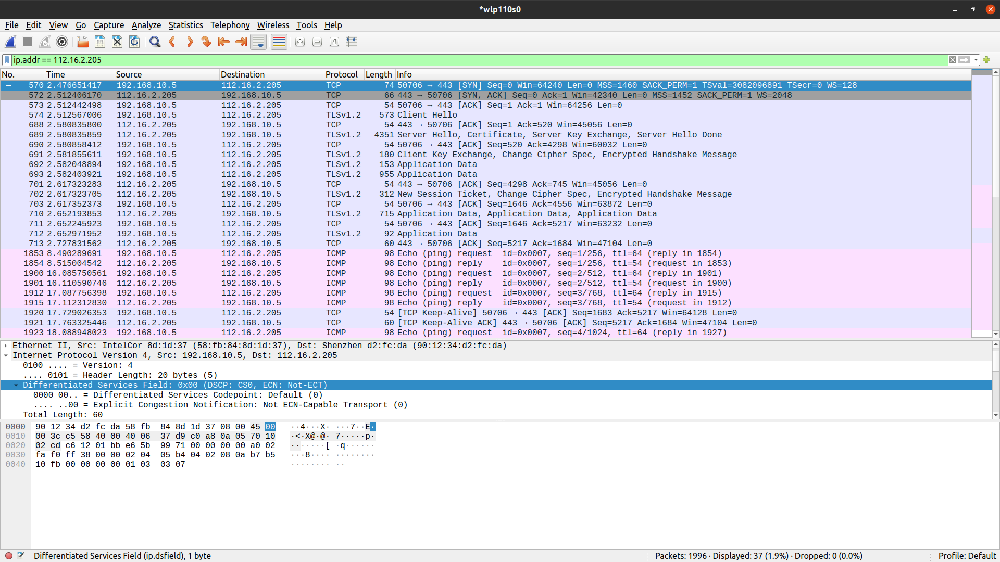
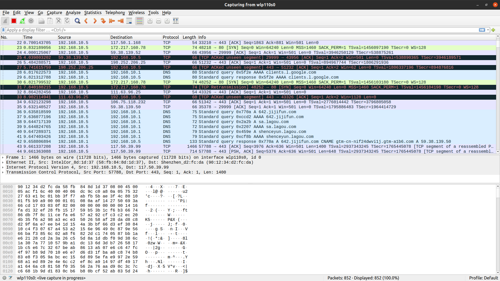

# TCP 实战: TCP 抓包调试

这一讲带来了一个网络调试工具——Wireshark。Wireshark 是世界上应用最广泛的网络协议分析器，它能让我们在微观层面上看到整个网络正在发生的事情。

---
---

## Wireshark

Wireshark 本身是一个开源项目，所以也得到了很多志愿者的支持。同时，Wireshark 具有丰富的功能集，包括:

* 深入检查数百个协议，并不断添加更多协议
* 实时捕获和离线分析
* 支持 Windows、Linux、macOS、Solaris、FreeBSD、NetBSD，以及许多其他平台
* 提供 GUI 浏览，也可以通过 TTY
* 支持 VOIP
* 支持 Gzip
* 支持 IPSec
* ...

Wireshark 的主页: [https://www.wireshark.org/download.html](https://www.wireshark.org/download.html)

---

## 接口列表

Whireshark 可以帮你看到整个网络交通情况，也可以帮你深入了解每个封包。而且 Whireshark 在 macOS、Linux、Windows 上的操作都是一致的，打开 Wireshark
会先看到如下图所示的一个选择网络接口的界面。


选择一个网络接口(Network Interface)。Linux 下可以使用 ifconfig 指令看到所有的网络接口，Windows 下则使用
ipconfig。可以看到，上图中有很多网络接口，目前我教学这台机器上，连接路由器的接口是以太网 2。另外可以看到，我的机器上还有 VMware，docker 的虚拟网络接口。

---

## 开启捕获功能

选择好接口之后，点击左上角的按钮就可以开启捕获，开启后看到的是一个个数据条目。

因为整个网络的数据非常多，大量的应用都在使用网络，你会看到非常多数据条目，每个条目是一次数据的发送或者接收。如下图所示:


以下是具体捕获到的内容:


* 序号(No.)是 Wireshark 分配的一个从捕获开始的编号
* 时间(Time)是从捕获开始过去的时间戳，具体可以在视图中设置，比如可以设置成中文的年月日等
* 源地址和目标地址(Source 和 Destination)是 IP 协议，注意这里有 IPv6 的地址，也有 IPV4 的地址
* 协议可能有很多种，比如 TCP/UDP/ICMP 等，ICMP 是 IP 协议之上搭建的一个消息控制协议(Internet Control Message Protocol)，比如 Ping 用的就是 ICMP；还有 ARP 协议(
  Address Resolution Protocol)用来在局域网广播自己的 MAC 地址
* Length 是消息的长度(Bytes)
* Info 是根据不同协议显示的数据，比如你可以看到在TCP 协议上看到Seq 和 ACK。这里的 Seq 和 ACK 已经简化过了，正常情况下是一个大随机数，Whireshark 帮你共同减去了一个初始值

---

## 观察 TCP 协议

如果具体选择一个 TCP 协议的捕获，可以看到如下图所示的内容:


然后在这下面可以观察到详情内容:


可以从不同的层面来看这次捕获。从传输层看是 TCP 段；从网络层来看是 IP 封包；从链路层来看是 Frame。

点开不同层面观察这个 TCP 段，就可以获得对它更具体的认识，例如下图是从 TCP 层面理解这次捕获:


可以看到这次捕获是一次 ACK(见 Flags)字段，从端口 46804 发往 443，那么大概率是 HTTPS 客户端给服务器的响应。

---

## 消息视图

如果选中一条消息，下面会出现一个消息视图。还有一个二进制视图。二进制视图里面是数据的二进制形式，消息视图是对二进制形式的解读。

Whireshark 追溯的是最底层网卡传输的 Frame(帧)，可以追溯到数据链路层。因此对二进制形式的解读，也就是我们的消息视图也要分层。因为对于同样的数据，不同层的解读是不同的。

* 最上面是 Frame 数据，主要是关注数据的收发时间和大小
* 接着是数据链路层数据，关注的是设备间的传递。你可以在这里看到源 MAC 地址和目标 MAC 地址
* 然后是网络层数据，IP 层数据。这里有 IP 地址(源 IP 地址和目标 IP 地址)；也有头部的 Checksum(用来纠错的)
* 最下面是传输层数据。也就是 TCP 协议。关注的是源端口，目标端口，Seq、ACK 等
* 有的传输层上还有一个 TLS 协议，这是因为用 HTTPS 请求了数据。TLS 也是传输层。TLS 是建立在 TCP 之上，复用了 TCP 的逻辑

---

## 观察 HTTP 协议

Wireshark 还可以用来观察其他的协议，比如说 HTTP 协议，下图是对 HTTP 协议的一次捕获:


可以看到，Wireshark 不仅仅捕获了应用层，还可以看到这次 HTTP 捕获对应的传输层、网络层和链路层数据。

---

## 过滤和筛选

Wireshark 还提供了捕获的过滤，只需要输入过滤条件，就可以只看符合条件的捕获。

比如分析一次到 bilibili 的握手。首先开启捕获，然后在浏览器输入 bilibili 的网址，最后通过 ping 指令看下 bilibili 的 IP 地址:

```shell
$ ping www.bilibili.com
PING a.w.bilicdn1.com (223.111.221.130) 56(84) bytes of data.
64 bytes from 223.111.221.130 (223.111.221.130): icmp_seq=1 ttl=241 time=27.5 ms
64 bytes from 223.111.221.130 (223.111.221.130): icmp_seq=2 ttl=241 time=64.0 ms
64 bytes from 223.111.221.130 (223.111.221.130): icmp_seq=3 ttl=241 time=27.3 ms
64 bytes from 223.111.221.130 (223.111.221.130): icmp_seq=4 ttl=241 time=71.9 ms
...
```

看到 IP 地址之后，在 Wireshark 中输入表达式，如下图所示:



这样看到的就是和 bilibili 关联的所有连接。上图中刚好是一次从建立 TCP 连接(3 次握手)，到 HTTPS 协议传输握手的完整过程。可以只看从 192.168.10.5 到 112.16.2.205 的请求。

首先是从客户端(192.168.10.5)发出的 SYN 和 bilibili 返回的 SYN-ACK，如下图所示:


然后是客户端返回给 bilibili 一个 ACK:


接下来是 HTTPS 协议开始工作(开始握手):


可以看到 HTTPS 协议通过 TLSv1.2 发送了 Client Hello 到服务端。接下来是 Server 返回给客户端 ACK，然后再发送给客户端一个 Server Hello:


之后 bilibili 回传了证书:


最后开始交换密钥，直到 HTTPS 握手结束:


---

## 报文颜色

在抓包过程中，黑色报文代表各类报文错误；红色代表出现异常；其他颜色代表正常传输。



---

## 总结

Wireshark 是个强大的工具，支持大量的协议。还有很多关于 Wireshark 的能力，希望你可以进一步探索，如下图中鼠标右键一次捕获，可以看到很多选项，都是可以深挖的。


---

## 思考题

最后留一道实战题目: 请你用自己最熟悉的语言，写一个 UDP 连接程序，然后用 Wireshark 抓包。

---
---

