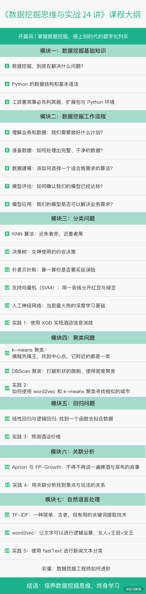

# begin

本课程将从构建数据挖掘思维的角度出发，为你详解数据挖掘，具体分为三大部分:

* 基础知识准备(模块一): 带你建立对数据挖掘的全局认知，学习课程中可能会涉及的一些基础知识(包括必备的Python语言知识，以及如何搭建 Python 环境)。
* 数据挖掘过程(模块二): 授人以鱼不如授人以渔，重点是让你能够在思想和行为上都做足准备，全面细致地了解数挖掘方法的实施过程。同时也会讲到数据挖掘过程中的每一个步骤都会遇到哪些坑
* 算法详解(模块三~模块七):
  涉及数据挖掘的分类、聚类、回归、关联分析这四大问题，以及一些自然语言处理的知识。重点介绍每个算法的理念、优缺点、应用场景，配合一些简短的代码来说明该如何使用。每个模块的最后一个课时，会通过为本课程设计的实践案例，来处理一个个实际问题

课程大纲如下:

---
---

