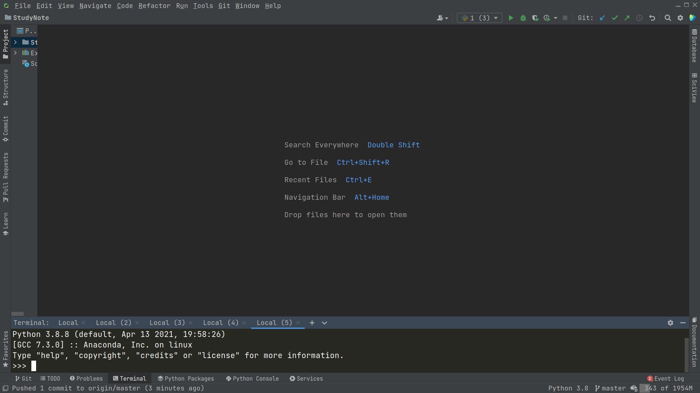
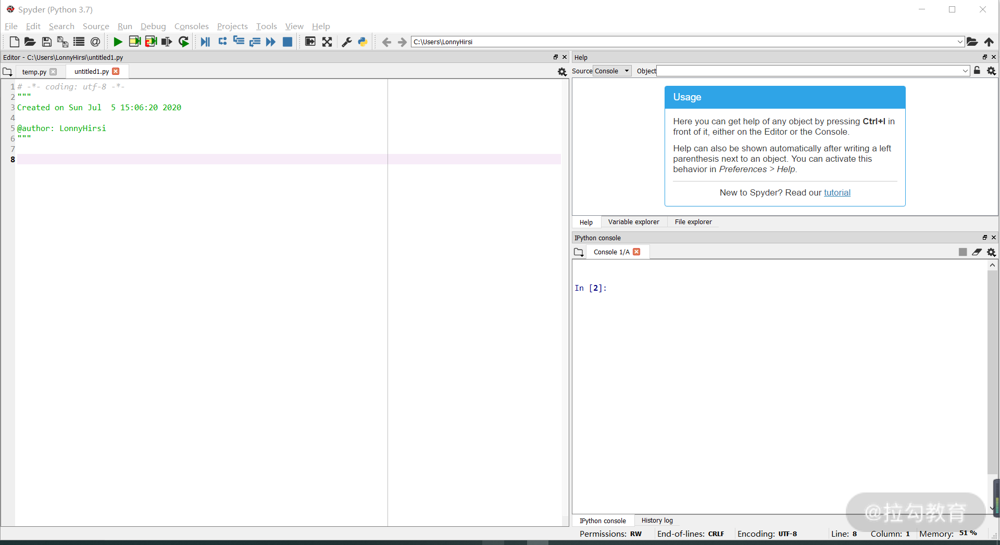
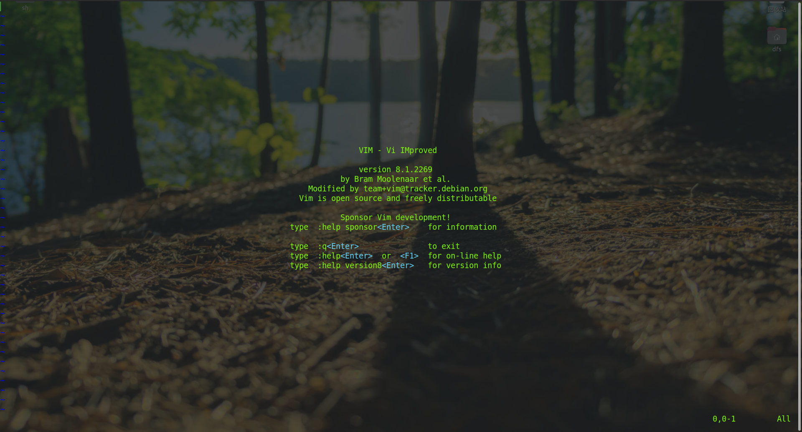
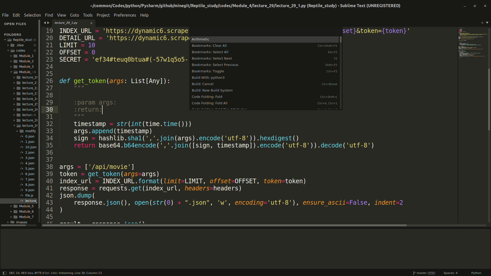
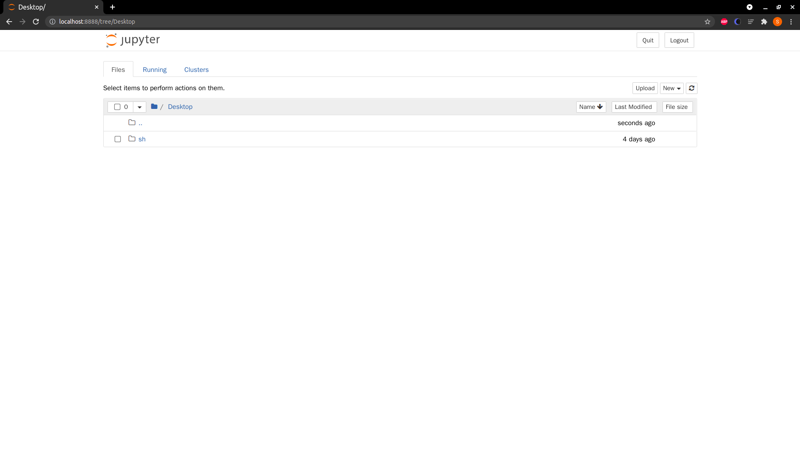
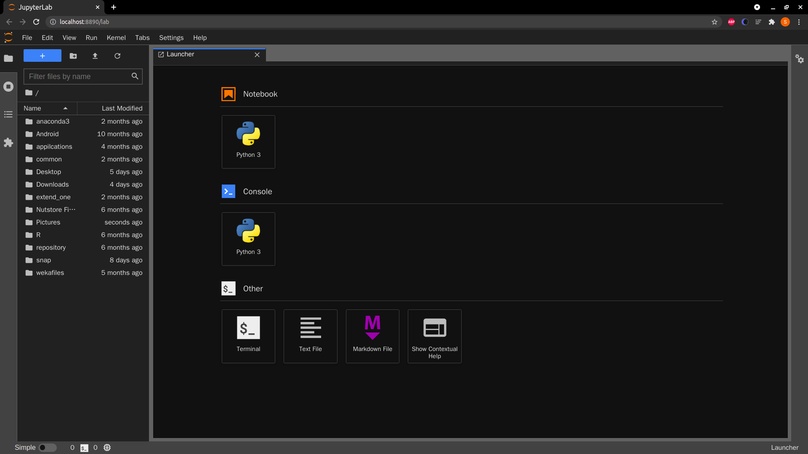
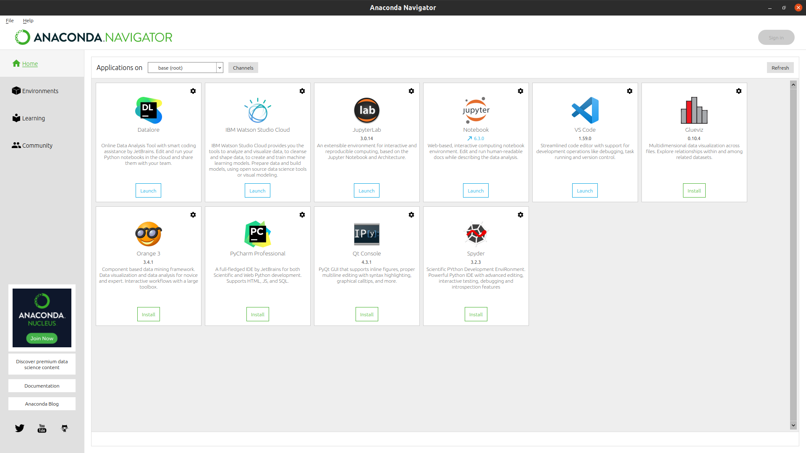

# Python 的数据结构和基本语法

在 [01](lecture_1.md) 课时简单地介绍了数据挖掘是什么、能做什么，以及怎么做。本课时将带你了解数据挖掘需要用到的编程语言——Python，包括其数据结构和基本语法。如果对
Python有一定了解，那么可以直接跳过这部分内容。

---
---

## Python 的介绍

Python 是一门面向对象、直译式编程语言， 编写简单、上手迅速，开源扩展包十分丰富，所以在数据挖掘的前沿科研和工业领域都广受欢迎，有着瑞士军刀般的价值。利用 Python，可以非常方便地开展各种领域的数据挖掘工作。

在后续的课时中，如果没有特殊说明，一般使用的是 Python 3 的语法。因为 Python 3 相比 2 有了很大的调整和改进，对中文的支持也更加友好。

下面先来看一下为什么要用 Python 进行数据挖掘。

---

## Python 的优、缺点

* 优点
    * 简单易学: Python 的代码比较简洁、语法比较规范， 甚至有点像伪代码，很容易上手。如果你有其他编程语言基础的话，那么学习 Python 就会变得很快了。如果你没有学过，也不要担心，市面上关于 Python
      入门的课程非常多，足够满足你的需求
    * 开源: 因为用户可以免费使用，所以不管是在工作中，还是在学习中，使用 Python 的人群都很多，这使得各种更新包层出不穷
    * 可移植性好: 在不同的平台都可以运行，不管是 MacOS、Windows 还是 Linux，唯一需要注意的是运行环境的配置。比如 Python
      中各种包的依赖关系，如果处理不好将导致程序无法运行，要注意避免。下一课时会介绍一种常用的包管理办法
    * 可扩展性: Python 拥有丰富的第三方库，不管是文件操作、网络编程、各种数据库，还是 3D 图形编程都可以运用到

* 缺点
    * 为了使语言更加简便易懂，Python 在底层做了很多工作，所以其运行速度比 C、Java 等要慢很多
    * 由于各种扩展库太庞大，导致配置这些相关包有些困难，比如不同版本的包可能存在不兼容的情况，甚至是 Python 语言本身，在从 2.x 版本升级到 3.x 版本后，很多语句和功能都发生了变化，无法跨版本运行

知道了 Python 的特点之后，下面来了解一下它的数据类型，这对编写代码有很大的帮助。

---

## Python 支持的数据类型

Python 支持的数据类型，如下表所示:

| | | |
|:----:|:----:|:----:|
| 类型名 | 说明 | 描述 | 
| str | 字符串类型 | 一段字符串 |
| int | 整型 | 整数，比如 1、 2、3 |
| float    | 浮点型 | 比如 0.1、0.315 |
| bool | 逻辑值 | true or false |
| complex | 复数 | 数学上的概念 |
| bytes| 字节型 | 原始的数据类型，可以理解为 01 代码 |
| list | 列表 | 有序可修改的列表 |
| tuple | 元组 | 元组比较特别，它是一个不可以修改的有序列表 |
| set | 集合 | 无序，唯一的值的合集 |
| dict(map) | 字典 | 类似于 map |

Python 的数据类型有一个特色，在声明一个变量的时候可以不声明它的类型，而是在赋值时才确定类型。同时在声明的容器型变量(如下面提到的列表、字典等)中，内部的元素类型也是任意的。

由于列表、集合和字典将非常频繁地使用，尤其是在数据挖掘过程中，数据通常都会以向量的方式表示、存储在列表中。所以掌握这些数据类型，以及它们的各种扩展方法是非常有好处的。在这里我会对上述常用的三种数据进行详细的说明，当然数据结构类型远远不止这几种情况，如果感兴趣，可以找其他资料进行深入了解学习。

---

### 列表(list)

列表可以理解为是一个有序可重复的数组，主要用于按顺序存放数据。

首先，来举个例子，下面是一个为列表赋值的语句:

```python
list = ['one', 'two', 3, 4, 5]
```

通过该语句生成了一个列表，即 list，里面有 5 个元素，但它们的类型不一样，前 2 个是字符串，后 3 个是数字。

列表中的元素是有序的，每个元素都有一个位置标记，并且元素可以重复。比如下面这两个语句，即用列表的位置下标来获取对应的元素并输出。我们输出 list[0] 会得到'one'这个单词，因为 one 存放在了 list 的第 0 个位置，而输出
list[4] 会得到数字 5，因为数字 5 存放在了 list 的第 4 个位置，注意，在计算机语言中，一般位置标识都是从 0 开始的。

```python
print(list[0])  # 输出 one 
print(list[4])  # 输出 5
```

列表的基本操作主要有添加、删除、修改等功能，同时 Python 还提供了一系列的扩展功能，如查询列表长度、列表运算，等等。

添加元素

```python
list.append(x)  # 向列表中加入一个新的元素 x
```

删除元素

```python
del list[2]  # 删除了位于位置 2 的元素。注意，此时后面的元素会补充进来，所以位置 2 上仍然是有元素的
```

修改元素、查询列表长度、列表的运算以及判断某一元素是否在列表中

```python
list[2] = 'three'  # 修改位于位置 2 的列表元素 
len(list)  # 返回列表的长度 
list1 + list2  # 列表相加,返回一个新的列表，里面按顺序有 list1 和 list2 的所有元素 
list1 * 2  # 列表重复，返回一个新的列表，里面按顺序出现 list1 中的元素两次 
x in list  # 判断 list 中是否有 x 这个元素
```

除了上述的操作，列表还有很多已经实现好的方法可供你使用，比如列表排序、找到最大值和最小值、逆序排列等。由于功能模块非常多，有需要的时候可以根据自己的需求进行查询，在这里就不一一阐述了。

---

### 集合(set)

集合是一个无序的不重复序列，可以使用大括号 { } 或者 ```set()``` 函数创建集合。需要注意的是，创建一个空集合必须用 ```set()``` 而不能用 { }，因为 { } 是用来创建一个空字典的。

比如要新建一个叫 abc 的集合:

```python
abc = set()  # 这时候就创建了一个空集合
```

添加元素

```python
abc.add(x)  # 向 abc 中加入元素 x
```

删除元素

```python
abc.remove(x)  # 从 abc 中删除元素 x
```

---

### 字典(dict)

字典中存放的每一个元素实际上是一个键值对(key: value)，其中 key 是不能重复的，存入相同的 key，它的 value 会被替换成最新的。dict={} 代表使用大括号声明一个空字典。

字典中的元素可以是任意类型，比如数值、字符串、列表，甚至是字典:

```python
dict = {'a': 1, 'b': 2, 5: 4}
```

向字典中添加键值对

```python
dict['c'] = 3
```

从字典中删除键值对

```python
del dict['a']  # 只需要标记 key 就删除了键值对
```

了解了数据类型，就可以进行简单的语句书写了，不过每种语言都有自己的书写习惯，所以在正式进入代码编写前，先说明一下 Python 的四个注意事项。

---

## 编写 Python 代码的注意事项

---

### 标识符

标识符就是你定义的名称，包括类名、变量名，等等。在 Python 中，标识符的大小写是敏感的，且第一个字符必须是字母表中的字母或"_"。在 Python 3 中，甚至中文也可被用作变量名。

当然，Python 有一些自留标识符，比如 def、true、false 等，我们不能再使用这些作为标识符。

---

### 注释

注释是为了方便阅读代码写的内容，这些内容将不会被解释器解释执行。Python 中有两种注释方法:

第一种是注释单行，可以使用"#"，出现在"#"后面的该行内容将变成注释(如上面代码块中"#输出 one"等)，不会被运行；

第二种是注释一段，可以使用 ''' 或者 """ 来处理多行注释，比如:

```python
''' 
这是一段注释 
这一段内容主要是用来说明的 
好了 这段注释就到这里了 
'''
```

---

### 使用缩进来标记代码块

在很多编程语言中，比如 C++ 和 Java，都是使用大括号 {} 来对代码段进行分割的，但是在 Python 中不需要，而是使用缩进来对代码段进行控制。所以在编写 Python 代码的时候，一定要非常注意缩进规范。

如果你使用 IDE(Integrated Development Environment ，集成开发环境)来编辑代码，一般都会有缩进提醒，但使用文本编辑器就可能会经常遇到缩进的问题了。

比如下面这段正确的代码，就是使用缩进来标记的:

```python
if a > b:
    print("yes")
else:
    print("no")
```

如果写成对齐的样子就会出错，无法输出结果:

```shell
if a > b:
print("yes")
else:
print("no")
```

如果一行代码实在太长，需要把它分割成多行来写，可以使用"\"进行连接，比如:

```shell
num = num + \
            a + \
            b + \
            c
```

如果是在括号里的内容，那就不需要使用"\"，直接换行就行了。

---

### 导入其他模块

在 Python 的扩展中，有很多第三方编写的模块，并且在组织大型项目代码的时候，也会把代码分成好多的模块，这里就涉及导入或者说是引用的问题了。

这时候要用到两个命令 ```import``` 或者 ```from ... import ...```

```import``` 的主要作用是导入整个模块，或者导入模块中的模块；而 ```from ... import ...``` 是从某个模块中导入某个方法(
函数)，比如:

```python
import tensorflow as tf  # 导入 tensorflow 模块，并起一个新名字 tf，这主要是为了方便代码编写 
from model import yolov3  # 从 model 模块导入 yolov3 方法 
from math import *  # 从 math 模块导入所有方法
```

到这里，Python 的基本知识你就都了解了，可以开始学习语句，进行代码编写了。

---

## 常用语句

Python 的语句有很多种，在这里只给大家介绍 3 种常用的，包括条件语句、循环语句和 pass 语句，剩下的语句，如运算符、各种函数功能模块，可以通过搜索资料自行学习。

---

### 条件语句

条件判断是最常用到的方法，可以用来各种情况的判定，从而影响语句的执行，使用方法如下:

```python
if 条件:
    执行
elif 条件:
    执行
else:
    执行
```

```python
# 具体的例子，找到 a、b、c 中最大的数,其中 and 是逻辑运算符"且"的意思 
if a > b and a > c:
    print(a)
elif b > a and b > c:
    print(b)
else:
    print(c)
```

---

### 循环语句

循环语句相关的主要有 while 语句、for 语句、continue 语句、break 语句。

while 循环

```python
# a>b 循环输出a，b加1，直到 a<=b 循环终止 
while a > b:
    print(a)
    b = b + 1
```

for 循环

```python
# i 在区间 0-100 循环输出 i，即从 0 开始到 100 循环终止 
for i in range(0, 100):
    print(i)
```

continue 跳过

```python
# i 在区间 0-100 循环输出 i，但是如果 i 小于 50 就跳过本次，下面的 print 语句得不到执行，一直循环到 i>=50 才会执行 print 
for i in range(0, 100):
    if i < 50:
        continue
    print(i)
```

break 终止循环

```python
# i 在区间 0-100 循环输出 i，当 i>50 的时候遇到 break，该循环被终止了，所以这个循环只能输出前 50 次 
for i in range(0, 100):
    print(i)
    if i > 50:
        break
```

---

### pass 语句

在 Python 中有一个特别的语句，那就是 pass 语句，该语句代表什么都没有，主要用于一些特殊的位置。如果在一段代码中必须要写一些语句，又不能产生任何影响，就可以使用 pass 语句。

比如想写一个代码，当 i < 50 的时候什么都不做，就可以这么写:

```python
for i in range(0, 100):
    print(i)
    if i < 50:
        pass
    else:
        print(i)
```

在实际编写代码的时候，有些位置可能想要写一些功能，但是还没有想好要怎么写，比如你定义了一个函数，但是函数的具体内容还没确定，此时就可以预留出一些位置暂时写上 pass 语句，从而不会影响代码的运行。

工欲善其事，必先利其器。想用 Python 写出漂亮的代码，没有合适的编辑器怎么行。下面就给你介绍 5 种 Python 编辑器，希望你能找到合适的工具。

---

## Python 的编辑器

---

### PyCharm

PyCharm 是由大名鼎鼎的 JetBrains 开发的，它是一款 Python 专用 IDE，不用说它的功能十分强大，开发版是免费的，通常可以满足一般开发者的需求，但如果你有大型项目开发的需求，那么可以选择购买一个专业版的。



---

### Spyder

推荐这个 IDE 的不多，但是在 Anaconda(下一课时会具体介绍)中集成了这个 IDE，而且是免费的，它的功能没有 PyCharm 那么强大，但对于日常实验也够用了。



---

### VIM

关于 VIM 就不多做介绍了，在 Linux 系统上，尤其是服务器上，最常用的文本编辑软件。



---

### Sublime

SublimeText 是一款用于代码、标记和散文的精致文本编辑器，它与 VIM 一样都属于文本编辑器，界面简洁清爽，反应十分迅速，其优势是扩展了代码开发的功能，支持代码高亮、语法提示等功能。



---

### Jupyter Notebook

Jupyter Notebook 是基于网页的用于交互计算的应用程序。其可被应用于全过程计算: 开发、文档编写、运行代码和展示结果。

它的好处就是轻量，而且对于数据的可视化非常友好，对于一些小型实验，或者数据分析，使用Jupyter Notebook 非常方便。





在 Anaconda 里面也集成了 Jupyter Notebook，有兴趣可以深入探索。



---

## 总结

因为在后续的课程中，会使用 Python 编写代码，所以在这一课时介绍了一些 Python
语言的基础知识。由于篇幅的限制，这里所列出的只是该语言中最最基本的部分，有很多细节都没有一一展开。如果对实际的代码编写有很大兴趣，可以自己购买一些书籍或课程进行更加深入的学习。

---
---

