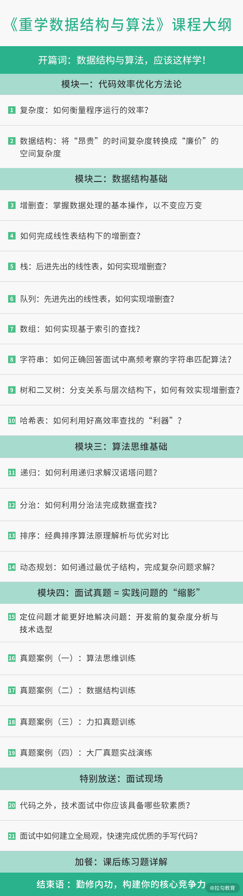

# begin

这门课包括了四个方面，方法论、基础知识、真题演练、面试技巧。具体包括以下五部分内容。

* 第一部分: 方法论，也就是把"烂"代码优化为高效率代码的方法和路径，是这门课关于代码开发与优化方法框架的总纲。代码的目标，除了完成任务，还要求把某项任务高效率地完成
* 第二部分:
  在方法论的指引下，补充必备的数据结构基础知识。复杂度的降低，要求对数据有更好的组织方式，这正是数据结构需要解决的问题。为了合理选择数据结构，需要全面分析任务对数据处理和计算的基本操作，再根据不同数据结构在这些基本操作中的优劣特点去灵活选用合适的数据结构
* 第三部分:
  在方法论的指引下，掌握必备的算法思维，也就是用算法思考问题的逻辑和程序设计的重要思想。在一些实际问题的解决中，需要运用一些巧妙的方法，它们不会改变数据的组织方式，但可以通过巧妙的计算方式降低代码复杂度。常见的方法，如递归、二分法、排序算法、动态规划等，会在这一部分介绍
* 第四部分:
  面试真题详解，用前面的知识体系，去真正地解决问题。前三部分的知识合在一起，就是解决实际问题的工具包。面试题并非单纯考核人才的工具，更是实际业务问题高度提炼后的缩影，它能反映一个开发者的知识储备和问题解决能力。这一部分将深入剖析高频真题的解题方法和思路
* 第五部分: 面试现场，给予一些求职时的切实建议。很多工程师有个共性问题，那就是明明有能力，却说不出来，表现得就像是个初学者一样。这部分通过补充面试经验，包括现场手写代码、问题分析、面试官注重的软素质等内容，来帮解决这个问题

课程大纲如下:

 
---
---

