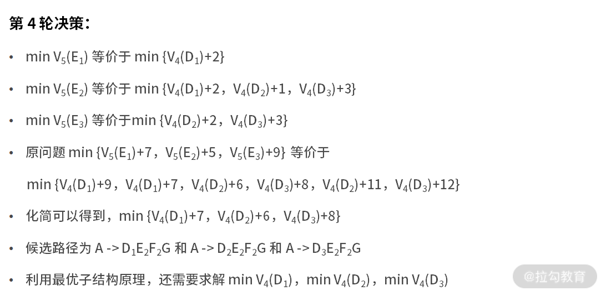

# 动态规划: 如何通过最优子结构，完成复杂问题求解

前面课时学习了分治法的思想，并以二分查找为例介绍了分治的实现逻辑。

前面提到过，分治法的使用必须满足 4 个条件:

* 问题的解决难度与数据规模有关
* 原问题可被分解
* 子问题的解可以合并为原问题的解
* 所有的子问题相互独立

然而在实际工作中还存在这样一类问题，它们满足前 3 个条件，唯独不满足第 4 个条件。那么这类问题该怎么解决呢？本课时就来学习求解这类问题的动态规划算法，它是最常用的算法之一。

---

## 什么是动态规划

从数学的视角来看，动态规划是一种运筹学方法，是在多轮决策过程中的最优方法。

那么，什么是多轮决策呢？其实多轮决策的每一轮都可以看作是一个子问题。从分治法的视角来看，每个子问题必须相互独立。但在多轮决策中，这个假设显然不成立。这也是动态规划方法产生的原因之一。

动态规划是面试过程中的难点。虽然动态规划很难，但在实际的工作中，使用频率并不高，不是所有的岗位都会用到动态规划。

---

## 最短路径问题

接下来看一个非常典型的例子，最短路径问题。如下图所示:


每个结点是一个位置，每条边是两个位置之间的距离。现在需要求解出一条由 A 到 G 的最短距离是多少。

不难发现，需要求解的路线是由 A 到 G，这就意味着 A 要先到 B，再到 C，再到 D，再到 E，再到 F。每一轮都需要做不同的决策，而每次的决策又依赖上一轮决策的结果。

例如，做 $D_{2} -> E$ 的决策时，$D_{2} -> E_{2}$ 的距离为 1，最短。但这轮的决策，基于的假设是从 $D_{2}$ 出发，这就意味着前面一轮的决策结果是 $D_{2}$。由此可见，相邻两轮的决策结果并不是独立的。

动态规划还有一个重要概念叫作状态。在这个例子中，状态是个变量，而且受决策动作的影响。例如，第一轮决策的状态是 $S_{1}$，可选的值是 A，第二轮决策的状态是 $S_{2}$，可选的值就是 $B_{1}$ 和 $B_{2}$。以此类推。

---

## 动态规划的基本方法

动态规划问题之所以难，是因为动态规划的解题方法并没有那么标准化，它需要你因题而异，仔细分析问题并寻找解决方案。虽然动态规划问题没有标准化的解题方法，但它有一些宏观层面通用的方法论:

下面的 k 表示多轮决策的第 k 轮

* 分阶段。将原问题划分成几个子问题。一个子问题就是多轮决策的一个阶段，它们可以是不满足独立性的
* 找状态。选择合适的状态变量 $S_{k}$。它需要具备描述多轮决策过程的演变，更像是决策可能的结果
* 做决策。确定决策变量 $u_{k}$。每一轮的决策就是每一轮可能的决策动作，例如 $D_{2}$ 的可能的决策动作是 $D_{2} -> E_{2}$ 和 $D_{2} -> E_{3}$
* 状态转移方程。这个步骤是动态规划最重要的核心，即 $s_{k+1}= u_{k}(s_{k})$
* 定目标。写出代表多轮决策目标的指标函数 $V_{k,n}$
* 寻找终止条件

了解了方法论、状态、多轮决策之后，再补充一些动态规划的基本概念。

* 策略，每轮的动作是决策，多轮决策合在一起常常被称为策略
* 策略集合，由于每轮的决策动作都是一个变量，这就导致合在一起的策略也是一个变量。通常会称所有可能的策略为策略集合。因此，动态规划的目标，也可以说是从策略集合中，找到最优的那个策略

一般而言，具有如下几个特征的问题，可以采用动态规划求解:

* 最优子结构。它的含义是，原问题的最优解所包括的子问题的解也是最优的。例如，某个策略使得 A 到 G 是最优的。假设它途径了 $F_{i}$，那么它从 A 到 $F_{i}$ 也一定是最优的
* 无后效性。某阶段的决策，无法影响先前的状态。可以理解为今天的动作改变不了历史
* 有重叠子问题。也就是，子问题之间不独立。这个性质是动态规划区别于分治法的条件。如果原问题不满足这个特征，也是可以用动态规划求解的，无非就是杀鸡用了宰牛刀

---

## 动态规划的案例

到这里，动态规划的概念和方法就讲完了。接下来以最短路径问题再来看看动态规划的求解方法。在这个问题中，可以采用最暴力的方法，那就是把所有的可能路径都遍历一遍，去看哪个结果的路径最短的。如果采用动态规划方法，那么按照方法论来执行。

---

### 动态规划的求解方法

具体的解题步骤如下:

* 分阶段
    * 很显然，从 A 到 G，可以拆分为 $A -> B、B -> C、C -> D、D -> E、E -> F、F -> G$，6 个阶段
* 找状态
    * 第一轮的状态 $S_{1} = A$，第二轮 $S_{2} = \{B_{1},B_{2}\}$，第三轮 $S_{3} = \{C_{1},C_{2},C_{3},C_{4}\}$，第四轮 $S_{4} = \{D_{1},D_
      {2},D_{3}\}$，第五轮 $S_{5} = \{E_{1},E_{2},E_{3}\}$，第六轮 $S_{6} = \{F_{1},F_{2}\}$，第七轮 $S_{7} = \{G\}$
* 做决策
    * 决策变量就是上面图中的每条边。以第四轮决策 $D -> E$ 为例来看，可以得到 $u_{4}(D_{1})，u_{4}(D_{2})，u_{4}(D_{3})$。其中 $u_{4}(D_{1})$ 的可能结果是 $E_{1}$
      和 $E_{2}$
* 写出状态转移方程
    * 在这里，就是 $s_{k+1} = u_{k}(s_{k})$
* 定目标
    * 别忘了，我们的目标是总距离最短。定义 $d_{k}(s_{k},u_{k})$ 是在 $s_{k}$ 时，选择 $u_{k}$ 动作的距离。例如，$d_{5}(E_{1},F_{1}) = 3$。那么此时 n =
      7，则下式就是最终要优化的目标

$$ 
V_{K,7}(S_{1}=A,S_{7}=G)=\sum_{K=1}^{n}d_{k}(s_{k},u_{k})
$$

* 寻找终止条件
    * 很显然，这里的起止条件分别是，$s_{1} = A$ 和 $s_{7} = G$
    * 接下来把所有的已知条件，凝练为上面的符号之后，只需要借助最优子结构，就可以把问题解决了。最优子结构的含义是，原问题的最优解所包括的子问题的解也是最优的
    * 套用在这个例子的含义就是，如果 $A -> ... -> F_{1} -> G$ 是全局 A 到 G 最优的路径，那么此处 $A -> ... -> F_{1}$ 也是 A 到 $F_{1}$ 的最优路径
    * 因此，此时的优化目标 $min V_{k,7}(s_{1}=A,s_{7}=G)$，等价于 $min \{V_{k,6}(s_{1}=A, s_{6}=F_{1})+4, V_{k,6}(s_{1}=A, s_{6}=F_{2})+3\}$
    * 此时，优化目标的含义为，从 A 到 G 的最短路径，是 A 到 $F_{1}$ 到 G 的路径和 A 到 $F_{2}$ 到 G 的路径中更短的那个
    * 同样的，对于上面式子中，$V_{k,6}(s_{1}=A,s_{6}=F_{1})$ 和 $V_{k,6}(s_{1}=A,s_{6}=F_{2})$，仍然可以递归地使用上面的分析方法

---

### 计算过程详解

好了，为了让大家清晰地看到结果，下面给出详细的计算过程。为了书写简单，这里把函数 $V_{k,7}(s_{1}=A, s_{7}=G)$ 精简为 $V_{7}(G)$，含义为经过了 6 轮决策后，状态到达 G 后所使用的距离。


优化目标为 $min V_{k,7}(s_{1}=A, s_{7}=G)$，因此精简后原问题为，$min V_{7}(G)$。





因此，最终输出路径为 $A -> B_{1} -> C_{2} -> D_{1} -> E_{2} -> F_{2} -> G$，最短距离为 18。

---

### 代码实现过程

接下来尝试用代码来实现上面的计算过程。对于输入的图，可以采用一个 m x m 的二维数组来保存。在这个二维数组里，m 等于全部的结点数，也就是结点与结点的关系图。而数组每个元素的数值，定义为结点到结点需要的距离。


在本例中，可以定义输入矩阵 m(空白处为0)，如下图所示:


[代码](../../codes/module_3/LectureFourteen.java) 如下:

```java 
public static void main(String[] args) {
    int[][] m = { { 0, 5, 3, 0, 0, 0, 0, 0, 0, 0, 0, 0, 0, 0, 0, 0 },
                { 0, 0, 0, 1, 3, 6, 0, 0, 0, 0, 0, 0, 0, 0, 0, 0 }, 
                { 0, 0, 0, 0, 8, 7, 6, 0, 0, 0, 0, 0, 0, 0, 0, 0 },
                { 0, 0, 0, 0, 0, 0, 0, 6, 8, 0, 0, 0, 0, 0, 0, 0 }, 
                { 0, 0, 0, 0, 0, 0, 0, 3, 5, 0, 0, 0, 0, 0, 0, 0 },
                { 0, 0, 0, 0, 0, 0, 0, 0, 3, 3, 0, 0, 0, 0, 0, 0 },
                { 0, 0, 0, 0, 0, 0, 0, 0, 8, 4, 0, 0, 0, 0, 0, 0 },
                { 0, 0, 0, 0, 0, 0, 0, 0, 0, 0, 2, 2, 0, 0, 0, 0 }, 
                { 0, 0, 0, 0, 0, 0, 0, 0, 0, 0, 0, 1, 2, 0, 0, 0 },
                { 0, 0, 0, 0, 0, 0, 0, 0, 0, 0, 0, 3, 3, 0, 0, 0 }, 
                { 0, 0, 0, 0, 0, 0, 0, 0, 0, 0, 0, 0, 0, 3, 5, 0 },
                { 0, 0, 0, 0, 0, 0, 0, 0, 0, 0, 0, 0, 0, 5, 2, 0 }, 
                { 0, 0, 0, 0, 0, 0, 0, 0, 0, 0, 0, 0, 0, 6, 6, 0 },
                { 0, 0, 0, 0, 0, 0, 0, 0, 0, 0, 0, 0, 0, 0, 0, 4 },
                { 0, 0, 0, 0, 0, 0, 0, 0, 0, 0, 0, 0, 0, 0, 0, 3 } };
    System.out.println(minPath1(m));
    // 18
}

public static int minPath1(int[][] matrix) {
    return process1(matrix, matrix[0].length - 1);
}

// 递归
public static int process1(int[][] matrix, int i) {
    // 到达A退出递归
    if (i == 0) {
        return 0;
    }
    // 状态转移
    else {
        int distance = 999;
        for (int j = 0; j < i; j++) {
            if (matrix[j][i] != 0) {
                int d_tmp = matrix[j][i] + process1(matrix, j);
                if (d_tmp < distance) {
                    distance = d_tmp;
                }
            }
        }
        return distance;
    }
}
```

---

### 代码解读

下面对这段代码进行解读:

代码的 1 行是主函数，在代码中定义了二维数组 m，对应于输入的距离图。m 是 15 x 16 维，忽略了最后一行的全 0(即使输入也不会影响结果)。

然后调用函数 minPath1。在第 2 到第 4 行，它的内部又调用了 ```process1(matrix, matrix[0].length-1)```。在这里，```matrix[0].length-1``` 的值是
15，表示的含义是 matrix 数组的第 16 列(G)是目的地。

接着进入 process1 函数中。我们知道在动态规划的过程中，是从后往前不断地推进结果，这就是状态转移的过程。对应代码中的 13-24 行:

* 第 15 行开始循环，j 变量是纵向的循环变量。
* 第 16 行判断 matrix[j][i] 与 0 的关系，含义为，只有值不为 0 才说明两个结点之间存在通路
* 一旦发现某个通路，就需要计算其距离。计算的方式是 17 行的，```d_tmp = matrix[j][i] + process1(matrix, j)```
* 当得到了距离之后，还需要找到最短的那个距离，也就是 18 到 20 行的含义。这就是动态规划最优子结构的体现
* 一旦 i 减小到了 0，就说明已经到了起点 A。那么 A 到 A 的距离就是 0，直接第 10 行的 return 0 就可以了

经过运行，这段代码的输出结果是 18，这与手动的推导结果一致。

---

## 练习题

在 [08](../module_2/lecture_8.md) 课时讲述"字符串匹配算法的案例"时提到过，最大公共子串也可以使用动态规划的方法来做。

案例题目如下:

假设有且仅有 1 个最大公共子串。比如，输入 a ="13452439"，b ="123456"。由于字符串"345"同时在 a 和 b 中出现，且是同时出现在 a 和 b 中的最长子串。因此输出"345"。

本节就把这个问题当作本课时的练习题。详细分析和答案，请翻阅 16 课时例题 3。

---

## 总结

动态规划领域有很多经典问题，本课时，讲述了最短路径的问题。需要明确的是，动态规划并不简单，动态规划的适用范围也没有那么广。如果不是专门从事运筹优化领域的工作，对它不了解也很正常。如果在求职过程中，你求职的岗位与运筹优化关系不大，一般而言被考察到动态规划的可能性也是极低的。

---
---

