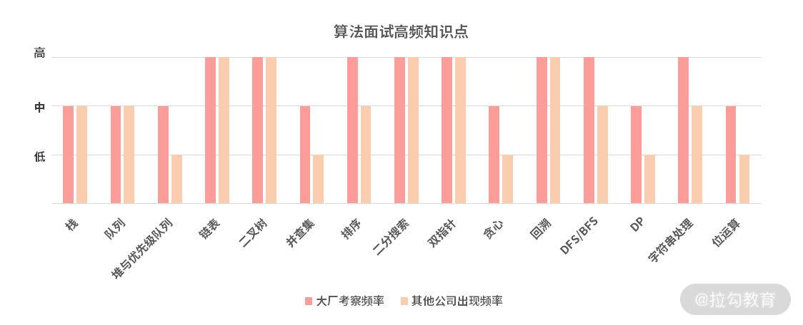
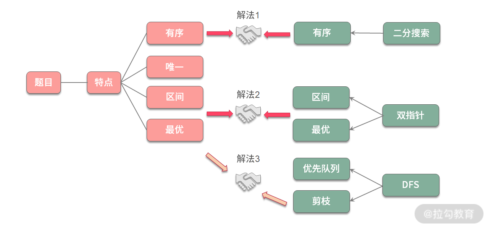
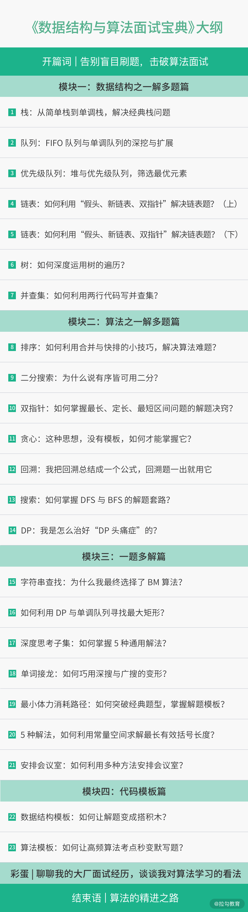

# begin

本专栏以解题为核心，并以 300+ 道大厂高频面试题作为切入点，引出很多在面试中常踩的坑和卡壳的知识点，给出一套通用的解题方法论。

这里面既有经验与教训的总结，也有各种值得玩味的真题及变形题。

---
---

## 课程设置

本课程旨在带你圈考点、破难点、练真题、模拟考备战。为此，专栏精心设计为 4 个模块，合计 23 讲循序展开。

* 模块一: 数据结构之一解多题篇。这一模块由高频数据结构面试题，引出常考的栈及单调栈、队列及单调队列；重点介绍如何"三板斧"
  搞定链表题，如何使用树的三种遍历搞定所有二叉树题目，通过树的遍历展开介绍排序技巧的妙用。在这里会带你掌握常考数据结构的各种特点、各种变形及各种考点
* 模块二: 算法之一解多题篇。这一模块将从常规的二分搜索过渡到高阶二分搜索，再从 3 种区间套路介绍双指针解题场景。重点介绍算法面试中常考的贪心、回溯、搜索及动态规划。帮助你快速建立常考算法题的系统框架
* 模块三: 一题多解篇。 这一模块会带你挖掘题目的特点，再对标不同的数据结构与算法，从而得出不同的解法。本模块精选出 7 道高频面试题，涵盖动态规划、单调栈、优先级队列、位运算、DFS/BFS、KMP/BM
  等算法的实际应用，帮助你掌握快速审题和解题的能力

* 模块四: 代码模板篇。本模块将常见的"套路"题，总结成了手写代码时应该准备的各种代码模板。还会把压箱底的独家代码模板分享给你。此外，还把面试中高频的知识点拆分成了一块块"积木"，将面试求解过程变成了"搭积木的游戏"
  ，帮助你在面试时写出更高效和 0 Bug 的代码

课程目录如下:

---

## 课程亮点

本课程亮点如下

* 一解多题，一题多解
    * 刷题，不在于多，而在于精，关键在于锻炼你挖掘题目特点，总结算法与数据结构的对应特点，以及整理代码模板的能力。"一解多题"与"一题多解"的讲解设计，可以帮你沉淀通用的解题方法论。
* 一道题目，3 种代码实现
    * 每一道题目，都会基于案例分析，提供 Java、C++、Python 三种实现方案，方便学习和改造，满足不同领域的工作和面试需求。
* 思维导图，启发引导
    * 通过思维导图，先串联每一道题目的解题思路，给出每种题型的套路框架；然后在每一讲的结尾部分带你总结讲过的算法知识，让原本没有联系的算法、数据结构知识相互之间产生化学反应，巩固算法知识体系。

* 动画图解
    * 以直观的图形，有趣的动画来表达数据结构与算法的操作步骤，帮助梳理解题思路，让枯燥的算法"动"起来。

一个技术课程，不是一些散文的合集，而是非常结构化和紧密耦合的知识体系。算法与数据结构的学习过程尤其如此，在学习和实践的过程中需要不断思考总结，当你有了一定的积累之后，相互割裂的知识很自然就会联系起来形成交叉火力，各种变形的面试题目在你面前将再无死角。

---
---

