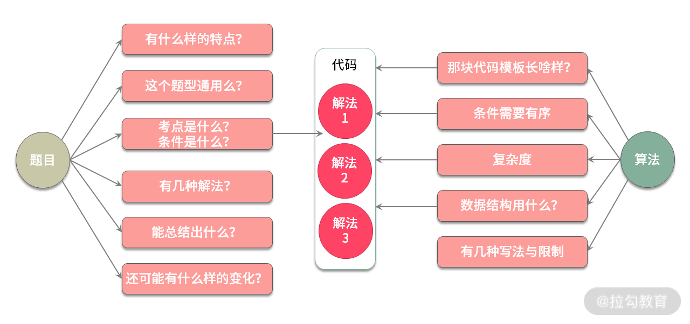

# begin

算法和数据结构最能体现一个人的基本功。基本功扎实的人，无论是做工程还是去做算法，都不会差到哪里去。面试招人的时候都有一个标准: 招进来的这个人至少要排到团队里面前
50%。只有这样招进来的人才能够让团队更加强大。不可能招一个很差的人来拉低平均水平，怎么评判这个人能够在团队里面排到前 50% 呢？其实是有很多标准的，包括逻辑思维能力、系统设计能力、职业素养，等等，而算法数据结构是里面最基础最重要的一个。

数据结构与算法能力的考核在以 BAT 为代表的国内大厂，乃至硅谷高科技公司的面试里占了相当大的比重。总结起来，考察的原因有四:

* 算法能力能够准确辨别一个程序员的技术功底是否扎实
* 算法能力是发掘程序员的学习能力与成长潜力的关键手段
* 算法能力能够协助判断程序员在面对新问题时，分析并解决问题的能力
* 算法能力是设计一个高性能系统的必备基础

课程由 4 部分组成:

* 第一部分是实用的数据结构，包括数组、字符串、链表、队列、树、栈、队列、图、前缀树、分段树和树状数组等
* 第二部分讲面试中所有的常用算法，比如如何使用归并、快排、拓扑，如何二分查找、递归、回溯，以及广度与深度优先、动态规划等
* 第三部分优选力扣(LeetCode)高频算法面试真题，进行全面剖析，通过实操来提升自己的面试能力
* 最后一部分，我也将会分享一些关于简历的制作、力扣(LeetCode)模拟面试、面试技巧经验、以及面试官所看重的那些软实力、如何提高印象分等内容，帮你冲刺心仪的高薪 Offer

可以看到，除了分享数据结构基础、算法解题思路，课程中还会讲一些算法面试的通用方法: 比如怎么分析题目、难题如何解、不会怎么办，如何提高印象分等等。

那么，这门课程就介绍完了。从下节课开始，会先来讲解算法面试中常用的数据结构和技巧，帮助你为学好后续课程打下一个坚实的基础。

---
---

