# 从神经元说起: 数学篇

先来看本课程的第一节课，[01 | 从神经元说起: 数学篇](lecture_1.md)
。说到深度学习，很多人都以为它很深奥、很难，需要很多数学知识。其实并不是这样的，本科的数学知识已经足够你掌握中等水平的深度学习了。在这一节也会带你了解后续课程中会用到的，深度学习中的基础数学知识。

这一节，除了介绍数学计算规则之外，还会使用 Python 程序代码的方式进行实际演示，这可以让你更加直观地了解你学习的知识是如何在实际中应用的。我会从使用最多的，也是较为重要的线性代数、微积分和信息论这 3
个部分出发，带你了解深度学习中的数学部分。

---
---

## 线性代数部分知识点回顾

深度学习背后的核心是标量、向量、矩阵和张量这 4 种数据结构，我们可以通过使用这些数据结构，以编程的方式解决所有基本的线性代数问题。会在后续介绍 TensorFlow
的时候再对张量进行介绍。除此之外，我增加了范数的概念，这个知识点在后续的函数优化方面有着很重要的作用。

先来了解一下标量和向量。

---

### 标量

标量，实际上就是一个单独的数。代码如下:

```python
a = 1.0
print(type(a))
# Get <class 'float'>
b = 5
print(type(b))
# Get <class 'int'>
```

---

### 向量及其运算

一个向量表示一组有序排列，并可以通过索引获取其中对应位置的数值。一般情况下会选择 NumPy 对向量进行表示和计算。NumPy 是 Python
的一个扩展程序库，能够很好地支持数组、向量、矩阵的运算。它的官网地址为: [https://numpy.org/](https://numpy.org/)

来看一下向量是如何基于 NumPy 运算的。

---

#### 向量和标量的计算

刚才讲到，标量是一个数字，所以标量在跟向量进行加减乘除的时候，实际上与向量中的每一个数字都同步进行了计算。[代码](../../codes/module_1/l_1_1.py) 如下:

```python
import numpy as np

a = np.array([1, 2, 3, 4])
print(a * 4)
# Get array([4, 8, 12, 16])
print(a + 4)
# Get array([5, 6, 7, 8])
```

---

#### 向量之间的加减操作

向量之间的加减操作是各自对应位置的加减操作。因为 Python 的数组相加是列表的拼接操作，所以在 Python 中，向量的计算不能使用 Python 数组的计算方法。

例如，给定如下图的两个向量，经过加操作之后，就得到了如下的结果。

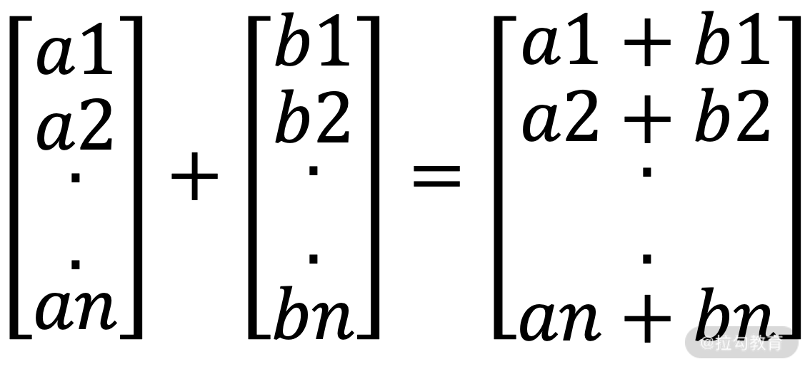

[代码](../../codes/module_1/l_1_2.py) 如下:

```python
import numpy as np

x = [1, 2, 3]
y = [4, 5, 6]
print(x + y)
# Get: [1, 2, 3, 4, 5, 6]
print(np.add(x, y))
# Get: array([5, 7, 9])
```

---

#### 向量之间的乘法操作

向量之间的乘法操作主要分为点乘(内积)、叉乘(外积)和对应项相乘。

先来看向量的点乘。

向量的点乘，也叫向量的内积、数量积，对两个向量执行点乘运算，就是对这两个向量对应位一一相乘之后求和的操作，点乘的结果是一个标量。给定两个向量: $a=[a_1, a_2,...,a_n]$ 和 $b=[b_1, b_2,...,b_n]$，则 a 和 b 的点乘计算方式为
$a \cdot b = a_1b_1+a_2b_2+....+a_nb_n$。

向量的点乘要求两个向量的长度一致。

其次是向量的叉乘。

向量的叉乘，也叫向量的外积、向量积。叉乘的运算结果是一个向量而不是一个标量。叉乘用得较少，这里就不多介绍。

最后是对应项相乘。

对应项相乘，顾名思义，就是两个向量对应的位置相乘，得到的结果还是原来的形状。给定两个向量: $a=[a_1, a_2,...,a_n]$ 和 $b=[b_1, b_2,...,b_n]$，则 a 和 b 的对应项相乘计算方式为 $a*b = [a_1b_1,a_2b_2...a_nb_n]$。

点乘、叉乘及对应项相乘的 [代码](../../codes/module_1/l_1_3.py) 如下所示:

```python
import numpy as np

a = np.array([1, 2, 3, 4])
b = np.array([5, 6, 7, 8])
print(np.inner(a, b))
# 点乘: Get 70
print(np.outer(a, b))
# 叉乘: Get
# array([[5, 6, 7, 8],
#        [10, 12, 14, 16],
#        [15, 18, 21, 24],
#        [20, 24, 28, 32]])
print(np.multiply(a, b))
# 对应项相乘: Get array([ 5, 12, 21, 32])
```

---

### 矩阵及其运算

介绍完标量和向量之后，再来看矩阵。

矩阵一般是一个 m 行 n 列的矩形阵列，一般的表达方式如下图所示:

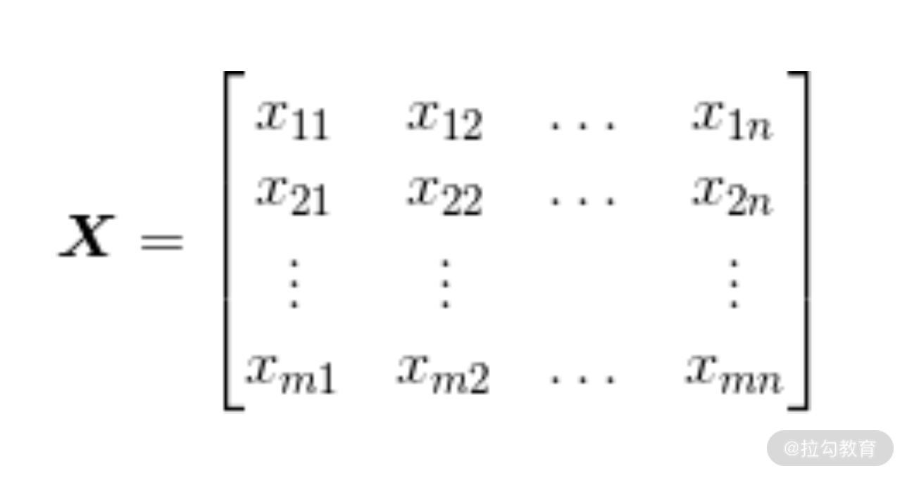

矩阵中每个元素都有 m 和 n 两个下标，分别代表行和列的位置，所以矩阵也可以通过索引直接定位元素的值，例如 ```X[2][1]```。不难发现，m=1 的时候，矩阵就成了刚才提到的向量。

---

#### 矩阵的加减法

矩阵的加减法操作跟向量类似，也是对应位置进行相加减。如图所示，红色和绿色的框分别代表了不同位置数字的计算过程。

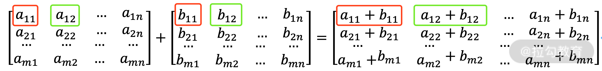

[代码](../../codes/module_1/l_1_4.py) 如下所示:

```python
import numpy as np

a = np.mat(((1, 2), (5, 6)))
b = np.mat(((0, 1), (2, 3)))
print(a)
# Get matrix([[1, 2],
#               [5, 6]])
print(a + b)
# Get matrix([[1, 3],
#               [7, 9]])
```

---

#### 矩阵的乘运算

矩阵的乘运算也有两种形式。

第一种是两个形状一样的矩阵的对应位置分别相乘。

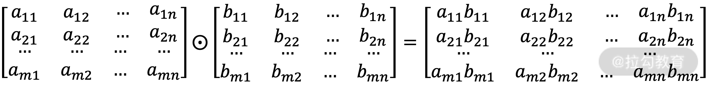

第二种则是矩阵乘法。设 a 为 m 行 p 列的矩阵，b 为 p 行 n 列的矩阵，相乘的结果为一个 m 行 n 列的新矩阵，其中第 i 行第 j 列($1≤i≤m,1≤j≤n$)的元素为:

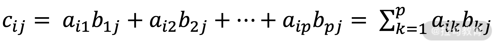

具体放到示意图中，如下所示:

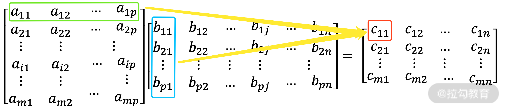

每个新的元素都是由一个行向量和一个列向量做点乘之后生成的。这个计算过程有点复杂。

[代码](../../codes/module_1/l_1_5.py) 如下所示:

```python
import numpy as np

a = np.array([[1, 2], [3, 4]])
b = np.array([[5, 6], [7, 8]])
print(a * b)
# 对应位置相乘: Get array([[ 5, 12],
#             [21, 32]])
print(a.dot(b))
# 矩阵乘法，Get array([[19, 22],
#             [43, 50]])
```

---

### 范数

回顾完了标量、向量和矩阵，再来看看范数。范数是一种距离的表示，或者说向量的长度。常见的范数有 L0 范数、L1 范数和 L2 范数，我们通过一个向量来看:

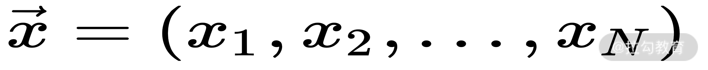

---

#### L0 范数

L0 范数指这个向量中非 0 元素的个数。可以通过 L0 范数减少非 0 元素的个数，从而减少参与决策的特征，减少参数。这样一来，自然模型就运算得更快，模型的体积也更小了。

---

#### L1 范数

L1 范数指的是向量中所有元素的绝对值之和，它是一种距离的表示(曼哈顿距离)，也被称为稀疏规则算子，公式如下:

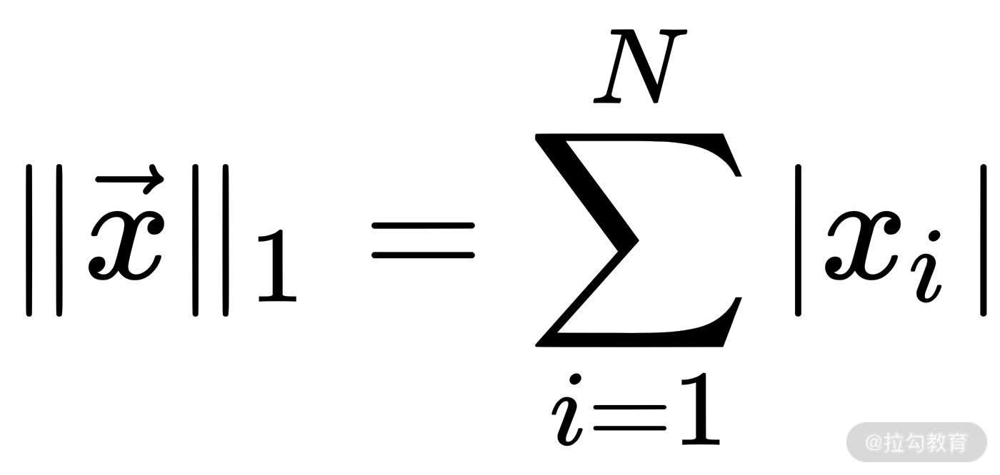

L0 范数和 L1 范数都能实现权值稀疏。但 L1 范数是 L0 范数的最优凸近似，它比 L0 范数有着更好的优化求解的特性，所以被更广泛地使用。

那么，为什么要实现权值稀疏呢？

在设计模型的过程中，有时会使用到大量的特征(例如在推荐系统中，特征维度都是上亿的)，每个特征都会从不同的角度体现问题的不同信息。这些特征经过某些方式的组合、变换、映射之后，会按照不同的权重得到最终的结果。

但有时候，有一部分特征对于最后结果的贡献非常小，甚至近乎零。这些用处不大的特征，我们希望能够将其舍弃，以更方便模型做出决策。这就是权值稀疏的意义。

#### L2 范数

除了 L0、L1，还有一个更为常用的范数 L2，也有叫它"岭回归"和"权值衰减"的。首先来看它的定义: L2 范数是向量中所有元素的平方和的平方根。其公式如下:

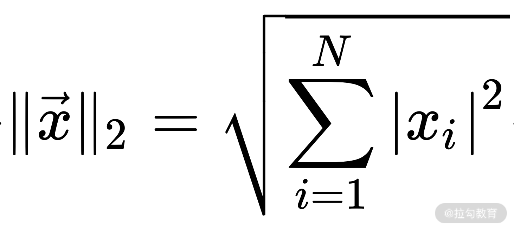

L2 也代表一种距离，即欧式距离。

刚才提到 L0 和 L1 可以起到权值稀疏的作用，L2 也有它的作用，那就是防止过拟合。先来看什么是过拟合，再来了解为什么 L2 可以减少过拟合。

先打一个比方。

你在考试前一天临时抱佛脚，把去年的考试题、老师画的知识点，背得滚瓜烂熟。第二天考试的时候，卷子发下来，第一页的题都是你前一天背过的。你很开心，三下五除二就写好了，然后把卷子翻到了第二页。结果到了第二页你就傻眼了，都是你没背过的知识点，完全不知道它们在问什么，最后你挂科了，来年再见。

咱们训练模型时，一般会有训练数据和测试数据。有时模型在训练数据上表现非常好，但一到测试数据上，效果就会急剧下降。用通俗的话来讲就是模型的应试能力很强，实际应用表现就很差。这种情况就是过拟合。

那 L2 是如何解决过拟合的呢？

首先，参数值小的模型一般会比较简单，它能适应不同的数据集，也能在一定程度上避免过拟合。举一个简单的例子，$y=10*x_1+1000*x_2$。$x_2$ 取值 1 和 3，最终会导致 y 差了 2000。$x_2$
稍微一变，结果就差别很大了。更进一步，$x_1$ 的权重就低了很多，$x_1$ 的变化对 y 的结果影响小，模型的适应性就很差了。所以可以得出一个结论: 越小的参数，模型就越简单，越简单的模型，就越不容易过拟合。

再回头看公式，可以看到，L2 实际上就是让向量中所有元素的平方和再开方。那么，如果要避免模型过拟合，就要使 L2 最小，这意味着向量中的每一个元素的平方都要尽量小，且接近于 0。和 L0 和 L1 不一样，L2 不会让元素等于 0。

由此，L1 和 L2 范数的区别就很显然了。

L1 会趋向于产生少量的特征，而其他的特征都是 0，用于特征选择和稀疏；L2 会选择更多的特征，但这些特征都会接近于 0，用于减少过拟合。

---

## 微积分部分概念回顾

微积分是现代数学的核心基础知识。在本课时，会回顾一些本课程中会用到的知识点，分别是导数、偏导数和梯度。我们先从导数开始。

---

### 导数

导数，也叫作导函数值。

假定现在手头有一个函数 $F(x) = 2x$。当 x=1 的时候，函数值 $F(x)=F(2)=2*1$。然后给 x 增加一个非常小的变化(增量)$Δx$，那么 $F(x+Δx)=2(x+Δx)$，这意味着函数的结果也有了一个增量，记为
$Δy$。

当函数值增量 $Δy$ 与变量增量 $Δx$ 的比值在 $Δx$ 趋近于 0 时，如果极限 a 存在，就称 a 为函数 $F(x)$ 在 x 处的导数。

这里有两个需要注意的地方，第一个是 $Δx$ 一定要趋近于 0，第二个是极限 a 要存在。

$F(x) = 2x$ 的图像如下:

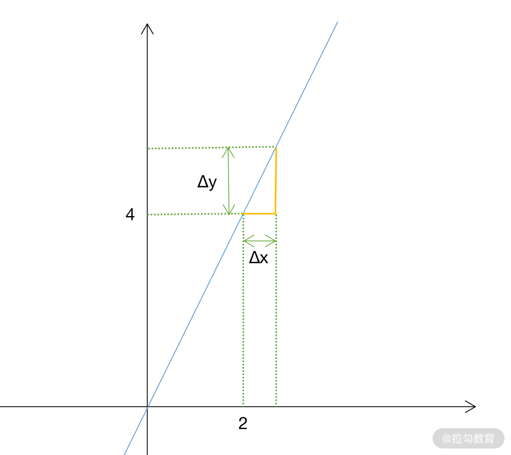

不难发现，在这个函数中，导数实际上就是平时说的斜率。一个函数在某一点的导数描述了这个函数在这一点附近的变化率。

导数一般记为:

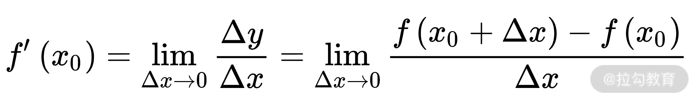

其中 lim 为"极限"的意思。也可记为:


不光函数有导数，导数也有导数。代表函数在 x 处斜率(导数)的变化率我们称之为二阶导数。由此类推，还有高阶导数等。

---

### 偏导数

再来看第二个概念，偏导数。

在实际应用中，很多函数都有多个变量。为了方便分析不同变量与函数的关系，为单个变量求导是很有必要的。这个时候，我们需要让其他变量不变，只有某一个变量发生变化，这种情况下的求导我们称之为"偏导数"。公式如下:

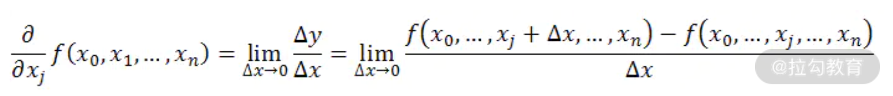

刚才说过，导数就是函数在某个点上的斜率。如果把坐标系从二维变成三维，甚至更多维时，偏导数就不难理解了: 它实际上是函数在不同方向(坐标轴)上的变化率。就好比爬山，任意一个位置，都会有东西方向和南北方向的坡度(斜率)。

假定有一个函数 $z = f(x,y)$，我们想要求这个函数在 x 方向的导数，只需要将 y 固定，在 x 上增加一个小的增量 $Δx$；同样的，如果要求 y 方向的导数，则需要固定 x，y 上增加一个增量 $Δy$。

例如:

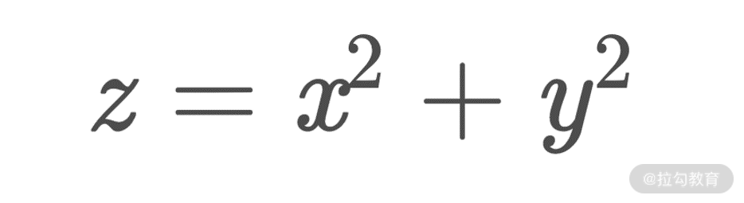


表示函数在 x 轴方向上的导数


表示函数在 y 轴方向上的导数

---

### 梯度

在机器学习中，梯度是一个出现频率极高的词语，模型的设计、训练、优化等过程中，梯度都是一个核心概念。函数的所有偏导数构成的向量就叫作梯度。我们用 $∇f$ 表示，公式化的形式为:

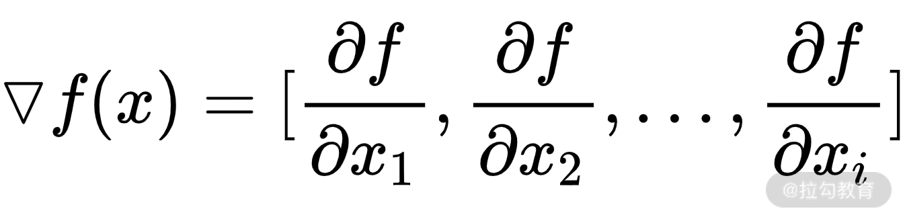

一定要注意，梯度是一个向量。同时，梯度向量的方向即为函数值增长最快的方向。

在后续的课时中，将会介绍损失函数、反向传播、优化方法等内容，它们都离不开梯度。

接下来一同进入本节课的最后一个部分"信息论"。

---

## 信息论部分知识点回顾

信息论，在深度学习中是一个非常重要的概念，它集成了微积分、概率论和统计学中很多的概念和想法。它的应用场景非常多，像损失函数中的交叉熵损失、机器学习中构建决策树使用到的信息增益、NLP 和语音算法中的维特比算法等。

提到信息论，就不得不从最基础的熵的定义开始。

---

### 熵

熵，也称信息熵。

假定有一枚标准的硬币，每次投掷，得到正面和反面的概率都是 1/2，不确定性非常大。假如我们在硬币上做点手脚，在正面加点重量，那么每次投掷的概率就发生了变化，正面朝上的概率就比原来大了，比如此时变成了 2/3，这种正反面的不确定性就减少了。

对于每一个事件(情况)的发生，都有一个信息量的度量，它的公式为:

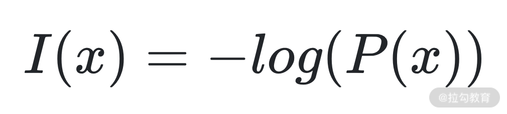

其中 $P(x)$ 是 x 发生的概率。

以投掷硬币来说，投硬币是有正反两种不确定性(概率为 $p_i$)的。我们将这两种不确定性的总量进行量化，就成了: $-log(P(正面)) - log(P(反面))$。

当把投掷硬币推广到更广义的场景下，就得到了熵的定义公式，如下:

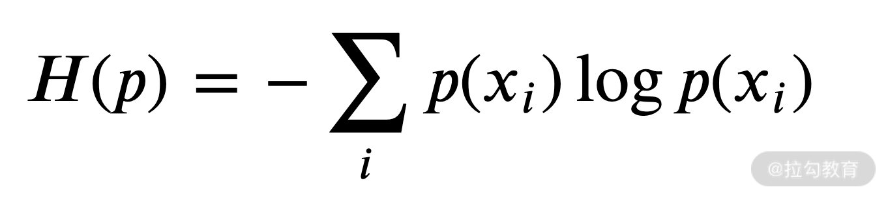

这个公示就是信息熵的公式，其中 $p(x_i)$ 就是各个可能事件发生的概率。通过公示可以看出，熵越大，不确定性越大。

---

### KL 散度

KL 散度，也称为相对熵，它衡量了两个分布之间的差异。来看它的公式:

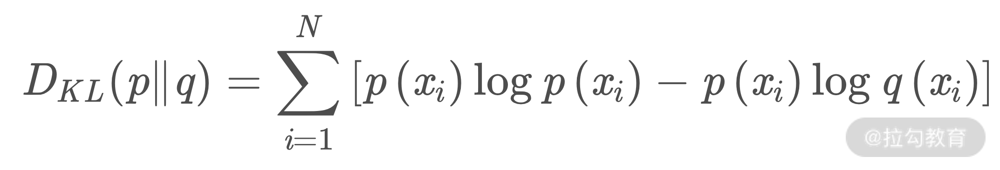

上面的 $p(x_i)$ 为真实事件的概率分布，$q(x_i)$ 为理论拟合出来的该事件的概率分布。因此该公式字面上的含义就是真实事件的信息熵，同理论拟合的事件的信息量与真实事件的概率的乘积的差的累加。

这句话非常的长，我们拆开来看，真实事件的信息熵就是 $p(x_i) log p(x_i)$，理论拟合的事件的信息量就是 $log q(x_i)$，真实事件的概率就是 $p(x_i)$。

在模型优化、数据分析和统计等场合下，就可以使用 KL 散度衡量我们选择的近似分布与数据原分布有多大差异。当拟合事件和真实事件一致的时候 KL 散度就成了 0，不一样的时候就大于 0。

---

### 交叉熵

交叉熵也衡量了两个分布之间的差异，但是与 KL 散度的区别在于，交叉熵代表用拟合分布来表示实际分布的困难程度，其公式如下:

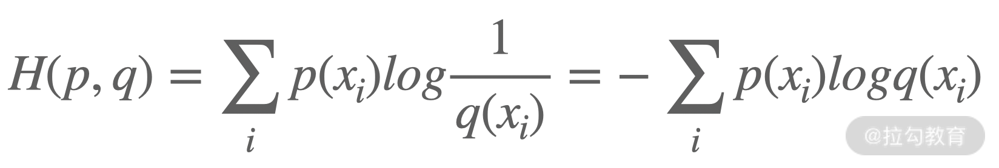

三种度量方式的公式，如果我们放在一起看，就发现其中的关联，如下所示:

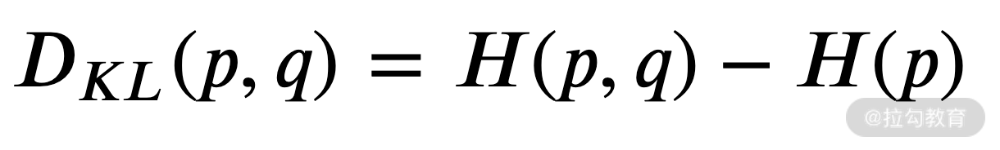

---

## 结语

深度学习是一个很庞大的学科，用到的知识点也非常多，但是这不意味着你需要重新翻箱倒柜把大学的书本拿出来继续啃。本课时对未来会用到的线性代数、微积分、信息论中的核心内容进行了介绍，在后续的课程中，还会对遇到的知识进行及时的补充。

下一课时将带你了解，[什么是神经元](lecture_2.md)

--- 
---

