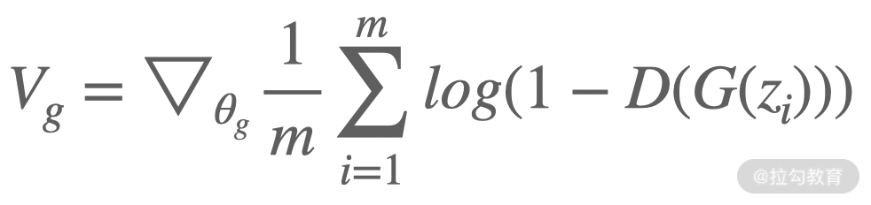

# 生成式对抗网络: 艺术创造也可以成为深度学习的拿手好戏

上一讲学习了自编码器以及自编码器的拓展，之前我们学习了 CNN、RNN 等深度学习常用的网络结构。这一讲将会更加深入，通过生成式对抗网络来了解深度学习是如何在创造性领域发挥威力的。

---
---

## 生成式对抗网络(GAN)

人类之所以能够有今天的发展和成就，很大程度上是因为我们有创造的能力，这种创造既包括对实物的创造，如飞船、汽车，也包括了对虚拟的创造，如艺术、文学、绘画。想必大家都看过梵高的《星空》:


这幅画的艺术手法非常有个性。旋转、躁动、卷曲的星云使夜空变得异常活跃，这也是它的最大特点。再来看下面的画:


是不是很熟悉的风格？对，这幅画的风格很明显地借鉴了《星空》的元素。但是你可能想不到，它是由深度学习算法绘制出来的。

那我们是通过什么算法绘制的，这种算法绘制又是一个什么样的过程呢？本节就一起来学习生成式对抗网络(Generative Adversarial Networks，以下简称 GAN)。

在介绍 GAN 之前，先来想一个问题: 假设我们有一个模型，这个模型能够根据某种方式来作画，那我们怎么判断这个模型绘画能力的好坏呢？或者说，什么样的绘画水平才是我们能够接受的呢？

其中一种方式就是，将模型生成的图画和人类画好的图画，随机给评判者看，评判者要根据看到的图画来判断这幅画是模型生成的还是人类画出来的。如果评判者很容易就能判断出来，那这个模型的绘画能力还不够好；如果评判者很难判断一幅画是谁画的，则这个模型就足够优秀了。

其实这个问题就是 GAN 的核心思想。即模型分为两部分，一部分生成、一部分判断，利用这种左右互搏的方式来进行效果提升

GAN 由生成器和判别器这两个部分组成。

* 生成器(Generator): 它通过输入的数据或噪声来生成新的数据，生成的数据要能够骗过判别器。以图像为例(文本也可以)，生成器接受一个向量之后，经过多层的神经网络(可以是 CNN 也可以是其他结构)，输出最终的图片。


* 判别器(Discriminator): 它的作用是判断输入的数据是模型生成的还是真实的数据。这个相对来说就好理解了。判别器在接受输入之后，经过一系列的操作，最后输出一个标量，也就是一个数字，这个数字介于 0～1 之间，越接近 1
  则意味着模型越认为这个输入是真实数据，越接近 0 则模型越认为这个输入是生成器"伪造"的数据。


生成器和判别器的区分，很容易让人以为 GAN 有 2 个网络，但是实际上只有 1 个，只不过连接生成器和判别器的网络中间环节的输出是一个图片(也可能是文字、音频等)。将 generator 和 discriminator
连接之后的整体网络示意图如下:


---

## GAN 的损失函数

明确了 GAN 的网络结构之后，就很容易理解我们在优化(训练)它的时候，对于 discriminator，我们希望尽可能最大限度地正确区分数据的真伪，而对于 generator 则是希望最小化 discriminator
将假数据判断为假的可能。这意味着，discriminator 的损失函数也是由两部分组成的，它们分别是真实数据的损失函数和假数据的损失函数。

我们一般使用 1 个与二分类器相关的交叉熵损失函数作为 discriminator 的损失函数。

具体来说，当 discriminator 接受一个输入时，这个输入可能是 generator 给出的假数据，也可能是真实数据。我们假设数据的标签为 y，则对于真实数据 $y=1$，对于假数据 $1-y=1$(即 $y=0$)；同时我们假设
p 是数据为真实数据的概率，则 $1-p$ 是数据为假数据的概率。根据之前在 [01 | 从神经元说起: 数学篇](lecture_1.md) 学习的交叉熵，则损失函数为 $-(ylog(p)+(1-y)log(1-p))$。

将上式做一个简单的调整。

因为 p 是 discriminator 预测数据为真实数据的概率，所以用 $D(x)$ 来代替 p，损失函数就变成了 $-(ylog(D(x))+(1-y)log(1-D(x)))$。

如果输入数据为真实数据，则损失函数的第一部分非零，第二部分为零；如果输入数据为假数据，是由 generator 生成的，则损失函数变成 $-(ylog(D(x))+(1-y)log(1-D(G(z))))$，其中 z 为 generator
的输入数据(一般为随机噪声数据)。

所以当我们有 m 个训练数据的时候，对于 discriminator，损失函数的优化就变成了对上面式子的优化迭代，梯度如下:


需要注意的是，这里面不再是梯度下降了，而是上升，因为该公式跟之前的差了一个负号。

了解了 discriminator 的损失函数后，再来看一下 generator 的损失函数。

generator 的目标刚才我们说过，它是为了"最小化 discriminator 将假数据判断为假的可能"，即最大化 discriminator 的损失函数。但是对 generator 来说，刚才的损失函数 $-(ylog(D(x)) + (1-y)log(1-D(G(z))))$ 的第一部分是没有意义的，因为 y 为 0，所以就变成了 $log(1-D(G(z)))$。其目标函数的梯度就变成了:



这个过程跟以前学习的梯度下降是一样的。

---

## GAN 的训练过程

了解了 GAN 的网络结构之后，那应该怎么去训练它呢？

GAN 的训练过程和它的网络结构一样，分成了两个部分，分别对应 generator 和 discriminator 的学习过程，这两部分是交替进行的。其过程如下:

* 初始化 generator 和 discriminator，其对应的参数分别为 $θ_g$ 和 $θ_d$
* 从真实数据集 Pr 中随机选择m个样本点 $\{x_1,x_2,...x_m\}$
* 随机生成m个向量 $\{z_1,z_2,... z_m\}$，生成的方式可以是从正态分布中生成，也可以从其他类型的分布中生成
* 将 $\{z_1,z_2,...z_m\}$ 输入到 generator 中，得到 generator 生成的样本数据 $\{x‘_1,x’_2,...x‘_m\}$，也就是假数据
* 利用 $\{x_1,x_2,...x_m\}$ 和 $\{x‘_1,x’_2,...x‘_m\}$ 更新 discriminator 的参数 $θ_d$，也就是让 $V_d$ 越大越好
* 重复步骤 2～5，若干次
* 用跟步骤 3 一样的方式生成新的随机数据 $\{z‘_1,z’_2,...z‘m\}$
* 利用 ${z‘_1,z’_2,...z‘_m\}$ 更新 generator 的参数 $θ_g$，也就是让 $V_g$ 越小越好
* 回到步骤 2 继续迭代，直至结束

需要注意的是，为了防止过拟合，一般来说 generator 的迭代次数要比 discriminator 少。

---

## 一个简单的 GAN

当我们了解了 GAN 的原理、损失函数、训练过程之后，就可以尝试写一个简单的 GAN 网络了。按照之前学习的内容可以知道，这个网络将会包含三个部分: discriminator、generator 和 loss。

---

### discriminator

discriminator 很简单，它实际上就是在 [07 | 卷积神经网络: 给你的模型一双可以看到世界的眼睛](lecture_7.md) 中学到的基于 CNN 的分类器。其网络结构示意图如下:


其中 b 表示 batch size。

---

### generator

generator 跟 discriminator 相反，它接受的是一个随机噪声，然后将噪声向量转化成很多小尺寸的特征图，再经过几个反卷积层使其尺寸逐渐变大，最后生成一个28x28x1的图像。其网络结构示意图如下:


---

### loss

在上文 GAN 的训练过程中我们知道 GAN 有 3 个损失函数，其中 generator 有 1 个，discriminator 有 2 个。我们逐个来看。

定义输入数据。对于真实数据，其尺寸为 28x28x1；对于噪声数据，是一个向量的形式，其长度用 z_dimensions 代替。

```python
x_placeholder = tf.placeholder("float", shape=[None, 28, 28, 1])
z_placeholder = tf.placeholder(tf.float32, [None, z_dimensions])
```

获得 discriminator 和 generator 的输出。Dx 表示 discriminator 接受真实数据后的输出结果，Gz 表示 generator 接受噪声数据后的输出结果，Dg 表示 discriminator 接受
generator 生成的假数据后的输出结果。

```python
Dx = discriminator(x_placeholder)
Gz = generator(z_placeholder, batch_size, z_dimensions)
Dg = discriminator(Gz)
```

定义 generator 的 loss。

```python
g_loss = tf.reduce_mean(tf.nn.sigmoid_cross_entropy_with_logits(logits=Dg, labels=tf.ones_like(Dg)))
```

定义 discriminator 的 loss。这里 ```d_loss_real``` 是 Dx 和标签 1 之间的 loss，```d_loss_fake``` 是 Dg 和标签 0 之间的
loss。最后相加得到的 ```d_loss``` 就是 discriminator 的整体 loss。

```python
d_loss_real = tf.reduce_mean(tf.nn.sigmoid_cross_entropy_with_logits(logits=Dx, labels=tf.ones_like(Dx)))
d_loss_fake = tf.reduce_mean(tf.nn.sigmoid_cross_entropy_with_logits(logits=Dg, labels=tf.zeros_like(Dg)))
d_loss = d_loss_real + d_loss_fake
```

由此，我们就完成了一个最简单的 GAN 的网络结构和损失函数。

---

## 总结

因为这一讲主要是概念和知识点的介绍，所以就没有对训练的过程展开。如果你感兴趣，可以在看完文章后自行补充训练过程的框架，即可得到一个属于自己的GAN 网络。但是如果你觉得自己暂时不能够完成补充，没有关系，在后续的 TensorFlow
介绍和实战中，我们将会学习如何构建一个训练流程，到时候你就知道了。

下一讲将带你了解 Jupyter Notebook，它是深度学习编程常用的工具。

---
---

