# 从神经元说起: 结构篇

上一节讲解了一些数学上常用的基础概念。本节就带你深度学习再具体化一些，进入深度学习的基础结构的学习吧！

---
---

## 深度学习的起源

在介绍深度学习的起源之前，先来看一下人工智能、机器学习和深度学习的关系。

1950 年，"人工智能"的概念被提出，在诞生之初，它就饱受争议。人类应该如何对待他们创造出的像人一样的物种，关于这个话题的讨论直到如今也没有停息。受限于技术，"人工智能"在当时只是作为一个理想目标，对于这个目标的研究则一路向着人类所担忧的方向发展着。

1980 年开始，人类向"人工智能"又迈进了一步，"机器学习"
诞生了。这是一门包含数学、统计学、计算机学、生物学等多个学科知识的交叉学科。在机器学习中，人们提出了很多经典的机器学习算法，例如回归、贝叶斯分类器、神经网络。这些虽然帮助人们解决了一些问题，但是在计算机视觉、自然语言处理(NLP)
与语音识别等领域中还是不能取得很好的效果。

2010 年前后，"深度学习"技术让人们更加靠近人工智能，尤其是在计算机视觉、NLP 与语音识别领域，深度学习取得了长足的进步。现在人们口中的人工智能(AI)大部分时候指的都是深度学习。

深度学习作为机器学习研究领域中的一个方向，它的起源离不开人们对大脑认知原理，尤其是视觉原理的研究。

1981 年的诺贝尔医学奖中，有两位得奖者发现了人类的视觉处理系统是分级的。关于这一发现，可以通过下图来直观地认识。

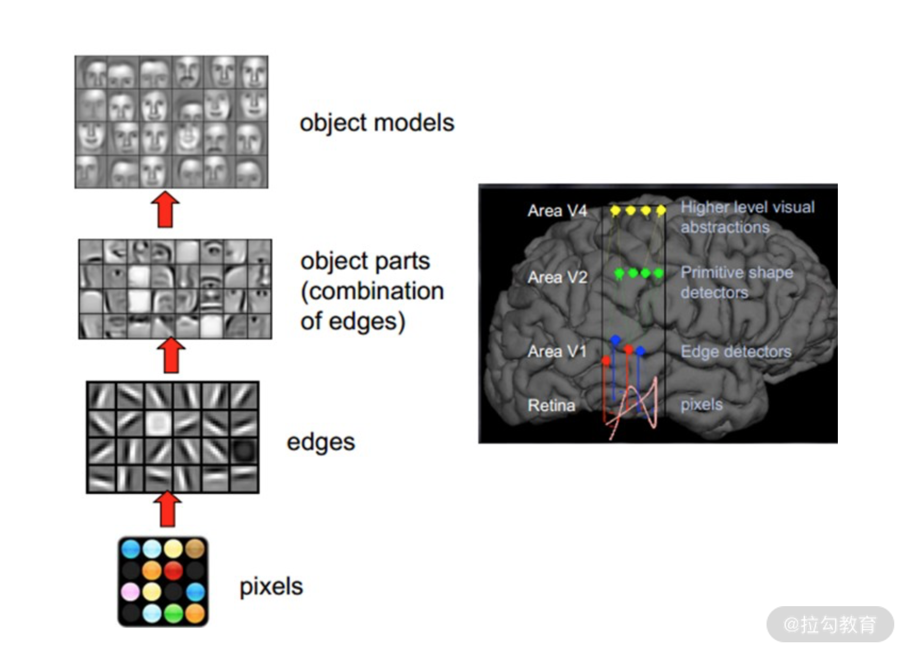

当看到一张人脸时，视觉系统会进行以下 5 个步骤:

* 从原始信号摄入开始(瞳孔摄入像素)
* 接着做初步处理(大脑皮层某些细胞会从前一层的像素中提取到一些边缘与方向的信息)
* 再抽象(将边缘信息组合为人脸的某些部分)
* 继续抽象(将这些部分的信息抽象为一张张具体的人脸信息)
* 与我们记忆中的人脸进行匹配

对于任意其他物体，人脑也都是这样的处理的。

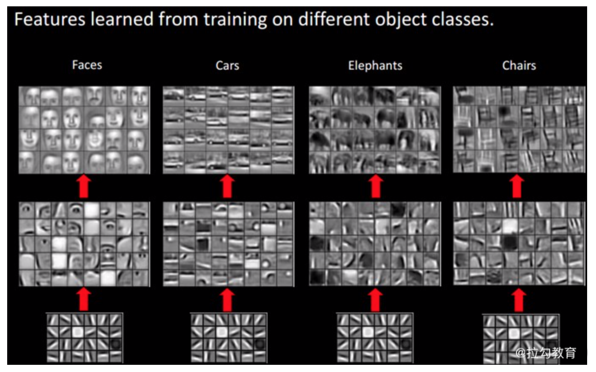

[https://www.programmersought.com/article/5040146408/](https://www.programmersought.com/article/5040146408/)

可以看到，最底层的特征基本上是类似的，都是一些简单的边缘信息。越往上，越能提取出此类物体的一些特征(轮子、眼睛、躯干等)，到最上层，不同的高级特征最终组合成相应的图像，从而让人类区分不同的物体。

在用理论分析出人类的视觉处理过程后，"人工智能"的方向就有了新的思路: 我们是否可以让计算器模仿人类的信息处理流程，使它像人脑一样思考呢？

答案是肯定的，这个回答就是"深度学习"技术。

我们可以用程序构造一个多层的神经系统，让较低层识别初级的特征，前一层的输出作为后一层的输入，最终通过多个层级的组合，在顶层获得我们需要的信息。

---

## 神经元与感知机

这一小节要介绍的是神经网络最基本的组织单元与模型结构: 神经元、单层感知机与多层感知机。它们是卷积神经网络的起源，对于学习卷积神经网络有着非常重要的作用。

---

### 神经元与单层感知机

讲完深度学习的起源，我们就要落实到具体的实现方式了。我将从神经元、Sigmoid 函数、MNIST 数据集、Softmax 函数与单层感知机这 4 个方面，来逐层带你了解神经元与单层感知机。

---

#### 神经元

深度学习的算法，基本都是一层一层的复杂的网络结构。就像刚才讲到的，会模仿人脑处理信息一样。我们把这种网络称之为"人工神经网络"，它是卷积神经网络的基础。

人工神经网络是由一个个神经元组成的，神经元是人工神经网络中最基础的计算单元。神经元接受前一层的输入，经过处理会有一个输出。就像下面这张图一样，接受输入$(x_1, x_2, ...)$，然后输出 z:

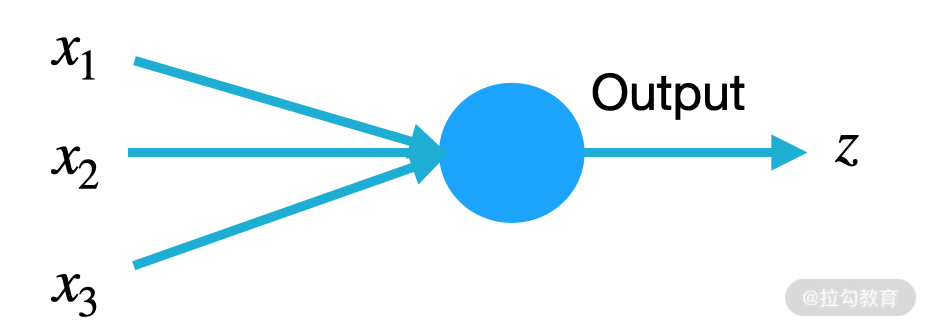

z 的计算方式如下:

$$ z=δ(w_1x_1+w_2x_2+...+w_kx_k+b)
$$

其中，$x_1,x_2,...,x_k$ 为输入；$w_1,w_2,..,w_k$ 为权重；b 为偏移项；$δ$ 则为激活函数。关于激活函数，会在后面多个课时反复提及，这是一个相当重要的概念。

将上述的公式具体到上面的那幅图中，可以得到下图:

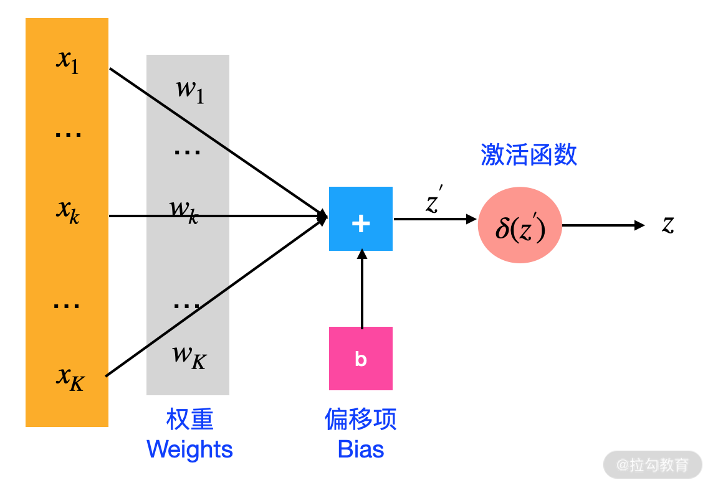

可以看出，一个神经元是由下面 5 部分组成的:

* 输入: $x_1,x_2,...,x_k$
* 权重: $w_1,w_2,..,w_k$。权重的个数与神经元输入的个数相同
* 偏移项: 可省
* 激活函数: 一般都会有，根据实际问题也是可以省略的
* 输出

$w_1,w_2,..,w_k$ 与 b 是神经网络需要通过训练学习到的参数。如何通过训练获得 $w_1,w_2,..,w_k$ 与 b 会在 [04 | 函数与优化方法: 模型的自我学习(上)](lecture_4.md)
与 [05 | 前馈网络与反向传播: 模型的自我学习(下)](lecture_5.md) 中讲到。

学习一个网络、训练一个模型这样的术语，其实这些说的都是学习模型的参数，也就是我们神经元中的权重与偏移项。

---

#### Sigmoid 函数

在神经元的部分介绍了神经元的组成部分，提到一般会由一个激活函数来输出。激活函数有很多种，不同的激活函数适用于不同的问题。二分类问题我们一般采用 Sigmoid 函数，多分类问题我们采用 Softmax 函数，卷积神经网络的中间层一般会采用
relu 函数。

今天讲的神经元最基本的作用就是用于二分类问题，也就是说上文中的 $δ$，它在神经元中是一个 Sigmoid 函数，作用是将神经元的输出转换为概率，为二分类问题提供概率依据。

Sigmoid 函数定义如下:

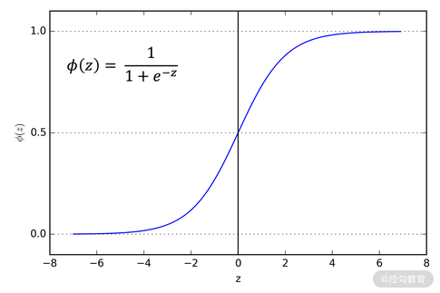

Sigmoid 函数是我们在机器学习与深度学习中经常使用的一种激活函数。通过图像不难发现:

* 当输入趋近于无穷大的时候，输出越接近于 1
* 当输入趋近于无穷小的时候，输出越接近于 0

所以 Sigmoid 函数经常被使用在二分类问题，它可以将 1 个数值转换为概率。当输出的概率大于 0.5 或者某一个自定的阈值时，我们就可以判断该类别为正例。

---

#### MNIST 数据集

介绍完神经元的构成后，我们以经典的 MNIST 数据集为例，看看神经元是如何工作的。

MNIST 数据集收集了 250 名不同的人的手写数字，每张图的大小是 28x28 像素的灰度图。

我们现在需要利用神经元判断下面这张图片是否为手写数字 5:

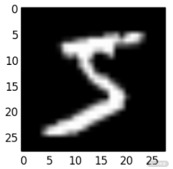

因为每张图片是 28x28 像素的，所以将图片按行列展开为 $x_1, x_2,...,x_{784}$，输入的下标的范围是 1 到 784。将它们输入到以 ${w_1, w_2, ..., w_{784}; b}$
为参数的神经元中。假设输出 z 为 20，经过 Sigmoid 函数会将 z 转换为概率，通过计算可得概率为 99%。如下图所示:

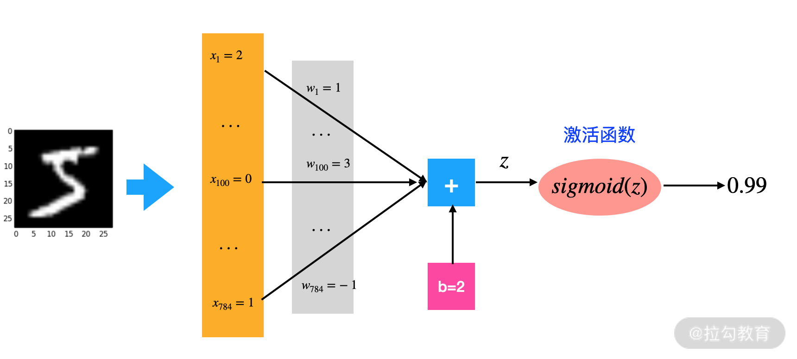

在判断的时候一般会以 50% 为阈值，但我们可以根据实际问题来设置不同的阈值。这里我们设定阈值为 50%，通过上图得出的 99% 明显高于这个值，因此，我们可以判断这张图片是数字 5。如此一来，就完成了一次神经元的推断过程。

其实到这里，你就已经了解了感知机的概念。没错，这一个小小的神经元就是最简单的一种感知机。神经元是模仿单个神经细胞的工作状态，单个神经细胞只有两种状态，激活时状态为是，未激活时状态为否，其实就是一个二分类问题。

但是，现在问题变了，变成需要自动识别出每张图片是属于哪一个数字了。这样只靠刚才讲过的单个神经元是无法完成的，因为神经元只能处理二分类的问题。遇到这种问题应该怎么办呢？

前人的研究结果表明，每个神经元是更加侧重于一种数字的识别。因此将刚才的感知机稍加修改，即可解决这样的一个多分类任务:

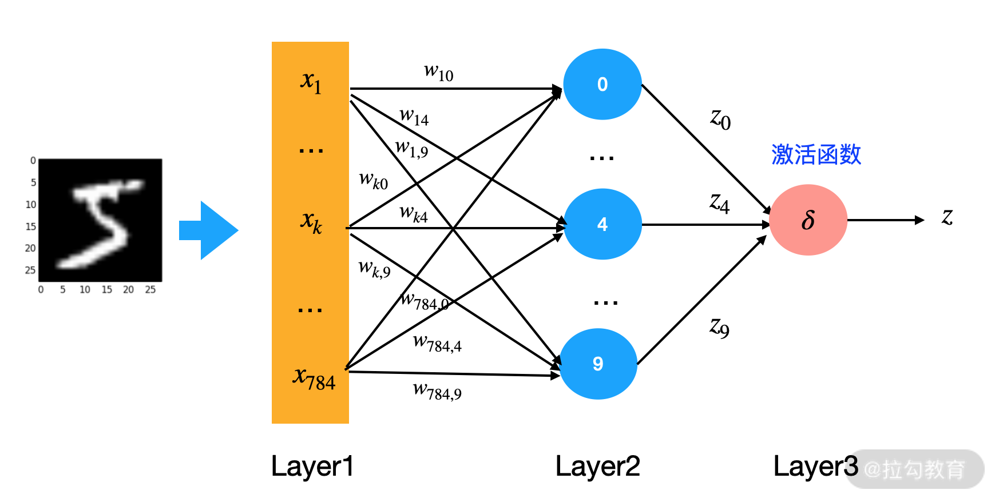

输入不变，仍然将一张 28x28 像素的图片转换为长度为 784 的向量。

将神经元的个数由 1 变为了 10，这 10 个神经元只负责自己力所能及的任务，它们只判断输入的图片是否为自己对应的数字，也就是神经元 0 只负责学习输入的图片是否为 0，神经元 1 只负责学习输入的图片是否为 1，以此类推。

每个神经元接受输入后都会有一个输出(图中的 $z_0,...,z_9$)，每个输出 z 都是神经元自己做出的判断: 输入的图片是否为该神经元负责的类别。

接下来汇总一下这 10 个神经元的判断，做一个最终的推断。我们可以把图中粉色的激活函数设置为 Softmax 函数，哪个神经元输出的数值最大，输入的图片就对应哪一类。

---

#### Softmax 函数与单层感知机

前文提到，Sigmoid 函数是用来解决二分类的问题的，面对上面要识别输入的图片为哪个数字的时候，就需要使用 Softmax 函数，来解决这样一个多分类的问题。

神经元最终输出的 z 又可以叫作特征值。通常来说，特征值的用途不大，我们更希望获得到更有统计学意义的，每一个分类的概率。Softmax 函数可以将一组数值映射到 [0，1] 区间内，并且保证输出的和是 1，输出的数值可以看作"概率"
。计算公式及举例如下图所示:

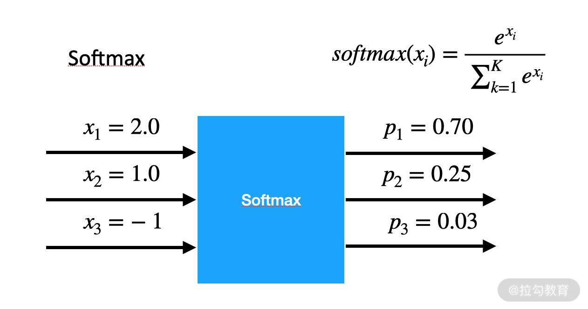

这样，将输出的 $z_0, z_1, ..., z_9$ 输入到 Softmax 激活函数后，可以获得一组概率值。通过判断哪个神经元输出的概率最大，就可以推断出输入图片所属的类别。

这也引出感知机的另一种形态，单层感知机。

既然一个神经元不可以解决复杂的问题，那么我们可以集成多个神经元，让多个神经元共同解决复杂的问题。在这种新的形态下，感知机会增加 2 个新的特性:

* 可以进行多类别的分类
* 集成了多个神经元，提升了模型整体性能

请看下图，蓝色的圆圈就是我们刚才讲的神经元，因为单个神经元的学习能力有限，所以我们对神经元进行了扩充。每个神经元各司其职，只处理自己的事情，合并起来就可以处理更复杂的问题，简单来说就是人多力量大。

在这里会再引入"层(Layer)"的概念。

一般来说 Layer1 为输入层，Layer3 为输出层，中间的 Layer2 为隐藏层。单层感知机里只有一个隐藏层，而在后面要学习的多层感知机，以及 [07 | 卷积神经网络:
给你的模型一双可以看到世界的眼睛](lecture_7.md) 中讲到的卷积神经网络，则会有多个隐藏层。

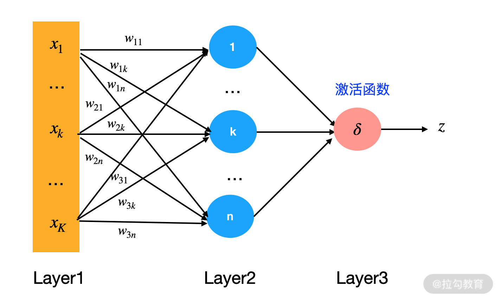

---

### 多层感知机

后续会学到卷积神经网络、时间递归神经网络等，这些都是神经网络的变种。最基本、最简单的神经网络结构就是我在这里要讲的多层感知机，只有理解了多层感知机才能更好地理解那些高级的神经网络。

多层感知机的思想仍然是模仿人的神经系统，将获得的信息一层层地传递下去，每一层做不同的抽象。多层感知机要求至少有两个隐藏层，所以我们对单层感知机稍做修改，即可获得多层感知机。

如下图所示:

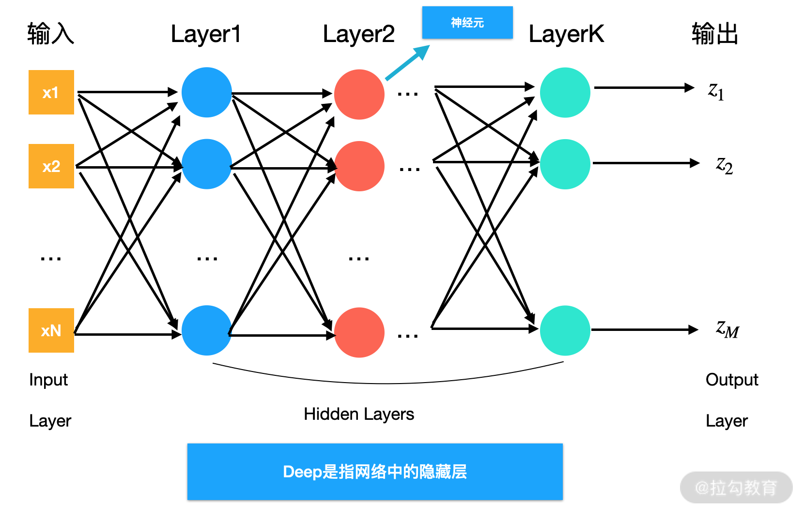

我们经常说的网络的深度，就是指网络中的隐藏层，即 Deep Learning 中的 Deep。你也许听过 DNN(Deep Neural Network)，它其实指的就是多层感知机。

图中的小圆圈就是我们之前介绍的神经元，计算方式与神经元的计算完全相同。

再回到刚才识别一张图片是否为手写数字 5 的例子，这次我们有 2 个隐藏层。如下图所示:

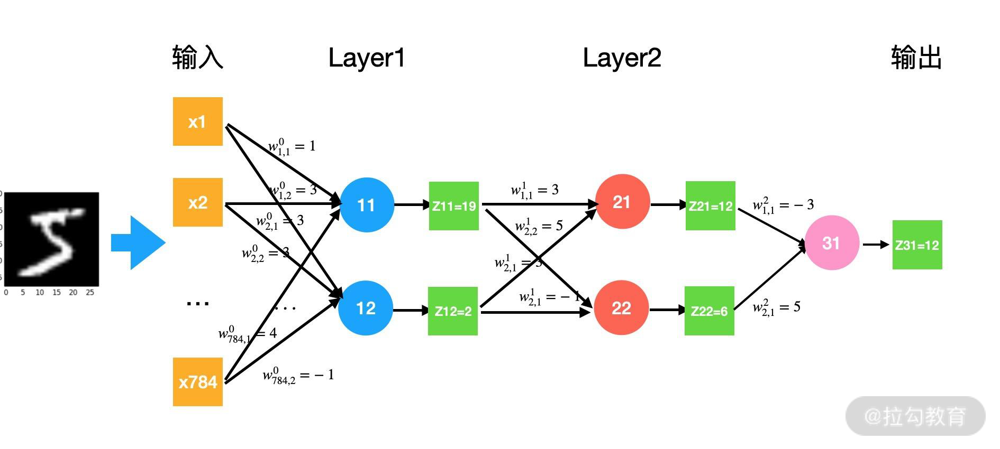

输入仍然是 $x_1, x_2, ..., x_{784}$，$w_{kij} 代表第 k 层，由输入 i 到第 j 个神经元的权重，z_{ki} 为 k 层，第 i 个神经元的输出。

输入的图片，经过第一层获得输出 $z_11$ 与 $z_{12}，z_{11}$ 与 $z_{12}$ 作为第二层的输入，得到第二层的输出 $z_{21} 与 $z_{22}，第二层的输出再作为第三层的输入，最后获得数组 $z_{31}$。

$z_{31}$ 之后再加一个 Sigmoid 函数，将它转换为对应的概率，这个操作就和之前讲的一样了。

---

### 多层感知机的局限

从神经元的角度介绍了感知机之后，我们再来从数学的角度上理解一下感知机。

从神经元的计算公式可以知道，神经元只能学习到线性的关系，但是在现实中，绝大多数问题都是复杂的非线性关系。

看看下面这个例子: 2 个输入($x_1$ 与 $x_2$)，1 个神经元，激活函数为 Sigmoid，需要对右侧的 output 进行预测。output 一共有 2 个类别，黄色的点与蓝色的点，并且两类处于一种非线性关系。

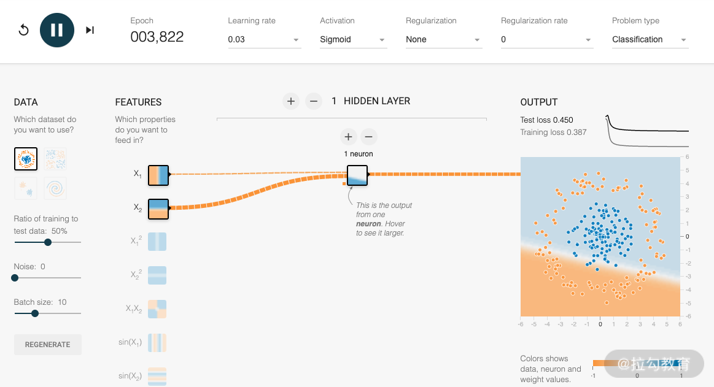

可以发现，无论训练多少个 Epoch，模型都无法把属于非线性关系的输出划分开来。这也就是单个神经元的局限性。

Epoch: 在机器学习中，会有很多数据来帮助我们更新参数。所有数据都使用过一次，便称之为"一个 Epoch"。在 [03 | AI 术语: 让你变得更加专业](lecture_3.md) ，会更详细地讲解 Epoch。

我们一直说，神经网络是模仿人类的思考过程，将信息层层传递下去，每一层负责抽象不同的信息，从而解决复杂的任务。这一行为的背后有一个数学解释，即:
当我们有足够多个线性关系的时候，可以拟合出任意的非线性关系的。所以可以尝试增加神经元与层的个数来解决上面的问题，如下图所示:

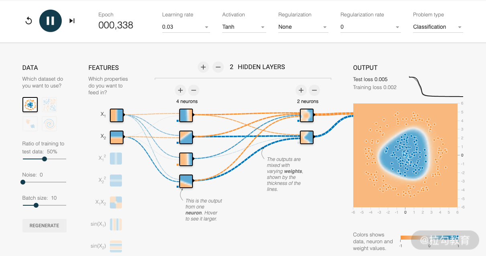

讲到这里，你可能就会有一个疑问: 如果我们无限的堆叠神经网络的层与任意增加神经元的个数，是不是就可以解决所有问题了？

非常遗憾，这是不可以的，神经网络的性能会大大的下降。曾有人做过实验，当神经网络隐藏层的层数大于 2 时，网络的性能会随着层数的增加而降低。

在深度学习诞生之前，这些局限性导致多层感知机的发展一度停滞。

* 参数量膨胀: 在多层感知机中，采用的是全连接的形式，每增加一层，将会来带数量级的参数增加。这非常容易导致过拟合，并且很难训练，会陷入局部的最优
* 梯度消失: 使用 Sigmoid 函数激活的时候，会产生梯度消失的问题，使参数无法更新

我会在后面讲到，深度学习是通过何种方式解决上述问题的。

---

## 结语

到这里，你就完成对神经网络基础结构的学习了。在后续的学习中，有很多内容都是在基础机构上进行的改进，我会对在 [01 | 从神经元说起: 数学篇](lecture_1.md) 及 [02 | 从神经元说起:
结构篇](lecture_2.md) 中提到的基础知识进行更细化的讲解，希望你能够牢记这两个课时的内容。

"多层感知机的局限"这一小节中的图，是使用 TensorFlow
的这个可视化工具做的，你可以点击链接查看。在网站中，你可以尝试使用不同的输入、不同的层数以及每层中不同的神经元，构建自己的神经网络，来观察它们的不同之处。深度学习所用到的工具的使用方法，我会在"模块二: 深度学习的工具与框架"
中讲解。如果你对神经元和感知机还有什么疑问，欢迎在留言区提问。

下一课时将带你了解人工智能领域中的一些专业的术语，例如训练、训练集、有监督学习和无监督学习。通过对这些专业术语的讲解，可以让你在日后的学习中更快地理解课程的内容。

---
---

