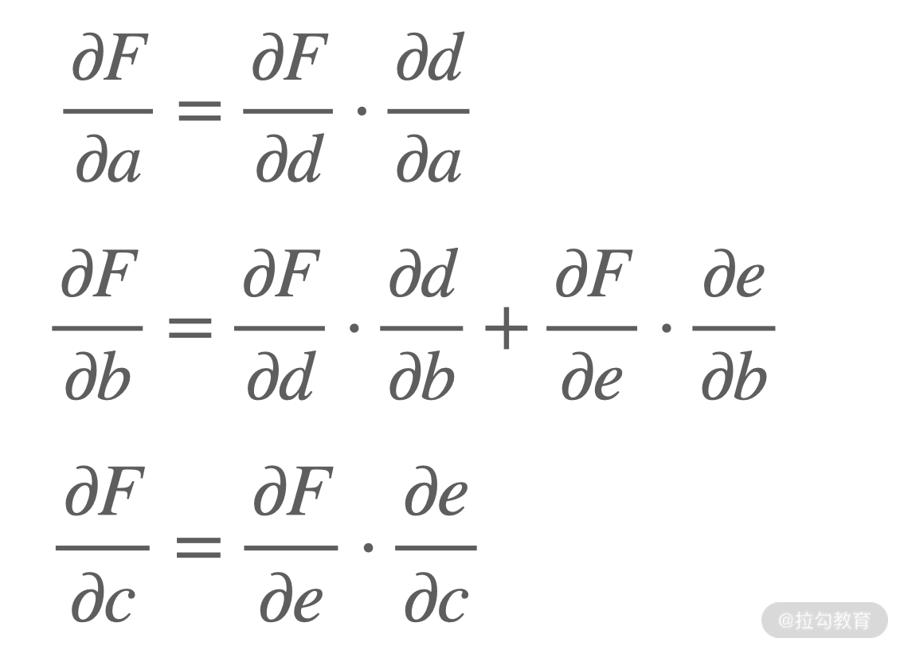
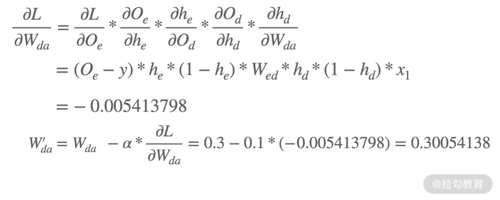

# 前馈网络与反向传播: 模型的自我学习(下)

在之前的课程中先学习了深度学习会用到的数学知识和基础原理，随后又学习了模型的目标函数、优化原理基础。关于深度学习的内部原理基本上已经万事俱备，就差最后一个环节: 模型学习的计算过程具体是怎样的？本节课就结合数学公式来学习这个过程。

模型的学习本质就是数学的计算过程，因此，本章节会涉及很多的运算，我会尽量简化运算的过程。

---
---

## 前馈网络

前馈神经网络(Feedforward Neural Network，FNN)，简称前馈网络，它是一种单向的多层结构，也是最简单的神经网络，其简化结构图如下所示:

在这个网络中，蓝色的层是第 0 层，我们称为输入层，这里将接受模型的输入数据，即向量 x；中间黄色的层，分别是有 5 个神经元的第 1 层和有 3 个神经元的第 2 层，它们是模型的内部环节，我们称为隐藏层(实际的网络中，隐藏层可以有很多层，不仅限于 2 个)；绿色的层，是网络的最后一层，我们称为输出层。神经元之间的单向箭头连线，就是两个节点之间的权重。

既然叫前馈神经网络，那我们理解了"前馈"就相当于理解了这个网络。前馈是指这个网络中的每一层神经元，产生信号之后会传递到下一层，而下一层的神经元产生的信号无法反传递给上一层，即数据是单向流动的。

那输入的数据最后是怎么变成输出的呢？为了方便起见，我们把上图进一步简化，来看看它的具体计算过程。

这个简单的网络中，有一个输入层(a、b 节点)，一个隐藏层(c、d 节点)和一个输出层(e 节点)。

在开始具体计算之前，我们先明确几个变量。

* 输入数据 x

$$ x=\begin{bmatrix} 0.5 \\ 0.8 \end{bmatrix} $$

* 权重 $W_{ij}$，表示从节点 i 和 j 之间的权重，方向由 j 到 i。在上图中，我们假设 $W_{cb}=0.7，W_{da}=0.3，Wec=0.4$。

* 权重矩阵 $W_j$，表示第 j 层的权重矩阵，在这里有两个权重矩阵，$W_1$ 和 $W_2$

$$ W_1=\begin{bmatrix} 0.1 & 0.7 \\ 0.3 0.2 \end{bmatrix} $$

$$ W_2=\begin{bmatrix} 0.4 & 0.6 \end{bmatrix} $$

* 激活函数。这节课我选择 Sigmoid 函数作为激活函数，其公式化表示为

$$ f(x)=\frac{1}{1+e^{-x}} $$

激活函数实际上是一个将线性计算过程进行非线性变换的函数。关于激活函数会在讲到介绍深度学习的各种运算单元和结构时进行详细介绍，目前可以单纯地理解为: 激活函数是一个对输入数据进行变化的函数。

明确这些变量之后，就可以开始具体的计算了。

节点 c 的输入，就是 $x_1$ 和 $x_2$ 沿着各自的路径与对应的权重相乘后求和，即:

同理，节点 d 的输入就是:

模型在计算的过程中是使用矩阵的方式，所以得到的结果也是以层为单位的，计算过程如下:

如果你对矩阵的运算有点忘记了，可以去 [01｜从神经元说起: 数学篇](lecture_1.md) 回顾。

现在，输入的数据走到了 c 和 d 两个节点，这里还有一层 Sigmoid 激活函数。因此，第一层的输出是:

也就是节点 c 的输出为 0.6479，节点 d 的输出为 0.5769。

这样，我们就完成了隐藏层的计算了。我们可以用同样的方式求到最后节点 e 的输出，过程如下:

输入的数据 x 经过网络的各个节点之后，最后模型给出计算结果为 0.6469。到这里就完成了一个最基本的前馈网络从输入到输出的计算过程。

---

## 链式法则

深度学习的内容主要就是优化更新各个节点之间链接的权重，也就是刚才提到的 W。

那如何更新权重呢？在上一课时提到"模型的学习就是不断减小损失函数"。最小化损失函数通常采用梯度下降的方式，即每一次给模型更新权重的时候按照梯度的方向进行。

假设把 cost 函数表示为: $H(W_{11},W_{12},...,W_{ij}...,W_{mn})$，则其梯度向量 $▽H$ 为:

是否发现了一个问题？就是上面梯度向量的一些项不太好求。比如第一项，$W_11$ 似乎跟 H 的关联不是很直接，因为中间隔了很多的节点和层。这个时候就需要微积分中的链式法则出场了。

所谓链式法则，是指两个函数组合起来的复合函数，其导数等于里面函数代入外函数值的导数，乘以里面函数的导数。假设有函数 $f(g(x))$，链式法则有两种形式:

链式法则的定义看起来很拗口，没关系，我们以第一种形式举个例子。

有函数 $f(x)=sin(x^3 + 5)$。我们可以把函数分解为:

* $f(x)=sin(x)$
* $g(x)=x^3 + 5$

$g(x)$ 的导数为 $g'(x) = 3x2$，$f(x)$ 的导数为 $f'(x)=cos(x)$，则 $f'(x) = f'(g(x))g'(x)=cos(x^3 + 5)·3x^2$，相当于各自求导后再相乘。

在求梯度之前，我们把链式法则的例子变得稍微复杂一点，通过一个例子来感受链式法则的具体过程。下图是一个 $y=(a+b)(b*c)$ 函数的关系图，运算方向为自下向上。

要想求函数 y 在 $a=1，b=2，c=3$ 条件下的梯度，我们可以先利用偏导数的定义求出不同层之间相邻节点的偏导关系。将每个导数的计算写在了图中，如下:

通过链式法则我们知道:

可以看出，函数 F 在 a 的偏导数相当于从 a 到 F 路径上的偏导值的乘积，同理 F 在 b 的偏导数等于 b 到 F 的所有路径上偏导值乘积的和。是不是很简单？很好，我们已经把链式法则基本弄明白了。可以开始探讨反向传播的过程了。

---

## 反向传播

反向传播算法(Backpropagation)是目前训练神经网络最常用且最有效的算法。通过反向传播，模型会不断更新自己的参数，以达到学习的目的。在这个过程中会经历 3 个步骤。

* 前向传播: 将训练数据输入到网络中，数据经过隐藏层，最后达到输出层并作为结果输出
* 误差及其传播: 计算输出值和实际值之间的误差，将误差从输出层向隐藏层反向传递，直到输入层
* 迭代: 在反向传播的过程中，根据误差调整模型各个参数的值，并不断迭代前两个步骤，直至达到结束模型训练的条件

反向传播的公式推导和证明是相对冗长和复杂的，在实际的深度学习的研发中，该部分的内容都是封装好的，所以我们这里并不会对反向传播的数学定义、推导、证明进行详细的介绍。但是我们需要知道和了解这个过程的具体运转方式，这将有助于我们更好地理解深度学习是如何学习的。

在开始下面的内容之前，你不妨重新看一下 [04｜函数与优化方法: 模型的自我学习(上)](lecture_4.md) 这一课时中关于梯度下降的内容。下面要讲的就是将相关知识进行实际举例的过程。

回到前馈网络中使用到的简化网络:

在前面的内容中，我们已经学会如何得到这个网络中所有节点和边(权重)的数值了，其中

输入为: $x_1=0.5，x_2=0.8$。

第一层权重: $W_{ca}=0.1，W_{cb}=0.7，W_{da}=0.3，W_{db}=0.2$

* 节点 c 输入: $h(c)=W_{ca}*x_1+W_{cb}*x_2=0.61$，节点 d 输入: $h(d)=W_{da}*x1+W_{db}*x2=0.31$
* 节点 c 输出: $O(c)=0.647941$，节点 d 输出: $O(d)=0.576885$

第二层权重: $W_{ec}=0.4，W_{ed}=0.6$

* 节点 e 输入: $h(e)=W_{ec}*Output(c)+W_{ed}*Output(d)=0.605307$
* 节点 e 输出: $O(e)=0.646870$

实际标签: y=1

损失函数为:

激活函数为:

$$ f(x)=\frac{1}{1+e^{-x}} $$

我们用这个简化的网络，一步步看反向传播是怎么进行的。

在 [04 课时](lecture_4.md) 讲过，我们使用损失函数来评估拟合函数对真实函数的表示效果的"好坏"，为了更新权重，就需要求损失函数的梯度，即 $L(x)$ 对不同权重的偏导数。

反向传播的特点是反馈从输出往输入方向流动，所以最先要更新的权重是最后一个隐藏层的权重，即 $W_{ec}$ 和 $W_{ed}$。以更新 $W_{ec}$ 为例，具体过程分为 4 个步骤。

* 确定权重到输出的路径。很显然，数据是从节点 c 流动到 e 然后输出的
* 确定路径上的函数关系。首先由 $O(c)$ 和权重 $W_{ec}$ 相乘得到节点 e 的一部分输入，另一部分则是 $O(d)$ 和权重 $W_{ed}$ 相乘得到的。涉及的函数为 $h=W_{ec}*O(c)+W_{ed}*O(d)
  $，e 节点还有一个激活函数 $f(x)$。所以最后的函数关系为:
    * $L=\frac{1}{2} * (O(e) - y)^2$
    * $O(e) = f(h)$
    * $h = W_{ec}*O(c)+W_{ed}*O(d)$
    * 计算损失函数对 $W_{ec}$ 的偏导
    * 更新权重。该环节就是之前介绍梯度下降的时候介绍过的环节: 更新参数。假定学习率 $α=0.1$，则 $W_{ec}$ 的更新值为:

由此，完成了 $W_{ec}$ 的权重更新。同理，按照这个步骤更新其他的五个权重。

* $W_{ed}$，路径关系为节点 d 到节点 e。更新过程如下:

* $W_{ca}$，路径关系为节点 a 到节点 c 到节点 e。更新过程如下:

* $W_{cb}$，路径关系为节点 b 到节点 c 到节点 e。更新过程如下:

* $W_{da}$，路径关系为节点 a 到节点 d 到节点 e。更新过程如下:

* $W_{db}$，路径关系为节点 b 到节点 d 到节点 e。更新过程如下:

为了验证模型是否真的学到了知识，我们不妨重新使用 $x_1$ 和 $x_2$ 在更新权重后的模型进行预测。按照之前的前馈计算步骤可以得到输出 $O(e)=0.648366218$，对应的损失函数 $L(x)=0.061823158$。对比原来的 $L(x)=0.062351$，可以发现损失函数变小了。如果有更多数据进行更多的迭代，这个损失函数会越来越小，模型的表现也会越来越好。

以上就是反向传播的基本过程。细心的你一定会发现一个问题，那就是在进行梯度更新的时候，很多变量被反复计算了，比如
$O_e、h_e$，如果每次更新梯度都要重新计算，那整个的运算量就很大，所以在实际的反向传播算法中，每个节点都会暂存从上层反馈回来的各个数据值信息，也就避免了重复计算，提高运算速度。

---

## 总结

本课时对前馈网络和反向传播算法进行了具体的解释和计算，在实际工作中这部分的内容是封装好的。尽管如此，我们仍旧需要了解其原理及过程。自此，通过前 5
个课时的内容，我介绍了深度学习相关的数学知识和原理，下一课时我将会通过一个具体的问题把所有的知识点串联起来，为后续进一步介绍深度学习的结构、网络和实战做好准备。

---
---

