# 线性回归模型: 在问题中回顾与了解基础概念

学到这里相信你已经了解了深度学习，知道该如何训练模型、如何评估模型，并且掌握了一种叫作人工神经网络的算法。正所谓温故而知新，这节课会通过一个线性回归模型将前面的知识串起来，做一个完整的回顾。

线性回归是一个最基本的传统机器学习算法，不算是深度学习的内容，但神经元其实就是线性回归模型。你以后学习物体检测的话，线性回归也会被用在物体检测问题中。

---
---

## 线性回归

那什么是线性回归呢？顾名思义，就是用一种线性关系进行回归。回归与分类都属于有监督学习，分类预测的是一个类别，而回归预测的是一个数值，例如房价、天气的温度、股票的走势。

假设有训练数据 D:

$$ D=\{(x_1,y_1),(x_2,y_2),...,(x_i,y_i),...,(x_m,y_m)\} $$

其中 $xi=(x_{i,1},x_{i,2},...,x_{i,n})$。

我们希望找到一个线性关系 $f(x)$，使 $f(x)$ 尽可能地模拟出数据 x 与 y 的关系，数学上的表达是 $f(x_i)≈y_i$，也就是希望 $f(x)$ 接受一个输入 x，它的输出能尽可能地接近真实结果 y。

线性关系 $f(x)$ 可以定义为:

$$ f(x)=w_1x_1+w_2x_2+...+w_nx_n+b $$

向量的表示方式为:

$$ f(x)=w^Tx+b $$

其中 w 为权重，是一个列向量，我们定义为:

$$ w=(w_1,w_2,...,w_n)
$$

b 是一个偏移项。

这个 $f(x)$ 就是我们说的线性回归模型。我们对 $f(x)$ 的训练，就是获得 $f(x)$ 中的 w 与 b。

可以看到数据集 D 中，每个 x 都是一个向量，每个 x 中有 n 个元素。当 n 大于 2 的时候，我们把 $f(x)$ 称为多元线性回归，当 n 等于 1 或者 2 的时候，我们一般直接称为一元线性回归或者二元线性回归。

当 $n=1$ 时，$f(x)$ 就是一条直线，也就是说，我们希望找到一条直线拟合出数据的整体趋势。如下图所示:

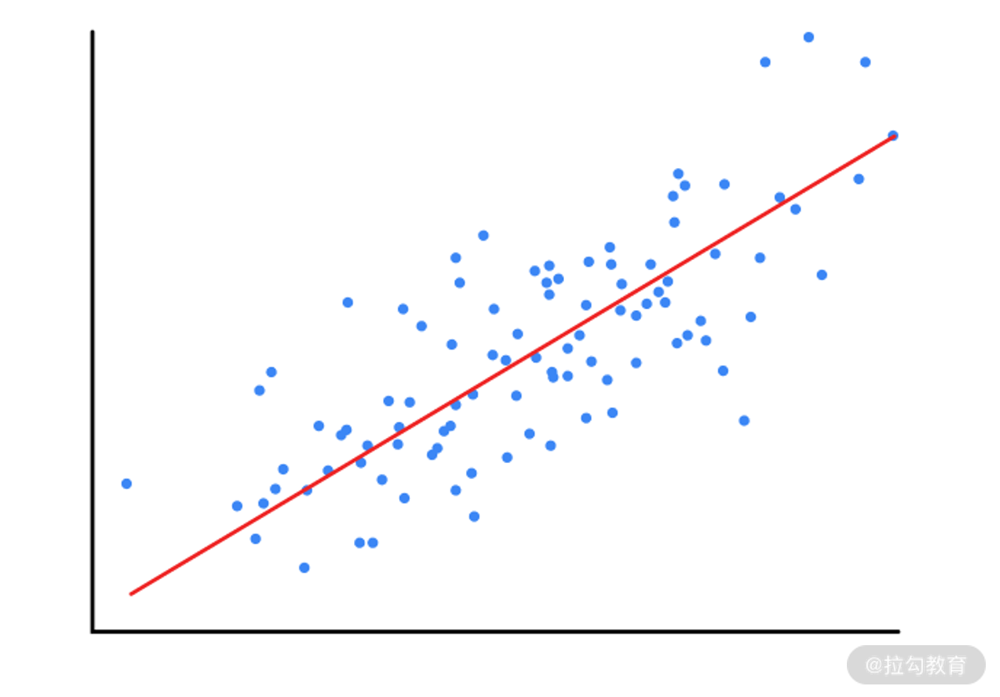

当 $n=2$ 时，$f(x)$ 就是一个平面，这个时候我们希望用一个平面拟合出数据的整体趋势。如下图所示:

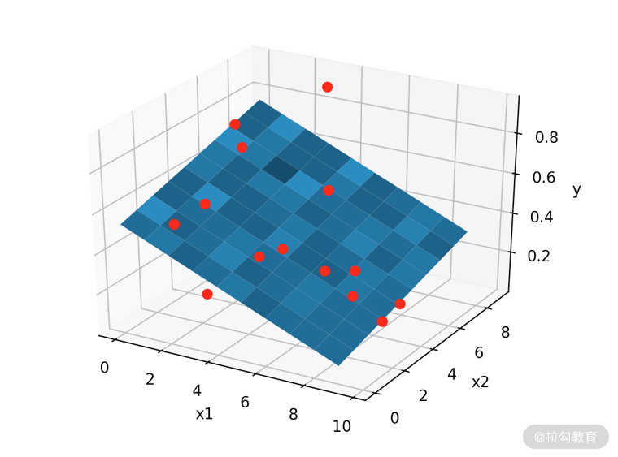

---

## 模型训练与评估

先来回忆一下机器学习的流程。

* 确定好训练数据与评估数据
* 选择损失函数、优化方法进行训练
* 利用评估数据评估模型

接下来就通过线性回归模型的训练与评估来复习一下以上流程。

第 1 步与第 3 步在这里就先略过，我在后面还会通过一个房价预测的案例带你回顾机器学习的流程，在那里会有相关的例子。

---

### 损失函数

对于训练数据 D，我们需要根据每一条数据 $(x_i, y_i)$ 来训练线性回归模型。我们希望 $f(x)$ 的输出可以无限接近真实的结果 y，那我们怎样衡量预测结果与真实结果的差距呢？

最常用的方式是使用均方误差(Mean Squared Error, MSE)。均方误差是回归任务中经常使用的一种损失函数(cost function 或者是 loss function)。其定义如下:

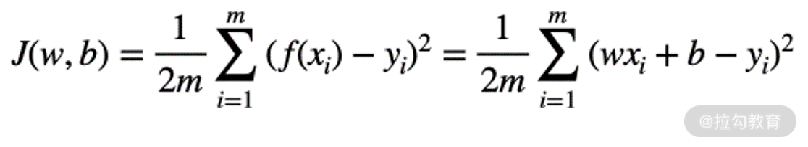

在均方误差中，$x_i$ 与 $y_i$ 是数据中的具体数值，自变量就是 $f(x)$ 的权重 w 与偏移项 b。所以均方误差 J 是一个关于权重 w 与偏移项 b 的函数。

既然均方误差是衡量预测值与真实值之间的差距的，那我们只要让它获得最小的 w 与 b 的值，就能够得到预测值最接近真实值的回归方程了。

---

### 模型优化

模型优化就是获得权重 w 与 b 的过程，这些 w 与 b 可以让损失函数取得最小值。在 [04｜函数与优化方法: 模型的自我学习(上)](lecture_4.md) 中讲到了梯度下降的优化方法，现在就用这个方法来优化我们的权重 w 与
b。

先回忆一下梯度下降的原理。

假如我们在一座高山上，想走到山脚，但是又不认识路，那应该怎么办呢？我们可以以当前点为基准，向坡面最陡的方向前进，每前进一步，就依据现在的位置再寻找最陡的方向，这样一点点地前进，就可以成功到达山脚。

到达山脚的这个过程就是求 $J(w, b)$ 最小值的过程。

在给定点找到最陡的方向，就是函数中给定点的梯度，然后朝着梯度相反的方向前进，就能让函数值下降的最快。

确定了梯度，那么每次走多长呢，这取决于设置的学习率。

为了举例方便，假设回归方式是一元回归方程，所以回归方程只有一个 w。

首先要计算 $J(w, b)$ 的梯度:

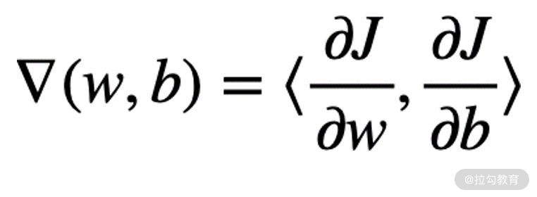

其中，w 与 b 的偏导数为:

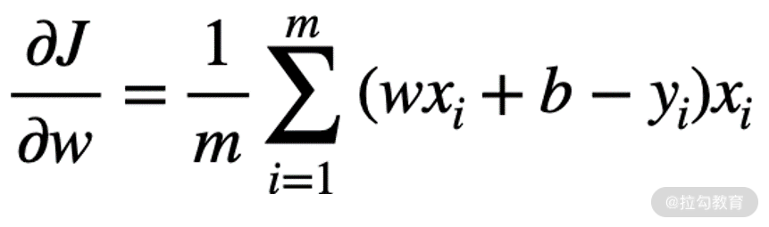

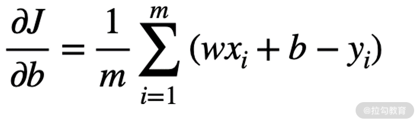

由于训练样本 m 往往很大，采用以上的做法每次需要消耗巨大的计算资源。为了解决这个问题，随机梯度下降法与小批量梯度下降法营运而生。

接下来自己写一个每次只取一条数据的小批量随机梯度下降算法来看看效果如何，即每次计算梯度时，$m=1$。

首先生成数据，蓝色点为我们生成的数据。

[代码](../../codes/module_1/l_6_1.py) 如下:

```python
# -*- coding: utf-8 -*-

import numpy
import random
import matplotlib.pyplot as plt

numpy.random.seed(123)
w_real = 2
b_real = -15
xlim = [-15, 15]
x_gen = numpy.random.randint(low=xlim[0], high=xlim[1], size=30)
y_real = w_real * x_gen + b_real
plt.plot(x_gen, y_real, 'bo')
plt.savefig("../../images/module_1/6_7.png")
plt.show()
```

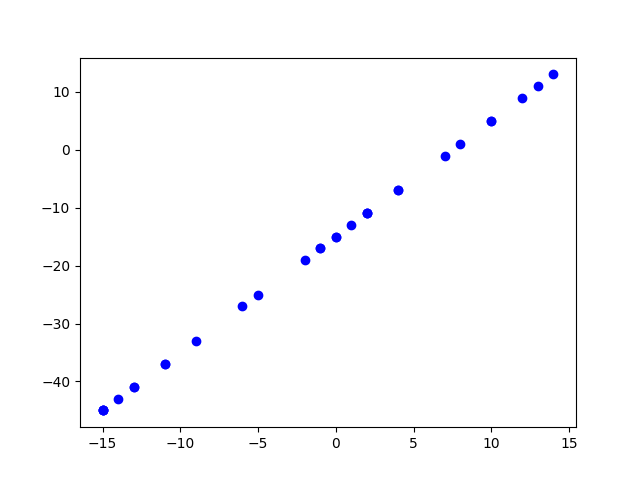

假设权重 $w=2, b=-15$，生成训练数据。将 w 与 b 随机初始化，然后读取训练数据计算梯度，通过随机梯度下降法来更新 w 与 b，使其接近我们真实的值。过程如下:

```python
def sgd(x, y, lr, epochs=1):
    # x 为训练集中的数据
    # y 为训练集中标签
    # lr 学习率
    # epochs 训练 epoch 数

    # 随机初始化 w 与 b
    w = random.random()
    b = random.random()
    for e in range(epochs):
        w_list.append(w)
        b_list.append(b)
        for x_, y_ in zip(x, y):
            w = w - lr * x_ * (w * x_ + b - y_)
            b = b - lr * (w * x_ + b - y_)
    return w, b


# 用于记录 w 与 b 的变化
w_list = []
b_list = []
w, b = sgd(x_gen, y_real, 0.001, epochs=150)
print("w = {:.3f} , b = {:.3f}".format(w, b))
# 输出: w = 2.006 , b = -14.732
```

设置学习率为 0.001，更新 150 个 Epoch。可以看到，最终输出的 w 与 b 已经很接近真实的 w 与 b 了。

```shell
w = 2.006 , b = -14.740
```

讲到这里，就完成一个线性回归模型的完整训练了。

---

### 模型评估

当模型训练完成之后，需要对模型进行评估。评估指标可以回顾 [03 课时](lecture_3.md) 的内容，我也会在下面的这个例子中再次提到。

---

## 经典问题: 房价预测

这一节会用一个经典的波士顿房价预测实例，带你完整地回顾一遍机器学习的整个流程，并简单地进行一次问题排查。

---

### 数据加载

房价预测的数据集已经被包含在 sklearn 中了。所以我们可以通过 sklearn 直接加载房价数据。加载完数据之后，调用 ```train_test_split```
方法，按照一定的比例将数据集拆成训练集与测试集。[代码](../../codes/module_1/l_6_2.py) 如下所示:

```python
# -*- coding: utf-8 -*-

from sklearn import datasets
# 分割数据的模块，把数据集分为训练集和测试集
from sklearn.model_selection import train_test_split
# 导入回归方法
from sklearn.linear_model import SGDRegressor
import pandas as pd
import seaborn as sns
import matplotlib.pyplot as plt
from sklearn.metrics import mean_squared_error

boston_data = datasets.load_boston()
# sklearn 把数据分为了 data(输入)与 target(输出)两部分
data_X = boston_data.data
data_y = boston_data.target
# 将数据集分割成训练集与测试集，其中测试集占 30%
X_train, X_test, y_train, y_test = train_test_split(data_X, data_y, test_size=0.3)
```

---

### 模型训练

我们使用 sklearn 的 SGDRegressor 回归来进行预测，它的优化方法就是我刚才介绍的随机梯度下降。训练时会进行如下设置:

* loss 为 squared_loss
* 学习率为 0.001
* 迭代次数为 2000 次

```python
model = SGDRegressor(loss='squared_loss', l1_ratio=0.001, max_iter=2000, verbose=1)
model.fit(X_train, y_train)
```

我们来观察一下 loss:

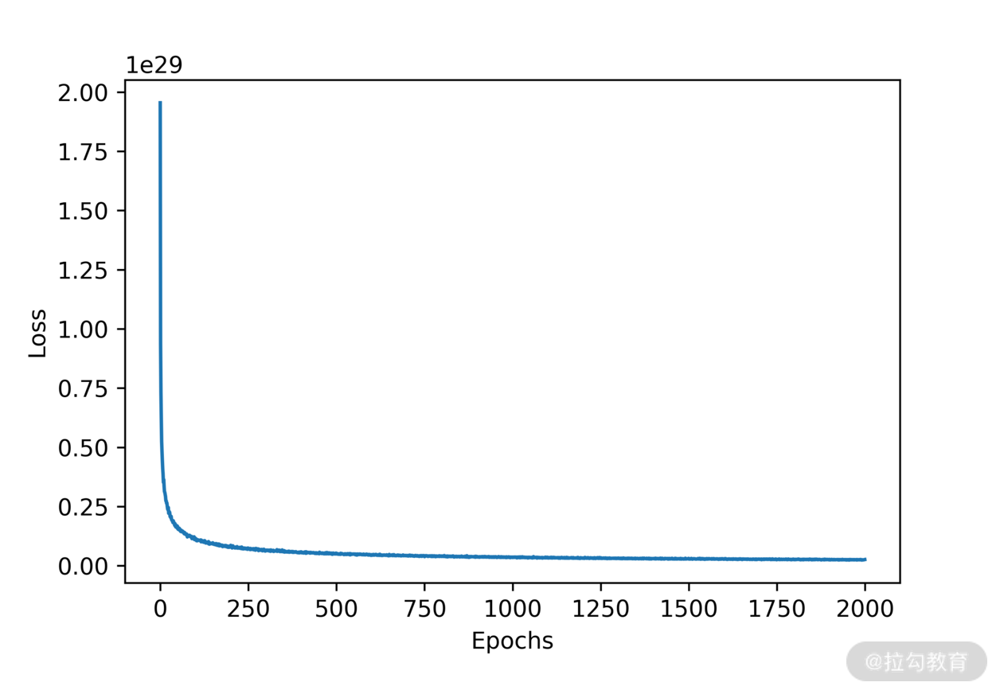

可以看到，loss 存在很大问题: loss 的数量级是 e 的 29 次幂。

任何机器学习项目，首要任务都是要观察数据、分析数据。把数据搞清楚之后，我们才能着手训练。所以，我们要回过头来看一下数据。盲目的训练是不会取得很好的结果的。

sklearn 把波士顿房价数据以一个字典的形式返回，可以看一下字典的 key 都有哪些:

```python
boston_data.keys()
```

输出如下:

```shell
dict_keys(['data', 'target', 'feature_names', 'DESCR', 'filename'])
```

其中有一个 key 叫作 DESCR，它是用来描述我们数据集的信息的，如下所示:

```python
print(boston_data['DESCR'])
```

输出如下:

```shell
.. _boston_dataset:
Boston house prices dataset
---------------------------
**Data Set Characteristics:**  
    :Number of Instances: 506 
    :Number of Attributes: 13 numeric/categorical predictive. Median Value (attribute 14) is usually the target.
    :Attribute Information (in order):
        - CRIM     per capita crime rate by town
        - ZN       proportion of residential land zoned for lots over 25,000 sq.ft.
        - INDUS    proportion of non-retail business acres per town
        - CHAS     Charles River dummy variable (= 1 if tract bounds river; 0 otherwise)
        - NOX      nitric oxides concentration (parts per 10 million)
        - RM       average number of rooms per dwelling
        - AGE      proportion of owner-occupied units built prior to 1940
        - DIS      weighted distances to five Boston employment centres
        - RAD      index of accessibility to radial highways
        - TAX      full-value property-tax rate per $10,000
        - PTRATIO  pupil-teacher ratio by town
        - B        1000(Bk - 0.63)^2 where Bk is the proportion of blacks by town
        - LSTAT    % lower status of the population
        - MEDV     Median value of owner-occupied homes in $1000's
    :Missing Attribute Values: None
    :Creator: Harrison, D. and Rubinfeld, D.L.
This is a copy of UCI ML housing dataset.
https://archive.ics.uci.edu/ml/machine-learning-databases/housing/
This dataset was taken from the StatLib library which is maintained at Carnegie Mellon University.
The Boston house-price data of Harrison, D. and Rubinfeld, D.L. 'Hedonic
prices and the demand for clean air', J. Environ. Economics & Management,
vol.5, 81-102, 1978.   Used in Belsley, Kuh & Welsch, 'Regression diagnostics
', Wiley, 1980.   N.B. Various transformations are used in the table on
pages 244-261 of the latter.
The Boston house-price data has been used in many machine learning papers that address regression
problems.   
     
.. topic:: References
   - Belsley, Kuh & Welsch, 'Regression diagnostics: Identifying Influential Data and Sources of Collinearity', Wiley, 1980. 244-261.
   - Quinlan,R. (1993). Combining Instance-Based and Model-Based Learning. In Proceedings on the Tenth International Conference of Machine Learning, 236-243, University of Massachusetts, Amherst. Morgan Kaufmann.

```

可以看到这个数据集一共有 506 条记录、13 个属性，并且没有缺失值。其实，这些内容即使我们不看它的描述，也应该通过代码自己确认一遍。

再具体看一下房价的数据:

```python
# 加载数据到dataframe中
df = pd.DataFrame(data=boston_data['data'], columns=boston_data['feature_names'])
df.head()
```

输出如下:

```shell
      CRIM    ZN  INDUS  CHAS    NOX  ...  RAD    TAX  PTRATIO       B  LSTAT
0  0.00632  18.0   2.31   0.0  0.538  ...  1.0  296.0     15.3  396.90   4.98
1  0.02731   0.0   7.07   0.0  0.469  ...  2.0  242.0     17.8  396.90   9.14
2  0.02729   0.0   7.07   0.0  0.469  ...  2.0  242.0     17.8  392.83   4.03
3  0.03237   0.0   2.18   0.0  0.458  ...  3.0  222.0     18.7  394.63   2.94
4  0.06905   0.0   2.18   0.0  0.458  ...  3.0  222.0     18.7  396.90   5.33
[5 rows x 13 columns]
```

你有没有发现一个问题，就是每个属性的取值范围是不一样的，CRIM 那列普遍很小，B 的那列却取值很大。

在这个时候，你就要考虑是否应该把所有训练数据都正规化到一个取值范围里了，否则会影响到模型的训练。关于正规化，将会在 [12 | 数据预处理: 让模型学得更好](../module_2/lecture_12.md) 中介绍。

当然，在这种传统机器学习的项目中，挑选特征是最重要的事情。所以我们先看看是否使用全量特征进行训练。

我们来计算一下各个特征(包括目标属性)的相关性。

相关性的取值范围是-1 到 1，越接近 1 或者-1 代表越相关，越接近 0 则越不相关。相关系数大于 0 称为正相关，小于 0 称为负相关。

* 假如 A 与 B 正相关，则是说 A(B) 会随着 B(A) 的增大而增大，减小而减小
* 假如 A 与 B 负相关，则是说 A(B) 会随着 B(A) 的增大而减小，减小而增大

下面的例子我采用皮尔逊相关性探索属性间的关系，具体计算方式在这里我就不介绍了，你可以自行查询了解。它常用于传统的机器学习项目，在深度学习中很少使用。

```python
# 观察属性间的相关性
df['PRICE'] = boston_data.target
correlation_matrix = df.corr().round(2)
plt.figure(figsize=(10, 10))
sns.heatmap(data=correlation_matrix, annot=True)
plt.savefig("../../images/module_1/6_9.png")
plt.show()
```

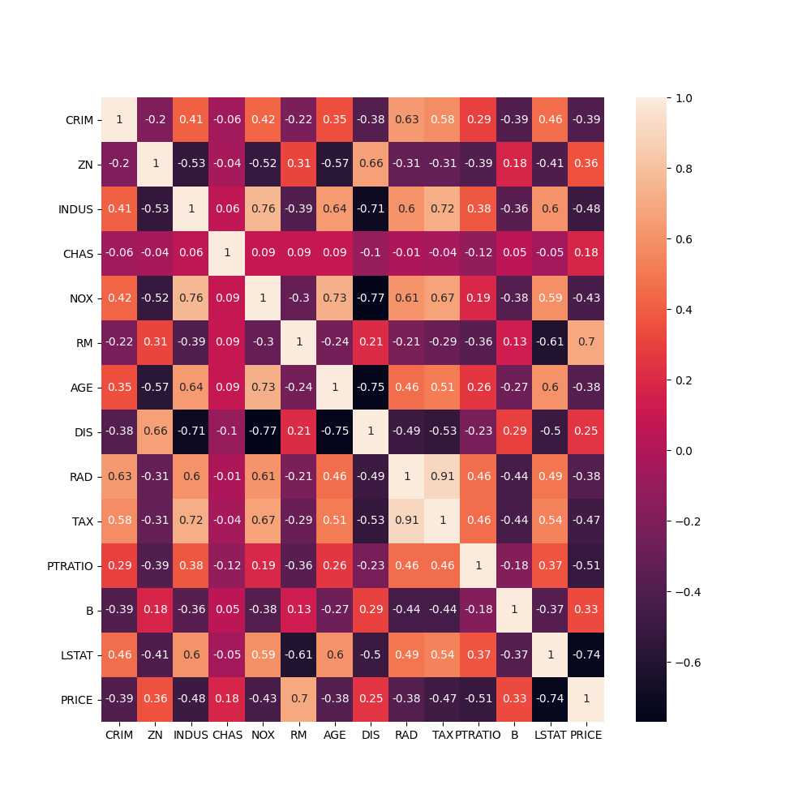

从上图可以发现两点:

* RM 与 PRICE 有很强的正相关性(0.7)，而 LSTAT 与 PRICE 有很强的负相关性(-0.74)
* 在线性模型中，很重要的一点是考虑是否剔除相关性很高的属性。RAD 与 TAX 有非常高的正相关性(0.91)，DIS 与 AGE 的负相关性(-0.75)很高

我们把第 1 点发现中与 price 相关的两个属性可视化之后，可以观察到正相关与负相关确实如我们刚才所介绍的那样。

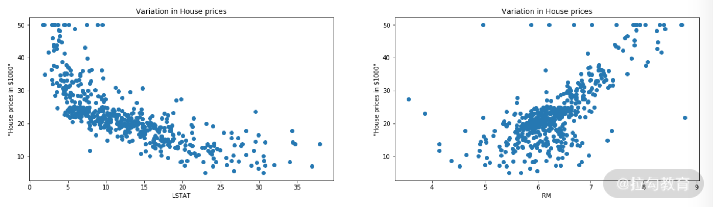

RM 与 LSTAT 算是两个非常重要的特征了，我们下面做 2 组实验对比一下，看看我们模型的模型是否收敛。

* 实验 1: 只用 RM 预测 PRICE
* 实验 2: 只用 LSTAT 预测 PRICE

实验 1 的训练 loss:

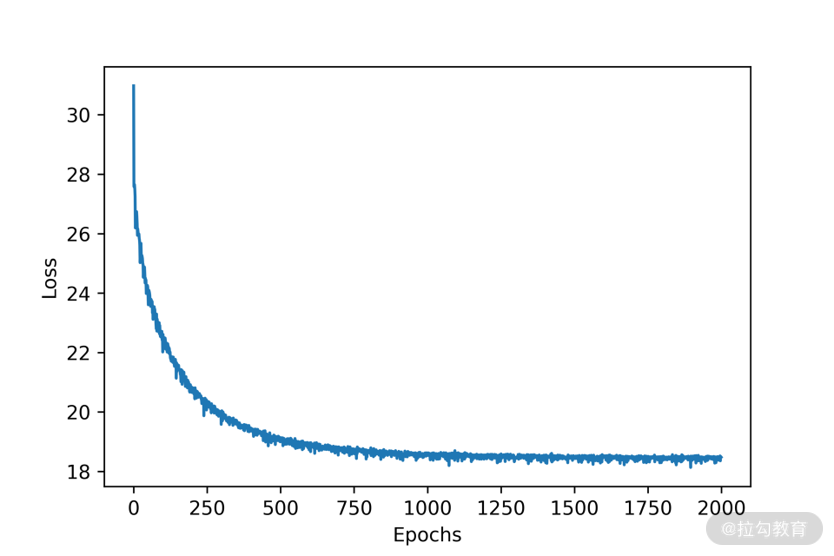

实验 2 的 loss:

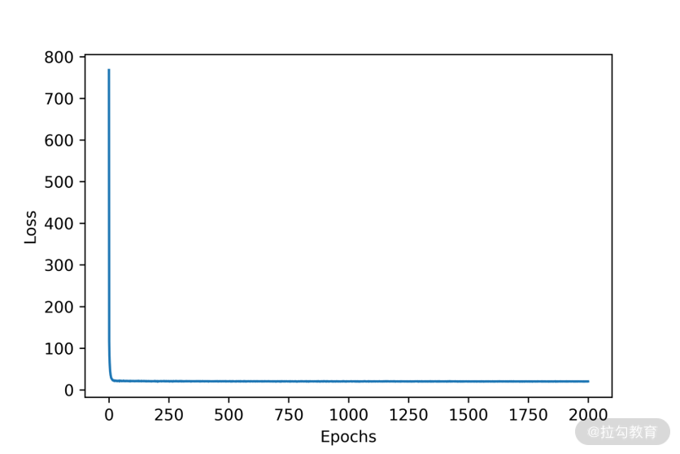

实验 1 与实验 2 的 loss 都很好地收敛了，并且实验 2 收敛得更快一些。接下来我们可以看看评估结果。

---

### 模型评估

模型评估我们依然使用 sklearn 中自带的均方误差来进行。

实验 1 的评估:

```python
y_predict = model.predict(X_test)
# 使用 mean_squared_error 模块，并输出评估结果。
print('The mean squared error of SGDRegressor is', mean_squared_error(y_test, y_predict))
```

输出如下:

```shell
Output: The mean squared error of SGDRegressor is 38.61589881811603
```

实验 2 的评估:

```shell
Output: The mean squared error of SGDRegressor is 49.33770954798598
```

从评估结果上看实验 1 要好一些。但你可能会好奇，实验 2 收敛得更快，为什么实验 2 的评估结果不好呢？这很正常，因为在验证集上的表现和训练时的收敛速度并没有直接关系。

实际问题往往更加复杂，如果在训练集上表现好，但在验证集中表现差，我们可能需要再好好地分析一下数据集哪里出现了问题，是不是训练集没有覆盖到验证集。

---

## 总结

这一课时介绍了线性回归模型，那我们可不可以把线性回归模型用于分类问题呢？答案是可以的，只需要把回归方程 $f(x)$ 输出加一个 sigmoid 函数就可以了。

你可能会觉得这跟我们讲的神经元很像，其实就是一回事。就像在介绍人工神经网络时讲到，一个神经元可以处理一个线性关系，有足够多个神经元就可以模拟出任意的非线性关系。

本课时通过线性回归模型对机器学习的整个流程进行了复习，并用波士顿房价预测的问题进行了实际的举例，课余时间你可以试一试同时使用 RM 与 LSTAT 对 PRICE 进行回归，或者提前对输入数据进行规则化处理，看看模型的效果会不会变好。

[本节代码](../../codes/module_1/l_6.ipynb)

下一节将带你了解卷积神经网络(CNN)，让你了解模型是如何观察世界的。

--- 
---

