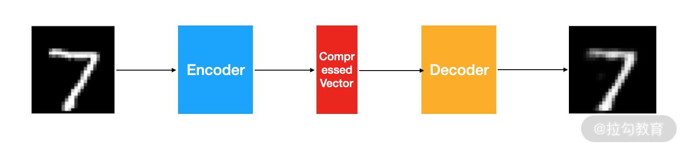
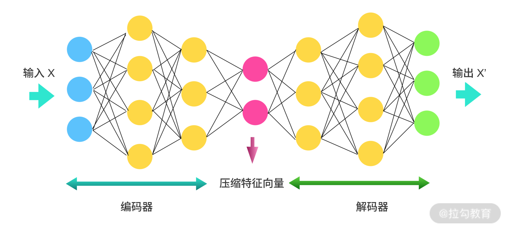
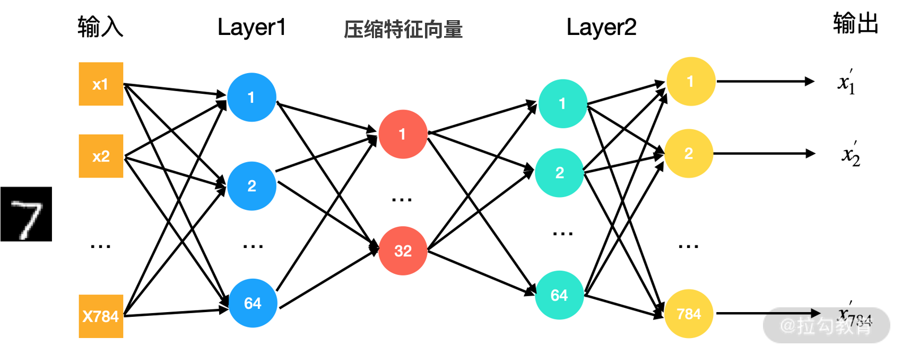
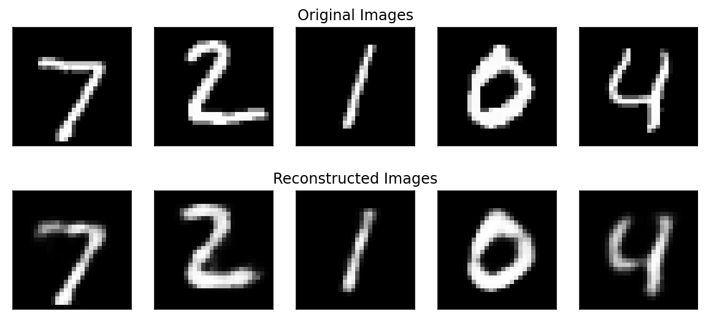
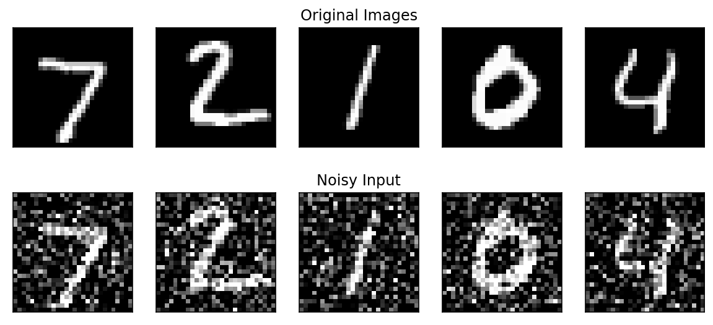
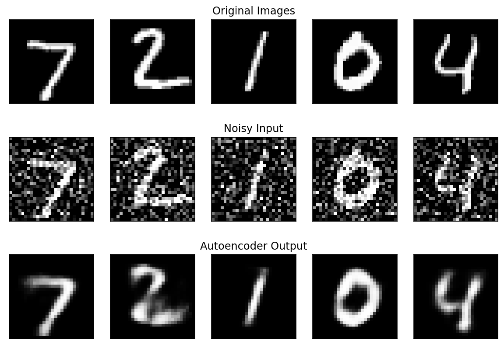
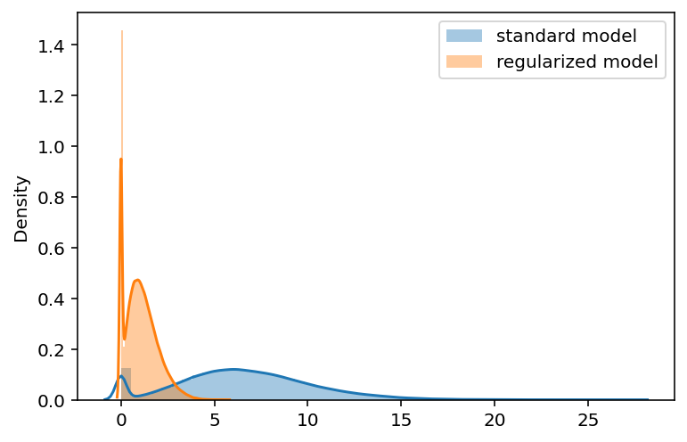

# 自编码器: 让模型拥有属于自己的表达和语言

上一讲了解了 RNN 和 LSTM，它们是在处理序列数据时非常有用的神经网络。在 [03 | AI 术语: 让你变得更加专业](lecture_3.md) 中说到，深度学习中大部分能落地的项目都属于有监督学习。那你还记得有监督学习的特点吗？

有监督学习的特点就是每个训练数据都有一个已知的标签。无监督学习则是在没有额外信息的情况下自动提取数据中模式和结构。有监督学习和无监督学习最大的区别就在于，有监督学习的训练集是需要人工提前标记的。这一讲要介绍的自编码器则是无监督学习的一个应用。

---
---

## 自编码器

自编码器是一个无监督的应用，它使用反向传播来更新参数，它最终的目标是让输出等于输入。数学上的表达为，$f(x) = x$，f 为自编码器，x 为输入数据。

在这个过程中，自编码器会先将输入数据压缩到一个较低维度的特征，然后利用这个较低维度的特征重现输入的数据，重现后的数据就是自编码器的输出。所以，从本质上来说，自编码器就是一个压缩算法。

一个自编码器由 3 个部分组成:

* 编码器(Encoder): 用于数据压缩
* 压缩特征向量(Compressed Feature Vector): 被编码器压缩后的特征
* 解码器(Decoder): 用于数据解码

自编码器的结构如下图所示:



对自编码器做如下 3 点说明:

* 自编码器只能压缩与训练数据相似的数据。比如我们用 MNIST 训练自编码器，那它只能压缩手写数字相关的数据，如果用来压缩手写数字以外的数据，表现就会很差
* 自编码器解压缩的结果只能接近输入，并不完全一样。所以，换句话说，它是一个有损的压缩算法
* 自编码器是一个无监督学习的算法。训练一个自编码器，我们不需要对数据做任何标注，只需要把原始数据扔给它就可以了，它会自动挖掘数据中的潜在结构模式

---

## 自编码器的网络架构

那自编码器的网络结构是什么样的呢？这一节来一起探索编码器、压缩特征向量和解码器。

编码器与解码器就是我之前讲的多层感知机，也就是在 [02 | 从神经元说起: 结构篇](lecture_2.md) 中介绍的内容。

压缩特征向量也是人工神经网络中的一层，它的维度就是我们要将数据压缩到的维度，是一个超参，要提前设定。

下图是一个详细的自编码器的网络结构。



从图中可以看到，首先我们会有 3 个维度的输入 x 通过编码器，然后生成 1 个有两个维度的压缩特征向量。解码器会将这两个维度的特征向量恢复到 3 个维度的 $x'$，然后输出。

整个过程的宗旨只有一个: 输出的 $x'$ 无限接近输入 x。

对于一个自编码器，会有 3 个超参需要设定:

* 压缩特征向量的神经元的个数，也就是压缩后的维度。神经元的个数越少则代表有更重的压缩
* 层的个数。自编码器的结构可以按照我们的想法任意设定
* 每一层中神经元的个数。

现在介绍的这种自编码器是一层层堆叠起来的，所以又可以称为堆叠式自编码器。通常来说，堆叠式自编码器的结构总体上看起来像一个三明治，编码器与解码器是对称的。从输入到中间的压缩特征向量，神经元的个数逐层减少；从中间的压缩特征向量到输出层，神经元的个数逐层递增。

---

## 自编码器的实现

接下来看看具体怎么构建一个自编码器。总体上而言，如何训练一个自编码器呢？只需要以下几个步骤:

* 构造一个编码器和解码器
* 设定一个损失函数来衡量输出 $x'$ 与输入 x 的差距
* 选择一个优化方法，来更新参数，例如 SGD

把上面 3 步再具体一些。

* 我们有数据集 $D: D=\{x_1,x_2,...,x_i,...,x_m\}$，其中 $x_i=(x_i,1,x_i,2,...,x_i,n)$
* 编码器为 $y=h(x)$，y 是上图中的压缩特征向量
* 解码器为 $x'=f(y)=f(h(x))$
* 如果输入的数据是数值型，则利用均方误差(MSE)来衡量输出 x'与输入 x 之间的差距；如果输入的数据是离散型，则利用交叉熵损失来衡量输出 $x'$ 与输入 x 之间的差距
* $h(x)$ 与 $f(y)$ 的参数会通过设定好的优化方法进行更新。

下面我们用 MNIST 数据来训练一个下图这样的自编码器:



因为我们还没有学习到 TensorFlow 编程，所以这里先使用 Keras 举例。Keras 的优点是代码非常简单且易读性高。

代码中会用到 Keras 的 Dense 模块，Dense 就是一个全连接层。如果你对 Keras 很感兴趣，可以点击链接查看。

下面来看一下图中自编码器的实现，在 [代码](../../codes/module_1/l_9.ipynb) 中已经写好了注释:

```python
# 输入的大小。
# 因为输入的图片 shape 是(28, 28)，将它展开后的大小是 784
input_size = 784
# 隐藏层神经元的大小
hidden_size = 64
# 压缩向量长度为 32
compression_size = 32
# autoEncoder 网络定义
# 输入层
input_img = Input(shape=(input_size,))
# 隐藏层 Layer1
hidden_1 = Dense(hidden_size, activation='relu')(input_img)
# 压缩特征向量
compressed_vector = Dense(compression_size, activation='relu')(hidden_1)
# 隐藏层 Layer2
hidden_2 = Dense(hidden_size, activation='relu')(compressed_vector)
# 输出层
output_img = Dense(input_size, activation='sigmoid')(hidden_2)
# 网络训练
autoEncoder = Model(input_img, output_img)
autoEncoder.compile(optimizer='adam', loss='binary_crossentropy')
autoEncoder.fit(x_train, x_train, epochs=3)
```

通过以上代码，我们从输入层、隐藏层到输出层，构建了一个最为简单的自编码器。

然后用刚才训练的自编码器测试一下 MNIST 测试集的前 6 张图片。可以发现，解码后基本可以恢复到原图的效果。



通过刚才的代码可以发现，自编码器的网络结构非常容易控制，只要增加网络的层数、每一层的节点数以及压缩向量的长度就让网络变得更加强大。

增加这些超参会让自编码器学习到更加复杂的压缩编码模型，但同时也会带来一定的问题。太复杂的网络有可能让网络变得非常容易过拟合，并且网络也很难学习到输入数据的潜在特征，只会学到将输入数据拷贝到输出这样一种单纯的恒等变换。

模型过拟合的时候，在训练集上会有非常优秀的表现，但是遇到训练集以外的数据就不会有很好的效果。这就是为什么我们大部分自编码器都是三明治结构，并且故意保留了一个比较小的压缩特征向量。

那除了保留一个较小的压缩特征向量之外，还有没有其他方法可以让自编码器更加专注地发现数据中的潜在结构呢？

那就是接下来要介绍的两种方式，降噪自编码器与稀疏自编码器。

---

## 降噪自编码器(Denoising AutoEncoders)

降噪自编码器是在训练时，在输入的数据中加入随机噪音，在最后输出的时候恢复到没有噪音的状态的一种编码器。

因为输入的数据中加入了随机噪音，就避免了网络只学习到简单的将输入复制到输出的这种恒等变换，强制让自编码器学习如何剔除数据中的噪音，然后再恢复到没有噪音的状态。这样就能让它更加专注地挖掘数据中的潜在结构模式。

依然使用 MNIST 来举例，我在训练数据中加入了随机的噪音，如下图所示:



上图的第一行为原始图片，第二行为对应有噪声的图片。

训练时，我们把第二行图片作为输入，第一行的原始图片作为输出。在代码上，降噪自编码器的训练只有一点与普通的自编码器不一样，就是输入数据的选择。

我们使用上文介绍的网络结构来训练，但是请你注意，fit 的时候，输入变成了 x_train_noisy。

```python
# denoising autoEncoder 的网络结构
# 与上一个例子中的网络结构一样
input_img = Input(shape=(input_size,))
hidden_1 = Dense(hidden_size, activation='relu')(input_img)
compressed_vector = Dense(compression_size, activation='relu')(hidden_1)
hidden_2 = Dense(hidden_size, activation='relu')(compressed_vector)
output_img = Dense(input_size, activation='sigmoid')(hidden_2)
autoEncoder = Model(input_img, output_img)
autoEncoder.compile(optimizer='adam', loss='binary_crossentropy')
autoEncoder.fit(x_train_noisy, x_train, epochs=3)
```

通过上述代码，我们实现了降噪自编码器。

下面我们来可视化一下，看看降噪编码器是否可以生成没有噪音的图片。



从结果上看，效果还是不错的。最下面一行是自编码器的输出，自编码器成功去除了噪音，还原了图片的本来面貌。

---

## 稀疏自编码器(Sparse AutoEncoders)

我们已经学习了 2 种让自编码器学习到有用特征的方法: 保持较小的压缩特征向量和降噪自编码器。下面来介绍第 3 种方法，稀疏自编码器。

我们可以通过限制自编码器中神经元的输出，只让很小的一部分神经元有非 0
的输出，也可以说是只激活一小部分的神经元。这就迫使自编码器将输入与一部分节点联系起来，从而让它发现数据中更有价值的结构。即使压缩特征向量中有很多节点，有这种约束的自动编码器也可以很好地工作，因为它只让一部分节点被激活。

具体怎么做呢？我们只需要在损失函数中加一个惩罚项，在训练时就可以让自编码器只有一小部分节点被激活，这样我们就得到一个稀疏自编码器了。

你还记得什么样的正则约束会实现这种稀疏的约束吗？答案是我们在 [第 1 讲](lecture_1.md) 中介绍的 L1 范数。我们这里讲的稀疏自编码器在 Keras 中也很好实现。

之前是用如下的方式建立的全连接层:

```python
hidden_1 = Dense(hidden_size, activation='relu')(input_img)
```

我们现在添加一个叫作 ```activity_regularizer``` 的参数，它可以对层的输出进行正则化约束(可以参考链接中的内容)。

约束的方式我们选择的是 L1 正则化。L1 正则化的参数一般会是在 [0.001, 0.000001] 这个范围内，我们选择 0.0001。

```python
hidden_1 = Dense(hidden_size, activation='relu', activity_regularizer=l1(0.0001))(input_img)
```

接下来训练 2 个自编码器。

* 标准的自编码器: 与上文介绍的一样
* 稀疏自编码器: 在压缩特征向量那一层增加 L1 正则约束

然后对比一下压缩特征向量的输出分布。

我们通过下面的代码获得标准自编码器与稀疏自编码器压缩特征向量的输出。

```python
standard_scores = Encoder_autoEncoder.predict(x_test).ravel()
sparse_autoEncoder = Encoder_sparse_autoEncoder.predict(x_test).ravel()
```

然后绘制一下它们的概率密度图，如下所示:



可以发现，我们的 L1 正则约束确实对压缩特征向量起到了效果，大部分时候的输出都是 0。而标准的自编码器的压缩特征向量的输出相对平缓一些。

---

## 自编码器的使用场景

学习完自编码器的模型结构之后，你是否会有这样的疑问: 自编码器对输入图片的压缩效果怎么样，它在深度学习领域中被广泛应用了吗？

非常不幸地告诉你，自编码器并没有被广泛地应用在现实世界中。

对于压缩应用来说，想训练一个能够与 JPEG 算法相提并论的模型几乎是不可能的。并且自编码器对训练数据有非常强的依赖，这也让它能难作为一个通用的压缩算法被使用。

所以自编码器主要有以下两个用途:

* 数据降噪
* 降维处理

数据降噪我在前面已经介绍过了，这里我来说明一下自编码器的降维应用。

自编码器常用于降维处理，它的降维性能要强于主成分分析(Principal Component Analysis, PCA)。PCA 只能做线性变换，而自编码器可以做非线性变换，可以发现数据中更多有趣的事情。

PCA 是一个常用的降维方法，经常用于传统机器学习与统计分析的领域中，很少用在深度学习的领域。我在这里就不做过多的介绍了，你可以自行查阅学习。

为什么自编码器可以做非线性变换呢？我在 [02 | 从神经元说起: 结构篇](lecture_2.md)
提到过，一个神经元可以处理一个线性关系，如果有足够多个线性单元，我们可以模拟出任意的非线性关系。我们的自编码器是由感知机实现的，所以可以发现数据中更多非线性的关系。

---

## 总结

自编码器是一个非常有用的降维技术，在这一讲里我介绍了它的几种常见形式。我们涉及了一些 Keras 的代码，这部分代码虽然你可能还没有学过，但它的可读性非常高，希望课后你能够尝试阅读一下。

上文中我讲到了解码器和编码器，那它们能否用卷积来实现呢？

下一讲将带你了解深度学习中，无监督学习的另一个应用: 生成式对抗网络。有了生成式对抗网络的知识，你就可以去学习例如人脸生成、风格迁移等更加有趣的算法。

---
---

