# 集成、共享、敏捷: Jupyter Notebook 的使用

在此之前，你已经学习了有关深度学习的理论部分了。从本节开始，你将接触更多与实际编程开发相关的内容，就让我们从常用的工具说起。

---
---

## 深度学习编程常用工具

先来看 4 个常用的编程工具: Sublime Text、Pycharm、Vim、Jupyter。虽然我介绍的是 Jupyter，但并不是要求你必须使用它，你也可以根据自己的喜好自由选择。

---

### Sublime Text

第一个是 Sublime Text，它是一个非常轻量且强大的文本编辑工具，内置了很多快捷的功能，同时还支持很丰富的插件功能，对我们来说非常方便。

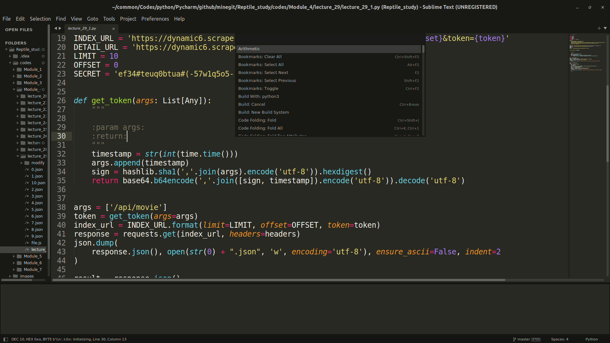

如上图所示，它可以自动为项目中的类、方法和函数生成索引，让我们可以跟踪代码。可以通过它的 goto anything 功能，根据一些关键字查找到项目中的对应的代码行。

---

### Pycharm

第二个是 Pycharm，这里不做过多的介绍，它与 R Studio 一样都是针对某一编程语言的特定 IDE。

---

### Vim

第三个是 Vim，它是 Linux 系统中的文本编辑工具，方便快捷且强大，我们在项目中经常会使用到。

在项目中，经常需要登录到服务器上进行开发，而服务器一般都是 Linux 系统，不会有 Sublime Text 与 Pycharm，所以可以直接用 Vim 打开代码进行编辑。对于没有接触过 Linux 或者是一直使用 IDE
进行编程开发的同学，一开始可能觉得不是很方便，但 Vim 的快捷键十分丰富，对于 Shell 与 Python 的开发来说非常便捷。

Vim 的缺点正如刚才所说，有一点点门槛，需要你去学习它的使用方法。只要你学会了，你将对它爱不释手。

---

### Jupyter Notebook & Lab

最后是这一讲要介绍的 Jupyter Notebook 了，它是一个开源的 Web 应用，能够让你创建、分享包含可执行代码、可视化结构和文字说明的文档。

Jupyter Notebook 的应用非常广泛，它可以用在数据清理与转换、数字模拟、统计模型、数据可视化、机器学习等方面。

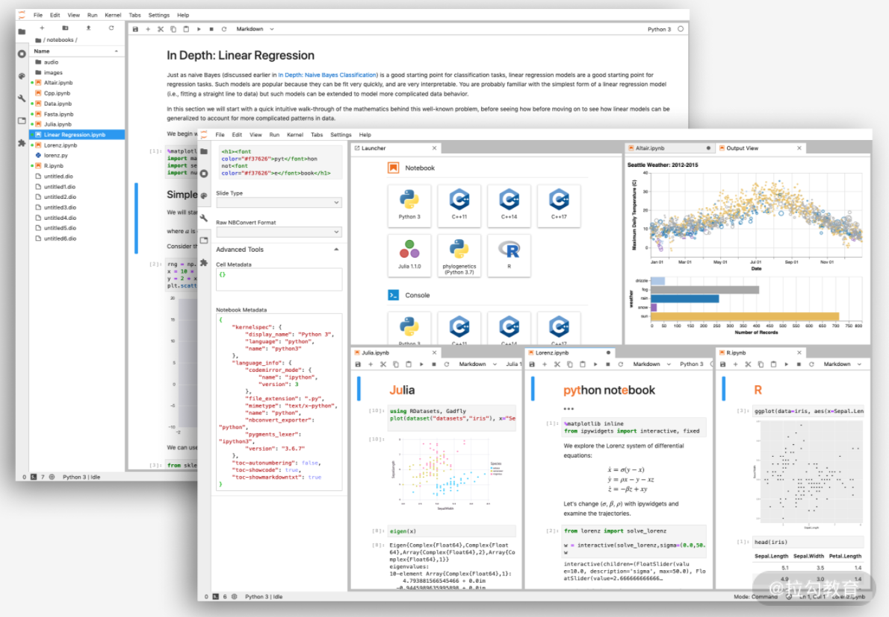

Jupyter Notebooks 非常活跃于深度学习领域。在项目的实验测试阶段，它相比于用 py 文件来直接编程还是方便一些。在项目结束之后如果要写项目报告，用 Jupyter 也比较合适。

简单介绍之后，接下来就从 Jupyter 的功能、Jupyter 的安装与启动与 Jupyter Lab 的操作这 3 个方面学习 Jupyter。

---

## Jupyter Notebook & Lab 的功能

Jupyter 主要有以下 3 点的作用: 执行代码、数据可视化以及使用 Markdown 功能写报告。

* 执行代码。一般是 Python 程序，也可以添加新的编程语言
* 数据可视化。设想一下，我们经常在 Linux 环境编程开发，如果需要对数据可视化该怎么办呢？是不是只能把图片保存下来，然后下载到本地进行查看？使用 Jupyter Notebook 就不用多此一举，我们可以直接在页面中查看。如下图所示:

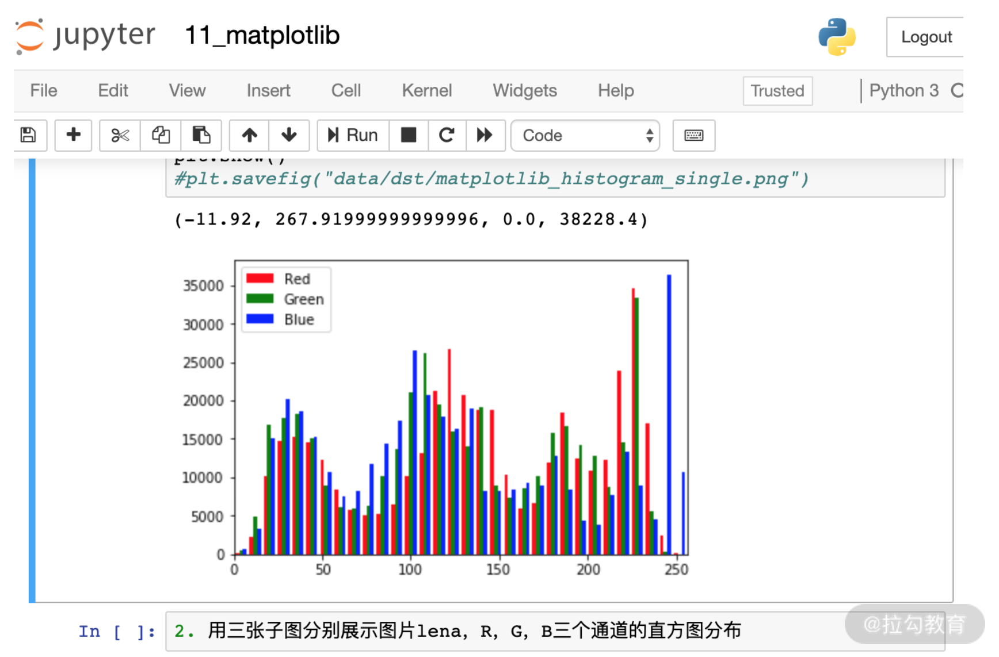

* 使用 Markdown 功能写文档，或者制作 PPT。这些文档中还包含代码以及代码执行后的结果，非常有助于你书写项目报告

---

## Jupyter Notebook & Lab 的安装与启动

了解了 Jupyter 的功能之后，我们来看看具体要如何进行安装与启动。这一节我介绍了 3 种安装和启动的方式，分别是 Anaconda、Docker 和 pip。

---

### 使用 Anaconda 安装与启动

先来看如何使用 Anaconda 来安装与启动。

---

#### 安装

最简单的方法是通过安装 Anaconda 来使用 Jupyter Notebook & Lab。Anaconda 已自动安装了 Jupter Notebook 及其他工具，还有 Python 中超过 180 个科学包及其依赖项。你可以通过
Anaconda 的官方网站得到 Anaconda 的下载工具。

---

#### 启动

这里会分 MacOS/linux 系统和 Win 环境来讲解。

---

##### MacOS/linux 系统

安装完 Anaconda 之后，打开终端后系统会默认进入 base 环境。

在命令行最前面有个 (base) 的标志则表示代码进入 base 环境了，如果没有就需要通过下面的命令激活 base 环境:

```shell
conda activate base
```

在 base 环境下执行下面的命令，会自动进入 Jupyte Notebook 的开发环境。

```shell
jupyter notebook
```

执行下面的命令，则会自动进入到 Jupyter Lab 的开发环境。

```shell
jupyter lab
```

还有一种方法，我们可以通过 Anaconda Navigator 启动 Juypter Notebook 或者 Jupyter Lab。

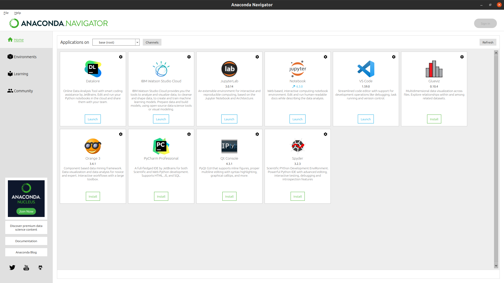

---

##### Win 环境

Windows 环境中的启动方式与 MacOS 基本一样。

当你想通过命令 Jupyter Notebook 或 Jupyter Lab 启动时，你需要在 Anaconda Prompt 中执行。

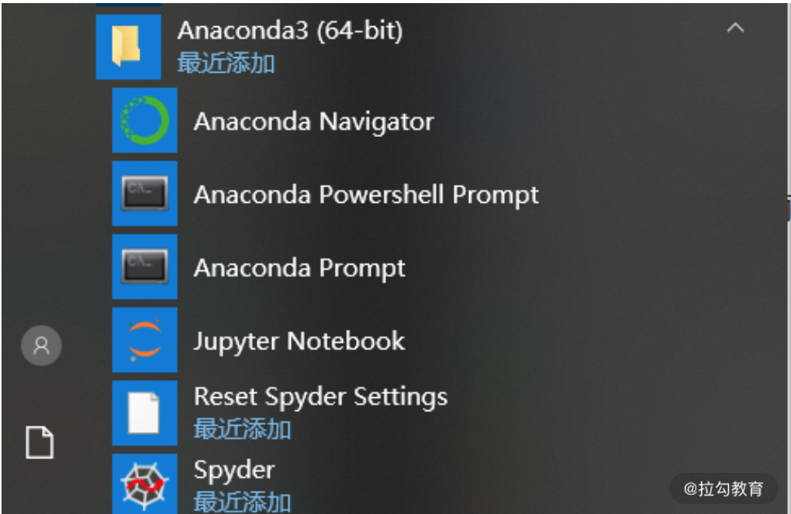

通过 Anaconda Navigator 启动的方式与 MacOS 一样。

---

#### 使用 Docker

通过 Docker 使用 Jupyter 也非常简单，连安装都不需要，但前提是你要有 Docker 相关的知识。

该地址中有很多的 Jupyter 的 Docker 镜像，你可以在这里找到你需要的，然后拉取一个到你的服务器或者本地，直接启动就可以了。

---

#### 使用 pip 安装与启动

了解完 Anaconda 和 Docker 的安装与启动方式后，我们最后来看 pip 是如何安装和启动的。

通过 pip 安装 Jupyter Notebook:

```shell
pip install Jupyter
```

通过 pip 安装 Jupyter Lab:

```shell
pip install Jupyterlab
```

安装完成后，直接在终端执行 Jupyter Notebok 或 Jupyter Lab 命令启动。

不管在 MacOS 系统还是在 Windows 系统，通过以上任意一种方式成功启动后，浏览器都会自动打开 Jupyter Notebook 或 Jupyter Lab 的开发环境，如"Jupyter Notebook & Lab"小节中的图
2。

---

## Jupyter Lab 的操作

Jupyter Lab 是 Jupyter Notebook 的下一代产品，在使用方式上更为灵活、便捷。

在本讲中介绍的也是 Jupyter Lab。Jupyter Lab 的内容同样适用于 Jupyter Nobebook，它们只是工具的表现形式不一样而已。所以，下面我就省略了 Notebook 的介绍。

在命令行或者 Anaconda Navigator 中启动 Jupyter Lab 之后，浏览器会自动打开如下所示的 Jupyter Lab 界面:

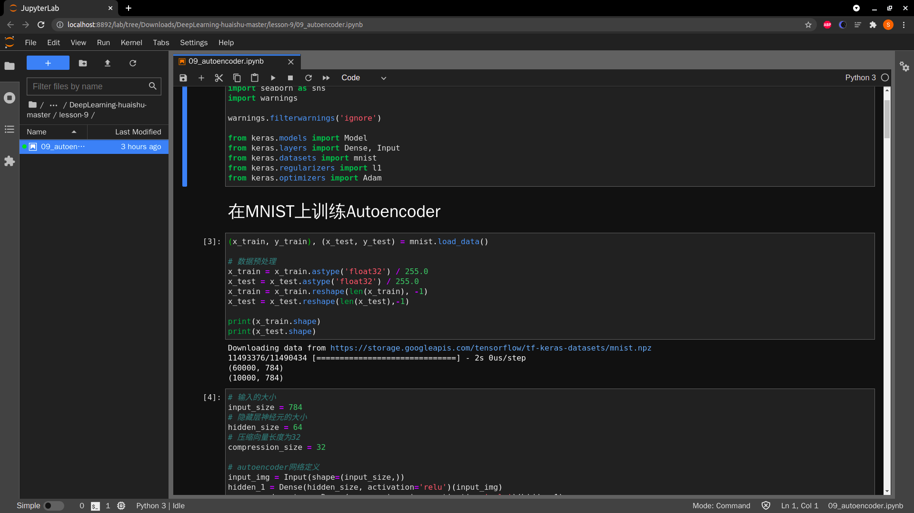

最左侧显示的是你启动时所在的目录，右侧是你可以使用的一些开发工具。

我们先来看 Notebook 的使用。

---

### Notebook

点击 Notebook 下面的"Python 3"的图标之后，就会自动新建一个 Notebook。

Jypter Lab 与 Jupyter Notebook 中都会用到这个叫作 Notebook 的编辑工具。

Jupyter Lab 与 Jupyter Notebook 不同的地方是 IDE 的界面以及操作方式，这里讲解用的是 Jupyter Lab 的操作。

一个 Notebook 的编辑界面主要由 4 个部分组成: 菜单栏、工具栏、单元格(Cell)以及内核。如下图所示:

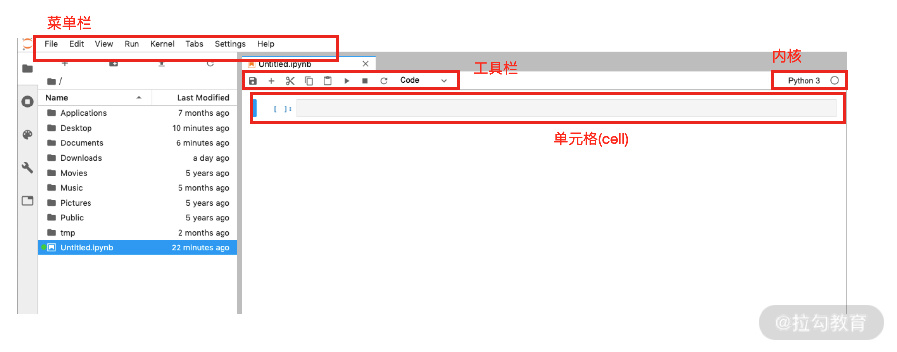

菜单栏与工具栏这里就不详细介绍了。先来看单元格(Cell)，然后再介绍内核。

单元格是我们 Notebook 的主要内容，这里我会介绍两种单元格。

* Code 单元格: 包含可以在内核运行的代码，并且在单元格下方输出运行结果
* Markdown 单元格: 包含运用 Markdown 的文档，常用于文档的说明，也是可以运行的单元格

从 Code 单元格切换到 Markdown 单元格的切换的快捷键是 m；从 Markdown 单元格切换到 Code 单元格的切换的快捷键是 y。

切换之前需要先按 Esc，从单元格的编辑状态中退出。

在工具栏中也可以切换，但是还是快捷键方便些。工具栏的位置在下图中红框的位置:

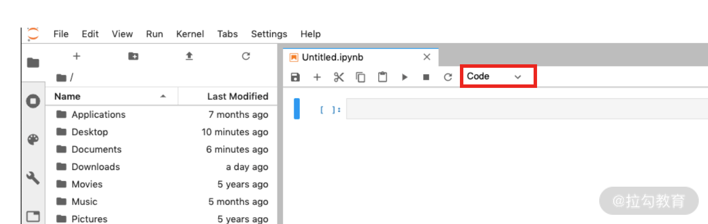

我们看一个例子。我编辑了下面的 Notebook。第一行是 1 个 Markdown 单元格，是 1 个一级标题，第二行是 1 个 Python 的代码。两行代码都是未运行状态。

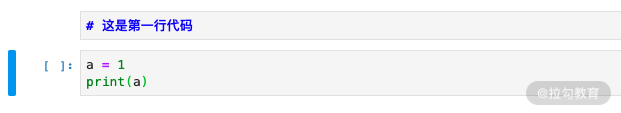

你注意到左边那个蓝色的竖条了吗？它代表我们所在的单元格。

我们在编辑这个单元格的时候，左边是绿色的竖条。如果我们按 Esc 退出单元格，它就会变为蓝色。

退出单元格后，我们可以通过上下键移动选中的单元格。我们移动到第一行，然后开始运行这两个单元格。

运行单独一个单元格的快捷键 Ctrl+Enter，运行选中单元格并切换到下一个单元格的快捷键是 Shift + Enter。运行结果如下图所示:

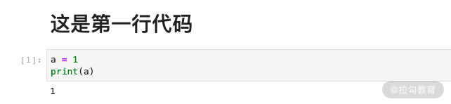

Markdown 没有左边的"[]"标签，通过这一点你可以区分 Code 单元格与 Markdown 单元格。

"[]"中的数字代表单元格被执行的顺序，例子中"[1]"代表第一个被执行的单元格。

以上就是单元格的内容了。接下来看看，单元格中的一些快捷键的使用。

(1) 快捷键

如果你是用 Jupyter 进行开发，掌握单元格的快捷键能让你的开发速度变得更快，下面我列举了几个常用的快捷键:

执行单元格 Ctrl+Enter 或 Shift+Enter；

* a 在单元格上方插入新的单元格
* b 在单元格下方插入新的单元格
* x 删除单元格
* z 撤销删除的单元格

(2) Magic 命令

Jupyter Notebook 的前身是 IPython Notebook，所以 Jupyter 也支持 IPython 的 Magic 命令。IPython 是一个比 Python 自带的 Shell 更加灵活方便的
Shell，它主要活跃于数据科学领域。

Magic 命令分两种:

* Line Magics 命令: 在命令前面加 %，表示只在本行有效
* Cell Magics 命令: 在命令前面加 %%，表示在整个 Cell 单元有效

下面介绍几个常用的 Magic 命令。

* ```%lsmagic```: 用来查看可以使用的 Magic 命令

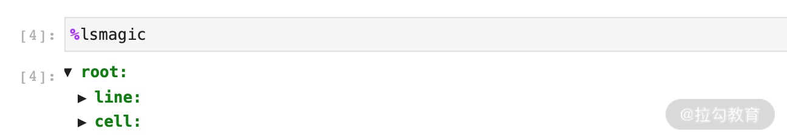

* ```%matplotlib inline```: 可以在单元格下面直接打印出 matplotlib 的图标，通常要在 matplotlib 模块引入之前使用；使用这个 Magic 命令之后，可以不用 ```plt.show()```

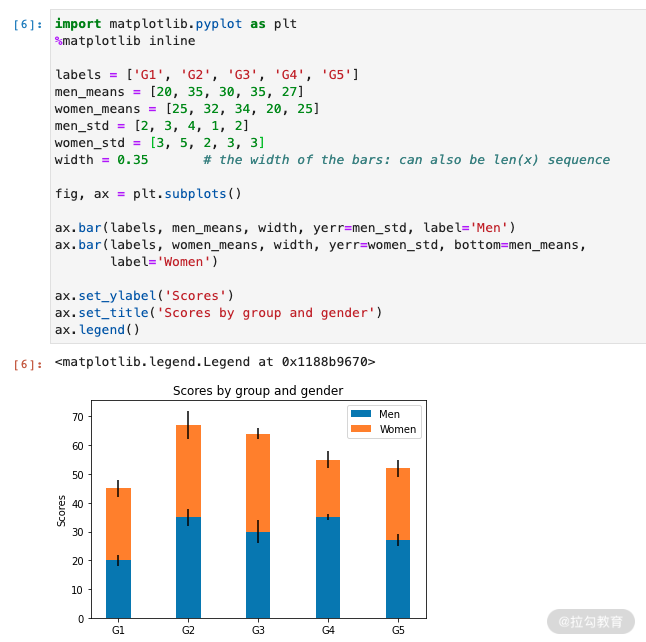

* ```%pwd```: 查看当前的文件路径
* ```%%writefile```: 写文件，```%%writefile``` 后面紧跟着文件名，然后下面写文件的内容
* ```%run```:  运行一个文件，```%run``` 后面跟着要运行的文件

请看下面的例子，我们先写一个 temp.py 的文件。运行单元格之后会在当前位置生成一个叫作 temp.py 的文件，然后我们使用%run 来运行它。

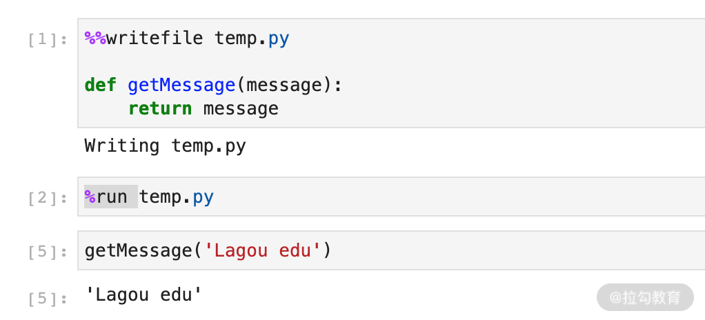

* ```%load```: 加载文件。使用 ```%load + 文件名``` 可以把指定的文件加载到单元格内。请看下面的例子，我们要把 temp.py 加载到单元格里，首先是执行前，


运行后，自动加载 temp.py 到本单元格。

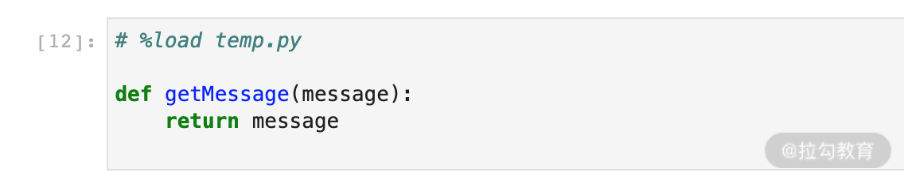

(3) Markdown 命令

了解了 Magic 命令后，再来看 Markdown 命令。Markdown 是一种在 Markdown 单元中用于格式化文本的语言，常用于 Notebook 的文档说明，我们列举了几个常用的命令。

* 标题: 通过井号的数目可以决定标题的大小

```markdown
# 一级标题:

## 二级标题:

### 三级标题:

#### 四级标题:

##### 五级标题: 
```

上述 Markdown 命令的执行结果如下:


图 16: "标题"命令展示图

* 列表: 分为无序列表与有序列表。

```markdown
## 无序列表

- 项目 1
- 项目 2

## 有序列表

1. 项目 1 (1. 与项目 1 之间有一个空格)
2. 项目 2
```

上述 Markdown 命令的执行结果如下:

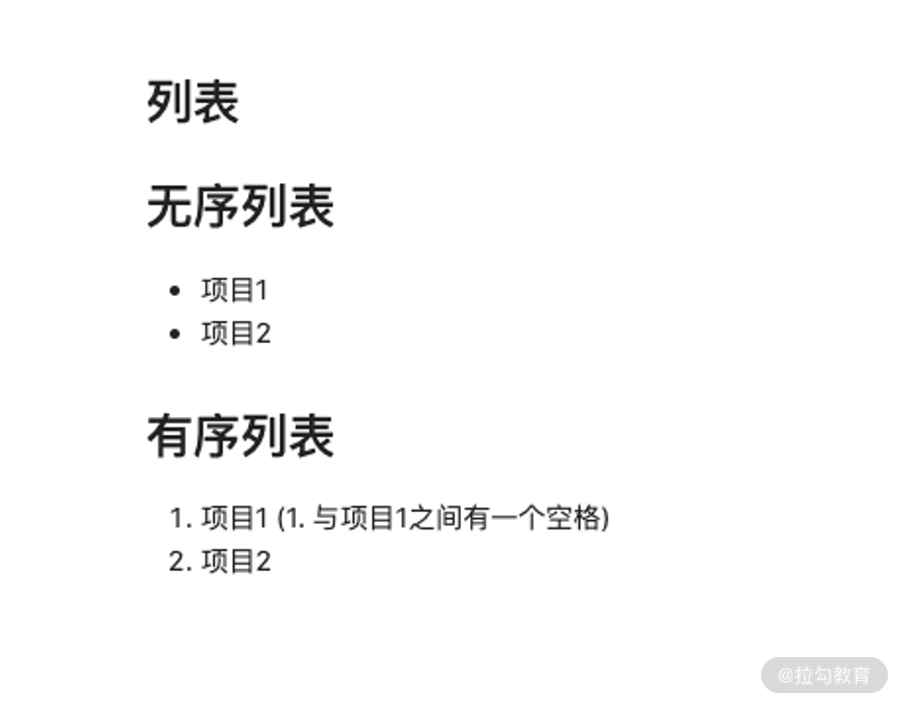

* 换行: 第一种换行方法是在行尾添加
* 进行换行；第二种则是两行之间空一行
* 字体: 可以通过*或者_的数目控制强调的内容，即斜体、加粗以及粗斜体。具体的请看下面的例子

```markdown
*斜体*
**加粗**
***粗斜体***
或者
_斜体_
__加粗__
___粗斜体___
```

运行后效果如下所示:


(4) 调用系统命令

最后，在 Notebook 中还可以调用所在操作系统的命令，只需要在命令前加一个"!"就可以了。例如，在 Linux 系统中查看当前路径:

```shell
!pwd
```

上面介绍了单元格及单元格的常用快捷键和命令，接下来解一下内核。我们刚才打开这个 Notebook 的时候其实已经选好了它的内核，即 Python3。

什么是内核呢？

Notebook 背后其实都有一个内核，我们在单元格中写好的代码就是运行在内核中的。运行代码后，内核会将代码中所有的输出都返回给单元格，并在单元格下方显示。

在编辑 Notebook 中的单元格的时候，内核的状态是保持不变的。换句话说，内核的运行状态只与 Notebook 有关，与 Notebook 中的单元格无关。

例如，你在一个单元格中定义了变量、方法或是导入了模块，并运行了它。那么，在其他的单元格中仍然可以使用这些变量、方法以及模块，不会因为我们换了一个单元格，之前的代码就失效了，因为它们都运行在同一个 Notebook 的内核中。

请看下面的例子:


上图中，我们在第一个单元格定义了一个 print_message 函数，然后在下一个单元格中写了一句说明，在最下面一个单元格中依然可以调用了第一个单元格中的 print_message 函数。

我们编辑一个 Notebook 的开发流程肯定是从上至下的，一边分析运行结果一边考虑下面的代码该如何书写。

开发到某一阶段时，可能会发现之前的某些代码写错了，需要回过头重新编辑然后运行代码，这是一件很正常的事情。但这个时候你要注意，每个 Code 单元格是有执行顺序的，这个顺序就是每个单元格前面[]的数字。

如果你想全部重新执行的话，Kernal 菜单中的一些功能会帮到你。

* Restart Kernel: 重新启动内核，清除所有变量
* Restart Kernel and Clear All Outputs: 重新启动内核，清除所有变量与输出
* Restart Kernel and Run up to Selected Cell: 重启内核，运行选中的单元格
* Restart Kernel and Run All Cells: 重启内核，运行所有单元格

我们现在使用的是 Python 内核，其实 Jupyter 还支持很多其他的内核，如 Java、C、R 以及 Julia 等编程语言的内核。我们创建 NoteBook 的时候就选择好了使用什么样的内核。

---

### Notebook 的配置

我们使用 IDE 开发的时候经常会根据实际需要以及个人的喜好，对 IDE 进行一些配置。Notebook 同样支持个性化的配置。

可以通过下面这条命令找到 Notebook 的配置文件:

```shell
Jupyter notebook --generate-config
```

执行完上述命令，Jupyter 就会告诉你生成的配置文件在哪，如果已经有了会问你是否覆盖。配置文件名叫 Jupyter_notebook_config.py。

下面就对 Notebook 做一些常用的配置。

(1) 修改启动后的工作路径

默认情况下，在哪里执行 Jupyter Lab 命令，启动后的工作路径就在哪里，如下图左侧显示的位置:

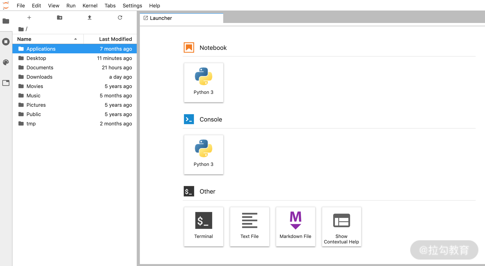

可以通过修改下面的变量修改启动的路径:

```shell
c.NotebookApp.notebook_dir = '/home/user/work'
```

(2) 在服务器端启动 Jupyter

讲到这里，只介绍了在自己本地的机器上启动 Jupyter 的方法: 在自己的电脑上输入 Jupyter Lab 或者 Jupyter Notebook 命令就可以打开 Jupyter。但是我们经常需要在服务器上开发，也就是在服务器端启动
Jupyter，在本地通过浏览器访问服务器。

如果是这样的话，我们就需要做如下配置了。

首先，通过修改下面的位置，使所有 IP 都可以访问 Jupyter 服务。

```shell
c.NotebookApp.ip = '*' # 开启所有的 IP 访问，即可使用远程访问
```

然后设定访问的端口号。

```shell
c.NotebookApp.port = 8888
```

接着关闭启动 Jupyter 后自动弹出浏览器的选项(这一步是可选的)。通常，在服务器上不需要弹出浏览器，因为绝大多数情况下服务器都是没有图形界面的 Linux 系统，根本没有浏览器。

```shell
c.NotebookApp.open_browser = False
```

最后，设置登录 Jupyter 的密码。如果不设置密码，启动时会生成一段 token，然后登录的时候复制这段 token 就可以了。下面是不设置密码的配置方式:

```shell
c.NotebookApp.password = ''
```

如果需要设置密码的话，在 Jupyter 5.0 之后可以通过下面的命令进行设置:

```shell
Jupyter notebook password
```

它会自动帮你修改好密码。

或者你也可以手动设置，在命令行输入 iPython，然后执行下面的命令:

```python
from notebook.auth import passwd

passwd()
```

密码设置完成后，会生成一个字符串，需要手动赋值给 ```c.NotebookApp.password``` 就可以了。

---

### Terminal

介绍完 Notebook，让我们回到这一节的开始，图 6 的"Other"下还有一个"Terminal"图标。Terminal 也是一个经常被使用到的工具，它是一个命令终端，在这个终端里你可以对操作系统进行操作，就是我们常见的
XShell、iterm2 这样的工具。

---

## 总结

到这里，你就完成了 Jupyter 的学习。通过一些简单的练习，你就可以上手进行一些开发或者实验了。

我在这一讲介绍了一些常用的方法，还有很多其他的命令以及功能需要你自己去摸索。正所谓"熟能生巧"，Jupyter 本身没有任何难度，只要你多加使用，很快就可以掌握它，希望它能够在今后的学习与工作中帮到你。

下一讲将带你了解自然语言处理与计算机视觉常用的预处理方式，这部分内容在实际项目中必不可少。通过对这一部分的学习，你可以更快地融入实际的项目。

---
---

