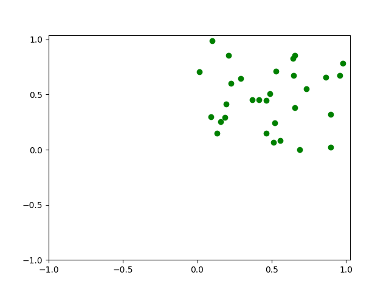
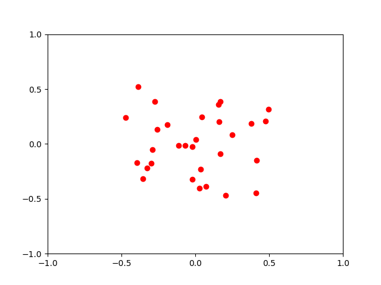
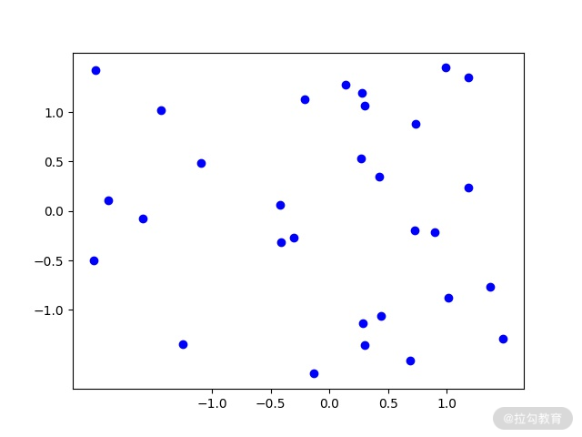
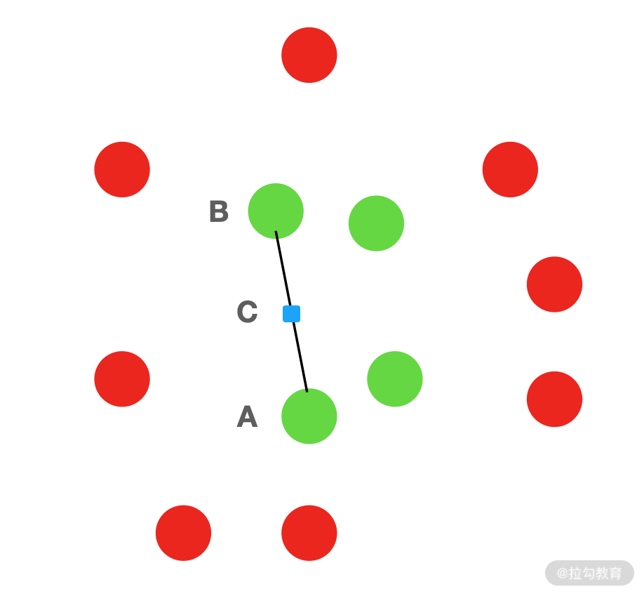
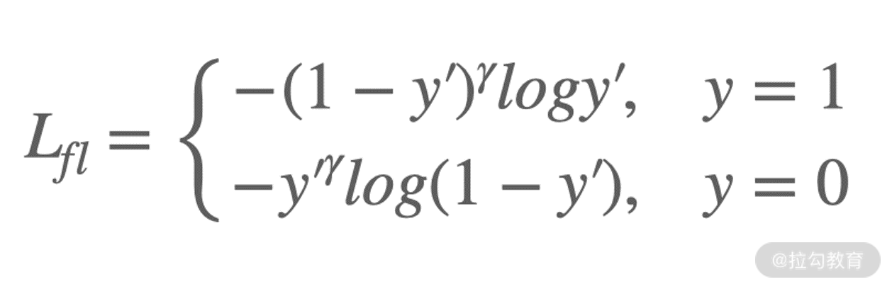
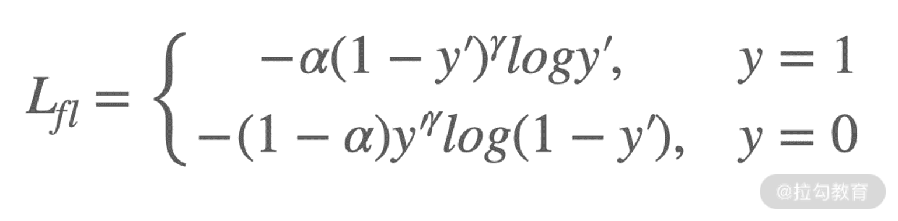

# 数据预处理: 让模型学得更好

上一讲一同学习了 Jupyter Notebook，通过该工具我们能够很好地做到交互式编程。这一讲就来学习数据的预处理，通过预处理，可以让你的模型有更好的学习效果。

---
---

## 数据预处理的必要性

数据预处理就是在模型利用数据进行训练之前，对数据本身进行加工操作的过程。

比如在 [07 | 卷积神经网络: 给你的模型一双可以看到世界的眼睛](../module_1/lecture_7.md) 中介绍的
CNN，它输入的图片就要统一缩放到统一的尺寸才能被正确地处理；又比如在 [06 | 线性回归模型: 在问题中回顾与了解基础概念](../module_1/lecture_6.md)
中的房价预测问题，输入的数据可能存在噪声数据，即特别不符合常理的数据，我们就需要将这种特别不好的数据剔除。

数据预处理对于模型的最终表现有非常大的影响。在很多情况下，不同的模型最后取得的效果差别不大，但是一旦对数据进行预处理或者优化得当，最终的提升将会非常明显。

训练数据往往来源于不同渠道，质量参差不齐，一般来说，常见的问题有 5 个:

* 数据不一致，指数据本身或者之间存在冲突。比如有一份房价信息数据，其中街道名称和所属的行政区的信息不符合，这就是一个冲突，它导致了数据本身的不一致
* 数据缺失，指属性或特征为空的情况。比如在房价预测问题中，房子楼龄信息、房子产权年限信息等就经常会丢失
* 数据噪声，指不符合常理的数据。比如某个房子每平方米的房价比同小区的高出了 10 万，这就成了一个不好的数据
* 数据不平衡，指数量差距悬殊，有的类别数据非常多，有的类别数据非常少
* 数据重复，指相同的数据反复出现

当然，在实际的工作中，数据本身的问题非常广，还会有很多我们没有见过的情况。

数据如果存在问题，最后一定会对模型的效果产生影响，所以我们要对数据预处理有一定的了解，这可以帮助我们提升模型的表现。

通常，数据预处理包括 3 个基本的环节。

---

### 数据清洗与挑选

这个环节是最为基础的预处理环节，所要做的内容也非常的广泛，比如:

* 数据提取。从网页中提取正文，就需要使用到正则表达式等方法(正则表达式可以通过该链接中的内容学习)
* 数据删除。有的数据缺失的内容实在太多了，别说模型了，就连人都很难确定它的有效性。对于这种数据，我们就要将其删除。也有的数据实在是太不合理了，同样也要删除
* 数据填充。有的数据某些信息缺失了，但还不是很多，那么我们就需要利用聚类、生成、默认值填充等方式补全这些缺失值

---

### 数据组织与转换

数据组织就是对数据进行有效的管理，比如数据平衡就是通过采样的方式对那些特别少的数据进行重复选择，或者通过欠采样的方式对特别多的类别进行有选择性的删除，这样最后数据整体的比例会变得相对合理；数据类型的统一就好比房龄的信息，有的写"15"
，有的写"八年"，有的是空，那我们就需要统一将 Int、Float、String 等类型的数据转化为统一的类型。

此外还有文本分词、图像预处理、数值的归一化等数据预处理的方式。

---

### 特征选择与提取

以前传统机器学习方法，如 SVM、GBDT，这些模型需要研发人员用各种算法将需要学习的特征显式地提取出来，转化成某种格式，传入模型后才能学习。

在深度学习中，模型已经能够主动通过不同的结构，如卷积、全连接，来学习自己需要的信息和内容，但这丝毫没有影响到特征选择与提取的重要地位。很多情况下我们在实际的工作中，"担心"
深度学习模型不能很好地主动学习到某个特征或者规律，所以我们仍然需要针对性地提取出这些特征，然后按照某种方式告诉深度学习模型"这个特征或者规律很有用，你要学到它"。

需要注意的是，特征提取之后，还需要将其按照某种确定的格式或形式进行组织，我们将会在实战环节中对其具体介绍。

相比于传统机器学习那样非常依赖数据的"干净"
程度，深度学习已经能够一定程度上对数据的错误进行修正和适应，但数据预处理仍旧非常重要，这个技能也是算法工程师必备的技术功底。所以这一讲，咱们就来学一学数据预处理的相关内容，针对数据缺失、数据标准化、异常数据处理以及数据不平衡问题进行具体展开。而其他前面提到的预处理问题，在后面的内容中我也会继续介绍。

---

## 缺失值的预处理

首先是缺失值的预处理。现实世界中的数据千变万化，就比如身高，我们习惯了 1.5~2m 的区间，但是仍旧有不到 1m 的和超过 2.3m 的人。还比如人均收入，大部分工作的人的月薪都在 3~30k 之间，但是也有不到 1k
的低收入者和月入百万的高收入者，还有一部分人没有收入。如果我们要做一个模型，就需要对数据进行分析和挑选。

缺失值，顾名思义，就是一条样本中的某些特征数据丢失了。一般来说，对待缺失值有 3 个选择。

* 第一个选择是直接删除该条样本，但一般不这么做。数据是很宝贵的，很多时候不完美的数据占据了大多数，所以只在部分不得已的情况下删除，比如某些数据缺失的特征实在太多，没缺失的特征有用的信息又很少
* 第二个选择是使用含有缺失值的特征。这个方法倒是可以，但不是所有的模型和算法都能接受这种缺失的输入，更多情况下我们还是要进行填充
* 最后一个选择就是利用某些方法对缺失值进行补充。一般来说常用的方法有均值补缺、同类均值补缺、默认值补缺、高维映射和预测缺失值，我们依次来看
    * 均值补缺。如果特征的值是有限定范围的，我们经常会使用其他样本在该特征上的值的平均值来填补空缺的内容。比如房价均价预测问题，如果缺失面积信息，就可以用该区域的房屋平均面积进行补充
    * 同类均值补缺。不同于均值补缺，同类均值补缺是使用跟待补缺样本同一个类别的其他数据在该特征上的平均值进行填补。比如房价单价预测问题，如果缺失面积信息，则可以用该区域的相同户型或者小区房屋的平均面积进行补充
    * 默认值补缺。这是个比较省事儿的办法，相当于给模型一个占位信息，告诉模型"我也不知道它是多少"，例如用 0、-1 等特殊数值占位。当然也有的时候会根据问题的具体特点而给出一个特定的补缺的数值
    * 高维映射。这个其实是默认值补缺的另一种方式。假设某个缺失的特征有 10 个可能的值，那么我们就可以将这个特征用 11 位的 one-hot 编码进行表示。其中第 11 位为 1
      的时候，意味着该特征缺失，相当于更进一步地告诉模型"不好意思我也不知道"
        * one-hot 编码，也称独热编码，它是使用 n 个位来表示数据的 n 个状态，这些位中只有一位有效，置为 1，其余的为 0。例如性别，假定只有男女性别，那么我们就可以用两位数字来做
          one-hot，第一位表示男性，第二位表示女性。即男性: 10，女性 01
        * 所以，当数据缺失的时候，我们就可以用三位 one-hot 表示，即第三位代表数据空缺。当有跨性别者时，我们就可以再追加一位
        * 例如跨性别者: 0001。不清楚性别: 0010。男性: 1000。女性: 0100
    * 预测缺失值。这实际上就是相当于再学习一个模型，专门用于对缺失值的预测。这种方式一般用得较少

缺失值的补充有非常多的办法，均值和默认值的方法往往用得较多。方法没有好坏，我们要根据具体问题来选择。

---

## 数据的标准化

第二个问题是数据的标准化。

数据的分布对模型来说至关重要，在实际的工作中，我们遇到的数据都是千奇百怪的，模型有的时候学起来会比较吃力。

比如某个样本的某个特征特别大或者特别小，或者是某个样本不同特征的取值范围区别很大，那我们使用某个模型(函数)去表示这些样本的时候，就很容易受到这些过大或过小的数据影响。

再假设我们有一些样本点，在坐标系中表示的时候，形状很奇怪，就比较难得到一个很好的函数去对其进行拟合。但如果将其分布的形状修改一下，比如"圆一点"，那么就能相对容易地找到一个函数来做拟合了。

通过上面的举例，你应该可以想到，如果有一种方法能够处理数据，让它们能更"好表示"或者"好学习"，就能有效地提高模型最终的效果。这个方法就是数据的标准化。数据的标准化的方法有很多，我们一般常用的方法是零均值化和标准化。

---

### 零均值化

零均值化也被称为中心化，多见于图像问题。它的思路很简单，就是对训练数据中的每一个数据的特征，都减去全部训练数据的对应特征的平均值。这么做之后，输入数据的各个维度的数据都中心化到 0 了。相当于我们把数据的"中心"位置，移动到了 0。

我们可以从图中来看:



上图是随机的 30 个 0～1 的绿色的点，将其零均值化之后，如下图所示:



零均值化之后，数据均匀地分布到了-0.5～0.5 之间。

绘图 [代码](../../codes/module_2/l_12_1.py) 如下:

```python
import numpy as np
import matplotlib.pyplot as plt
from numpy import random

samples = random.rand(30, 2)
plt.scatter(samples[:, 1], samples[:, 0], color='green')
new_ticks = np.linspace(-1, 1, 5)
plt.xticks(new_ticks)
plt.yticks(new_ticks)
plt.savefig('../../images/module_2/12_1.png')
plt.close()
samples_a = samples - np.mean(samples, axis=0)
plt.scatter(samples_a[:, 1], samples_a[:, 0], color='red')
new_ticks = np.linspace(-1, 1, 5)
plt.xticks(new_ticks)
plt.yticks(new_ticks)
plt.savefig('../../images/module_2/12_2.png')
plt.close()
```

绘图使用的是 Matplotlib 工具，更多的用法你可以点击 [链接](https://www.runoob.com/numpy/numpy-matplotlib.html) 学习。

---

### 标准化

零均值化只修改了数据的中心位置，但数据之间的差别还是很大，有的时候还需要将数据"压"到同一个尺度，这就要用到"标准化"。

数据的标准化，在深度学习做图像任务的时候尤为重要，它可以让模型更专注于特征提取、抽象等环节，而不需要为了适应数据多做无用功，或者为了拟合数据引起结果偏差。

以咱们提了好多次却买不起的房子为例，房子的面积从 20 平方米到 1000 平方米的都有，如果我们要将其压缩到一个小的区间，如 0～1。标准化的方法有很多种，常见的有:

* 原数据除以所有数据中绝对值的最大的样本值。公式化表示为:

$$ x^{\prime}=\frac{x}{x_{max}} $$

* 原数据零均值化之后，每一维特征除以所有数据在该特征上的标准差。公式化表示为:

$$ x^{\prime}=\frac{x-\mu}{std(x)} $$

该方法也叫作 z-score 标准化，$std(x)$ 是标准差，其特点是均值为 0，标准差为 1。这种方法适用于属性的最大值和最小值未知，或者是有超出取值范围的数据的情况。为了便于理解，我们对前面零均值化用到的数据做一下 z-score
标准化，结果如下:



* 原数据减去所有数据中特征值的最小值之后，除以特征值最大值与最小值的差。公式化表示为:

$$ x^{\prime}=\frac{x-x_{min}}{x_{max}-x_{min}} $$

该方法也叫作 min-max 标准化。

---

## 异常数据的处理

再来看第三个问题，异常数据的处理。

晚上去撸烤串，吃完饭结账，兜里掏出来一堆的一块、五块、十块，忽然发现有张百元大钞，我这人没啥钱，这个百元大钞太不可信了。这个百元大钞就是一个简单的异常数据。

异常数据，有时也称为噪声数据，指的是不符合常理的数据，它们的存在有时候会影响模型的最终效果，特别是某些对小样本数据非常敏感的算法更为严重。

异常数据的存在有很多原因，比如数据收集和输入发生的错误、抽样发生的小概率的错误，当然也有可能存在系统本身的错误。这些错误都是不可避免的，所以我们需要发现并处理它们。

不同类型的数据，有不同的异常值特点，比如图像数据中的画面变形、图像残缺，文本数据中的内容缺失、语言类型错误，又或者是属性值组成的某个特征数据异常过大过小。

对于异常数据，常见的发现办法有:

* 观察法。没错，就是拿眼睛看，比如图像数据有的没有下载好，黑乎乎的一片，或者是清晰度太低。数据量不大的时候，如果专门写算法去筛选异常数据，代价就太大了，还不如直接看
* 简单统计法。对于某个特征，我们可以统计其所有样本的特征值。一般来说，合理的数据都是相对集中的，异常数据的数量较小，很容易发现

比如在房价预测中，我们可以将房屋面积做一个统计，假定 99% 的数据都在 30~300 平方米，这时有一个孤零零的 10000
平方米，那就要考虑一下这是异常数据了，还是真的有这种土豪了。理论上的方法都很高大上，但在实际使用中，我用得最多的就是这个方法，虽然看起来不是很高端，但你可别小瞧这个方法，它是真的好用，省事儿。

* $3σ$ 法。现实世界中很多数据都是符合正态分布的，比如人的智商、股票涨跌与大盘的紧密程度。假设有一个特征符合正态分布，σ为标准差，μ为均值，则数值分布在 $(μ-σ,μ+σ)$ 中的概率为 0.6827；数值分布在 $(μ-2σ,μ+2σ)$ 中的概率为 0.9545；数值分布在 $(μ-3σ,μ+3σ)$ 中的概率为 0.9973。

可以发现，如果特征大于 $μ+3σ$ 或者小于 $μ-3σ$ 的占比只有不到 0.3%，这种过大或者过小的数据，就可以认为是异常数据。

除此之外，还有分箱法、拟合法等方式，因为使用的较少就不过多介绍了。

找到异常数据之后，我们通常有以下几种处理方式:

* 如果训练集的规模很大，对于少量的异常数据，就可以直接删除，影响不大
* 使用平滑的方式进行补全。比如对于连续型的特征，可以有一个拟合的函数去拟合这个特征，我们可以用这个新的函数去预测其可能的数值，并对原来的异常值进行代替
* 将异常值作为一种情况处理。类似于前面提到的高维映射，新增一个专门用来记录异常数值的特征位
* 作为缺失值处理

---

## 数据不平衡问题

最后一个就是数据不平衡问题了。

训练集中不同类别的数据比例悬殊，或者不合理的情况，我们称为数据不平衡。

假设我们要做一个猫狗图片分类问题，训练集中猫的数量有 900 张，而狗的只有 100 张。那么在训练过程中如果 batch size 为 32，那每个 batch
中猫的图片有二十八九张，狗的只有三四张。这样的话，在计算损失函数的时候，猫的图片占比权重太大，模型主要学习了猫的特征，狗对损失函数的贡献(比例)小，模型对狗的识别就肯定不好。

数据不平衡是一个非常常见的问题，它对模型最终效果有着显著的影响。

深度学习中常见的数据不平衡问题解决办法，主要是从数据比例、损失函数、模型结构等几个方面来进行的。我们这一节就来看看数据比例和损失函数这两个方面的解决方法。

---

### 数据比例平衡

首先是数据比例平衡的方法，这里主要介绍欠采样和过采样这两种。

---

#### 欠采样

欠采样就是对训练集中样本数量过多的类别的数据按照某种方式进行一定量的去除，从而使不同类别的数据数量大体相等，比较常用的采样方式有随机欠采样和 EasyEnsemble。

* 随机欠采样:
  该方法是将数据量多的类别中的数据，随机删除一部分，然后将剩余的数据作为新的该类别的数据。该方法的优点是简单、快速，且被删除类别的样本的特征分布相对比较均衡，不过它的缺点也是显而易见的。删除了数据，就意味着删除了一部分信息，这有可能导致模型对于一些很重要的特征无法学到。
* EasyEnsemble: 该方法的具体操作是从多数类 A 中有放回地随机采样 n 次，每次都选择与少数类数目 B 差不多个数的样本，这样就得到了 n 个数据集 $S=\{S_1, S_2...S_n\}$，它们都属于 A 类。然后 S
  中的每一个子集都和 B 训练出一个模型，这样就得到了 n 个模型。最终将这 n 个模型组合成一个大的模型系统。

---

#### 过采样

与欠采样相反，过采样是对少数类的数据按照某种方式进行扩充，从而使不同类别数据的数量大体相等。比较常用的采样方式是随机过采样和合成少数类过采样。

* 随机过采样。该方法是在少数类数据中随机选择一些样本，然后复制选择的样本，得到新的样本集，这个新样本集和原来的少数类数据共同作为新的该类别的数据集。该方法的缺点就是容易过拟合
* 合成少数类过采样。这个方法的名字虽然吓人，但是其实非常简单，简单来说就是生成一些少数类的数据。具体的操作就是，先从少数类数据中随机选择一个样本点 A，然后在同类别的数据中找到离 A 最近的 k 个样本点(下图中绿色的点)，再从这 k
  个样本点中随机选择一个点 B，在 AB 的连线上随机选择一个新的点 C，这个 C 就可以作为生成的数据。该过程会一直重复直到扩充之后的少数类数据的数量达到足够



过采样方法是一个比较常用的方式，特别是在 embedding 的方式下，经常用来寻找替代或者补充数据。embedding 会在"模块三: 经典问题的落地实战"中具体介绍。

---

### 损失函数平衡

接下来看一下损失函数平衡。在开始之前，先回忆一下之前学习过的损失函数。

一般情况下，每个类别在损失函数中的权值是一样的。但有时候，比如某些类别特别重要，或者特别少，我们就要把这个类别的训练样本对应的损失函数进行调整。一个常用的方法就是直接给对应的类别的样本的 loss 乘上一个因子来设定权值。

通过损失函数的方法来调节数据不平衡问题有很多的思路，这里我选择了一个最为常用的方式: Focal loss。

Focal loss 是在标准交叉熵损失基础上修改得到的，其特点在于减小那些容易分类的样本的权重，让模型更加专注于不太好分的数据。我们来看一下 Focal loss 的公式化表示:



这里 $y'$ 是预测值的结果，y 是真实值的标签。γ 被称作 focusing parameter，且要大于0。$(1-y')Y$ 称为调制系数，从名字就能看出，我们就是要通过 γ 来调整损失函数的大小。

假设 $γ=2$，当样本标签为 1 的时候，如果预测值为 0.9，也就是分对了，那么损失函数的调制系数就很小: $(1-0.9)^2$；如果预测值为 0.1，分错了，那损失函数的调制系数就相对大一些: (1-0.1)2。同理，如果样本标签为
0，focal loss 也可以有不同的大小结果。在 $γ=2$ 的时候，如果预测为 0.9，其 loss 要比交叉上损失函数小 100 多倍，这就增加了那些误分类样本的重要性。

有的时候，我们还会在 focal loss 前面加一个系数，如下所示:



这个 alpha 被称为平衡因子，用来平衡正负样本本身的比例不均。

---

## 总结

恭喜你，完成了对数据预处理的学习。在这一讲，我介绍了数据中常见的问题，并带你了解了如何解决这些问题。数据的预处理对于模型的学习非常重要，实际情况中的各种数据错误花样繁多，在以后的工作和学习中，希望你能多多留意观察，多做总结。

那么，你知道损失函数的平衡方式还有哪些吗？你可以到网络上搜索并学习一下。

下一讲开始将一起了解深度学习中最常用的大杀器 TensorFlow，以及模型构建的好帮手 TensorBoard。这也是进行项目实战前的最后两个内容，学完它们我们就要开始真正的项目实战了。

---
---

