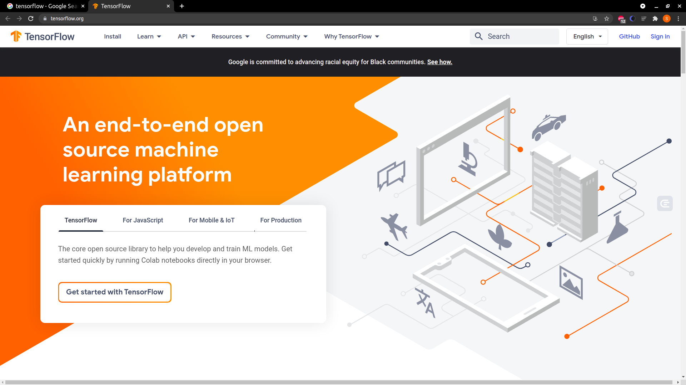

# 张量、数据流图与概念: 初步了解 TensorFlow

学到这里，你已经掌握了深度学习的理论知识，包括模型的训练、模型的评估，还学习了一些网络中组成的结构，例如 CNN 中的卷积操作、池化操作、BN 等。

这一讲就要来和你聊聊框架的事儿。

为什么要使用框架？

主要有两点:

* 一是框架帮我们封装好了丰富的 API
* 二是框架帮助我们调度与协调硬件资源

一路过来，我们学习过很多数学概念(卷积、池化、正则、链式求导等)，你还记得吗？不出意外的话，学习的时候会稍有些迷糊吧。到了实际项目中，我们必须把那些理论知识都落实到代码里才能搭建我们的整个训练流程。

现在问问你，你愿意自己写一个前向传播或者反向传播，或是我之前讲到的任意一个数学公式吗？我想大部分人都不愿意(因为我也是)。

除此之外，实际的项目工程还会面临很多硬件调度的问题，例如单机多卡训练、多机多卡训练、CPU 与 GPU 之间的交互。

那你愿意自己写一个程序来调度硬件资源吗？我想你还是会说不愿意。

这就要用到框架了。

---
---

## 主流深度学习框架

目前最主流的深度框架有 TensorFlow、Pytorch 以及 Keras。

TensorFlow 是现在被使用最广泛的一个深度学习框架，也是我们今天要介绍的框架；PyTorch 是一个开源的 Python 机器学习库，基于 Torch 开发，底层由 C++实现，也被广泛使用在人工智能领域；Keras 则是
Python 编写的高级神经网络 API，它可以将 TensorFlow、CNTK，或是 Theano 作为后端程序来用，它的代码简单、易读，非常适合于新手(
关于Keras，我也在 [09 | 自编码器: 让模型拥有属于自己的表达和语言](../module_1/lecture_9.md) 中有过介绍)。

这 3 个框架你选择用哪一个都是可以的。学会了任意一个框架，另外的也基本融会贯通了。我选择介绍 TensorFlow 的原因是使用它的人相对较多，同时它也是由谷歌开发与维护的。作为现在全世界最流行的深度学习框架，TensorFlow
可以帮你把理论知识落实到实际应用当中，包括模型的训练与模型的部署。

---

## 什么是 TensorFlow

正如刚才所说，TensorFlow 是一个开源的机器学习框架，由谷歌开发与维护，并被用在谷歌的很多产品中，例如 Gmail、Google Photos、语音识别。但其实，无论是整个行业的研究领域还是实际工业中，TensorFlow
使用度都很高。



从应用角度来说，TensorFlow 有多语言支持和应用环境广泛这两个特点。

* 多语言支持: Python 是我们深度学习领域中最常用的编程语言，也是 TensorFlow 中最推荐的编程语言，除了 Python 之外你还可以用
  JavaScript、C++、Java、Go、C#、Haskell、Julia、MATLAB、Ruby、Rust、Scala 来编写你的 TensorFlow 程序
* 应用环境广泛:
  在过去的几年，人们为了获得更高精度的模型，往往会构建非常庞大且复杂的神经网络，这些复杂的网络在服务器端都取得了优秀的成绩。随着移动技术的不断发展，这样复杂庞大的模型并不能被很好地应用在移动终端。因此，速度快、模型小，高精度的模型就成了另一个研究方向
* 这样的模型可以部署在移动终端中离线使用，让人们在没有网络的条件下享受深度学习带来的乐趣。TensorFlow 不仅可以训练与部署在服务器端运行的模型，还可以将训练好的模型转换为能在手机(IOS 和安卓)上运行的轻量化模型
* 不同人群学习 TensorFlow 有不同的侧重点。对于偏研究领域的，TensorFlow 可以帮助我们做数据的处理、模型的训练与导出；对于偏实际工程领域的，TensorFlow 可以帮助我们在服务器、移动终端或者网页中部署模型

---

## TensorFlow 的版本

TensorFlow 在 2017 年 2 月 11 日发布了 1.0.0 版本，在 2019 年 1 月发布了 2.0 版本。

下文中，1.0 到 2.0 我们简称为 TensorFlow 1，从 2.0 开始我们简称为 TensorFlow 2。

TensorFlow 1 发展的几年中，TensorFlow 取得了飞速的进步，它很快成了被使用次数最多的深度学习框架。但是飞速发展也带来一个问题: 因为它的 API
发展太快，更新频繁，一些常用的函数方法会经常换位置；小版本之间的切换时，原有的代码甚至不能执行，开发经常要去翻 TensorFlow 的官网，查找对应的接口。

除此之外，TensorFlow 1 采用高性能的静态计算图方式，从编程角度来说，这种方式不便于理解，对新手不是很友好。

TensorFlow 2 无论在 API 的管理还是易用性上都做出了巨大的改善。即使你已经掌握了 TensorFlow 1，我觉得也很有必要好好学习一遍 TensorFlow 2。

总结了一下从 TensorFlow 1 到 TensorFlow 2 的主要变化:

* 默认开启 Eager Execution 模式，降低了 TensorFlow 的学习成本，方便程序调试。会话(Session)与图(Graph)都改为底层实现
* 取消全局变量，在 TensorFlow 1 中使用 ```tf.Variable``` 创建变量时，它会放到默认的计算图中。如果我们想恢复变量，可以通过变量名字恢复。但如果记不住变量名字，就没办法了。TensorFlow 2
  则有自己的变量跟踪机制，它自己会考虑是否回收变量
* 不使用会话方式，而是用 ```tf.function```，兼顾程序的易用性与高性能

---

## TensorFlow 基础

我们再来看有关 TensorFlow 的一些基础知识，让我们从安装开始。

---

### TensorFlow 的安装

TensorFlow 的安装有两种方式，一种是使用 pip，另一种是直接拉取 TensorFlow 的 Docker 镜像，当然，官网给出了更详细的安装方案。

---

#### 使用 pip 安装

我们可以直接只用 pip 来安装 TensorFlow，但 pip 的版本必须是 19 以上。所以在安装前我们可以先升级一下 pip，然后通过下面的代码安装:

```shell
# 更新 pip
pip install --upgrade pip
# 安装 TensorFlow 的稳定版本，2.0 之后同时支持 GPU 与 CPU。
pip install TensorFlow
```

TensorFlow 还提供一个 preview 版本，preview 版本是包含新特性的版本，但它并不稳定，你可以通过下面的命令安装:

```shell
pip install tf-nightly
```

---

#### 使用 Docker 镜像

TensorFlow 提供已经配置好的 TensorFlow 镜像，你可以直接从 TensorFlow 的 [Docker Hub](https://hub.docker.com/r/tensorflow/tensorflow/)
上拉取镜像。

---

### Eager Execution

TensorFlow 从1.14 版本开始支持 Eager Execution 模式，在 TensorFlow 2 中启动 TensorFlow 会默认进入 Eager Execution 模式。

没有 Eager Execution 模式的时候，TensorFlow 的工作流程是建立计算图，使用 ```session.run()``` 执行计算，最后获得结果，操作起来很烦琐。

有了 Eager Execution 模式，就变得简单了。TensorFlow 就像 Python 一样，变成了一个可以交互的模式: 写完代码直接运行就能看到结果。这就使我们非常容易上手 TensorFlow 并且易于 Debug
程序，因为看起来我们仍是在使用 Python 语法编程。

对于研究和实验，Eager Execution 也是一个非常灵活的机器学习平台，它可以为我们提供直观的开发方式和亲民的控制流程。一方面，我们可以快速地在小规模的数据上进行实验，直接就能看到操作结果；另一方面，使用 Python 的控制流程(
自上而下)而不是使用数据流图。

Eager Execution 的使用方式

来看一下 Eager Execution 的使用方式。先看下面这一段 [程序](../../codes/module_2/l_13_1.py) :

```python
import tensorflow as tf

# 查看 Eager Execution 的状态
tf.executing_eagerly()
output: True
x = [[2.]]
m = tf.matmul(x, x)
print("x * x is ,  {}".format(m))
# output:
# x * x is ,  Tensor("MatMul_1:0", shape=(1, 1), dtype=float32)
```

这一段程序看起来很容易理解，与我们的普通 Python 程序很像: 输入完命令，只要执行就可以看到输出的结果。这就是 Eager Execution 的便利之处，你可能会问写程序难道不就应该这么使用吗？但没有 Eager Execution
的时候，确实不是这样工作的。

没有 Eager Execution 时，TensorFlow 的工作流程就像刚才所说，先创建一个计算图，然后通过 Session 启动计算图，最后才能获得某一个 张量的具体值。我们看一下没有 Eager
的时候，以上的代码的结果是什么以及如何打印出 x*x 的结果。先看下面的代码:

```python
# 手动关闭 Eager Execution
tf.compat.v1.disable_eager_Execution()
tf.executing_eagerly()
output: Fasle
x = [[2.]]
m = tf.matmul(x, x)
print("x * x is ,  {}".format(m))
# x * x is ,  Tensor("MatMul_2:0", shape=(1, 1), dtype=float32)
```

在没有 Eager Execution 模式时，如果直接 tensor 的时候，只会打印出 tensor 的句柄。如果想打印出 tensor 具体值的话，必须启动一个 session 才可以，如下面的代码所示:

```python
with tf.compat.v1.Session() as sess:
    print("x * x is, {}".format(sess.run(m)))
# output:
# x * x is, [[4.]]
```

当代码多了，这种方式就非常不便利了。

Eager Execution 与 Numpy 可以很好地协同工作: Numpy 中的函数可以接受 tensor 作为参数，```tf.math``` 中的操作可以将 Python 的对象或者 Numpy 数组转换为 tensor
对象，tensor 的 ```numpy()``` 方法又可以将 tensor 的值以 Numpy 数组的形式返回。请看下面的 [代码](../../codes/module_2/l_13_2.py) :

```python
import tensorflow as tf

# 定义一个常量 tensor
a = tf.constant([[1, 2],
                 [3, 4]])
print(a)
# output:
# tf.Tensor(
# [[1 2]
#  [3 4]], shape=(2, 2), dtype=int32)

import numpy as np

# 将 a 作为参数传入 numpy 的方法
b = np.multiply(a, a)
print(b)
# output:
# [[ 1  4]
#  [ 9 16]]

# 将 tensor 的值以 numpy array 的形式返回:
print(a.numpy())
# output:
# array([[1, 2],
#        [3, 4]], dtype=int32)
```

Eager Execution 还有一个好处就是你可以根据宿主程序语言来动态地控制程序。简单来说，就是可以在 if、else 等语句中根据 tensor 的值做判断。这是一个很方便的事情，在没有 Eager Execution
模式的时候，这一点做起来还是很困难的，需要使用 ```tf.cond、tf.while``` 等算子。下面的代码是一个通过 if 进行条件判断的小例子:

```python
def dynamic_control(num):
    if num.numpy() == 1:
        print("num is 1.")
    else:
        print(num)


dynamic_control(tf.convert_to_tensor(1))
dynamic_control(tf.convert_to_tensor(3))
# output:
# num is 1.
# tf.Tensor(3, shape=(), dtype=int32)
```

---

### Tensor 张量

TensorFlow 的名字就来源于张量。在计算图中，张量(Tensor)作为图中的节点(操作)的输入输出，在节点之间流动(Flow)，因此得名。

张量可以理解成一个多维数组，TensorFlow 的张量与 Numpy 的数组比较相似。

TensorFlow 中，张量是不可以改变的，如果想改变张量的内容，只能创建新的张量。张量是由 ```tf.Tensor``` 类定义的，所以在编写 TensorFlow 程序时，操作的主要数据对象是 ```tf.Tensor```。

张量具有数据类型(例如 float32、int32 或 字符串)和形状的属性。

张量中的每个元素都具有相同的数据类型，且该数据类型一定是已知的，我们可以使用 tensor 的 dtpye 属性查看 tensor 的数据类型。

张量是有形状的，关于 tensor 的形状有两个术语: 秩、轴(维度)。

* 秩: 张量维度的数目
* 轴(维度): 轴(维度)就是我们计算机科学中数组的维度。例如，向量的维度就是 1，矩阵的维度就是 2

我们可以通过 tensor 的 shape 属性查看 tensor 的形状。

下面来创建几个不同维度的张量。

(1) 创建一个标量，秩为 0，没有维度或者轴。

```shell
>>> import tensorflow as tf
>>> mammal = tf.constant("Elephant", tf.string)
>>> ignition = tf.constant(451, tf.int16)
>>> floating = tf.constant(3.14159265359, tf.float64)
>>> mammal, ignition, floating
(<tf.Tensor: shape=(), dtype=string, numpy=b'Elephant'>, <tf.Tensor: shape=(), dtype=int16, numpy=451>, <tf.Tensor: shape=(), dtype=float64, numpy=3.14159265359>)
```

(2) 创建一个向量，秩为 1，有 1 个维度或者轴。

```shell
>>> import tensorflow as tf
>>> mystr = tf.constant(["Hello"], tf.string)
>>> cool_numbers = tf.constant([3.14159, 2.71828], tf.float32)
>>> first_primes = tf.constant([2, 3, 5, 7, 11], tf.int32)
>>> mystr, cool_numbers, first_primes
(<tf.Tensor: shape=(1,), dtype=string, numpy=array([b'Hello'], dtype=object)>, <tf.Tensor: shape=(2,), dtype=float32, numpy=array([3.14159, 2.71828], dtype=float32)>, <tf.Tensor: shape=(5,), dtype=int32, numpy=array([ 2,  3,  5,  7, 11], dtype=int32)>)
```

(3) 创建一个矩阵，秩为 2，有 2 个维度或者轴。

```shell
>>> import tensorflow as tf
>>> mymat = tf.constant([[1, 2],
...                      [3, 4],
...                      [5, 6]])
>>> mymat
<tf.Tensor: shape=(3, 2), dtype=int32, numpy=
array([[1, 2],
       [3, 4],
       [5, 6]], dtype=int32)>
```

张量的维度或者轴的数目不局限于刚才介绍的标量、向量与矩阵，它可以有更高的维度，这个是根据程序来定的。我们可以通过 ```numpy.asarray()``` 或者 ```tensor.numpy()``` 方法将 tensor 转换为
Numpy 数组。

---

### 变量

刚才介绍介绍张量的时候提到，在 TensorFlow 中张量是不会被改变的，如果想改变只能创建一个新的张量。

那么如果我们在训练的过程中需要存储一些中间状态呢？例如，随着训练的不断迭代，卷积核中参数一直会发生改变；如果想存储这种随时会变化的对象，就要用到 TensorFlow 的变量。我们可以通过 ```tf.Variable```
类进行跟踪与定义。

---

#### 变量的创建

创建变量的时候需要制定一个初始值和数据类型。如果不指定数据类型，变量就会自动选择初始值的数据类型作为变量的数据类型；但如果指定的数据类型与初始值不一样，就会报错。

变量与张量十分相似，变量也有形状(shape)和数据类型(dtype)的属性，并且也可以转换为 Numpy 数组。

用下面的代码举例，看一下创建变量以及打印出变量的相关信息:

```shell
>>> import tensorflow as tf
>>> # 创建变量 var 并打印数据类型与形状
>>> var = tf.Variable(initial_value=[[1.0, 2.0, 3.0], [1.0, 2.0, 3.0]])
>>> # initial_value 可以省略
>>> print('var is {} \nshape is {} \ntype is {}'.format(var, var.shape, var.dtype))
var is <tf.Variable 'Variable:0' shape=(2, 3) dtype=float32, numpy=
array([[1., 2., 3.],
       [1., 2., 3.]], dtype=float32)> 
shape is (2, 3) 
type is <dtype: 'float32'>
```

---

#### 变量的生命周期与名字

```tf.Variable``` 中还有一个叫作 name 的参数，在 TensorFlow 1 中我们可以根据这个名字找到变量。虽然有很多方法帮助你找到你创建过的变量，但用起来都比较麻烦。

TensorFlow 2 对变量管理功能做了改善，它会自动给变量创建名字，并对它进行跟踪与销毁。

TensorFlow 变量的生命周期与 Python 对象的生命周期相同。

---

### 计算图与 tf.function

计算图是 TensorFlow 的核心，它是一个有向图，又可以叫作数据流图。

计算图是 TensorFlow 操作对象(```tf.Operation```)与张量对象(```tf.Tensor```)的集合。操作对象是图中的节点，是图中的计算单元，张量对象是图的边，是在节点之间流动的数据。

接下来你介绍 TensorFlow 的 3 种计算图，它们分别是静态计算图、动态计算图和 Autograph。

---

#### 静态计算图

TensorFlow 1 中，如果用低级 API(在下一讲 [14 | 工作机制与流程: 通过手写识别深入了解 TensorFlow](lecture_14.md) 中会介绍)
构建模型，我们要先定义好计算图，这种计算图就是静态计算图机制。定义好计算图之后，再通过 Session 启动计算图，如下面 [代码](../../codes/module_2/l_13_3.py) 所示:

```python
import tensorflow as tf

# placeholder 是一个占位符，运行 session 时会将对应的值传进去。
x = tf.placeholder(tf.float32)
y = tf.placeholder(tf.float32)
z = x + y
with tf.Session() as sess:
    print(sess.run(z, feed_dict={x: 3, y: 4.5}))
# output:
# 7.5
```

静态计算图的优点是高效，在分布式训练、性能优化和生产部署方面都有优势。定义好之后可以反复执行。执行时 TensorFlow 会将静态计算图运行在后台由 C++编写的程序上，所以性能较好。

但是静态计算图有一个缺点，那就是编程方式非常反人类，不易于理解。

就像刚才在介绍 Eager Execution 时说的，在静态计算图中不可以使用 Python 原生的条件判断与循环逻辑，必须使用 TensorFlow 的内置算子 ```tf.cond、tf.while``` 等。

---

#### 动态计算图

TensorFlow 2 引入的 Eager Execution 模型就是采用动态计算图方式，大大地提高了代码的简洁性，且非常易于调试。

但动态计算图的缺点是: 相对于静态计算图的性能，动态计算图会有一定的损失。其实这个很好理解，静态计算图是先构建好再执行，而动态计算图是执行时自动构建。并且动态计算图不会像静态计算图那样，完全运行在 C+ +编写的程序上，它存在很多
Python 进程与 C++ 进程之间的通信消耗。

---

#### Autograph

如何兼顾代码的可读性与运行的高性能呢？TensorFlow 2 中提出了 Autograph 的概念，只需要在 Python 的函数前加上 ```@tf.function``` 标签，就可以将 Python 的函数转换为静态计算图。

请再次阅读一下静态计算图中的代码。在 TensorFlow 1 中，执行上述代码时需要做下面的两步操作:

* 定义计算图。定义 x，y 与 z 三个 tensor，计算图确定了这三个 tensor 的数据类型；然后 根据执行的顺序，将操作添加到计算图中
* 通过 session，执行这个计算图

在 TensorFlow 2 中，定一个 Python 的函数，在函数前加入 `````@tf.function````` 标签，第一次调用函数后，上面的两大步会变为下面的四个步骤:

* TensorFlow 会跟踪一遍函数体中的 Python 代码，记录涉及的各个 tensor 的类型
* 将操作添加到计算图中
* 如果涉及条件、循环等控制流程，会转换为 Tensorlow 的内置算子，有可能会添加 ```tf.control_dependencies``` 指定执行顺序依赖关系
* 执行计算图

其中 1-3 对应 TensorFlow 1 中的第一步，请看下面的代码:

```python
@tf.function
def f(x, y):
    z = x + y
    print('z is', z)
    return z


x = tf.constant(3, dtype=tf.float32)
y = tf.constant(4.5, dtype=tf.float32)
z = f(x, y)
print('z is', z)
# output:
# z is Tensor("add:0", shape=(), dtype=float32)
# z is tf.Tensor(7.5, shape=(), dtype=float32)
```

这就是 TensorFlow 2 最吸引人的地方: 保证了代码的高可读性的同时，将 Python 代码转换为高性能的 TensorFlow 1 的静态图计算方式。

我们在介绍 Eager 模式时，举过例子，在静态计算图中打印 tensor 只能打印句柄，而在动态计算图模式下可以直接打印出 tensor 的值。我们刚才的代码在第一行打印的结果就是一个句柄。

所以，我们可以得到印证，```tf.function``` 是将一个 Python 的函数转换为了一个静态图，在整个程序中可以反复调用。

我们将上面的程序稍做修改:

```python
@tf.function
def f(x, y):
    z = x + y
    print('python print z is', z)
    tf.print('tf print z is ', z)
    return z


z1 = f(tf.constant(3, dtype=tf.float32), tf.constant(4.5, dtype=tf.float32))
print('1: z is', z1)
z2 = f(tf.constant(3, dtype=tf.int32), tf.constant(4, dtype=tf.int32))
print('2: z is', z2)
z3 = f(tf.constant(1, dtype=tf.int32), tf.constant(3, dtype=tf.int32))
print('3: z is', z3)
# output:
# python print z is Tensor("add:0", shape=(), dtype=float32)
# tf print z is  7.5
# 1: z is tf.Tensor(7.5, shape=(), dtype=float32)
# python print z is Tensor("add:0", shape=(), dtype=int32)
# tf print z is  7
# 2: z is tf.Tensor(7, shape=(), dtype=int32)
# tf print z is  4
# 3: z is tf.Tensor(4, shape=(), dtype=int32)
```

你有没有发现 python print 那句打印命令只打印了两次？原因是 TensorFlow 需要将函数 f 转换为静态计算图，静态计算图中的 tensor 类型和形状是不可以改变的，它会根据输入 tensor
的类型和形状，动态创建计算图。

z1 与 z2 输入的 tensor 数据类型是不一样的，所以会创建两个静态计算图，而我们含有 python print 的 Python 原生 print 函数只会在静态计算图创建的时候被执行，在计算 z3 的时候就不会再次被执行了，因为
z3 与 z2 是同一张计算图，Python 原生的 print 函数没有被加载到静态计算图中。

所以，在使用 ```tf.function``` 时，要注意尽量少使用 Python 原生的函数，而使用 TensorFlow 的函数，例如: 不使用 print，使用 ```tf.print```。

---

## 总结

介绍了 Eager Execution 模式、张量与 ```tf.function``` 这 3 部分知识，它们是 TensorFlow 最基本的组成单元。今天讲的内容只能说是 TensorFlow 的冰山一角，在接下来的第 14 和 15
讲以及"模块三"的实战中，还会继续补充 TensorFlow 的知识。

想变成 TensorFlow 高手肯定是一个不断遇到问题、解决问题的过程，希望你在学完这一讲之后也能多学习，多实践。

下一讲将继续介绍 TensorFlow 有关搭建模型的知识。

---
---

