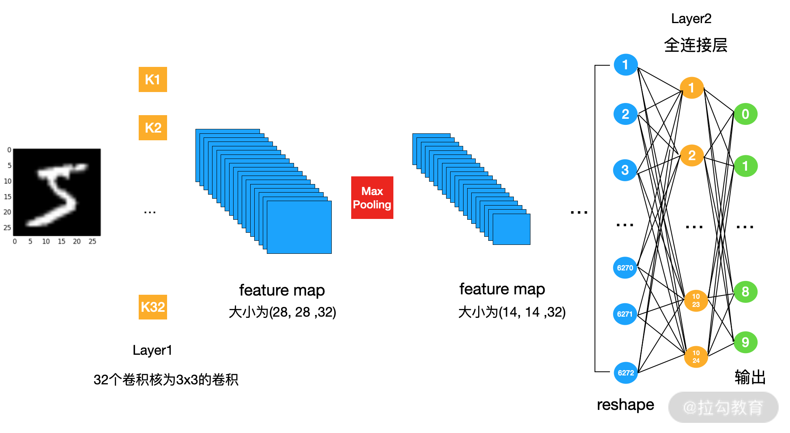
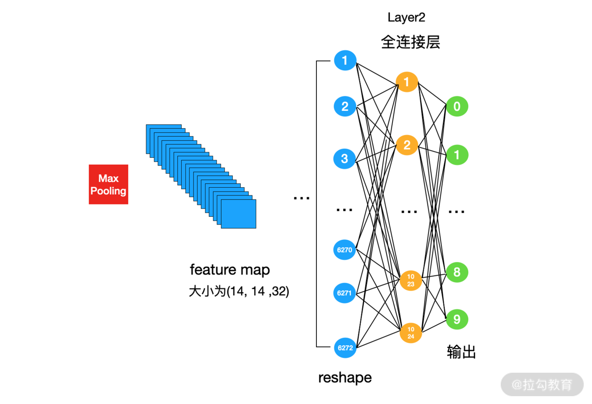

# 工作机制与流程: 通过手写识别深入了解 TensorFlow

上一讲介绍了 TensorFlow 中一些最基础的知识。这一讲继续介绍 TensorFlow 的知识，不过会通过搭建一个手写数字识别的 CNN 训练代码的方式来进行。

---
---

## TensorFlow 2 的 API

先来看看 TensorFlow 中，几个比较常用的 API: ```tf.compact、tf.data、tf.image、tf.nn、tf.keras、tf.lite、tf.math```。其余的 API
你可以学完之后去这个 [网址](https://www.tensorflow.org/versions/r2.0/api_docs/python/tf) 中查看。

---

### tf.compact

因为从 TensorFlow 1 到 TensorFlow 2 的升级中，API 发生了很大的变化，TensorFlow 团队为了保证 TensorFlow 1 的代码能够运行在 TensorFlow 2 上，为我们提供了迁移工具。TensorFlow 在 1.13 的版本之后都会自动安装这个迁移工具，你可以通过以下命令将 Tensorflow 1 的代码升级到 Tensorflow 2。

```shell
tf_upgrade_v2 \
  --intree my_project/ \
  --outtree my_project_v2/ \
  --reportfile report.txt
```

脚本在运行的时候会将 TensorFlow 1 中的一些函数转移到 Tensorflow2 中的 ```tf.compat.v1``` 模块中，这就使得 TensorFlow 1 的代码仍然可以在 TensorFlow 2
中使用。但是官方有两个建议，一是这些替换最好自己人工校对一下，二是尽快切换到 TensorFlow 2 的 API 中。

---

### tf.data

与数据读取相关的模块，会在 [17 | 图像分类: 实现你的第一个图像分类实战项目](../module_3/lecture_17.md) 中介绍。

---

### tf.image

这个模块中，包含了与图像相关的处理，可以用来帮助我们做数据增强，或者图像的一些变化。

例如，剪切、旋转、色彩饱和度增强等。

---

### tf.nn

这里封装了一些神经网络最基础的操作。例如，卷积操作、池化操作、dropout、激活函数。

---

### tf.keras

在 TensorFlow 2 以后，Keras 作为 TensorFlow 唯一 的高级API。Keras 是一个有前端与后端的机器学习库，后端可以在 TensorFlow、Theano 等平台上运行，前端有一个统一的
API，其特点是高度模块化，代码简单易读，这点在前文已经介绍过了。

```tf.keras``` 是被 TensorFlow 重新编写过的一套 Keras API，作为 TensorFlow 的一个子模块，它的后端只能是 TensorFlow。

---

### tf.lite

TensorFlow 可以把模型部署到移动终端，我们只需要将我们训练好的模型转换为 tflite 格式即可。与 tflite 模型相关的 API 就在这个模块中。

---

### tf.math

和它的名字一样，这里面包含了很多数学方法。

当编写训练代码时，如果从 API 的封装程度上来说，TensorFlow 可以分为低级 API 与高级 API。低级 API 就是利用 tf.nn 中的 API 进行搭建，这里面的 API 偏向底层，较为灵活；高级 API
是 ```tf.keras``` 中的 API，这一部分的 API 经过封装，用起来更加容易一些，代码也更为易读。

这一讲先介绍"如何利用低级 API 构建网络与训练代码"，在 [17 | 图像分类: 实现你的第一个图像分类实战项目](../module_3/lecture_17.md) 中会介绍高级 API 的使用。

---

## 利用低级 API 搭建手写数字识别网络

我们来构建一个卷积神经网络对手写数字进行分类，使用的数据依然是 MNIST。在着手训练之前，先来回忆一下，训练一个模型有哪些必不可少的要素。

* 数据: 主要是训练集与评估集，用来训练与评估我们的模型
* 网络结构: 也就是我们模型的主体
* 损失函数: 更新模型参数的核心
* 优化方法: 更新模型参数的方法

我们就从以上 4 个部分来了解，如何使用 TensorFlow 低级 API 构建一个模型。

---

### 数据

MNIST 数据集已经被封装在 TensorFlow 中了，我们通过下面的 [代码](../../codes/module_2/l_14_1.py) 可以将数据加载进来并查看:

```python
from keras.datasets import mnist
import numpy as np
import tensorflow as tf
from math import ceil

(X_train, Y_train), (X_test, Y_test) = mnist.load_data()
print('train set:', X_train.shape, X_train.dtype, Y_train.shape, Y_train.dtype)
print('test set:', X_test.shape, X_test.dtype, Y_test.shape, Y_test.dtype)
# output:
# train set: (60000, 28, 28) uint8 (60000,) uint8
# test set: (10000, 28, 28) uint8 (10000,) uint8
```

原始数据是 uint8 类型，我们将它们转换为 float32 类型，并做归一化处理。

```python
X_train = np.array(X_train, np.float32)
X_test = np.array(X_test, np.float32)
# 归一化
X_train, X_test = X_train / 255, X_test / 255
```

然后，将数据用 ```tf.data``` 封装。这里我们设定训练 2 个 Epoch，batchsize 大小为 128。如何使用 ```tf.data```
API，我会在 [17 | 图像分类: 实现你的第一个图像分类实战项目](../module_3/lecture_17.md) 中介绍。

```python
batch_size = 128
epoch = 2
# 使用 tf.data API 对数据进行随机排序和批处理
train_set = tf.data.Dataset.from_tensor_slices((X_train, Y_train))
train_set = train_set.repeat(epoch).shuffle(5000).batch(batch_size).prefetch(batch_size)
```

到这里，数据读取就算完成了。

---

### 网络结构

我们要构建下面这样的一个卷积神经网络。它是由 1 个卷积层与 1 个全连接层组成的:



第一层为卷积层，是由 32 个 大小为 3x3 的卷积核构成，我们可以使用 ```tf.nn.conv2d``` 来实现。

我们来看一下 ```tf.nn.conv2d``` 的详细内容。

```python
tf.nn.conv2d(
    input, filters, strides, padding, data_format='NHWC', dilations=None, name=None
)
```

* input: 卷积操作的输入，必须是 half, bfloat16, float32, float64 类型。这也是为什么我们要将训练数据转换为 float32 类型。输入有 4
  个维度: [batch_size, in_height, in_width, n_channels]。维度的顺序由 data_format 决定。在我们的例子中，Layer1 输入数据的维度为 [128, 28, 28, 1]
* filters: 卷积层中的卷积核，必须与输入数据有相同的数据类型。它也是一个 4 维的 tensor，[filter_height, filter_width, in_channels, out_channels]
  。在我们的例子中，Layer1 的卷积为 [3, 3, 1, 28]
* strides: 卷积移动的步长，是一个整数或者是整数类型的列表。列表的长度为 1，2 或者 4。如果只给 1 个值，那么默认是在 H 与 W 维度上使用相同的步长。N 与 C 的步长必须为 1
* padding: 可使用 'SAME' 与 'VALID' 算法，也可以用一个列表指定各个维度 padding 的数目。当 data_format 是 'NHWC' 时，列表的内容依次为: [0, 0]
  , [pad_top,pad_bottom], [pad_left, pad_right], [0, 0]。当 data_format 是 'NCHW' 时，列表的内容依次为: [0, 0], [0, 0]
  ,[pad_top, pad_bottom], [pad_left, pad_right]
* dilations: 卷积扩张因子，可以是一个整数或者一个整形的列表。默认是 1，如果设置大于 1,则卷积的时候会跳过设定值 -1 个元素进行卷积

我们来详细地看一下 padding 参数，用得比较多的还是直接指定的 same 或者 vaild。下面介绍一下两者的区别。

输入 tensor 的形状我们用 [batch, in_height, in_width, in_channels] 表示，输出的形状用 [batch, out_height, out_width, out_channels] 表示。

当 padding 为 SAME 时，```out_height``` 与 ```out_width``` 的计算方式为:

```python
out_height = ceil(in_height / stride_h)
out_width = ceil(out_width / stride_w)
```

当 padding 为 VALID 时，```out_height``` 与 ```out_width``` 的计算方式为:

```python
out_height = ceil((in_height - filter_height + 1) / stride_h)
out_width = ceil((out_width - filter_width + 1) / stride_w)
```

我们可以做一下实验，从例子中来看 SAME 与 VALID 的区别:

```python
# MNIST 输入的 tensor
input = tf.Variable(tf.random.normal([1, 28, 28, 1]))
# 3x3 的卷积
filter = tf.Variable(tf.random.normal([3, 3, 1, 32]))
print(input.shape)
output = tf.nn.conv2d(input, filter, strides=[1, 3, 3, 1], padding='SAME')
print(output.shape)
# output:
# (1, 28, 28, 1)
# (1, 10, 10, 32)
filter = tf.Variable(tf.random.normal([3, 3, 1, 32]))
print(input.shape)
output = tf.nn.conv2d(input, filter, strides=[1, 3, 3, 1], padding='VALID')
print(output.shape)
# output:
# (1, 28, 28, 1)
# (1, 9, 9, 32)
```

为了让卷积操作在代码里看起来更简单一点，我们把 ```tf.nn.conv2d``` 包装一下，让它包含偏移项与激活函数，代码如下:

```python
def conv(x, W, b, strides=1, activation=tf.nn.relu):
    """
    :param x: 
    :param W: 
    :param b: 
    :param strides: 
    :param activation: 
    :return: 
    """
    # Conv2D 包装器, 带有偏置和 relu 激活
    x = tf.nn.conv2d(x, W, strides=[1, strides, strides, 1], padding='SAME')
    x = tf.nn.bias_add(x, b)
    return activation(x)
```

在 Layer1 的输出之后接一个 Max Pooling 操作进行降采样，我们使用 ```tf.nn.max_pool``` 在实现。

```python
tf.nn.max_pool(
    input, ksize, strides, padding, data_format=None, name=None
)
```

我们来看看各个参数的含义。

* input: 输入的 tensor
* ksize: 是一个整形或者列表，指定 Pooling 的尺寸
* strides: 是一个整形或者列表。Pooling 移动时的步长度
* padding: 只可以是 'VALID' 或者 'SAME'

为了代码的易读性，我们再封装一个 maxpooling 函数:

```python
def maxpooling(x, k=2):
    """
    :param x: 
    :param k: 
    :return: 
    """
    return tf.nn.max_pool(x, ksize=[1, k, k, 1], strides=[1, k, k, 1], padding='SAME')
```

---

### 全连接层

做完这些，我们就来到了图 1 最后的一个部分: 全连接层。全连接层在低级 API 中没有直接的 API，需要我们自己实现。



请看上图，经过 maxpooling 之后的 feature map 的大小为(14, 14, 32)。为了后面的全连接计算，我们需要将它 reshape 到 [-1, 141432]。第一个维度是 -1，因为这里的大小要自动适配
batch_size 的大小。代码如下:

```python
# conv1 是 maxpooling 的输出，一会儿可以看整个网络的定义
fc1 = tf.reshape(conv1, [-1, fc1_w.get_shape().as_list()[0]])
```

接下来就是在 [02 | 从神经元说起: 结构篇](../module_1/lecture_2.md) 中介绍的人工神经网络(在 CNN 中叫作全连接层)。我们的第一层全连接层有 1024 个神经元，所以有 1024 个输出。

权重的形状为(14 * 14 * 32, 1024)，偏移项是一个长度为 1024 的向量。

第二个全连接层的输入是第一层的输出，所以第二层全连接层权重的形状为(1024, 10)，偏移项是一个长度为 10 的向量。

最后，因为是一个多分类问题，所以以 softmax 返回。请看下面的代码:

```python
# 全连接层， 输出形状:  [batch_size, 1024]
fc1 = tf.add(tf.matmul(fc1, fc1_w), fc1_b)
# 将 ReLU 应用于 fc1 输出以获得非线性
fc1 = tf.nn.relu(fc1)
# 全连接层，输出形状 [batch_size, num_classes]
out = tf.add(tf.matmul(fc1, fc2_w), fc2_b)
return tf.nn.softmax(out)
```

整个网络结构，可以参考下面的代码:

```python
def net(x):
    """
    :param x: 
    :return: 
    """
    # 输入形状: [batch_size, 28, 28, 1]
    x = tf.reshape(x, [-1, 28, 28, 1])
    # 输出形状: [batch_size, 28, 28 ,32]
    conv1 = conv(x, conv_w, conv_b)

    # maxpooling 输出形状: [batch_size, 14, 14, 32]
    conv1 = maxpooling(conv1, k=2)
    # 对 conv1 进行 reshape， 输出形状: [batch_size, 14*14*32]
    fc1 = tf.reshape(conv1, [-1, fc1_w.get_shape().as_list()[0]])

    # 全连接层， 输出形状:  [batch_size, 1024]
    fc1 = tf.add(tf.matmul(fc1, fc1_w), fc1_b)
    # 将 ReLU 应用于 fc1 输出以获得非线性
    fc1 = tf.nn.relu(fc1)
    # 全连接层，输出形状 [batch_size, num_classes]
    out = tf.add(tf.matmul(fc1, fc2_w), fc2_b)
    return tf.nn.softmax(out)
```

使用低级 API 的时候，需要注意一点: 我们使用 ```tf.nn.conv2d```、全连接层或者其他 API 中，如果需要参数(卷积核、权重、偏移项等)
，需要我们自己手动创建。所以在我们定义网络之前，需要先使用变量定义好我们的参数。请看下面的代码:

```python
num_classes = 10
# 随机值生成器初始化权重
random_normal = tf.initializers.RandomNormal()
# 第一层卷积层的权重: 3 * 3 卷积，1 个输入，32 个卷积核
conv_w = tf.Variable(random_normal([3, 3, 1, 32]))
# 第一层卷积层的偏移
conv_b = tf.Variable(tf.zeros([32]))
# fc1: 14*14*32 个输入，1024 个神经元
# 第一个全连接层的权重
fc1_w = tf.Variable(random_normal([14 * 14 * 32, 1024]))
# 第一个全连接层的权重
fc1_b = tf.Variable(tf.zeros([1024]))
# fc2: 1024 个输入，10 个神经元
# 第二个全连接层的权重
fc2_w = tf.Variable(random_normal([1024, num_classes]))
# 第二个全连接层的权重
fc2_b = tf.Variable(tf.zeros([10]))
```

到这里我们就完成了整个网络结构的搭建，我们来看看损失函数是如何设定的。

---

### 损失函数

低级 API 中没有直接可以用的损失函数，虽然官方的 API 中有 ```tf.losses``` 模块，但是点进去会自动跳转到 ```tf.keras.losses``` 中。

在这个问题中我们使用交叉熵损失函数，具体定义可以回顾 [04 | 函数与优化方法: 模型的自我学习(上)](../module_1/lecture_4.md) 中的内容。因为交叉熵损失比较简单，所以我们可以自己手写一个损失函数。

我们模型返回的是一个 10 个维度 tensor，tensor 的内容是经过 softmax 后获得的概率。但是我们的真实 label 是具体的数字，所以我们先试用 ```tf.one_hot``` 对真实标签进行一个次 one_hot
编码。代码如下:

```python
def cross_entropy(y_pred, y_true):
    """
    交叉熵损失函数
    :param y_pred: 
    :param y_true: 
    :return: 
    """
    y_true = tf.one_hot(y_true, depth=num_classes)
    # 计算交叉熵
    return tf.math.reduce_mean(-tf.math.reduce_sum(y_true * tf.math.log(y_pred)))
```

有几个常用的数学方法: ```tf.math.reduce_sum、tf.math.reduce_mean、tf.math.reduce_max``` 和 ```tf.math.reduce_min```
，它们分别是沿着某一个轴求合、求均值、求最大值以及求最小值。

最后，就来到了优化函数。

---

### 优化函数

与 ```tf.losses``` 相同，在 API 中你可以看到 ```tf.optimizers```，但是你点进去之后会自动跳转到 ```tf.keras.optimizers```。

优化方法我们选择我们熟知的 SGD。SGD 函数如下:

```python
tf.keras.optimizers.SGD(
    learning_rate=0.01, momentum=0.0, nesterov=False, name='SGD', **kwargs
)
```

当 momentum=0 时，按照下面的公式来更新权重 w:

```python
w = w - learning_rate * gradient
```

当 momentum>0 时，按照下面的公式来更新权重 w:

```python
velocity = momentum * velocity - learning_rate * g
w = w * velocity
```

初始速度 velocity 为 0。

当 nesterov=False 时，权重的更新方式变为:

```python
velocity = momentum * velocity - learning_rate * g
w = w + momentum * velocity - learning_rate * g
```

在我们的代码中，只设定学习率，一般设定为 0.001，但这也不是绝对的，其余的用默认值。

```python
optimizer = tf.keras.optimizers.SGD(learning_rate)
```

神经网络依赖反向传播求梯度来更新网络参数，所以接下来还剩计算梯度。

TensorFlow 为我们提供了自动微分的机制，这就是我们之前讲过的，为什么要使用框架的原因，除非你喜欢自己写程序进行求导。

TensorFlow 提供了一个 ```tf.GradientTape``` API，使用 ```tf.GradientTape``` 可以为我们自动计算某一计算关系中因变量相对于某些自变量的梯度值。tf.GradientTape
会自动记录前向传播的过程，并且利用反向传播自动计算出梯度值。

用 ```tf.GradientTap``` 记录下某些操作后，就可以使用 ```GradientTap.gradient(target, sources)``` 计算梯度了。这个 target 通常是损失函数。

我们看一下下面这个例子:

```python
x = tf.Variable(3.0)
with tf.GradientTape() as tape:
    y = x ** 2
# dy = 2x * dx
dy_dx = tape.gradient(y, x)
dy_dx.numpy()
```

例子中，先在 ```tf.GradientTape``` 中记录与 y 相关的操作，然后利用 ```GradientTap.gradienty(y, x)``` 计算 y 在 ```x=3``` 时的梯度值。

计算完梯度之后，我们需要使用优化器的 apply_gradients 更新参数。在 TensorFlow 2 中无论是计算梯度，还是应用梯度都需要显式的指定。

我们将梯度计算相关的部分应用到我们的模型训练代码中，如下所示:

```python
def run_optimization(x, y):
    """
    :param x: 
    :param y: 
    :return: 
    """
    # 将计算封装在 GradientTape 中以实现自动微分
    with tf.GradientTape() as g:
        pred = net(x)
        loss = cross_entropy(pred, y)

    # 要更新的变量，就是网络中需要训练的参数
    trainable_variables = [conv_w, conv_b, fc1_w, fc1_b, fc2_w, fc2_b]
    # 计算梯度
    gradients = g.gradient(loss, trainable_variables)

    # 按 gradients 更新参数
    tf.optimizers.Optimizer.apply_gradients(zip(gradients, trainable_variables))
```

接下来只需要不断读取数据调用 ```run_optimization``` 函数来计算梯度、更新参数就可以了。

到这里，我们就算利用低级 API 搭建了一个手写数字识别网络。

---

## 总结

这一讲介绍了如何使用 Tensorlfow 低级 API 来搭建网络并训练网络，在接下来的实战章节中我还会继续向你介绍 Tensorlfow 相关的知识。

以上建了一个包含全连接层的手写数字识别网络。

下一讲将带你了解 Tensorboard，它可以帮助我们在实验中分析与发现问题。

---
---

