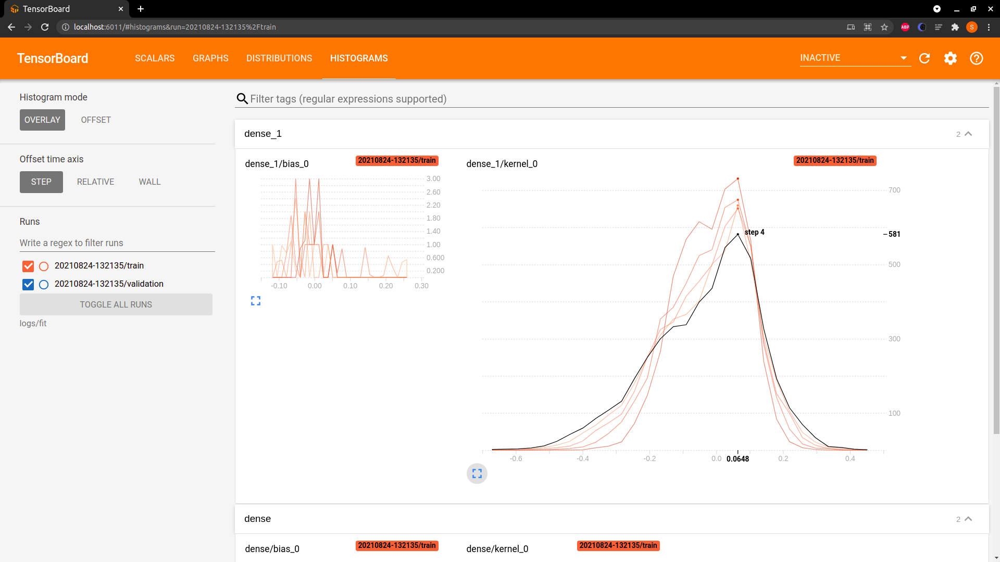
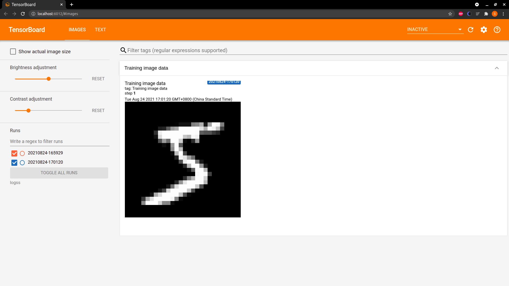

# TensorBoard: 实验统计分析助手

在 13 和 14 讲中，我们一同了解了 TensorFlow。通过 TensorFlow，可以将设计好的理论模型变成实际可用的真正的模型。这一讲将学习一个高效的实验分析助手: TensorBoard。

---
---

## 什么是 TensorBoard

在机器学习中，我们经常要衡量和把握模型的参数、指标等信息，这就需要一种工具，希望它能提供机器学习工作流程期间所需的测量和可视化的信息，于是就有了 [TensorBoard](https://www.tensorflow.org/tensorboard/get_started)

在构建深度学习的模型时，只要模型开始训练了，很多内部细节是不对外暴露的。模型的参数是多少、变大了还是变小了、当前的准确率是多少，我们都不知道。而 TensorBoard 可以通过 Web
页面提供查看细节与过程的功能，它将模型的细节与过程，通过浏览器可视化的方式进行展现，帮助使用者感知各个参数与指标的变化，把握训练趋势。

在 [13｜张量、数据流图与概念: 初步了解 TensorFlow](lecture_13.md) 中我们学会了如何安装 TensorFlow，TensorFlow 安装好之后，实际上 TensorBoard
也已经被安装了，所以不需要单独安装。

---

## TensorBoard 的简单使用

在 13 讲中，我们还了解了 TensorFlow 1 和 2 版本的不同，并选择了 TensorFlow 2 作为学习的版本；同样的，TensorBoard 也是在 TensorFlow 2 的基础上运行的。

TensorBoard 一般有两种使用方法: ```Model.fit()``` 中调用，或者在其他函数中使用。

---

### 在 model.fit()中使用 TensorBoard

在具体看 TensorBoard 可视化界面到底是什么样子之前，我们仍旧使用经典的 MNIST 数据来作为案例，先把模型跑起来。我们先加载数据和构建模型:

```python
import tensorflow as tf
import tensorboard
import datetime

# 加载 mnist 数据
mnist = tf.keras.datasets.mnist
# 将数据进行切分，分为训练集和验证集
(x_train, y_train), (x_test, y_test) = mnist.load_data()
# 还记得为什么要除以 255 么
x_train, x_test = x_train / 255.0, x_test / 255.0


# 构建一个简单的模型，拍平--全连接--dropout--全链接
def create_model():
    return tf.keras.models.Sequential([
        tf.keras.layers.Flatten(input_shape=(28, 28)),
        tf.keras.layers.Dense(512, activation='relu'),
        tf.keras.layers.Dropout(0.2),
        tf.keras.layers.Dense(10, activation='softmax')
    ])
```

以上代码，你可以直接在 Jupyter 中使用，也可以在终端使用。

然后我们就可以在代码中加入 TensorBoard 的内容了。首先要构建一个大致的训练框架，包括初始化模型、模型训练等关键步骤:

```python
model = create_model()
model.compile(optimizer='adam', loss='sparse_categorical_crossentropy', metrics=['accuracy'])
# 定义日志目录，这里需要注意的是，它必须是启动 Web 应用时指定目录的子目录
log_dir = "logs/fit/" + datetime.datetime.now().strftime("%Y%m%d-%H%M%S")
tensorboard_callback = tf.keras.callbacks.TensorBoard(log_dir=log_dir, histogram_freq=1)
model.fit(
    x=x_train,
    y=y_train,
    epochs=5,
    validation_data=(x_test, y_test),
    callbacks=[tensorboard_callback]
)
```

运行完成之后，可以在 log 文件夹中看到用时间命名的子文件夹，其中包含了一个以"v2"结尾的日志文件。执行如下命令，就可以看到 TensorBoard 的可视化展示了:

```shell
$ tensorboard --logdir logs/fit
Serving TensorBoard on localhost; to expose to the network, use a proxy or pass --bind_all
TensorBoard 2.2.1 at http://localhost:6010/ (Press CTRL+C to quit)
```

在浏览器中输入 [http://localhost:6010/](http://localhost:6010/) 就看到 TensorBoard 的样子了。如下图所示:


接下来看看这个页面都有些什么。

最上面的橙色菜单栏中，我们能够看到几个页卡，分别是 scalars、graphs、distributions、histograms 和 time series。这几个页卡提供了不同的功能。

首先是 scalars。

还记得我们之前学习到的标量吗？scalar 就可以理解为标量。这里记录的是各个数据指标的变化趋势信息，而数据指标一般也确实都是标量。

在 scalars 的图像中，我们可以看到深浅两种曲线，其中浅色的为未平滑的实际线图，深色的则是平滑之后的线图，我们可以通过左侧的 smoothing 调节平滑的程度。

此外，scalars 还可以实现的交互有:

* 点击每个图表左下角的蓝色小图标将展开图表
* 拖动图表上的矩形区域将放大
* 双击图表将缩小
* 鼠标悬停在图表上会产生十字线，数据值记录在左侧的运行选择器中

然后是 graphs。该页卡记录了模型的结构信息，当我们打开这个页卡的时候就可以看到如下的信息:


TensorBoard 的模型结构可视化可以让使用者非常方便地了解模型的"样子"。但我个人觉得，graphs 在小模型的情况下确实非常有用，如果模型结构比较复杂(比如后续实战中用到的图像分类模型)
，那整个可视化展示的网络就会十分庞大，反倒不如通过代码的方式了解网络结构本身的情况。

最后是 histograms 和 distributions。在这里你可以看到 activations、gradients 以及 weights 等变量的每一步的分布，越靠前就是越新的步数的结果。后文中我会具体介绍。

time serie 暂时用不上，这里就不做过多讲解了。

在 TensorBoard 中有很多可供选择的页卡，一般 scalars 使用较多， 因为它可以直观地展示数据指标的变化趋势。下面我们来看看 TensorBoard 其他的使用方法。

---

### 更加灵活地使用 TensorBoard

在 ```model.fit()``` 中使用 TensorBoard 的时候，可定制化的东西还是挺少的，没有那么灵活。因此，我们可以通过 ```tf.summary()``` 方法指定需要 TensorBoard
展示的参数。这个方法非常简单，甚至可以脱离模型训练本身来进行，也就是说: 只要给了数据，就能记录。我们不妨举一个简单的 [例子]() 。

```python
import tensorflow as tf
import random
import tensorboard
import datetime

# 这里，我们首先生成一个 tf.summary 的记录文件。
log_dir = "./log/" + datetime.datetime.now().strftime("%Y%m%d-%H%M%S")
summary_writer = tf.summary.create_file_writer(log_dir)
# 假设我们有一些二维坐标点，我们以函数 y=0.1x^2-4x+1 为例，此外，为了引入类似模型波动的效果，我们在 y 上乘一个 0.9～1 的随机数。
xs = list(range(100))
ys = [(0.1 * x * x - 4 * x + 1) * random.randint(90, 100) / 100 for x in xs]
# 任意一个二维坐标点，我们只需要使用 tf.summary.scalar，就可以记录该信息。
for i, j in zip(xs, ys):
    with summary_writer.as_default():
        tf.summary.scalar('fake_index', j, step=i)
summary_writer.close()
```

```tf.summary()``` 声明记录的位置以及记录的数据，只需要 2 句核心代码，就可以完成数据指标的追踪。我们来看看这 100 个二维坐标在 Web 页面的显示情况:


我们可以在每一个 epoch，甚至每一个 step 完成之后，记录模型的参数信息、性能信息等内容。

---

## TensorFlow Summary API 的使用

在使用 summary API 之前，我们需要先声明 SummaryWriter 的实例:

```python
tf.summary.create_file_writer(logdir, max_queue=10, flush_millis=None, filename_suffix=None, name=None)
```

以下是代码中的注解。

* logdir: 为我们要保存 log 文件的路径
* max_queue: 代表最多在缓存中暂存 max_queue 个数据。默认为 10，在实际使用的时候，默认值差不多就够了。如果超过 max_queue 个，flush 会更新到日志文件中并清空缓存
* flush_millis: 表示至少 flush_millis 毫秒内进行一次 flush
* filename_suffix: 是日志文件的后缀，默认为 .v2
* name: 则代表本操作的名称

SummaryWriter 作为一个类，其内部自然也有一些预先声明好的函数，一般常用的有 set_as_default、flush 和 close

* set_as_default: 该函数会设定默认的 summary writer，也就是以后出现的所有 summary 写入操作，都默认使用本个 summary writer 实例进行记录
* flush: 强制写入操作。log 的生成不是严格实时的，有时候我们需要尽快写入的话，就要用到该函数
* close: 写文件的常规操作，但是不能忘了

刚才初步介绍了 summary 的使用，现在是它的各个常用方法。

---

### tf.summary.scalar

现在你已经知道，该方法是适用于记录标量数据信息的。其具体参数如下:

```python
tf.summary.scalar(tags, values, step)
```

其中:

* tags 代表记录的节点的名字
* values 代表节点的值，也就是纵坐标
* step 代表训练的步数

在实际的使用中，values 和 step 的使用非常灵活，你可以用 step 记录 epoch，也可以记录 batch。

---

### tf.summary.histogram

```tf.summary.histogram()``` 将输入的张量压缩成了一个由宽度和数量组成的直方图数据结构。为了简化问题，我们假设有一个数组(实际是张量): [1,3, 2.8, 2.9, 3.3, 4.1]，则
TensorBoard 会将这个数组分成多个块: 小于 2 的数据为一个块，2 和 3 之间的数据一个块，3 和 4 之间的数据一个块等等。这个数组就是模型训练中我们要记录的信息(比如 loss)。

在实际的训练中，每一个训练的 step(或者 epoch)就会有一个这样的张量需要被"分块"，我们再结合刚才的图片来具体看看:


在 dense_1/bias_0 表格中，数据从上到下一共有 5 个切片。回顾一下代码可以知道，纵轴实际上代表了 5 个训练的 step。

注意一下纵轴的坐标，分别是 0-5(这里只显示了 1 和 3)。

在 histogram 中，横轴表示要记录的信息的值，纵轴表示 step 或者记录的切片的计数，每个切片显示一个直方图，切片按步骤(步数或时间)排列: 旧的切片较暗，新的切片颜色较浅。

将鼠标放到表格上，会发现变成了如下的样子:


带黑色线条的直方图表示你此刻正在观察的切片，它对应了第 2 个 step，在此时有 651 个参数集中在以 0.0648 为中心的块中。

histogram 有两种模式: OVERLAY 和 OFFSET。我们刚才学习的是 OFFSET，那么如何打开 OVERLAY 模式呢？



---

### tf.summary.image 与 tf.summary.text

如果只能记录参数信息，那么 TensorBoard 未免有些单调了。它还可以记录训练样本的内容信息，比如文本、图片。

图片的记录，我们以刚才的 MNIST 为例子:

```python
(x_train, y_train), (x_test, y_test) = mnist.load_data()
log_dir = "./logs/" + datetime.datetime.now().strftime("%Y%m%d-%H%M%S")
summary_writer = tf.summary.create_file_writer(log_dir)
img = np.reshape(x_train[0], (-1, 28, 28, 1))
with summary_writer.as_default():
    tf.summary.image("Training image data", img, step=1)
```

很简单，我们打开 TensorBoard 之后就可以看到记录的图片了:



同样， 文本可以用如下的方式:

```python
text = 'tenboard is so cool!'
with summary_writer.as_default():
    tf.summary.text('fake_text', tf.convert_to_tensor(text), step=1)
```

你可能会问，记录 scalar 和 histogram 可以理解，因为它们能够展示参数的实时和历史变化，那记录 image 和 text 有什么用呢？

其实，在模型的训练和预测过程中，我们经常会遇到一些模型不太好学习的顽固分子(badcase)，或是某些评估指标很低的类别的数据，它们都可以用这个 API 来记录和追踪，这总比跑完实验之后再一条一条去查来得方便和快捷。

---

### tf.summary 的其他 API

```tf.summary``` 中还有一些其他的 API，我对它们做一个简单的介绍。

* ```tf.summary.audio```: 展示训练过程中记录的音频。在本门课程中，不涉及音视频相关的内容，所以如果你有兴趣，可以查阅资料来学习 TensorBoard 是如何记录音频内容的
* ```tf.summary.distribution```: 该函数的功能主要是用来记录 weights 分布信息的，与之前提到的 ```tf.summary.histogram``` 的功能有一定的相似之处
* ```tf.summary.merge```: merge_all 可以将所有 summary 全部保存到磁盘，以便 TensorBoard 显示

---

## 总结

TensorBoard 是一个非常高效简便的实验记录和辅助工具，本讲中我介绍了它的基础使用方法，这些足够支持你日常的大部分使用场景和需求了。

从第 01 讲到这里，我们深度学习实战开发的基础知识做了相对全面的学习，包括数学基础、深度学习的概念与结构、辅助工具、开发工具等。至此，我们已经有了足够的理论知识，来进入后面的课程了。

---
---

