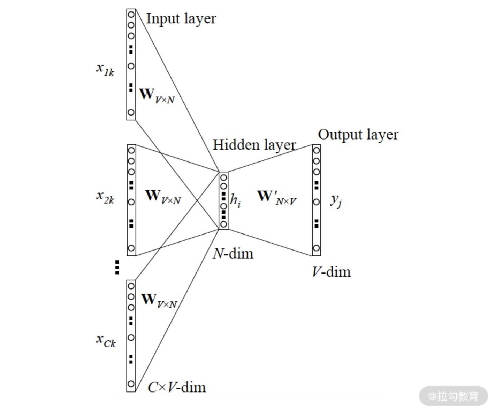
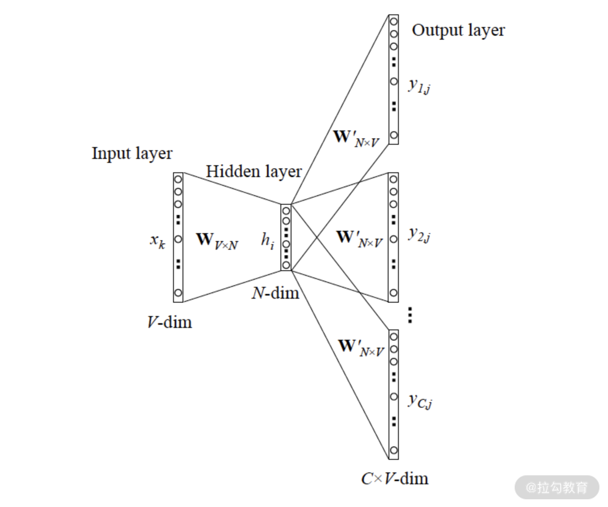
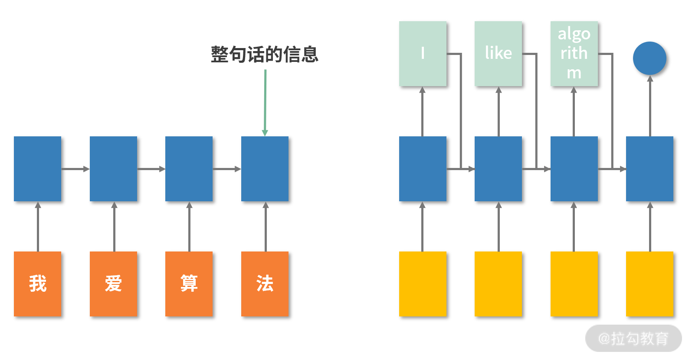
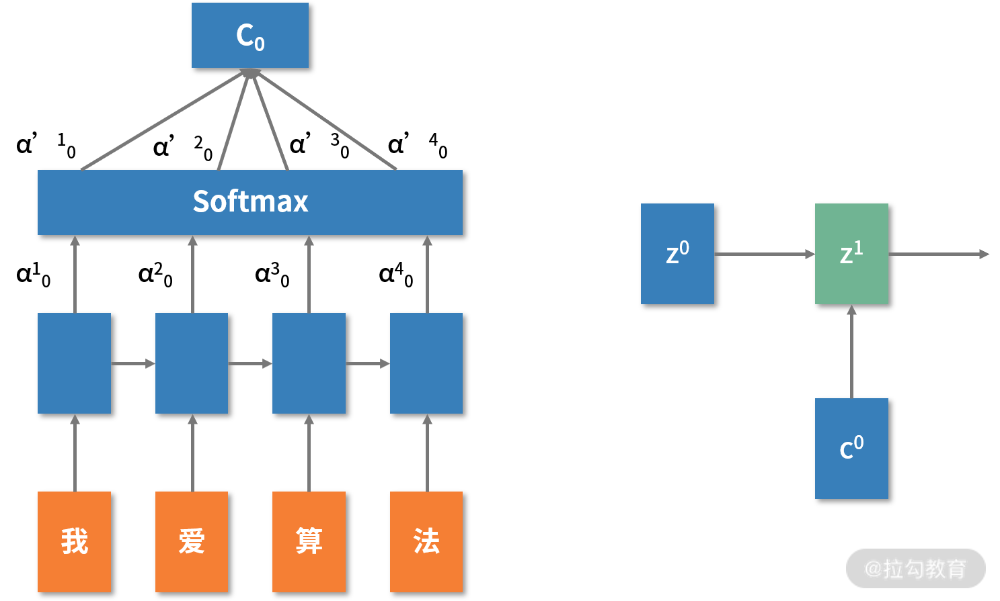
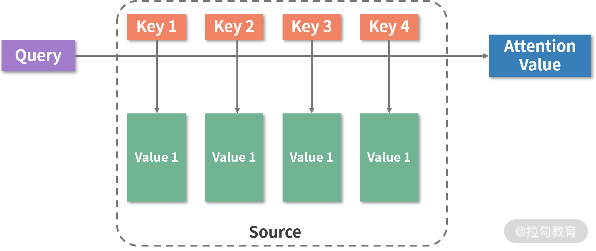

# 文本分类: 技术背景与经典网络结构介绍

我们已经学习了图片分类和语义分割问题，在这一讲和下一讲，我会从自然语言处理(NLP)中的文本分类角度出发，带你继续了解深度学习的应用。

---
---

## 概述

文本分类，顾名思义，就是给定一段文本，模型利用文本提供的特征将后者归为不同的类别。

比如，我们平时看的新闻资讯 App 中有时政、娱乐、体育等大的分类，这些大分类下又各有不同的小类别。这个世界每天都在发生着很多事情，如果纯靠人力来对每一篇文章进行分类是行不通的，所以各个 App 基本上都采用了模型分类的方式。


在深度学习广泛使用之前，人们较多采用贝叶斯分类、SVM 分类这样的方法。这些方法确实效果不错，但会比较依赖特征提取的好坏，并且对数据较为敏感。

随着深度学习应用范围的扩大，人们开始把注意力放到了深度学习上，试图利用深度学习解决自然语言处理的相关问题。随着研究的深入，涌现出了一大批优秀算法与解决方案，比如 DCNN、TextCNN、Transformers。

对于文本分类模型的学习，我会先从词向量出发，然后介绍两个较为经典的用于自然语言处理的深度学习算法 TextCNN 和 Attention(注意力机制)，再通过实战环节，带你从零构建一个综合的文本分类项目。

---

## 词向量与 word2vec

词向量(Word embedding)，又称词嵌入，是将文本(比如词语)
从单一维度映射到高维空间的过程。在高维空间中，每一个点都是一个有着明确含义的内容，且点和点之间的距离、位置关系是可被计算的。词向量是自然语言处理中不可缺少的一个重要环节，随着 BERT、ELMo
等一系列算法框架的广泛使用，词向量甚至已经成为一种可以表达知识的方法。

词向量的构建方法非常多，我这里选择的是 word2vec。在介绍 word2vec 之前，我们先来复习一下 one-hot，它是咱们介绍的一种向量表示的方法。

---

### one-hot

在 [12 | 数据预处理: 让模型学得更好](../module_2/lecture_12.md) 中，我曾介绍过 one-hot 的表达方式，当时是用来表达离散特征。其实它也可以用于词向量的表示。

假定我们有一个包含了 1000 个词语的词典，那我们给每个词语一个唯一的序号 ID，如"今天"=1，"是"=17，"星期二"=452，则"今天是星期二"这句话，我们就可以使用一个 1000 维的向量来表示，这个向量中第 1、17、452
位为 1，其余位为 0。

这种方式固然简单，但是不难发现其中存在两个很严重的问题，一个是维度爆炸: 一句简单的话，竟然要用 1000 维的向量表示，还是一个非常稀疏的向量；另一个问题就是，这种方式对于语言的很多重要信息都不能很好地保持，比如语序问题: "我是你爸爸"
和"你是我爸爸"，在 one-hot 中的表示是一模一样的，这就很容易丢失信息，甚至引起歧义。

为了让词向量能够更加接近语言的表示特点，人们开始将注意力集中在两个重要的方面:

* 上下文信息(context)，也就是词语前后出现的内容
* 共现(co-occurrence)，即与词语经常一块出现的词语

---

### word2vec

在自然语言处理问题中，词语是最常用的，也是最细的切分粒度(目前已经有很多更细的粒度，如字符 char 粒度，其实原理大致相同)。词语构成句子，句子构成段落，段落构成文章，所以词语的表示就非常重要，直接关系到整个文本的表示效果。

word2vec 的核心思想很有意思: 假定我们有一个函数 $f(x)->y$ 的映射，这里面 x 是词语，y 是 x 的上下文信息，f 就是一个将 x 映射到 y 的网络。

在这里，f 实际上就是一个语言模型(language model)。我们不关心模型本身有多厉害，我们需要的是训练完成之后的副产物: 模型参数，也就是网络权重。这些参数，可以认为是 x 的某种向量化的表示。

不难发现，word2vec 实际上就是简化了的神经网络。

word2vec 有两种形式，分别是 CBOW(Continuous Bag-of-Words)和 Skip-Gram。

---

#### CBOW

CBOW 模型的输入内容是某一个特征词的上下文相关的词的词向量，而输出就是这个词的词向量，其简化了的网络结构如下:



我们来看一下这个网络结构中包含的内容。

* 输入层: 上下文单词的 one-hot
* 权重矩阵: W，是一个共享的权重矩阵，即每个上下文单词共用一个
* 隐藏层: 由所有的上下文单词经过加权平均得到，尺寸是 1xN
* 输出矩阵: $W’$
* 输出向量: 经过激活函数处理后，得到一个 V 维的向量，其中概率最大的那一维代表预测的词语

咱们每介绍一个神经网络都要明确它的损失函数。显然，这里面的损失函数，就是要对输出向量和真实词语对应的 one-hot 之间的误差进行度量。

---

#### Skip-Gram

Skip-Gram 简化的网络结构如下:



Skip-Gram 的具体过程我就不做过多介绍了，它和 CBOW 正好相反，是给定输入一个单词，然后预测这个单词的上下文。

看完了 word2vec 之后，你可能会有一些发蒙，这不就是一个神经网络么，跟词向量有什么关系？

我刚才提到了，我们最终的目的，不是为了要得到一个多么优秀的神经网络，也不是要得到一个多好的预测模型。我们需要的，是这个网络中间的隐藏层的参数。

因为给定任意一个 one-hot 表示的词语，经过隐藏层之后都有确定位置的神经单元被激活，也就能得到一个唯一的向量表示。也就是说，将 one-hot 经过转换之后，变成了一个 N 维的稠密表达，也就解决了 one-hot
存在的两个严重的问题: 维度爆炸和信息丢失。

除了 word2vec，还有很多种词向量的表达方式，比如 ELMo、GloVe。不光词语可以转为向量形式，段落、文本(doc2vec)等类型都可以，甚至万物皆可 embedding。你如果感兴趣可以在课后查阅相关的知识。

了解了 word2vec 之后，我们就可以将词语用一个 N 位向量进行表示。假设一篇文章有 M 个词语，我们就可以用一个 MxN 的矩阵来表示这篇文章。

---

### TextCNN

了解了词向量，我们就来了解两个经典的用于自然语言处理的深度学习算法吧，首先是 TextCNN。

还记得 CNN 吗？其实 CNN 并不只是能用来做图像相关的算法，它可比你想象的更能干。

我曾说过，CNN 通过一层一层地卷积，不断地抽象和提取特征，比如浅层的卷积可以提取线条信息，深层的可以提取语义信息。CNN 提取的内容就好像一张张图片，那文字要怎么样变成类似的形式呢？

了解了词向量之后，或许你已经有了一点点思路: 把文本转化成一个矩阵，然后做进一步的处理。这也是 TextCNN 的精妙之处。

老规矩，我们先来看 TextCNN 的网络结构，如下:


不要被它吓到了。TextCNN 的网络结构看上去很复杂的样子，但其实很简单，我们来逐步分析。

首先是 embedding 层，也就是上图中的黑白矩阵。

通过 embedding 层，我们可以将文本转换为矩阵。在实际使用中，我们既可以使用已经训练好的语言模型直接表示文本，也可以利用手头的语料重新训练一个 embedding 层。

直接使用预训练语言模型的好处是，可以更好地学习外部知识来获得一个更加客观实际的语言表示，不用从头训练该部分网络也节省了大量时间；而利用手头的语料重新学习 embedding 则可以让网络更加关注该网络要解决的问题的特点，更加定制化。

在上图中，文本就可以表示成为了一个 7x5 的矩阵，其中 5 表示单词的向量维度为 5。

然后是卷积层，也就是上图中第二列五颜六色的矩阵。

在以前的 CNN 的学习中，卷积核我们一般都是固定的正方形尺寸，比如 3x3、5x5。在这里就不能这么用了。我们使用 kernel_sizes=(2,3,4) 的一维卷积层，每个 kernel_size 有两个输出
channel。这样，我们就可以得到了若干个列数为 1 的矩阵，也就是一个列向量。为什么要这么做呢？我们继续往下看。

卷积层之后接着的是 Max-pooling 层。

这里面用的 Max-pooling 层，也跟以前使用的不太一样，是一个 1-max pooling 层。这样能提取出每个 feature map 的最大值:
无论文本有多长，我们都能将文本变成一个定长的表示。将文本长度这个不确定的值变得确定。

最后就是将上面步骤得到的值拼接成一个向量，再加上一个全联接层，获得最后的输出。

你看，是不是非常简单？TextCNN 的最独特的地方在于可以用多个不同大小的卷积核来提取文本中的关键信息，也就是说，能提取了不同粒度、不同层次的局部相关信息。

将 TextCNN 最核心的代码提取了出来，如下所示:

```python
class TextCNN(object):
    def __init__(self, maxlen, max_features, embedding_dims,
                 class_num=5,
                 last_activation='softmax'):
        self.maxlen = maxlen
        self.max_features = max_features
        self.embedding_dims = embedding_dims
        self.class_num = class_num
        self.last_activation = last_activation

    def get_model(self):
        input = Input((self.maxlen,))
        embedding = Embedding(self.max_features, self.embedding_dims, input_length=self.maxlen)(input)
        convs = []
        for kernel_size in [3, 4, 5]:
            c = Conv1D(128, kernel_size, activation='relu')(embedding)
            c = GlobalMaxPooling1D()(c)
            convs.append(c)
        x = Concatenate()(convs)
        output = Dense(self.class_num, activation=self.last_activation)(x)
        model = Model(inputs=input, outputs=output)
        return model
```

---

### Attention 机制

Attention 机制也称注意力机制，严格来说它不是一个算法，而是一个网络构建的思路。谷歌在 2017 年发表了一篇论文名字《Attention Is All You Need》，提出了一个基于 Attention
的结构来处理序列模型相关的问题。

在之前的深度学习解决 NLP 问题的时候，经常会使用 RNN 或 LSTM 作为解决方案或模型，在 [08｜RNN 与 LSTM: 模型也可以持续不断的思考](../module_1/lecture_8.md) 中我提到，RNN 和
LSTM 天然有一些劣势和不足，比如梯度消失、并行化困难。而基于 Attention 构建的网络，比如 Transformers，就很好地解决了这些问题。

我用一个不太严谨的例子来向你介绍 Attention 机制的出发点。

给定任意一句话，我们在阅读的时候其实会对文字中的不同位置有不同的关注程度，比如"今天我终于赶在睡觉前完成了我的作业"，这里你关注的点，或者词语，可能是"我""完成""作业"
，而其他的词语你就不太关心了。你通过这几个词语就能精炼地提取出文本的内容: 我完成作业了。

Attention 机制其实就是这个意思，它对网络中的输入(或者中间层)的不同位置，给了一些不同的注意力(权重)。通过学习，网络逐渐地就知道了哪些是重点，哪些不需要关心。

通过对 word2vec 的学习我们知道了，word2vec 训练完权重固定之后，对于任意一个单词，给定的词向量都是固定且唯一的。而 Attention 机制则更加灵活: 通过词的重要性不同，输出的词向量也更加的动态。

为了减少理解上的难度，在介绍 Attention 之前我们先回顾一下 RNN。

下图是传统 RNN 的抽象结构:



作为对比，下图是加入 Attention 与 RNN 结合的样子:



其中 $α$ 就是每个状态 h 的权重。很明显，每一个状态 h 都多了一个输出，经过加权汇总到一个 Softmax 层中，再经过加权求和就得到了一个最终的输出 $c_0$。$c_0$ 和 $z_0$ 、继续向后传播到 $z_1$，然后
$z_1$ 和 $c_1$ 一同传入 $z_2$

我们只需要增加很少的参数，就可以让模型自己弄清楚谁重要谁次要。很简单， 但是也很巧妙。下面我们来看一下抽象化之后的 Attention:



输入是 query(Q), key(K), value(V)，输出是 attention value。

跟刚才 Attention 与 rnn 结合的图类比，query 就是 $z_0，z_1$，key 就是 $h_1，h_2，h_3，h_4$，value 也是 $h_1，h_2，h_3，h_4$。模型通过 Q 和 K
的匹配计算出权重，再结合 V 得到输出，公式如下:


Attention 目前主要有两种，一种是 soft attention，一种是 hard attention。

hard attention 关注的是当前词附近很小的一个区域，而 soft attention 则是关注了更大更广的范围，也更为常用。作为应用者，了解到 Attention 的基本原理就足够使用了，因为现在已经有了很多基于
Attention 的预训练模型可以直接使用。

---

## 结语

之所以在这里要讲 Attention，是因为我在下一讲会一步一步地教你构建一个文本分类器。下一讲的内容会更加应用化、工程化。在开始学习前，你需要做 3 件事情。

* 了解 PyTorch 的基本使用方法。之前咱们已经介绍过了 TensorFlow，下一讲我会使用 PyTorch，带你领略有不同框架的特点
* 思考: 如果让你设计一个文本分类器，你会怎么去做
* 课下学习 SVM 以及 FastText

如果你觉得自学比较困难也没有关系，在下一讲我会一步一步教你的。

下一讲会提供一个开箱即用的解决方案，但我仍旧建议你去从头实现项目代码，这对你个人能力的提升会非常明显。

---
---

