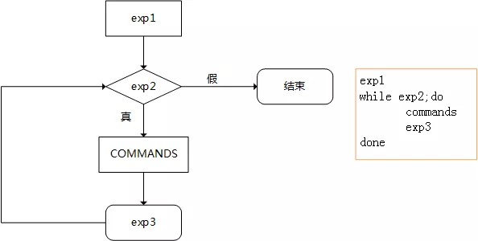
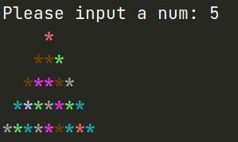

# main

## 条件选择、判断

### 条件选择 if

用法格式

```shell
if 判断条件 1 ; then
  条件为真的分支代码
elif 判断条件 2 ; then
  条件为真的分支代码
elif 判断条件 3 ; then
  条件为真的分支代码
else
  以上条件都为假的分支代码
fi
```

逐条件进行判断，第一次遇为 "真" 条件时，执行其分支，而后结束整个 if。

经典[案例](./sh/demo1.sh)

```shell
#!/bin/bash
read -p "Please input your age: " age
if [[ $age =~ [^0-9] ]]; then
  echo "please input a int"
  exit 10
elif [ $age -ge 150 ]; then
  echo "your age is wrong"
  exit 20
elif [ $age -gt 18 ]; then
  echo "good good work,day day up"
else
  echo "good good study,day day up"
fi
```

分析：请输入年纪，先判断输入的是否含有除数字以外的字符，有，就报错；没有，继续判断是否小于 150，是否大于 18。

[案例](./sh/demo2.sh)

```shell
#!/bin/bash
read -p "Please input your score: " score
if [[ $score =~ [^0-9] ]]; then
  echo "please input a int"
  exit 10
elif [ $score -gt 100 ]; then
  echo "Your score is wrong"
  exit 20
elif [ $score -ge 85 ]; then
  echo "Your score is very good"
elif [ $score -ge 60 ]; then
  echo "Your score is soso"
else
  echo "You are loser"
fi
```

分析：请输入成绩，先判断输入的是否含有除数字以外的字符，有，就报错；没有，继续判断是否大于 100，是否大于 85，是否大于 60。

### 条件判断 case

用法格式

```shell
case $name in;
PART1)
  cmd
  ;;
PART2)
  cmd
  ;;
*)
  cmd
  ;;
esac
```

```shell
注意：case 支持glob 风格的通配符：
  *: 任意长度任意字符
  ?: 任意单个字符
  [] ：指定范围内的任意单个字符
  a|b: a 或b
```

[案例](./sh/demo3.sh)

```shell
#!/bin/bash
read -p "Please input yes or no: " anw
case $anw in
[yY][eE][sS] | [yY])
  echo yes
  ;;
[nN][oO] | [nN])
  echo no
  ;;
*)
  echo false
  ;;
esac
```

分析：请输入 yes or no，回答 Y/y、yes 各种大小写组合为 yes；回答 N/n、No 各种大小写组合为 no。

---

## 四个循环

### for

用法格式

```shell
for name in 列表 ;do
  循环体
done
for (( exp1; exp2; exp3 )) ;do
  cmd
done
```



exo1 只执行一次，相当于在 for 里嵌了 while

执行机制：

* 依次将列表中的元素赋值给"变量名"; 每次赋值后即执行一次循环体; 直到列表中的元素耗尽，循环结束
* 列表的表示方法，可以 glob 通配符，如 `````{1..10} 、*.sh````` ；也可以变量引用，如： ```seq 1 $name```

[案例](./sh/demo4.sh)

```shell
#!/bin/bash
sum=0
read -p "Please input a positive integer: " num
if [[ $num =~ [^0-9] ]]; then
  echo "input error"
elif [[ $num -eq 0 ]]; then
  echo "input error"
else
  for i in $(seq 1 $num); do
    sum=$(($sum + $i))
  done
  echo $sum
fi
unset zhi
```

```shell
$ ./demo4.sh 
Please input a positive integer: 4
10
```

分析：sum 初始值为0，请输入一个数，先判断输入的是否含有除数字以外的字符，有，就报错；没有判断是否为 0，不为 0 进入 for 循环，i 的范围为 1~输入的数，每次的循环为 sum=sum+i，循环结束，最后输出 sum 的值。

[案例](./sh/demo5.sh)

```shell
#!/bin/bash
for ((i = 1, num = 0; i <= 100; i++)); do
  [ $((i % 2)) -eq 1 ] && let sum+=i
done
echo sum=$sum
```

```shell
$ ./demo5.sh 
sum=2500
```

分析：

i=1,num=0

当 i<=100，进入循环

若 i÷2 取余 =1，则 sum=sum+i，i=i+1

### while

用法格式

```shell
while 循环控制条件 ;do
  循环
done
```

循环控制条件；进入循环之前，先做一次判断；每一次循环之后会再次做判断；条件为 "true"，则执行一次循环；直到条件测试状态为 "false" 终止循环

特殊用法(遍历文件的每一行)：

```shell
while read line; do控制变量初始化
  循环体
done < /PATH/FROM/SOMEFILE
或cat /PATH/FROM/SOMEFILE | while read line; do
  循环体
done
```

依次读取 /PATH/FROM/SOMEFILE 文件中的每一行，且将行赋值给变量 line

[案例](./sh/demo6.sh)

```shell
#!/bin/bash
sum=0
i=1
while [ $i -le 100 ]; do
  if [ $(($i % 2)) -ne 0 ]; then
    let sum+=i
    let i++
  else
    let i++
  fi
done
echo "sum is $sum"
```

分析：

sum 初始值为 0，i 的初始值为 1

请输入一个数，先判断输入的是否含有除数字以外的字符

有，就报错

没有当 i<100 时，进入循环

判断 i÷2 取余 是否不为 0

不为 0 时为奇数，sum=sum+i，i+1，为 0，i+1

循环结束，最后输出 sum 的值

### until 循环

用法

```shell
unitl 循环条件 ;do
  循环
done
```

进入条件：

循环条件为 true

退出条件：循环条件为 false

刚好和 while 相反，所以不常用，用 while 就行

[案例](./sh/demo7.sh)

```shell
#!/bin/bash
until pgrep -u xiaoming &>/dev/null; do
  sleep 0.5
done
pkill -9 -u xiaoming
```

分析：每隔 0.5 秒扫描，直到发现 xiaoming 用户登录，杀死这个进程，退出脚本，用于监控用户登录。

### select 循环与菜单

用法

```shell
select variable in list
do
  循环体命令
done
```

① select 循环主要用于创建菜单，按数字顺序排列的示菜单项将显示在标准错误上，并显示 PS3 提示符，等待用户输入

② 用户输入菜单列表中的某个数字，执行相应的命令

③ 用户输入被保存在内置变量 REPLY 中

④ select 是个无限循环，因此要记住用 break 命令退出循环，或用 exit 按 命令终止脚本。也可以按 ctrl+c退出循环

⑤ select 和 经常和 case 联合使用

⑥ 与for循环类似，可以省略 in list， 此时使用位置参量

[案例](./sh/demo8.sh)

```shell
#!/bin/bash
PS3="Please choose the menu: "
select menu in mifan huimian jiaozi babaozhou quit; do
  case $REPLY in
  1 | 4)
    echo "the price is 15"
    ;;
  2 | 3)
    echo "the price is 20"
    ;;
  5)
    break
    ;;
  *)
    echo "no the option"
    ;;
  esac
done
```

分析：

PS3 是 select 的提示符，自动生成菜单，选择 5 break 退出循环。

```shell
$ ./demo8.sh 
1) mifan
2) huimian
3) jiaozi
4) babaozhou
5) quit
Please choose the menu: 1
the price is 15
Please choose the menu: 2
the price is 20
Please choose the menu: 3
the price is 20
Please choose the menu: 4
the price is 15
Please choose the menu: 6
no the option
Please choose the menu: 5
```

---

## 循环里的一些用法

### 循环控制语句

语法

continue [N]：提前结束第 N 层的本轮循环，而直接进入下一轮判断；最内层为第 1 层 break [N]：提前结束第 N 层循环，最内侧为第 1 层

```shell
while CONDTITON1; do
  CMD1
if CONDITION2; then
  continue / break
fi
  CMD2
done
```

[案例](./sh/demo9.sh)

求 (1+3+...+49+53+...+100) 的和

```shell
#!/bin/bash
sum=0
for i in {1..100}; do
  [ $i -eq 51 ] && continue
  [ $(($i % 2)) -eq 1 ] && {
    let sum+=i
    let i++
  }
done
echo sum=$sum
```

```shell
$ ./demo9.sh 
sum=2449
```

分析：做 1+2+...+100 的循环，当 i=51 时，跳过这次循环，但是继续整个循环，结果为：sum=2449

求 1+3+...+49 的和

[案例](./sh/demo10.sh)

```shell
#!/bin/bash
sum=0
for i in {1..100}; do
  [ $i -eq 51 ] && break
  [ $(($i % 2)) -eq 1 ] && {
    let sum+=i
    let i++
  }
done
echo sum=$sum
```

```shell
$ ./demo10.sh 
sum=625
```

分析：做 1+2+...+100 的循环，当 i=51 时，跳出整个循环，结果为： sum=625

### 循环控制 shift 命令

作用

用于将参数列表 list 左移指定次数，最左端的那个参数就从列表中删除，其后边的参数继续进入循环

创建指定的多个用户

[案例](./sh/demo11.sh)

```shell
#!/bin/bash
if [ $# -eq 0 ]; then
  echo "Please input a arg(eg:$(basename $0) arg1)"
  exit 1
else
  while [ -n "$1" ]; do
    useradd $1 &>/dev/null
    shift
  done
fi
```

分析：如果没有输入参数(参数的总数为0)，提示错误并退出；反之，进入循环；若第一个参数不为空字符，则创建以第一个参数为名的用户，并移除第一个参数，将紧跟的参数左移作为第一个参数，直到没有第一个参数，退出。

打印直角三角形的字符

[案例](./sh/demo12.sh)

```shell
#!/bin/bash
while (($# > 0)); do
  echo "$*"
  shift
done
```

```shell
$ ./demo12.sh 1 2 3 4 5
1 2 3 4 5
2 3 4 5
3 4 5
4 5
5
```

返回值结果

```shell
true 永远返回成功结果
: null command ,什么也不干，返回成功结果
false 永远返回错误结果
```

创建无限循环

```shell
while true ;do
  循环体
done
```

### 循环中可并行执行，使脚本运行更快

用法

```shell
for name in 列表 ;do
  {
  循环体
  }&
done
wait
```

[实例](./sh/demo13.sh)：

```shell
#!/bin/bash
read -p "Please input network (eg:192.168.0.0): " net
echo $net | egrep -o "\<(([0-9]|[1-9][0-9]|1[0-9]{2}|2[0-4][0-9]|25[0-5])\.){3}([0-9]|[1-9][0-9]|1[0-9]{2}|2[0-4][0-9]|25[0-5])\>"
[ $? -eq 0 ] || (
  echo "input error"
  exit 10
)
IP=$(echo $net | egrep -o "^([0-9]{1,3}\.){3}")
for i in {1..254}; do
  {
    ping -c 1 -w 1 $IP$i &>/dev/null &&
      echo "$IP$i is up"
  } &

done
wait
```

```shell
$ ./demo13.sh
Please input network (eg:192.168.0.0): 192.168.10.4
192.168.10.4
192.168.10.1 is up
192.168.10.4 is up
```

分析：请输入一个IP地址例 192.168.37.234

如果格式不是 0.0.0.0 则报错退出；正确则进入循环，IP 变量的值为 192.168.37. i 的范围为 1-254，并行 ping 192.168.37.1-154，ping 通就输出此 IP 为 UP。直到循环结束。

---

## 信号捕获 trap

### 用法格式

```shell
trap ' 触发指令' 信号，自定义进程收到系统发出的指定信号后，将执行触发指令，而不会执行原操作
trap '' 信号，忽略信号的操作
trap '-' 信号，恢复原信号的操作
trap -p，列出自定义信号操作
```

信号可以3种表达方法：信号的数字 2、全名 SIGINT、缩写 INT

### 常用信号

```shell
1) SIGHUP: 无须关闭进程而让其重读配置文件
2) SIGINT: 中止正在运行的进程；相当于Ctrl+c
3) SIGQUIT: 相当于ctrl+\
9) SIGKILL: 强制杀死正在运行的进程
15) SIGTERM ：终止正在运行的进程（默认为15）
18) SIGCONT ：继续运行
19) SIGSTOP ：后台休眠
9 信号，强制杀死，捕获不住
```

[案例](./sh/demo14.sh)

```shell
#!/bin/bash
trap 'echo press ctrl+c' 2
for ((i = 0; i < 10; i++)); do
  sleep 1
  echo $i
done
```

```shell
$ ./demo14.sh
0
1
2
^Cpress ctrl+c
3
4
5
6
7
8
9
```

分析：i=0，当 i<10，每休眠 1 秒，i+1，捕获 2 信号，并执行 echo press ctrl+c

打印 0-3，ctrl+c 不能终止，3 之后恢复，能终止

[案例](./sh/demo15.sh)

```shell
#!/bin/bash
trap '' 2
trap -p
for ((i = 0; i < 3; i++)); do
  sleep 1
  echo $i
done
trap '-' SIGINT
for ((i = 3; i < 10; i++)); do
  sleep 1
  echo $i
done
```

```shell
$ ./demo15.sh
trap -- '' SIGINT
0
1
^C2
3
4
^C
```

分析：i=0，当 i<3，每休眠 1 秒，i+1，捕获 2 信号；i>3 时，解除捕获 2 信号。

---

## 脚本小知识

### 生成随机字符

```shell
cat /dev/urandom
```

生成8个随机大小写字母或数字

```shell
cat /dev/urandom |tr -dc [:alnum:] |head -c 8
```

### 生成随机数

```shell
echo $RANDOM
```

确定范围

随机7个数(0-6)

```shell
echo $[RANDOM%7] 
```

随机7个数(31-37)

```shell
echo $[$[RANDOM%7]+31] 
```

### echo 打印颜色字

显示红色 along

```shell
echo -e "\033[31malong\033[0m" 
```

高亮显示红色 along

```shell
echo -e "\033[1;31malong\033[0m"
```

显示背景色为红色的 along

```shell
echo -e "\033[41malong\033[0m" 
```

显示闪烁的红色 along

```shell
echo -e "\033[31;5malong\033[0m" 
```

显示闪烁的随机色 along

```shell
color=$[$[RANDOM%7]+31]
echo -ne "\033[1;${color};5m*\033[0m" 
```

---

## 分享几个有意思的小脚本

### 9x9 乘法表

[案例](./sh/demo16.sh)

```shell
#!/bin/bash
for a in {1..9}; do
  for b in $(seq 1 $a); do
    let c=$a*$b
    echo -e "${a}x${b}=$c\t\c"
  done
  echo
done
```

```shell
$ ./demo16.sh 
1x1=1   
2x1=2   2x2=4   
3x1=3   3x2=6   3x3=9   
4x1=4   4x2=8   4x3=12  4x4=16  
5x1=5   5x2=10  5x3=15  5x4=20  5x5=25  
6x1=6   6x2=12  6x3=18  6x4=24  6x5=30  6x6=36  
7x1=7   7x2=14  7x3=21  7x4=28  7x5=35  7x6=42  7x7=49  
8x1=8   8x2=16  8x3=24  8x4=32  8x5=40  8x6=48  8x7=56  8x8=64  
9x1=9   9x2=18  9x3=27  9x4=36  9x5=45  9x6=54  9x7=63  9x8=72  9x9=81  
```

### 彩色等腰三角形

[案例](./sh/demo17.sh)

```shell
#!/bin/bash
read -p "Please input a num: " num
if [[ $num =~ [^0-9] ]]; then
  echo "input error"
else
  for i in $(seq 1 $num); do
    xing=$((2 * $i - 1))
    for j in $(seq 1 $(($num - $i))); do
      echo -ne " "
    done
    for k in $(seq 1 $xing); do
      color=$(($((RANDOM % 7)) + 31))
      echo -ne "\033[1;${color};5m*\033[0m"
    done
    echo
  done
fi
```

```shell
$ ./demo17.sh 
Please input a num: 5
    *
   ***
  *****
 *******
*********
```

### 国际象棋棋盘

[案例](./sh/demo18.sh)

```shell
#!/bin/bash
red="\033[1;41m  \033[0m"
yellow="\033[1;43m  \033[0m"

for i in {1..8}; do
  if [ $((i % 2)) -eq 0 ]; then
    for i in {1..4}; do
      echo -e -n "$red$yellow"
    done
    echo
  else
    for i in {1..4}; do
      echo -e -n "$yellow$red"
    done
    echo
  fi
done
```



