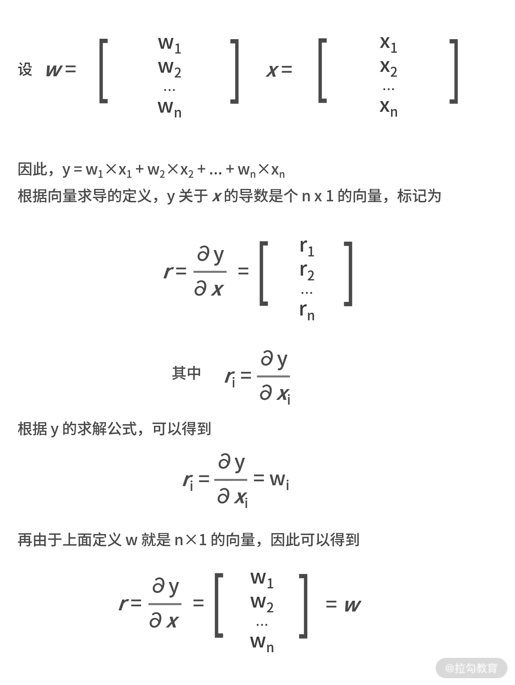

# 向量及其导数: 计算机如何完成对海量高维度数据计算

上一课时学习了利用梯度下降法求解函数的极值。举个例子，如果商品利润函数 r 和补贴金额 x 的关系为 
$$r(x) = p(x)\times (m - x - c) = (2/(1+e-x) - 1)\times (16 - x - 8)$$

然后又利用梯度下降法，求解出让利润最大的补贴额 $x^*$ 为 2.42 元。

就这个例题而言，其实根本不需要求导法或者是梯度下降法。这是因为，商品定价是 8 元，补贴额 x 的决策空间就是从不打折的 0 元到不要钱的 8 元。如果最小颗粒度是"分"，那么决策空间就是 0.00元～8.00元，这 801 个变量而已。写个 for 循环，对每一个可能的补贴额都简单粗暴地计算一遍，也是一种简单可行的方法。

然而，实际问题中可能会更加复杂。例如，购买概率除了与补贴额有关以外，还跟同行竞争对手的补贴额、商品的有效期、温度、天气、节假日等因素有关。假设有 n 个可能的因素，每个因素的决策空间都是 801 个，那么整体的决策空间就瞬间变成了
$801^n$ 个。

此时再用简单粗暴的 for 循环计算就变得不现实了，这也是在大数据环境下，数学算法对复杂业务环境求解计算的优势。

---
---

## 向量是高维度数据的处理单元

之前提到，除了补贴额，影响商品购买率的因素还有很多。为了综合刻画这些因素对购买概率以及利润的影响，自然就需要用多元函数来表达，即 $r(x,y,z...) = r(补贴额，有效期，温度...)$。

* 维度

每个影响购买概率的因素，又可称作维度。当维度逐渐变多时，就意味着需要在高维度数据空间下处理某个多元函数。在计算机或数学领域中，通常用向量或矩阵来对高维度数据进行计算和表示。

* 向量

向量是高维度数据的表现形式，它由多个数字组合在一起，其中每个数字都是某个维度的特征值。通常印刷体用斜体、加粗的小写字母表示，例如 a=[1,2,3,4,5]，而手写时在字母顶上加一小箭头"→"即可。

* 矩阵

既然向量是多个数字的组合，同样也可以把多个向量组合在一起就得到了矩阵。矩阵通常用斜体、加粗的大写字母表示，例如:

$$ A=\left[\begin{array}{lllll} 1 & 2 & 3 & 4 & 5 \\ 2 & 3 & 4 & 5 & 6 \\ 3 & 4 & 5 & 6 & 7 \end{array}\right]
$$

根据向量和矩阵的定义，不难发现向量是一种行数为 1 或列数为 1 的特殊矩阵。有了向量和矩阵，就能把高维度的数据用简单的数学符号表达了。

---

## 矩阵的基本运算

因为向量是一种特殊的矩阵，矩阵的基本运算对于向量也适用。

---

### 转置

先来介绍一下矩阵的转置。转置用大写字母 T 作为上标来表示，作用是交换矩阵行和列的值。这样原本的大小就由 n×m 变成 m×n 了，例如:

$$ A=\left[\begin{array}{lllll} 1 & 2 & 3 & 4 & 5 \\ 2 & 3 & 4 & 5 & 6 \\ 3 & 4 & 5 & 6 & 7 \end{array}\right] \quad
A^{\top}=\left[\begin{array}{lll} 1 & 2 & 3 \\ 2 & 3 & 4 \\ 3 & 4 & 5 \\ 4 & 5 & 6 \\ 5 & 6 & 7 \end{array}\right]
$$

---

### 向量的点乘运算

点乘运算只适用于向量，用"·"表示。计算的结果为，两个向量所有对应项的乘积之和。例如，向量 $a= [a_1,a_2,...,a_n] ,b= [b_1,b_2,...,b_n]$，则 $a·b=a_1b_1+a_2b_2+...+a_nb_n$。例如 a = [1,2,3] ,b = [2,3,4]，则 $a·b= 1×2 + 2×3 + 3×4 = 20$。

---

### 矩阵的乘积运算

接下来看一下矩阵相关的乘积运算。矩阵可以有两种乘积相关的运算，第一个是矩阵的乘法，第二个是哈达玛积。

* 运算矩阵的乘法

如果有 n×p 的矩阵 A 和 p×m 的矩阵 B，则矩阵A 和 B 可以做乘法运算。其乘积结果 $C =AB$ 的大小为 n×m，其中每个元素的数值为(C 矩阵中第 i 行第 j 列)

$$ c_{i j}=\sum_{k=1}^{p} a_{i k} b_{k j} $$

需要注意的是，矩阵的乘法对维数有严格要求。第一个矩阵的列数与第二个的行数必须相等。所以，矩阵的乘法并不满足交换律。

$$ \begin{array}{c} \text { 矩阵 } A=\left[\begin{array}{lll} 1 & 2 & 3 \\ 2 & 3 & 4 \end{array}\right] \quad
B=\left[\begin{array}{ll} 3 & 2 \\ 2 & 3 \\ 0 & 1 \end{array}\right] \\ \text { 矩阵 } C=A
B=\left[\begin{array}{ll} 1 \times 3+2 \times 2+3 \times 0 & 1 \times 2+2 \times 3+3 \times 1 \\ 2 \times 3+3 \times 2+4 \times 0 & 2 \times 2+3 \times 3+4 \times 1 \end{array}\right]
=\left[\begin{array}{cc} 7 & 9 \\ 12 & 17 \end{array}\right]
\end{array} $$

* 哈达玛积

哈达玛积在对海量数据预处理中会被高频使用，它的计算方式相对简单很多。哈达玛积要求两个矩阵的行列维数完全相同，计算方式是对应位置元素的乘积，例如:

$$ 
A=\left[\begin{array}{lll} 1 & 2 & 3 \\ 2 & 3 & 4 \end{array}\right]
B=\left[\begin{array}{lll} 3 & 2 & 3 \\ 2 & 3 & 1 \end{array}\right]
$$

$$
C=\left[\begin{array}{lll} 3 & 4 & 9 \\ 4 & 9 & 4 \end{array}\right] 
$$

---

### 求逆运算

最后一个矩阵的基本运算是求逆运算，这很像在标量里对一个数字求倒数。

先来介绍一个特殊的矩阵——单位矩阵。单位矩阵定义为主对角线元素为 1，其他元素为 0 的方阵，用 I 来表示，例如:

$$ I=\left[\begin{array}{lll} 1 & 0 & 0 \\ 0 & 1 & 0 \\ 0 & 0 & 1 \end{array}\right]
$$

求逆运算只可应用在方阵上，用 -1 作为上标来表示，输出的结果也称作逆矩阵。逆矩阵满足的性质是，与原矩阵做乘法运算后，结果为单位矩阵，即 $A×A-1=I$。

$$ {l} \text { 矩阵 } A=\left[\begin{array}{cc} 1 & 3 \\ 2 & 1 \end{array}\right] \quad \text { 矩阵 }
B=\left[\begin{array}{cc} -0.2 & 0.6 \\ 0.4 & -0.2 \end{array}\right] \\ A
B=\left[\begin{array}{ccc} 1 \times & (-0.2)+3 \times 0.4 & 1 \times 0.6+3 \times(-0.2) \\ 2 \times & (-0.2)+1 \times 0.4 & 2 \times 0.6+1 \times(-0.2)
\end{array}\right]=\left[\begin{array}{ll} 1 & 0 \\ 0 & 1 \end{array}\right]=I
$$ 

$$ 
B=A^{-1} 
$$

---

## 向量的求导

前面说过，在对复杂业务问题进行形式化定义后，再求解最优值的过程中，不管是用求导法还是梯度下降法，都是逃不开要对目标函数进行求导的。复杂业务环境中，自变量肯定不止一个，这就需要我们在向量或矩阵的环境中，掌握求导的运算。

实际工作中，矩阵的求导用得非常少，掌握向量的求导就足够了。因此，我们重点学习"向量关于向量"的导数计算。

先给出向量关于向量的导数的计算方法。向量 y 关于向量 w 的求导结果是个矩阵，标记为A。矩阵 A 中第 i 行第 j 列的元素 aij，为向量 y 中第 i 个元素关于向量 w 中第 j 个元素的导数。例如，如果向量 w 的维数为
n×1，向量 y 的维数是 m×1，则 y 关于 w 的求导结果矩阵维数就是 n×m，其中第 i 行第 j 列的元素为:

$$ a_{i j}=\frac{\partial y_{j}}{\partial w_{i}} $$

此时，向量的求导就变成了标量的求导了，相信这并不会难倒我们。

下面给出个相关例题:

如果 $w^Tx= y$，其中 w 和 x 都为 n×1 的向量。显然这里的 y 是个标量，也就是一个 1×1 的特殊向量。求 y 关于 x 的导数。

这里的 T 表示的是转置。此处 $w^Tx$ 是矩阵乘法，1×n 和 n×1 才能相乘。另一种表示方法是 $w·x$，表示向量点乘。此处二者结果一样。

它的解析过程如下图所示:

---

## 计算机处理海量数据

计算机在处理海量数据时，常常依赖复杂的数据结构进行存储。例如数组、链表、栈、哈希表、结构体等等。对于海量数据而言，一定要明确样本和维度这两个概念:

* 样本，是指一条一条数据，代表的数据的个数
* 维度，是指每一条样本的数据集合，代表数据特征的数量

举个例子，全班 50 名同学语文、数学、英语的考试成绩，就可以视作微型的海量数据。在这个数据集中，50 个同学每个人都有自己的乘积，因此样本就是 50 个。而每个同学的样本，又包含了数学成绩、语文成绩 、英语成绩，这就是每个样本的 3
个维度，也可以称作 3 个特征。这样，就可以得到维数为 50×3 的成绩矩阵。

假设你需要对全班同学的成绩做一些统计计算，那向量的知识就突显出来了。通过向量的加减法，你可以计算出每个人的总分，也可以计算出全班同学每一门课的平均分；通过向量的点乘、哈达玛积，你可以计算出每个同学的偏科情况，即方差。

有了这些基础知识，你就能应对大数据环境中数据的存储、处理、计算和应用了。

---

## 小结

在实际工作中，经常会遇到高维度的数据，向量和矩阵就是必不可少的数学基础知识，计算机在处理海量数据时，就通常以向量或数组为单位。

最后留一个问题: 假设矩阵 50×3 的矩阵 A 为全班 50 个同学 3 门课的考试成绩矩阵，用代码来实现每个同学的得分方差的计算，其中方差的公式为:

$$ s^{2}=\frac{\left(x_{1}-M\right)^{2}+\left(x_{2}-M\right)^{2}+\left(x_{3}-M\right)^{2}+\cdots+\left(x_{n}-M\right)
^{2}}{n} $$

如果用 Python 来开发，可能会用到 NumPy 库，你也可以考虑用 MATLAB 来实现。

关于向量的运算，还可以应用在对散点进行线性回归的拟合中，会在下一讲 [07 | 线性回归: 如何在离散点中寻找数据规律](lecture_7.md) 中讲解。

---
---

