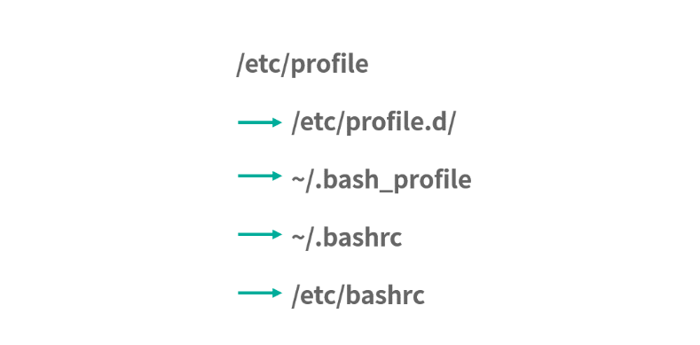

# 模块二练习题

本节会把 [模块二: Linux 指令](../../notes/module_2) 中涉及的课后练习题，逐一讲解，并给出每个课时练习题的解题思路和答案。

---
---

## 06 | 目录结构和文件管理指令: rm -rf 指令的作用

搜索文件系统中所有以包含 std 字符串且以 ```.h``` 扩展名结尾的文件。

先给出一种答案，查看全部文件需要 sudo，以管理员身份:

```shell
$ sudo find / -name "*std*.h"
```

也可以结合 grep 语句，用管道实现，比如:

```shell
$ sudo find / -name "*.h" |grep std
```

---

## 07 | 进程、重定向和管道指令: xargs 指令的作用

请问下面这段 Shell 程序的作用是什么？

```shell
mkfifo pipe1
mkfifo pipe2
echo -n run | cat - pipe1 > pipe2 &
cat < pipe2 > pipe1
```

前 2 行代码创建了两个管道文件。

从第 3 行开始，代码变得复杂。```echo -n run``` 就是向输出流中写入一个 run 字符串(不带回车，所以用 ```-n```)。通过管道，将这个结果传递给了 cat。cat 是 concatenate
的缩写，意思是把文件粘在一起。

* 当 cat 用 > 重定向输出到一个管道文件时，如果没有其他进程从管道文件中读取内容，cat会阻塞
* 当 cat 用 < 读取一个管道内容时，如果管道中没有输入，也会阻塞

从这个角度来看，总共有 3 次重定向:

* 将 - 也就是输入流的内容和 pipe1 内容合并重定向到 pipe2
* 将 pipe2 内容重定向到 cat
* 将 cat 的内容重定向到 pipe1

仔细观察下路径: ```pipe1->pipe2->pipe1```，构成了一个循环。这样导致管道 pipe1 管道 pipe2 中总是有数据(没有数据的时间太短)。于是，就构成了一个无限循环。执行这个程序后，可以用 htop 查看当前的
CPU 使用情况，会发现 CPU 占用率很高。

---

## 08 | 用户和权限管理指令: 请简述 Linux 权限划分的原则

如果一个目录是只读权限，那么这个目录下面的文件还可写吗？

这类问题，一定要去尝试，观察现象再得到结果。

```shell
$ mkdir demo
$ touch demo/d.txt
$ echo "demo" >> demo/d.txt
$ ls
demo
$ chmod -r demo
$ ls demo/
ls: cannot open directory 'demo/': Permission denied
$ cat demo/d.txt
demo
$ echo "test" >> demo/d.txt
$ cat demo/d.txt
demo
test
```

可以看到，demo 目录不可读了，下面的 ```demo/d.txt``` 文件还可以写。即便它不可写了，下面的 ```demo/d.txt``` 文件还是可以写。

---

## 09 | Linux 中的网络指令: 如何查看一个域名的 NS 记录

如何查看正在 TIME_WAIT 状态的连接数量？

注意，netstat 会有两行表头，这两行可以用 tail 过滤掉，下面 ```tail -n +3``` 就是告诉你 tail 从第 3 行开始显示。```-a``` 代表显示所有的 socket。

```shell
$ netstat -a | tail -n +3 | wc -l
1523
```

---

## 10 | 软件的安装: 编译安装和包管理器安装有什么优势和劣势

如果你在编译安装 MySQL 时，发现找不到 libcrypt.so ，应该如何处理？

遇到这类问题，首先应该去查资料。 比如查 StackOverflow，搜索关键词: libcrypt.so not found，或者带上自己的操作系统 ubuntu。

给出一个参考答案，[https://stackoverflow.com/questions/13811889/cannot-find-libcrypto-in-ubuntu](https://stackoverflow.com/questions/13811889/cannot-find-libcrypto-in-ubuntu)

---

## 11 | 高级技巧之日志分析: 利用 Linux 指令分析 Web 日志

根据今天的 access_log 分析出有哪些终端访问了这个网站，并给出分组统计结果。

access_log 中有 Debian 和 Ubuntu 等等。可以利用下面的指令看到，第 12 列是终端，如下所示:

```shell
$ cat access.log | awk '{print $12}' | head -n 5
"Debian
"Debian
"Debian
"Debian
"Debian
```

还可以使用 sort 和 uniq 查看有哪些终端，如下所示:

```shell
$ cat access.log | awk '{print $12}' | sort | uniq | head -n 10
"-"
"ansible-httpget"
"Apache-HttpClient/4.3.5
"apt-cacher/1.6.12
"apt-cacher/1.7.6
"Axel
"Chef
"curl/7.19.7
"curl/7.22.0
"curl/7.29.0"
```

最后需要写一个 [脚本](../../images/module_2/terminal.sh) ，进行统计:

```shell
#!/bin/bash
cat access.log |
  awk '{tms[$12]++;next}END{for (t in tms) print t, tms[t]}'
```

结果如下:

```shell
$ sh terminal.sh 
"Wget/1.14 11
"Java/1.8.0_25" 2
"ansible-httpget" 1
"Java/1.8.0_20" 3
"Java/1.7.0_55" 2
"Go 6
"Wget/1.13.4 438
"-" 14
"Debian 47801
"Ubuntu 46
"Mozilla/4.0 3
"dnf/0.5.4" 4
"Apache-HttpClient/4.3.5 4
"python-requests/2.2.1 4
"Axel 6
"Homebrew 1
"libwww-perl/6.05" 6
"urlgrabber/3.10.1 14
"Wget/1.11.4 2
"libwww-perl/5.836" 2
"urlgrabber/3.10 104
"ZYpp 8
"Python-urllib/2.7" 1
"curl/7.19.7 29
"apt-cacher/1.6.12 3
"Java/1.7.0_09" 3
"Java/1.7.0_65" 10
"Twitterbot/1.0" 1
"Wget/1.12 11
"curl/7.22.0 34
"Wget/1.15 74
"Java/1.7.0_51" 1
"urlgrabber/3.1.0 112
"curl/7.29.0" 2
"Java/1.7.0_71" 2
"Java/1.6.0_31" 1
"Chef 969
"apt-cacher/1.7.6 24
"Mozilla/5.0 160
"urlgrabber/3.9.1 1501
"None" 11
"Ruby" 1
"python-requests/2.0.0 30
```

根据今天的 access_log 分析出访问量 Top 前三的网页。

如果不需要 Substring 等复杂的处理，也可以使用 sort 和 uniq 的组合。如下所示:

```shell
$ cat access.log | awk '{print $7}' | sort | uniq -c
  30285 /downloads/product_1
  21104 /downloads/product_2
     73 /downloads/product_3
```

---

## 12 | 高级技巧之集群部署: 利用 Linux 指令同时在多台机器部署程序

```~/.bashrc ~/.bash_profile, ~/.profile``` 和 ```/etc/profile``` 的区别是什么？

执行一个 shell 的时候分成 login shell 和 non-login shell。顾名思义我们使用了 ```sudo su``` 切换到某个用户身份执行 shell，也就是 login shell。还有 ssh 远程执行指令也是
login shell，也就是伴随登录的意思——login shell 会触发很多文件执行，路径如下:



如果以当前用户身份正常执行一个 shell，比如说 ```./a.sh```，就是一个non-login的模式。这时候不会触发上述的完整逻辑。

另外 shell 还有另一种分法，就是 interactive 和 non-interactive。interactive 是交互式的意思，当用户打开一个终端命令行工具后，会进入一个输入命令得到结果的交互界面，这个时候，就是
interactive shell。

baserc 文件通常只在 interactive 模式下才会执行，这是因为 ```~/.bashrc``` 文件中通常有这样的语句，如下所示:

```shell
# If not running interactively, don't do anything
case $- in
    *i*) ;;
      *) return;;
esac
```

这个语句通过 ```$-``` 看到当前 shell 的执行环境，如图所示:

```shell
$ echo $-
himBHs
```

带 i 字符的就是 interactive，没有带 i 字符就不是。

因此，如果需要通过 ssh 远程 shell 执行一个文件，就不是在 interactive 模式下，bashrc 不会触发。但是因为登录的原因，login shell 都会触发，也就是说 profile 文件依然会执行。

---

## 总结

这个模块学习了 Linux 指令。虽然已经学了几十个指令，但还是沧海一粟。后续就需要多查资料，多用 man 手册了。

好的，Linux 指令部分就告一段落。下一节课，将开启操作系统核心知识学习，[模块三: 操作系统基础知识](../module_3) 。

---
---

