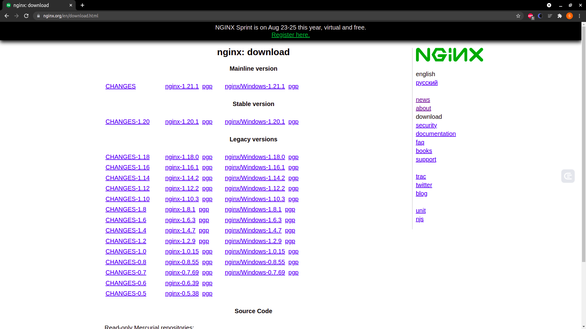

# 软件的安装: 编译安装和包管理器安装有什么优势和劣势

本节带来的题目是: 编译安装和包管理器安装有什么优势和劣势？为了搞清楚这个问题，就引出了本节的话题，在 Linux 上如何安装程序。

在 Linux 上安装程序大概有 2 种思路:

* 直接编译源代码
* 使用包管理器。

受开源运动影响，Linux 上很多软件都可以拿到源代码，这也是 Linux 能取得成功的一个重要原因。接下来先尝试用包管理器安装应用，然后再用一个实战的例子，教你如何编译安装 nginx。

---
---

## 包管理器使用

Linux 下的应用程序多数以软件包的形式发布，用户拿到对应的包之后，使用包管理器进行安装。说到包管理器，就要提到 dpkg 和 rpm。

先说说包。Linux 下两大主流的包就是 rpm 和 dpkg。

dpkg(debian package)，是 linux 一个主流的社区分支开发出来的。社区就是开源社区，有很多世界顶级的程序员会在社区贡献代码，比如 github。一般衍生于 debian 的 Linux 版本都支持 dpkg，比如
ubuntu。

rpm(redhatpackage manager)。在正式讲解之前，先来聊聊 RedHat 这家公司。

RedHat 是一个做 Linux 的公司，可以把它理解成一家"保险公司"。很多公司购买红帽的服务，是为了给自己的业务上一个保险。以防万一哪天公司内部搞不定 Linux 底层，或者底层有
Bug，再或者底层不适合当下的业务发展，需要修改等问题，红帽的工程师都可以帮企业解决。

再比如，RedHat 收购了 JBoss，把 JBoss 改名为 WildFly。像 WildFly 这种工具更多是面向企业级，比如没有大量研发团队的企业会更倾向使用成熟的技术。RedHat 公司也有自己的 Linux，就叫作
RedHat。RedHat 系比较重要的 Linux 有 RedHat/Fedora 等。

无论是 dpkg 还是 rpm 都抽象了自己的包格式，就是以 .dpkg 或者 .rpm 结尾的文件。

dpkg 和 rpm 也都提供了类似的能力:

* 查询是否已经安装了某个软件包
* 查询目前安装了什么软件包
* 给定一个软件包，进行安装
* 删除一个安装好的软件包

关于 dpkg 和 rpm 的具体用法，可以用 man 进行学习。接下来聊聊 yum 和 apt。

---

## 自动依赖管理

Linux 是一个开源生态，因此工具非常多。工具在给用户使用之前，需要先打成 dpkg 或者 rpm 包。有的时候一个包会依赖很多其他的包，而 dpkg 和 rpm
会对这种情况进行管理，有时候为了装一个包需要先装十几个依赖的包，过程非常艰辛，因此现在多数情况都在用 yum 和 apt。

---

### yum

yum 的全名是 Yellodog Updator Modified。看名字就知道它是基于 Yellodog Updator 这款软件修改而来的一个工具。yum 是 Python 开发的，提供的是 rpm 包，因此只有 redhat 系的
Linux，比如 Fedora，Centos 支持 yum。yum 的主要能力就是帮你解决下载和依赖两个问题。

下载之所以是问题，是因为 Linux 生态非常庞大，有时候用户不知道该去哪里下载一款工具。比如用户想安装 vim，只需要输入 ```sudo yum install vim``` 就可以安装了。yum 的服务器收集了很多 linux
软件，因此 yum 会帮助用户找到 vim 的包。

另一方面，yum 帮助用户解决了很多依赖，比如用户安装一个软件依赖了 10 个其他的软件，yum 会把这 11 个软件一次性的装好。

关于 yum 的具体用法，可以使用 man 工具进行学习。

---

### apt

接下来重点说说 apt，然后一起尝试使用。

apt 全名是 Advanced Packaging Tools，是一个 debian 及其衍生 Linux 系统下的包管理器。由于 advanced(先进)是相对于 dpkg 而言的，因此它也能够提供和 yum
类似的下载和依赖管理能力。比如在没有 vim 的机器上，可以用下面的指令安装 vim。

```shell
$ sudo apt install vim
Reading package lists... Done
Building dependency tree       
Reading state information... Done
vim is already the newest version (2:8.1.2269-1ubuntu5).
vim set to manually installed.
0 upgraded, 0 newly installed, 0 to remove and 0 not upgraded.
```

然后用 dpkg 指令查看 vim 的状态是 ii。第一个 i 代表期望状态是已安装，第二个 i 代表实际状态是已安装。

```shell
$ dpkg -l vim
Desired=Unknown/Install/Remove/Purge/Hold
| Status=Not/Inst/Conf-files/Unpacked/halF-conf/Half-inst/trig-aWait/Trig-pend
|/ Err?=(none)/Reinst-required (Status,Err: uppercase=bad)
||/ Name           Version             Architecture Description
+++-==============-===================-============-=================================
ii  vim            2:8.1.2269-1ubuntu5 amd64        Vi IMproved - enhanced vi editor
```

下面卸载 vim，再通过 dpkg 查看:

```shell
$ sudo apt remove vim
Reading package lists... Done
Building dependency tree       
Reading state information... Done
The following packages were automatically installed and are no longer required:
  alsa-topology-conf alsa-ucm-conf libasound2 libasound2-data libcanberra0 libltdl7 libogg0
  libpython3.8 libtdb1 libvorbis0a libvorbisfile3 sound-theme-freedesktop vim-runtime
Use 'sudo apt autoremove' to remove them.
The following packages will be REMOVED:
  ubuntu-server vim
0 upgraded, 0 newly installed, 2 to remove and 0 not upgraded.
After this operation, 3163 kB disk space will be freed.
Do you want to continue? [Y/n] 
(Reading database ... 63542 files and directories currently installed.)
Removing ubuntu-server (1.450.2) ...
Removing vim (2:8.1.2269-1ubuntu5) ...
update-alternatives: using /usr/bin/vim.tiny to provide /usr/bin/vi (vi) in auto mode
update-alternatives: using /usr/bin/vim.tiny to provide /usr/bin/view (view) in auto mode
update-alternatives: using /usr/bin/vim.tiny to provide /usr/bin/ex (ex) in auto mode
update-alternatives: using /usr/bin/vim.tiny to provide /usr/bin/rview (rview) in auto mode
```

```shell
$ dpkg -l vim
Desired=Unknown/Install/Remove/Purge/Hold
| Status=Not/Inst/Conf-files/Unpacked/halF-conf/Half-inst/trig-aWait/Trig-pend
|/ Err?=(none)/Reinst-required (Status,Err: uppercase=bad)
||/ Name           Version             Architecture Description
+++-==============-===================-============-=================================
rc  vim            2:8.1.2269-1ubuntu5 amd64        Vi IMproved - enhanced vi editor
```

可以看到 vim 的状态从 ii 变成了 rc，r 是期望删除，c 是实际上还有配置文件遗留。如果想彻底删除配置文件，可以使用 ```apt purge```，就是彻底清除的意思:

```shell
$ sudo apt purge vim
Reading package lists... Done
Building dependency tree       
Reading state information... Done
The following packages were automatically installed and are no longer required:
  alsa-topology-conf alsa-ucm-conf libasound2 libasound2-data libcanberra0 libltdl7 libogg0
  libpython3.8 libtdb1 libvorbis0a libvorbisfile3 sound-theme-freedesktop vim-runtime
Use 'sudo apt autoremove' to remove them.
The following packages will be REMOVED:
  vim*
0 upgraded, 0 newly installed, 1 to remove and 0 not upgraded.
After this operation, 0 B of additional disk space will be used.
Do you want to continue? [Y/n] 
(Reading database ... 63530 files and directories currently installed.)
Purging configuration files for vim (2:8.1.2269-1ubuntu5) ...
```

再使用 ```dpkg -l``` 时，vim 已经清除了。

```shell
$ dpkg -l vim
Desired=Unknown/Install/Remove/Purge/Hold
| Status=Not/Inst/Conf-files/Unpacked/halF-conf/Half-inst/trig-aWait/Trig-pend
|/ Err?=(none)/Reinst-required (Status,Err: uppercase=bad)
||/ Name           Version      Architecture Description
+++-==============-============-============-=================================
un  vim            <none>       <none>       (no description available)
```

期待结果是 u 就是 unkonw(未知) 说明已经没有了。实际结果是 n，就是 not-installed(未安装)。

如果想查询 mysql 相关的包，可以使用 ```apt serach mysql```，这样会看到很多和 mysql 相关的包:

```shell
$ apt search mysql
Sorting... Done
Full Text Search... Done
akonadi-backend-mysql/focal 4:19.12.3-0ubuntu2 all
  MySQL storage backend for Akonadi

apophenia-bin/focal 1.0+ds-8 amd64
  Apophenia Statistical C Library -- binary package

apophenia-doc/focal 1.0+ds-8 all
  Apophenia Statistical C Library -- reference manual

asterisk-mysql/focal 1:16.2.1~dfsg-2ubuntu1 amd64
  MySQL database protocol support for the Asterisk PBX
//...
```

如果想精确查找一个叫作 mysql-server 的包，可以用 ```apt list```。

```shell
$ apt list mysql-server
Listing... Done
mysql-server/focal-updates,focal-security 8.0.25-0ubuntu0.20.04.1 all
N: There is 1 additional version. Please use the '-a' switch to see it
```

这里我们找到了 mysql-server 包。

另外有时候国内的 apt 服务器速度比较慢，可以尝试使用阿里云的镜像服务器。具体可参考下面的操作:

```shell
cat /etc/apt/sources.list
--以下是文件内容--
deb http://mirrors.aliyun.com/ubuntu/ focal main restricted universe multiverse
deb http://mirrors.aliyun.com/ubuntu/ focal-security main restricted universe multiverse
deb http://mirrors.aliyun.com/ubuntu/ focal-updates main restricted universe multiverse
deb http://mirrors.aliyun.com/ubuntu/ focal-proposed main restricted universe multiverse
deb http://mirrors.aliyun.com/ubuntu/ focal-backports main restricted universe multiverse
deb-src http://mirrors.aliyun.com/ubuntu/ focal main restricted universe multiverse
deb-src http://mirrors.aliyun.com/ubuntu/ focal-security main restricted universe multiverse
deb-src http://mirrors.aliyun.com/ubuntu/ focal-updates main restricted universe multiverse
deb-src http://mirrors.aliyun.com/ubuntu/ focal-proposed main restricted universe multiverse
deb-src http://mirrors.aliyun.com/ubuntu/ focal-backports main restricted universe multiverse
```

镜像地址可以通过 ```/etc/apt/sources.list``` 配置，注意 focal 是我 ubuntu 版本，可以使用 ```sudo lsb_release``` 查看自己的 Ubuntu
版本。如果想用上面给出的内容覆盖你的 sources.list，只需把版本号改成你自己的。注意，每个 ubuntu 版本都有自己的代号。

```shell
$ sudo lsb_release -a
No LSB modules are available.
Distributor ID:	Ubuntu
Description:	Ubuntu 20.04.2 LTS
Release:	20.04
Codename:	focal
```

通过上面的学习，相信你已经逐渐了解了包管理器的基本概念和使用。如果你是 centos 或者 fedora，需要 man 一下 yum。

---

## 编译安装 Nginx

接下来开始编译安装 Nginx(发音是 engine X)，是一个家喻户晓的 Web 服务器。它的发明者是俄罗斯的伊戈尔·赛索耶夫。赛索耶夫 2002 年开始写
Nginx，主要目的是解决同一个互联网节点同时进入大量并发请求的问题。注意，大量并发请求不是大量 QPS 的意思，QPS 是吞吐量大，需要快速响应，而高并发时则需要合理安排任务调度。

后来塞索耶夫成立了 Nginx 公司，2018 年估值到达到 4.3 亿美金。现在基本上国内大厂的 Web 服务器都是基于
Nginx，只不过进行了特殊的修改，比如淘宝用 [Tengine](https://github.com/alibaba/tengine) 。

下面来看看源码安装，在 Linux 上获取 nginx 源码，可以去搜索 Nginx 官方网站，一般都会提供源码包。



可以看到 nginx-1.20.0 的网址是: [https://nginx.org/download/nginx-1.20.1.tar.gz](https://nginx.org/download/nginx-1.20.1.tar.gz)
。然后用 wget 去下载这个包。

---

### 第一步: 下载源码

使用 wget 下载 nginx 源码包

```shell
$ wget https://nginx.org/download/nginx-1.20.1.tar.gz
--2021-07-26 16:57:32--  https://nginx.org/download/nginx-1.20.1.tar.gz
Resolving nginx.org (nginx.org)... 52.58.199.22, 3.125.197.172, 2a05:d014:edb:5702::6, ...
Connecting to nginx.org (nginx.org)|52.58.199.22|:443... connected.
HTTP request sent, awaiting response... 200 OK
Length: 1061461 (1.0M) [application/octet-stream]
Saving to: ‘nginx-1.20.1.tar.gz’

nginx-1.20.1.tar.gz         100%[========================================>]   1.01M   708KB/s    in 1.5s    

2021-07-26 16:57:35 (708 KB/s) - ‘nginx-1.20.1.tar.gz’ saved [1061461/1061461]

```

---

### 第二步: 解压

解压下载好的 nginx 源码包

```shell
$ ls
nginx-1.20.1.tar.gz
$ tar -xzvf nginx-1.20.1.tar.gz 
nginx-1.20.1/
nginx-1.20.1/auto/
nginx-1.20.1/conf/
nginx-1.20.1/contrib/
nginx-1.20.1/src/
nginx-1.20.1/configure
nginx-1.20.1/LICENSE
nginx-1.20.1/README
nginx-1.20.1/html/
nginx-1.20.1/man/
//...
```

用 ls 发现包已经存在了，然后使用 tar 命令解压。

tar 是用来打包和解压用的。之所以叫作 tar 是有一些历史原因: t 代表 tape(磁带)；ar 是 archive(档案)。因为早期的存储介质很小，人们习惯把文件打包然后存储到磁带上，那时候 unix 用的命令就是 tar。因为
linux 是个开源生态，所以就沿袭下来继续使用 tar。

```-x``` 代表 extract(提取)。```-z``` 代表 gzip，也就是解压 gz 类型的文件。```-v``` 代表 verbose(显示细节)，如果你不输入 ```-v```，就不会打印解压过程了。```-f``` 代表
file，这里指的是要操作文件，而不是磁带。 所以 tar 解压通常带有 x 和 f，打包通常是 c 就是 create 的意思。

---

### 第三步: 配置和解决依赖

解压完，进入 nginx 的目录

```shell
$ ls
nginx-1.20.1  nginx-1.20.1.tar.gz
$ cd nginx-1.20.1/
$ ls
CHANGES  CHANGES.ru  LICENSE  README  auto  conf  configure  contrib  html  man  src
```

可以看到一个叫作 configure 的文件是绿色的，也就是可执行文件。然后执行 configure 文件进行配置，这个配置文件来自一款叫作 autoconf 的工具，也是 GNU 项目下的，说白了就是 bash(BourneShell)
下的安装打包工具(就是个安装程序)。这个安装程序支持很多配置，可以用 ```./configure --help``` 看到所有的配置项:

```shell
$ ./configure --help | head -n 10

  --help                             print this message

  --prefix=PATH                      set installation prefix
  --sbin-path=PATH                   set nginx binary pathname
  --modules-path=PATH                set modules path
  --conf-path=PATH                   set nginx.conf pathname
  --error-log-path=PATH              set error log pathname
  --pid-path=PATH                    set nginx.pid pathname
  --lock-path=PATH                   set nginx.lock pathname
```

这里有几个非常重要的配置项，叫作 prefix。prefix 配置项决定了软件的安装目录。如果不配置这个配置项，就会使用默认的安装目录。sbin-path 决定了 nginx 的可执行文件的位置。conf-path 决定了 nginx
配置文件的位置。使用默认，然后执行 ```./configure```:

```shell
$ ./configure 
checking for OS
 + Linux 5.4.0-80-generic x86_64
checking for C compiler ... not found

./configure: error: C compiler cc is not found

```

autoconf 进行依赖检查的时候，报了一个错误，cc 没有找到。这是因为机器上没有安装 gcc 工具，gcc 是家喻户晓的工具套件，全名是 GNU Compiler Collection ——里面涵盖了包括 C/C++
在内的多门语言的编译器。

使用包管理器，安装 gcc。安装 gcc 通常是安装 build-essential 这个包。

```shell
$ sudo apt install build-essential 
Reading package lists... Done
Building dependency tree       
Reading state information... Done
The following additional packages will be installed:
  g++ g++-9 libstdc++-9-dev
Suggested packages:
  g++-multilib g++-9-multilib gcc-9-doc libstdc++-9-doc
The following NEW packages will be installed:
  build-essential g++ g++-9 libstdc++-9-dev
0 upgraded, 4 newly installed, 0 to remove and 0 not upgraded.
Need to get 10.1 MB of archives.
After this operation, 46.8 MB of additional disk space will be used.
Do you want to continue? [Y/n] 
//...
```

安装完成之后，再执行 ```./configure```:

```shell
$ ./configure 
checking for OS
 + Linux 5.4.0-80-generic x86_64
checking for C compiler ... found
 + using GNU C compiler
 + gcc version: 9.3.0 (Ubuntu 9.3.0-17ubuntu1~20.04) 
checking for gcc -pipe switch ... found
checking for -Wl,-E switch ... found
checking for gcc builtin atomic operations ... found
checking for C99 variadic macros ... found
checking for gcc variadic macros ... found
checking for gcc builtin 64 bit byteswap ... found
checking for unistd.h ... found
checking for inttypes.h ... found
checking for limits.h ... found
checking for sys/filio.h ... not found
checking for sys/param.h ... found
//...
```

看到配置程序开始执行。但是最终报了一个错误，如下图所示:

```shell
//...

./configure: error: the HTTP rewrite module requires the PCRE library.
You can either disable the module by using --without-http_rewrite_module
option, or install the PCRE library into the system, or build the PCRE library
statically from the source with nginx by using --with-pcre=<path> option.

```

报错的内容是，nginx 的 HTTP rewrite 模块，需要 PCRE 库。PCRE 是 perl 语言的兼容正则表达式库。perl 语言一直以支持原生正则表达式，而受到广大编程爱好者的喜爱。接下来，开始安装 PCRE。

一般这种依赖库，会叫 pcre-dev 或者 libpcre。用 apt 查询了一下，然后 grep。

```shell
$ apt search pcre | grep libpcre

WARNING: apt does not have a stable CLI interface. Use with caution in scripts.

  GNU CLISP module that adds libpcre support
libpcre++-dev/focal 0.9.5-6.1build1 amd64
libpcre++0v5/focal 0.9.5-6.1build1 amd64
libpcre-ocaml/focal 7.4.3-1 amd64
libpcre-ocaml-dev/focal 7.4.3-1 amd64
libpcre16-3/focal 2:8.39-12build1 amd64
libpcre2-16-0/focal 10.34-7 amd64
libpcre2-32-0/focal 10.34-7 amd64
libpcre2-8-0/focal,now 10.34-7 amd64 [installed,automatic]
libpcre2-dev/focal 10.34-7 amd64
libpcre2-posix2/focal 10.34-7 amd64
libpcre3/focal,now 2:8.39-12build1 amd64 [installed,automatic]
libpcre3-dbg/focal 2:8.39-12build1 amd64
libpcre3-dev/focal 2:8.39-12build1 amd64
libpcre32-3/focal 2:8.39-12build1 amd64
libpcrecpp0v5/focal 2:8.39-12build1 amd64
```

可以看到有 pcre2 也有 pcre3。这个时候可以考虑试试 pcre3。

```shell
$ sudo apt install libpcre3 libpcre3-dev
Reading package lists... Done
Building dependency tree       
Reading state information... Done
libpcre3 is already the newest version (2:8.39-12build1).
libpcre3 set to manually installed.
The following additional packages will be installed:
  libpcre16-3 libpcre32-3 libpcrecpp0v5
The following NEW packages will be installed:
  libpcre16-3 libpcre3-dev libpcre32-3 libpcrecpp0v5
0 upgraded, 4 newly installed, 0 to remove and 0 not upgraded.
Need to get 846 kB of archives.
After this operation, 3586 kB of additional disk space will be used.
Do you want to continue? [Y/n] 
//...
```

安装完成之后再试试 ```./configure```，提示还需要 zlib。然后用类似的方法解决 zlib 依赖。

```shell
$ ./configure
//...

./configure: error: the HTTP gzip module requires the zlib library.
You can either disable the module by using --without-http_gzip_module
option, or install the zlib library into the system, or build the zlib library
statically from the source with nginx by using --with-zlib=<path> option.

```

zlib 包的名字叫 zlib1g 不太好找，需要查资料才能确定是这个名字。

```shell
$ sudo apt install zlib1g-dev
Reading package lists... Done
Building dependency tree       
Reading state information... Done
The following NEW packages will be installed:
  zlib1g-dev
0 upgraded, 1 newly installed, 0 to remove and 0 not upgraded.
Need to get 155 kB of archives.
After this operation, 605 kB of additional disk space will be used.
//...
```

再尝试配置，终于配置成功了。

```shell
$ ./configure
//...

Configuration summary
  + using system PCRE library
  + OpenSSL library is not used
  + using system zlib library

  nginx path prefix: "/usr/local/nginx"
  nginx binary file: "/usr/local/nginx/sbin/nginx"
  nginx modules path: "/usr/local/nginx/modules"
  nginx configuration prefix: "/usr/local/nginx/conf"
  nginx configuration file: "/usr/local/nginx/conf/nginx.conf"
  nginx pid file: "/usr/local/nginx/logs/nginx.pid"
  nginx error log file: "/usr/local/nginx/logs/error.log"
  nginx http access log file: "/usr/local/nginx/logs/access.log"
  nginx http client request body temporary files: "client_body_temp"
  nginx http proxy temporary files: "proxy_temp"
  nginx http fastcgi temporary files: "fastcgi_temp"
  nginx http uwsgi temporary files: "uwsgi_temp"
  nginx http scgi temporary files: "scgi_temp"

```

---

### 第四步: 编译和安装

通常配置完之后，输入 ```make && sudo make install``` 进行编译和安装。make 是 linux 下面一个强大的构建工具。autoconf 也就是 ```./configure``` 会在当前目录下生成一个
MakeFile 文件。make 会根据 MakeFile 文件编译整个项目。编译完成后，能够形成和当前操作系统以及 CPU 指令集兼容的二进制可执行文件。然后再用 ```make install```安装。&& 符号代表执行完 make
再去执行 ```make installl```。

```shell
$ make && sudo make install
make -f objs/Makefile
make[1]: Entering directory '/home/ubuntu/nginx-1.20.1'
cc -c -pipe  -O -W -Wall -Wpointer-arith -Wno-unused-parameter -Werror -g  -I src/core -I src/event -I src/event/modules -I src/os/unix -I objs \
	-o objs/src/core/nginx.o \
	src/core/nginx.c
cc -c -pipe  -O -W -Wall -Wpointer-arith -Wno-unused-parameter -Werror -g  -I src/core -I src/event -I src/event/modules -I src/os/unix -I objs \
	-o objs/src/core/ngx_log.o \
	src/core/ngx_log.c
cc -c -pipe  -O -W -Wall -Wpointer-arith -Wno-unused-parameter -Werror -g  -I src/core -I src/event -I src/event/modules -I src/os/unix -I objs \
	-o objs/src/core/ngx_palloc.o \
	src/core/ngx_palloc.c
//...
```

可以看到编译是个非常慢的活。等待了差不多 1 分钟，终于结束了。nginx 被安装到了 ```/usr/local/nginx``` 中，如果需要让 nginx 全局执行，可以设置一个软连接到 ```/usr/local/bin```
，具体如下:

```shell
$ sudo ln -sf /usr/local/nginx/sbin/nginx /usr/local/sbin/nginx
```

---

## 为什么会有编译安装

原来使用 C/C++ 写的程序存在一个交叉编译的问题。就是写一次程序，在很多个平台执行。而不同指令集的 CPU 指令，还有操作系统的可执行文件格式是不同的。因此，这里有非常多的现实问题需要解决。一般是由操作系统的提供方，比如 RedHat
来牵头解决这些问题。也可以用 apt 等工具提供给用户已经编译好的包。apt 会自动根据用户的平台类型选择不同的包。

但如果某个包没有在平台侧注册，也没有提供某个 Linux 平台的软件包，就需要回退到编译安装，通过源代码直接在某个平台安装。

---

## 总结

这节课学习了在 Linux 上安装软件，简要介绍了 dpkg 和 rpm，然后介绍了能够解决依赖和帮助用户下载的 yum 和 apt。重点使用了 apt，在这个过程中看到了强大的包管理机制，今天的 maven、npm、pip
都继承了这样一个特性。最后还尝试了一件事情，就是编译安装 nginx。

那么通过这节课的学习，回到本节关联的面试题目: 编译安装和包管理安装有什么优势和劣势了吗？

包管理安装很方便，但是有两点劣势。

* 第一点是需要提前将包编译好，因此有一个发布的过程，如果某个包没有发布版本，或者在某个平台上找不到对应的发布版本，就需要编译安装
* 第二点就是如果一个软件的定制程度很高，可能会在编译阶段传入参数，比如利用 configure 传入配置参数，这种时候就需要编译安装

---

## 思考题

最后再给出一道思考题: 如果在编译安装 MySQL 时，发现找不到 libcrypt.so，应该如何处理？

---
---

