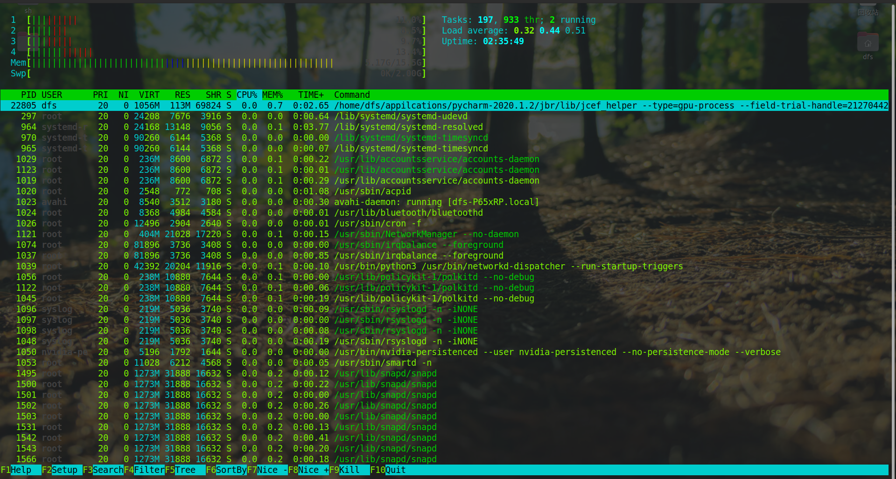

# 高级技巧之日志分析: 利用 Linux 指令分析 Web 日志

著名的黑客、自由软件运动的先驱理查德.斯托曼说过，"编程不是科学，编程是手艺"。可见，要想真正搞好编程，除了学习理论知识，还需要在实际的工作场景中进行反复的锤炼。

所以本节将结合实际的工作场景，利用 Linux 指令分析 Web 日志，本课时将用到一个大概有 5W 多条记录的 nginx [日志文件](../../images/module_2/access.log) 。

---
---

## 第一步: 能不能这样做

当想要分析一个线上文件的时候，首先要思考，能不能这样做？这里可以先用 htop 指令看一下当前的负载。



如上图所示，机器上 4 个 CPU 负载，16G 的内存不少富余。可以 wget 将目标文件下载到本地。

然后用 ls 查看文件大小。发现这只是一个 7M 的文件，因此对线上的影响可以忽略不计。如果文件太大，建议使用 scp 指令将文件拷贝到闲置服务器再分析。下面使用了 ```--block-size=M```让 ls 以 M
为单位显示文件大小。

```shell
$ ls -l access.log --block-size=M
-rw-rw-r-- 1 dfs dfs 7M 10月  9  2020 access.log
```

确定了当前机器的 CPU 和内存允许分析后，就可以开始第二步操作了。

---

## 第二步: LESS 日志文件

之前说过，尽量使用 less 这种不需要读取全部文件的指令，因为在线上执行 cat 是一件非常危险的事情，这可能导致线上服务器资源不足。

```shell
93.180.71.3 - - [17/May/2015:08:05:32 +0000] "GET /downloads/product_1 HTTP/1.1" 304 0 "-" "Debian APT-HTTP/1.3 (0.8.16~exp12ubuntu10.21)"
93.180.71.3 - - [17/May/2015:08:05:23 +0000] "GET /downloads/product_1 HTTP/1.1" 304 0 "-" "Debian APT-HTTP/1.3 (0.8.16~exp12ubuntu10.21)"
80.91.33.133 - - [17/May/2015:08:05:24 +0000] "GET /downloads/product_1 HTTP/1.1" 304 0 "-" "Debian APT-HTTP/1.3 (0.8.16~exp12ubuntu10.17)"
217.168.17.5 - - [17/May/2015:08:05:34 +0000] "GET /downloads/product_1 HTTP/1.1" 200 490 "-" "Debian APT-HTTP/1.3 (0.8.10.3)"
217.168.17.5 - - [17/May/2015:08:05:09 +0000] "GET /downloads/product_2 HTTP/1.1" 200 490 "-" "Debian APT-HTTP/1.3 (0.8.10.3)"
93.180.71.3 - - [17/May/2015:08:05:57 +0000] "GET /downloads/product_1 HTTP/1.1" 304 0 "-" "Debian APT-HTTP/1.3 (0.8.16~exp12ubuntu10.21)"
217.168.17.5 - - [17/May/2015:08:05:02 +0000] "GET /downloads/product_2 HTTP/1.1" 404 337 "-" "Debian APT-HTTP/1.3 (0.8.10.3)"
217.168.17.5 - - [17/May/2015:08:05:42 +0000] "GET /downloads/product_1 HTTP/1.1" 404 332 "-" "Debian APT-HTTP/1.3 (0.8.10.3)"
80.91.33.133 - - [17/May/2015:08:05:01 +0000] "GET /downloads/product_1 HTTP/1.1" 304 0 "-" "Debian APT-HTTP/1.3 (0.8.16~exp12ubuntu10.17)"
93.180.71.3 - - [17/May/2015:08:05:27 +0000] "GET /downloads/product_1 HTTP/1.1" 304 0 "-" "Debian APT-HTTP/1.3 (0.8.16~exp12ubuntu10.21)"
217.168.17.5 - - [17/May/2015:08:05:12 +0000] "GET /downloads/product_2 HTTP/1.1" 200 3316 "-" "-"
188.138.60.101 - - [17/May/2015:08:05:49 +0000] "GET /downloads/product_2 HTTP/1.1" 304 0 "-" "Debian APT-HTTP/1.3 (0.9.7.9)"
80.91.33.133 - - [17/May/2015:08:05:14 +0000] "GET /downloads/product_1 HTTP/1.1" 304 0 "-" "Debian APT-HTTP/1.3 (0.8.16~exp12ubuntu10.16)"
46.4.66.76 - - [17/May/2015:08:05:45 +0000] "GET /downloads/product_1 HTTP/1.1" 404 318 "-" "Debian APT-HTTP/1.3 (1.0.1ubuntu2)"
93.180.71.3 - - [17/May/2015:08:05:26 +0000] "GET /downloads/product_1 HTTP/1.1" 404 324 "-" "Debian APT-HTTP/1.3 (0.8.16~exp12ubuntu10.21)"
91.234.194.89 - - [17/May/2015:08:05:22 +0000] "GET /downloads/product_2 HTTP/1.1" 304 0 "-" "Debian APT-HTTP/1.3 (0.9.7.9)"
80.91.33.133 - - [17/May/2015:08:05:07 +0000] "GET /downloads/product_1 HTTP/1.1" 304 0 "-" "Debian APT-HTTP/1.3 (0.8.16~exp12
//...
```

如上所示，nginx 的 access_log 每一行都是一次用户的访问，从左到右依次是:

* IP 地址
* 时间
* HTTP 请求的方法、路径和协议版本、返回的状态码
* User Agent

---

## 第三步: PV 分析

PV(Page View)，用户每访问一个页面就是一次 Page View。对于 nginx 的 acess_log 来说，分析 PV 非常简单，直接使用 ```wc -l``` 就可以看到整体的 PV。

```shell
$ wc -l access.log 
51462 access.log
```

如上所示: 一共有 51462 条 PV。

---

## 第四步: PV 分组

通常一个日志中可能有几天的 PV，为了得到更加直观的数据，有时候需要按天进行分组。为了简化这个问题，先来看看日志中都有哪些天的日志。

使用 ```awk '{print $4}' access.log | less``` 可以看到如下结果。awk 是一个处理文本的领域专有语言。这里就牵扯到领域专有语言这个概念，英文是 Domain Specific
Language。领域专有语言，就是为了处理某个领域专门设计的语言。比如 awk 是用来分析处理文本的 DSL，html 是专门用来描述网页的 DSL，SQL是专门用来查询数据的 DSL。还可以根据自己的业务设计某种针对业务的DSL。

可以看到我们用 ```$4``` 代表文本的第 4 列，也就是时间所在的这一列，如下所示:

```shell
[17/May/2015:08:05:32
[17/May/2015:08:05:23
[17/May/2015:08:05:24
[17/May/2015:08:05:34
[17/May/2015:08:05:09
[17/May/2015:08:05:57
[17/May/2015:08:05:02
[17/May/2015:08:05:42
[17/May/2015:08:05:01
[17/May/2015:08:05:27
[17/May/2015:08:05:12
```

若想要按天统计，可以利用 awk 提供的字符串截取的能力。

```shell
$ awk '{print substr($4,2,11)}' access.log | head -n 10
17/May/2015
17/May/2015
17/May/2015
17/May/2015
17/May/2015
17/May/2015
17/May/2015
17/May/2015
17/May/2015
17/May/2015
```

上面使用 awk 的 substr 函数，数字 2 代表从第 2 个字符开始，数字 11 代表截取 11 个字符。

接下来就可以分组统计每天的日志条数了。

```shell
$ awk '{print substr($4,2,11)}' access.log | sort | uniq -c
   2837 01/Jun/2015
   2864 02/Jun/2015
   2825 03/Jun/2015
    896 04/Jun/2015
   1966 17/May/2015
   2855 18/May/2015
   2831 19/May/2015
   2851 20/May/2015
   2881 21/May/2015
   2879 22/May/2015
   2892 23/May/2015
   2853 24/May/2015
   2839 25/May/2015
   2879 26/May/2015
   2887 27/May/2015
   2852 28/May/2015
   2836 29/May/2015
   2876 30/May/2015
   2863 31/May/2015
```

上面使用 sort 进行排序，然后使用 ```uniq -c``` 进行统计。可以看到从 2015 年 5 月 17 号一直到 6 月 4 号的日志，还可以看到每天的 PV 量大概是在 2000~3000 之间。

---

## 第五步: 分析 UV

接下来分析 UV。UV(Uniq Visitor)，也就是统计访问人数。通常确定用户的身份是一个复杂的事情，但是可以用 IP 访问来近似统计 UV。

```shell
$ awk '{print $1}' access.log | sort | uniq | wc -l
2660
```

上面使用 awk 去打印 ```$1``` 也就是第一列，接着 sort 排序，然后用 uniq 去重，最后用 ```wc -l``` 查看条数。这样就知道日志文件中一共有 2660 个 IP，也就是 2660 个 UV。

---

## 第六步: 分组分析 UV

接下来尝试按天分组分析每天的 UV 情况。这个情况比较复杂，需要较多的指令，先创建一个叫作 [sum.sh](../../images/module_2/sum.sh) 的 bash 脚本文件，写入如下内容:

```shell
#!/usr/bin/bash
awk '{print substr($4, 2, 11) " " $1}' access.log |
  sort | uniq |
  awk '{uv[$1]++;next}END{for (ip in uv) print ip, uv[ip]}'
```

具体分析如下。

* 文件首部使用 ```#!```，表示我们将使用后面的 ```/usr/bin/bash``` 执行这个文件
* 第一次 awk 将第 4 列的日期和第 1 列的 ip 地址拼接在一起
* 下面的 sort 是把整个文件进行一次字典序排序，相当于先根据日期排序，再根据 IP 排序
* 接下来用 uniq 去重，日期 + IP 相同的行就只保留一个
* 最后的 awk 再根据第 1 列的时间和第 2 列的 IP 进行统计

为了理解最后这一行描述，先来简单了解下awk的原理。

awk 本身是逐行进行处理的。因此 next 关键字是提醒 awk 跳转到下一行输入。对每一行输入，awk 会根据第 1 列的字符串(也就是日期)进行累加。之后的 END 关键字代表一个触发器，就是 END 后面用 {}
括起来的语句会在所有输入都处理完之后执行——当所有输入都执行完，结果被累加到 uv 中后，通过 foreach 遍历 uv 中所有的 key，去打印 ip 和 ip 对应的数量。

编写完上面的脚本之后，保存退出编辑器。接着执行 ```chmod +x sum.sh```，给 sum.sh 增加执行权限。

```shell
$ chmod +x sum.sh
$ ./sum.sh 
22/May/2015 254
26/May/2015 218
03/Jun/2015 263
17/May/2015 118
01/Jun/2015 238
04/Jun/2015 101
28/May/2015 239
29/May/2015 247
30/May/2015 260
27/May/2015 288
24/May/2015 262
02/Jun/2015 230
25/May/2015 283
23/May/2015 259
20/May/2015 289
19/May/2015 276
21/May/2015 280
18/May/2015 252
31/May/2015 267
```

如上所示，IP 地址已经按天进行统计好了。

---

## 总结

本节结合一个简单的实战场景——Web 日志分析与统计练习了之前学过的指令，提高熟练程度。此外，还一起学习了新知识——功能强大的 awk 文本处理语言。在实战中，对一个 nginx 的 access_log
进行了简单的数据分析，直观地获得了这个网站的访问情况。

在日常的工作中会遇到各种各样的日志，除了 nginx 的日志，还有应用日志、前端日志、监控日志等等。都可以利用本节学习的方法，去做数据分析，然后从中得出结论。

---

## 思考题

最后给出 2 个思考题:

* 根据本节的 access_log 分析出有哪些终端访问了这个网站，并给出分组统计结果
* 根据本节的 access_log 分析出访问量 Top 前三的网页

---
---

