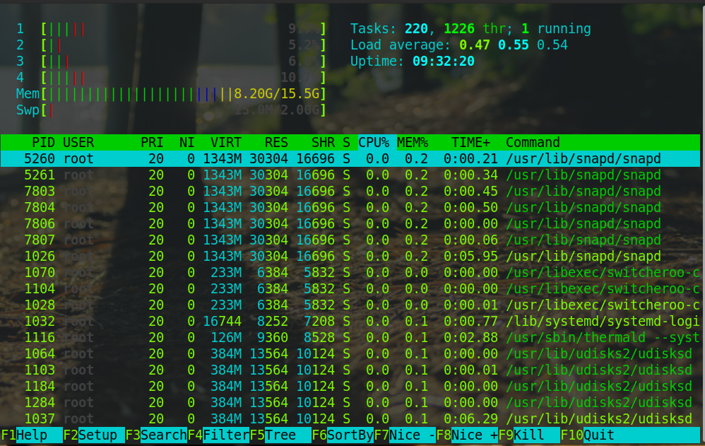

# 进程、重定向和管道指令: xargs 指令的作用

本节先带来一道题目: xargs 指令的作用是什么？

通常这个指令是和管道一起使用，因此就引出了这节课的主题: 管道。为了理解管道，和学习管道相关的内容，还有一些概念需要理解，比如: 进程、标准流和重定向。

---
---

## 进程

为了弄清楚这节课程的内容，也就是管道，先来讨论一下进程。

应用的可执行文件是放在文件系统里，把可执行文件启动，就会在操作系统里(具体来说是内存中)形成一个应用的副本，这个副本就是进程。

进程是应用的执行副本；而不要回答进程是操作系统分配资源的最小单位。前者是定义，后者是作用

如果想要看当前的进程，可以用 ps 指令。p 代表 processes，也就是进程；s 代表 snapshot，也就是快照。所谓快照，就是像拍照一样。

```shell
$ ps
    PID TTY          TIME CMD
  70373 pts/0    00:00:00 bash
  70405 pts/0    00:00:00 ps
```

如所示，启动了两个进程，ps 和 bash。ps 就是刚刚启动的，被 ps 自己捕捉到了；bash 是因为开了这个控制台，执行的 shell 是 bash。

当然操作系统也不可能只有这么几个进程，这是因为不带任何参数的 ps 指令显示的是同一个电传打字机(TTY上)的进程。TTY 这个概念是一个历史的概念，过去用来传递信息。

操作系统上的 TTY 是一个输入输出终端的概念，比如用户打开 bash，操作系统就为用户分配了一个输入输出终端。没有加任何参数的 ps 只显示在同一个 TTY 的进程。

如果想看到所有的进程，可以用 ```ps -e```，```-e``` 没有特殊含义，只是为了和 ```-A``` 区分开。通常不直接用 ```ps -e``` 而是用 ```ps -ef```，这是因为 ```-f```
可以带上更多的描述字段。

```shell
$ ps -ef
UID          PID    PPID  C STIME TTY          TIME CMD
root           1       0  0 09:28 ?        00:00:03 /sbin/init splash
root           2       0  0 09:28 ?        00:00:00 [kthreadd]
root           3       2  0 09:28 ?        00:00:00 [rcu_gp]
root           4       2  0 09:28 ?        00:00:00 [rcu_par_gp]
root           9       2  0 09:28 ?        00:00:00 [mm_percpu_wq]
root          10       2  0 09:28 ?        00:00:00 [ksoftirqd/0]
root          11       2  0 09:28 ?        00:00:41 [rcu_sched]
root          12       2  0 09:28 ?        00:00:00 [migration/0]
root          13       2  0 09:28 ?        00:00:00 [idle_inject/0]
root          14       2  0 09:28 ?        00:00:00 [cpuhp/0]
root          15       2  0 09:28 ?        00:00:00 [cpuhp/1]
//..
```

* UID 指进程的所有者
* PID 是进程的唯一标识
* PPID 是进程的父进程 ID
* C 是 CPU 的利用率(就是 CPU 占用)
* STIME 是开始时间
* TTY 是进程所在的 TTY，如果没有 TTY 就是 ? 号
* TIME
* CMD 是进程启动时的命令，如果不是一个 Shell 命令，而是用方括号括起来，那就是系统进程或者内核过程

另外一个用得比较多的是 ```ps aux```，它和 ```ps -ef``` 能力差不多，但是是 BSD 风格的。

```shell
$ ps aux
USER         PID %CPU %MEM    VSZ   RSS TTY      STAT START   TIME COMMAND
root           1  0.0  0.0 171796 14000 ?        Ss   09:28   0:03 /sbin/init splash
root           2  0.0  0.0      0     0 ?        S    09:28   0:00 [kthreadd]
root           3  0.0  0.0      0     0 ?        I<   09:28   0:00 [rcu_gp]
root           4  0.0  0.0      0     0 ?        I<   09:28   0:00 [rcu_par_gp]
root           9  0.0  0.0      0     0 ?        I<   09:28   0:00 [mm_percpu_wq]
root          10  0.0  0.0      0     0 ?        S    09:28   0:00 [ksoftirqd/0]
root          11  0.1  0.0      0     0 ?        I    09:28   0:41 [rcu_sched]
root          12  0.0  0.0      0     0 ?        S    09:28   0:00 [migration/0]
root          13  0.0  0.0      0     0 ?        S    09:28   0:00 [idle_inject/0]
root          14  0.0  0.0      0     0 ?        S    09:28   0:00 [cpuhp/0]
root          15  0.0  0.0      0     0 ?        S    09:28   0:00 [cpuhp/1]
root          16  0.0  0.0      0     0 ?        S    09:28   0:00 [idle_inject/1]
root          17  0.0  0.0      0     0 ?        S    09:28   0:00 [migration/1]
root          18  0.0  0.0      0     0 ?        S    09:28   0:00 [ksoftirqd/1]
//..
```

在 BSD 风格中有些字段的叫法和含义变了，如果感兴趣，可以作为课后延伸学习的内容。

---

### top

另外还有一个和 ps 能力差不多，但是显示的不是快照而是实时更新数据的 top 指令。因为自带的 top 显示的内容有点少，所以我喜欢用一个叫作 htop 的指令。



以上，就把进程学了一个皮毛，更多关于进程的内容会在 [模块四: 进程和线程](../module_4) 中讨论。

---

## 管道(Pipeline)

下面来学习管道，管道(Pipeline)的作用是在命令和命令之间，传递数据。比如说一个命令的结果，就可以作为另一个命令的输入。这里说的命令是进程。更准确地说，管道在进程间传递数据。

---

### 输入输出流

每个进程拥有自己的标准输入流、标准输出流、标准错误流。

这几个标准流说起来很复杂，但其实都是文件。

* 标准输入流(用 0 表示)可以作为进程执行的上下文(进程执行可以从输入流中获取数据)
* 标准输出流(用 1 表示)中写入的结果会被打印到屏幕上
* 如果进程在执行过程中发生异常，那么异常信息会被记录到标准错误流(用 2 表示)中

---

### 重定向

执行一个指令，比如 ```ls -l```，结果会写入标准输出流，进而被打印。这时可以用重定向符将结果重定向到一个文件，比如说 ```ls -l > out.txt```，这样 out 文件就会有 ```ls -l```
的结果；而屏幕上也不会再打印 ```ls -l``` 的结果。

```shell
$ touch out.txt
$ ls -l > out.txt 
$ cat out.txt
total 4
-rw-rw-r-- 1 user user 0 7月  25 20:22 out.txt
drwxrwxr-x 2 user user 4096 7月   1 11:28 sh
```

具体来说 > 符号叫作覆盖重定向； >> 叫作追加重定向。> 每次都会把目标文件覆盖，>> 会在目标文件中追加。比如每次启动一个程序日志都写入 ```/var/log/somelogfile``` 中，可以这样操作，如下所示:

```shell
start.sh >> /var/log/somelogfile
```

经过这样的操作后，每次执行程序日志就不会被覆盖了。

另外还有一种情况，比如我们输入:

```shell
ls1 > out.text
```

结果并不会存入 out.txt 文件，因为 ls1 指令是不存在的。结果会输出到标准错误流中，仍然在屏幕上。这里可以把标准错误流也重定向到标准输出流，然后再重定向到文件。

```shell
ls1 &> out
```

这个写法等价于:

```shell
ls1 > out 2>&1
```

相当于把 ls1 的标准输出流重定向到 out，因为 ```ls1 > out``` 出错了，所以标准错误流被定向到了标准输出流。& 代表一种引用关系，具体代表的是 ```ls1 >out``` 的标准输出流。

---

### 管道的作用和分类

有了进程和重定向的知识，接下来梳理下管道的作用。管道(Pipeline)将一个进程的输出流定向到另一个进程的输入流，就像水管一样，作用就是把这两个文件接起来。如果一个进程输出了一个字符 X，那么另一个进程就会获得 X 这个输入。

管道和重定向很像，但是管道是一个连接一个进行计算，重定向是将一个文件的内容定向到另一个文件，这二者经常会结合使用。

Linux 中的管道也是文件，有两种类型的管道:

* 匿名管道(Unnamed Pipeline)，这种管道也在文件系统中，但是它只是一个存储节点，不属于任何一个目录。说白了，就是没有路径
* 命名管道(Named Pipeline)，这种管道就是一个文件，有自己的路径

---

### FIFO

管道具有 FIFO(First In First Out)，FIFO 和排队场景一样，先排到的先获得。所以先流入管道文件的数据，也会先流出去传递给管道下游的进程。

---

## 使用场景分析

接下来以多个场景深入学习管道。

---

### 排序

比如用 ls，希望按照文件名排序倒序，可以使用匿名管道，将 ls 的结果传递给 sort 指令去排序。这样 ls 的开发者就不用关心排序问题了。

```shell
$ ls | sort -r
weka.sh
tomcat.sh
p.txt
```

---

### 去重

另一个比较常见的场景是去重，比如有一个字典文件，里面都是词语。如下所示:

```textmate
Apple
Banana
Apple
Banana
```

如果想要去重可以使用 uniq 指令，uniq 指令能够找到文件中相邻的重复行，然后去重。但是上面的文件重复行是交替的，所以不可以直接用 uniq，因此可以先 sort 这个文件，然后利用管道将 sort 的结果重定向到 uniq
指令。指令如下:

```shell
$ sort out.txt | uniq
Apple
Banana
```

---

### 筛选

有时候想根据正则模式筛选对应的内容。比如说想找到项目文件下所有文件名中含有 Spring 的文件。就可以利用 grep 指令，操作如下:

```shell
$ find ./ | grep Spring
```

```find ./``` 递归列出当前目录下所有目录中的文件。grep 从 find 的输出流中找出含有 Spring 关键字的行。

如果希望包含 Spring 但不包含 MyBatis 就可以这样操作:

```shell
$ find ./ | grep Spring | grep -v MyBatis
```

```grep -v``` 是匹配不包含 MyBatis 的结果。

---

### 数行数

还有一个比较常见的场景是数行数。比如写了一个文件想知道里面有多少行，就可以使用 ```wc -l``` 指令，如下所示:

```shell
$ wc -l p.txt 
15 p.txt
```

但是如果想知道当前目录下有多少个文件，可以用 ```ls | wc -l```，如下所示:

```shell
$ ls | wc -l
3
```

接下来请思考一个问题: 如何知道当前项目目录下有多少行代码？

可以使用下面这个指令:

```shell
$ find -i ".txt" ./ | wc -l
```

---

### 中间结果

管道一个接着一个，是一个计算逻辑。有时候想要把中间的结果保存下来，这就需要用到 tee 指令。tee 指令从标准输入流中读取数据到标准输出流。

tee 有一个能力，就是自己利用这个过程把输入流中读取到的数据存到文件中。比如下面这条指令:

```shell
$ find ./ -i "*.java" | tee JavaList | grep Spring
```

这句指令的意思是从当前目录中找到所有含有 Spring 关键字的 Java 文件。tee 本身不影响指令的执行，但是 tee 会把 find 指令的结果保存到 JavaList 文件中。

tee 这个执行就像英文字母中的 T 一样，连通管道两端，下面又开了口。这个开口，在函数式编程里面叫作副作用。

---

### xargs

最后来看看 xargs 指令。

xargs 指令从标准数据流中构造并执行一行行的指令。xargs 从输入流获取字符串，然后利用空白、换行符等切割字符串，在这些字符串的基础上构造指令，最后一行行执行这些指令。

举个例子，如果重命名当前目录下的所有 ```.txt``` 的文件，想在这些文件前面加一个前缀 prefix_。比如说 a.txt 文件需要重命名成 prefix_x.txt，就可以用 xargs 指令构造模块化的指令。

现有 a.txt，b.txt，c.txt 三个文件:

```shell
$ ls
a.txt  b.txt  c.txt
```

然后使用指令构造需要的指令:

```shell
$ ls | xargs -I GG echo "mv GG prefix_GG"
mv a.txt prefix_a.txt
mv b.txt prefix_b.txt
mv c.txt prefix_c.txt
```

* 用 ls 找到所有的文件
* ```-I``` 参数是查找替换符，这里用 GG 替代 ls 找到的结果；```-I GG``` 后面的字符串 GG 会被替换为 a.txt，b.txt，c.txt
* echo 是一个在命令行打印字符串的指令。使用 echo 主要是为了安全，帮助检查指令是否有错误

用 xargs 构造了 3 条指令。如果没有用 xargs 指令，而是用一条条 mv 指令去敲，这样就构成了样板代码。

最后去掉 echo，就是想要的结果，如下所示:

```shell
$ ls | xargs -I GG  mv GG prefix_GG
$ ls
prefix_a.txt  prefix_b.txt  prefix_c.txt
```

---

## 管道文件

上面花了较长的一段时间讨论匿名管道，用 | 就可以创造和使用。匿名管道也是利用了文件系统的能力，是一种文件结构。当学到 [模块: 六文件系统](../module_6) 的内容，会知道匿名管道拥有一个自己的
inode，但不属于任何一个文件夹。

还有一种管道叫作命名管道(Named Pipeline)。命名管道是要挂到文件夹中的，因此需要创建。用 mkfifo 指令可以创建一个命名管道，下面来创建一个叫作 pipe1 的命名管道，如下所示:

```shell
$ mkfifo pipe1
$ ls
pipe1
```

命名管道和匿名管道能力类似，可以连接一个输出流到另一个输入流，也是 First In First Out。

当执行 cat pipe1 的时候，可以观察到，当前的终端处于等待状态。因为 ```cat pipe1``` 的时候 pipe1 中没有内容。

如果这个时候再找一个终端去写一点东西到 pipe 中，比如说:

```shell
$ echo "XXX" > pipe1
```

这个时候，cat pipe1 就会返回，并打印出 xxx，如下所示:

```shell
$ cat pipe1 
FIFO
```

```shell
$ cat pipe1 &
[3] 80400
$ echo "FIFO" > pipe1
FIFO
[3]   Done                    cat pipe1
```

可以像上面那样演示这段程序，在 ```cat pipe1``` 后面增加了一个 & 符号。这个 & 符号代表指令在后台执行，不会阻塞用户继续输入。然后通过 echo 指令往 pipe1 中写入东西，接着就会看到 xxx 被打印出来。

---

## 总结

这节课为了学习管道，先简单接触了进程的概念，然后学习了重定向。之后学习了匿名管道的应用场景，匿名管道把 Linux 指令串联起来形成很强的计算能力。特别是 xargs
指令支持模板化的生成指令，拓展了指令的能力。最后还学习了命名管道，命名管道让可以真实拿到一个管道文件，让多个程序之间可以方便地进行通信。

回到本节关联的题目: xargs 指令的作用是什么？

xargs 将标准输入流中的字符串分割成一条条子字符串，然后再按照自己想要的方式构建成一条条指令，大大拓展了 Linux 指令的能力。

比如可以用来按照某种特定的方式逐个处理一个目录下所有的文件；根据一个 IP 地址列表逐个 ping 这些 IP，收集到每个 IP 地址的延迟等。

---

## 思考题

最后再给出一道题目。请问下面这段 Shell 程序的作用是什么？

```shell
mkfifo pipe1
mkfifo pipe2
echo -n run | cat - pipe1 > pipe2 &
cat <pipe2 > pipe1
```

---
---

