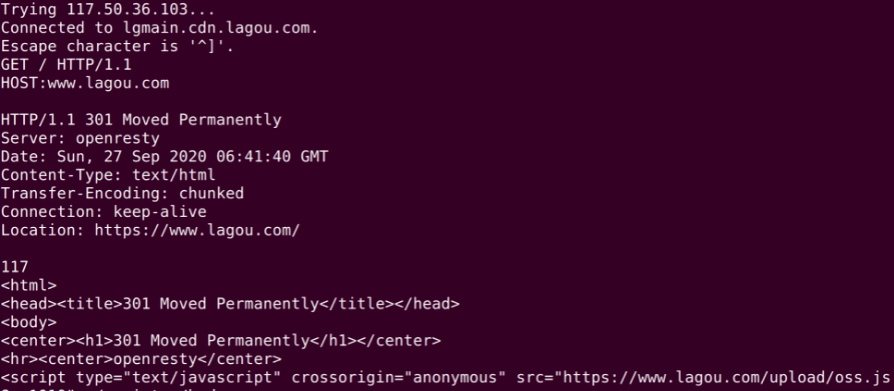

# Linux 中的网络指令: 如何查看一个域名的 NS 记录

先看一道关于 Linux 指令的题: 如何查看一个域名有哪些 NS 记录？

Linux 中提供了不少网络相关的指令，因为网络指令比较分散，本课时会从下面几个维度介绍常用的网络指令:

* 远程操作
* 查看本地网络状态
* 网络测试
* DNS 查询
* HTTP

这块知识从体系上属于 Linux 指令，同时也关联了很多计算机网络的知识，比如说 TCP/IP 协议、UDP 协议，会在 [模块七](../module_7) 中简要介绍。

---
---

## 远程操作指令

远程操作指令用得最多的是 ssh，ssh 指令允许远程登录到目标计算机并进行远程操作和管理。还有一个比较常用的远程指令是 scp，scp 可以远程传送文件。

---

### ssh(Secure Shell)

有一种场景需要远程登录一个 Linux 系统，这时会用到 ssh 指令。比如想远程登录一台机器，可以使用 ```ssh user@ip``` 的方式，如下图所示:

```shell
$ ssh root@xxx.xxx.xxx.xxx
root@xxx.xxx.xxx.xxx's password: 
Welcome to Ubuntu 20.04.2 LTS (GNU/Linux 5.4.0-66-generic x86_64)

 * Documentation:  https://help.ubuntu.com
 * Management:     https://landscape.canonical.com
 * Support:        https://ubuntu.com/advantage

Welcome to Alibaba Cloud Elastic Compute Service !

Last login: Mon Jul 26 15:57:32 2021 from xxx.xxx.xxx.xxx
```

这里登陆了一台阿里云服务器。

---

### scp

另一种场景是拷贝一个文件到远程，这时可以使用 scp 指令，如下图，使用 scp 指令将本地计算机的一个文件拷贝到了服务器 home 目录中。

比如从 拷贝目录下的文件 p.txt 到服务器。home 目录有一个简写，就是用 ~。具体指令见下:

```shell
$ scp p.txt root@xxx.xxx.xxx.xxx:/home/root/
root@xxx.xxx.xxx.xxx's password: 
p.txt                                                                   100%    0     0.0KB/s   00:00    
```

输入 scp 指令之后会弹出一个提示，要求输入密码，系统验证通过后文件会被成功拷贝。

---

## 查看本地网络状态

如果想要了解本地的网络状态，比较常用的网络指令是 ifconfig 和 netstat。

---

### ifconfig

若想知道本地 ip 以及本地有哪些网络接口时，就可以使用 ifconfig 指令。可以把一个网络接口理解成一个网卡，有时候虚拟机会装虚拟网卡，虚拟网卡是用软件模拟的网卡。

比如: VMware 为每个虚拟机创造一个虚拟网卡，通过虚拟网卡接入虚拟网络。当然物理机也可以接入虚拟网络，它可以通过虚拟网络向虚拟机的虚拟网卡上发送信息。

使用 ifconfig 查看网络接口信息。

```shell
$ ifconfig
eth0: flags=4163<UP,BROADCAST,RUNNING,MULTICAST>  mtu 1500
        inet 172.28.97.52  netmask 255.255.240.0  broadcast 172.28.111.255
        inet6 fe80::216:3eff:fe13:9ccb  prefixlen 64  scopeid 0x20<link>
        ether 00:16:3e:13:9c:cb  txqueuelen 1000  (Ethernet)
        RX packets 18284672  bytes 4124026793 (4.1 GB)
        RX errors 0  dropped 0  overruns 0  frame 0
        TX packets 13596080  bytes 8197547816 (8.1 GB)
        TX errors 0  dropped 0 overruns 0  carrier 0  collisions 0

lo: flags=73<UP,LOOPBACK,RUNNING>  mtu 65536
        inet 127.0.0.1  netmask 255.0.0.0
        inet6 ::1  prefixlen 128  scopeid 0x10<host>
        loop  txqueuelen 1000  (Local Loopback)
        RX packets 4345549  bytes 350591355 (350.5 MB)
        RX errors 0  dropped 0  overruns 0  frame 0
        TX packets 4345549  bytes 350591355 (350.5 MB)
        TX errors 0  dropped 0 overruns 0  carrier 0  collisions 0

```

可以看到这台服务器一共有 2 个网卡，eth0 和 lo。

---

### netstat

另一个查看网络状态的场景是想看目前本机的网络使用情况，这个时候可以用 netstat。

---

#### 默认行为

不传任何参数的 netstat 帮助查询所有的本地 socket，下面是 ```netstat | less``` 的结果。

```shell
Active Internet connections (w/o servers)
Proto Recv-Q Send-Q Local Address           Foreign Address         State      
tcp        0      0 localhost:36460         localhost:48941         TIME_WAIT  
tcp        0      0 localhost:54530         localhost:59346         TIME_WAIT  
tcp        0      0 localhost:60702         localhost:59139         TIME_WAIT  
tcp        0      0 localhost:46624         localhost:50792         TIME_WAIT  
tcp        0      0 localhost:8889          localhost:33872         TIME_WAIT  
tcp        0      0 localhost:36716         localhost:58761         TIME_WAIT  
tcp        0      0 localhost:56432         localhost:35309         TIME_WAIT  
tcp        0      0 localhost:54530         localhost:59536         TIME_WAIT  
tcp        0      0 localhost:54530         localhost:59372         TIME_WAIT  
tcp        0      0 localhost:54530         localhost:59300         TIME_WAIT  
tcp        0      0 localhost:54530         localhost:59486         TIME_WAIT  
tcp        0      0 localhost:34030         localhost:8889          ESTABLISHED
tcp        0      0 dfs-P65xRP:53938        106.75.118.232:https    ESTABLISHED
tcp        0      0 localhost:50282         localhost:40597         TIME_WAIT  
tcp        0      0 localhost:46624         localhost:50820         TIME_WAIT  
tcp        0      0 localhost:54530         localhost:59438         TIME_WAIT  
tcp        0      0 localhost:45135         localhost:43898         ESTABLISHED
tcp        0      0 localhost:54530         localhost:59400         TIME_WAIT  
tcp        0      0 localhost:54678         localhost:58889         TIME_WAIT  
tcp        0      0 localhost:54530         localhost:59452         TIME_WAIT  
tcp        0      0 localhost:54530         localhost:59480         TIME_WAIT  
:
```

上面是 socket 文件。socket 是网络插槽被抽象成了文件，负责在客户端、服务器之间收发数据。当客户端和服务端发生连接时，客户端和服务端会同时各自生成一个 socket 文件，用于管理这个连接。这里，可以用 ```wc -l```
数一下有多少个 socket。

```shell
$ netstat | wc -l
1600
```

可以看到一共有 1600 个 socket 文件，因为有很多 socket 在解决进程间的通信。就是将两个进程一个想象成客户端，一个想象成服务端。并不是真的有 1600 个连接着互联网的请求。

---

#### 查看 TCP 连接

如果想看有哪些 TCP 连接，可以使用 ```netstat -t```。比如通过 ```netstat -t tcp``` 看 tcp 协议的网络情况:

```shell
$ netstat -t tcp
Active Internet connections (w/o servers)
Proto Recv-Q Send-Q Local Address           Foreign Address         State      
tcp        0      0 localhost:51842         localhost:50729         TIME_WAIT  
tcp        0      0 localhost:54530         localhost:60234         TIME_WAIT  
tcp        0      0 localhost:40524         localhost:51389         TIME_WAIT  
tcp        0      0 localhost:46624         localhost:51702         TIME_WAIT  
tcp        0      0 localhost:54530         localhost:60312         TIME_WAIT  
//...
```

用 ```wc -l``` 数一下有多少个。

```shell
$ netstat -t tcp | wc -l
169
```

---

### 查看端口占用

还有一种非常常见的情形，想知道某个端口是哪个应用在占用。

```shell
$ sudo netstat -ntlp | grep 22
tcp        0      0 127.0.0.1:27017         0.0.0.0:*               LISTEN      2298/mongod         
tcp        0      0 0.0.0.0:80              0.0.0.0:*               LISTEN      1322/nginx: master  
tcp        0      0 0.0.0.0:22              0.0.0.0:*               LISTEN      1292/sshd: /usr/sbi 
tcp        0      0 127.0.0.1:1080          0.0.0.0:*               LISTEN      1224/v2ray          
tcp6       0      0 :::80                   :::*                    LISTEN      1322/nginx: master  
tcp6       0      0 :::22                   :::*                    LISTEN      1292/sshd: /usr/sbi 
```

这里看到 22 端口被 sshd，也就是远程登录模块被占用了，当然还有其他应用。```-n``` 是将一些特殊的端口号用数字显示，```-t``` 是指看 TCP 协议，```-l``` 是只显示连接中的连接，```-p```
是显示程序名称。

---

## 网络测试

当需要测试网络延迟、测试服务是否可用时，可能会用到 ping 和 telnet 指令。

---

### ping

想知道本机到某个网站的网络延迟，就可以使用 ping 指令。如下图所示:

```shell
$ ping www.baidu.com
PING www.a.shifen.com (36.152.44.96) 56(84) bytes of data.
64 bytes from 36.152.44.96 (36.152.44.96): icmp_seq=1 ttl=55 time=21.9 ms
64 bytes from 36.152.44.96 (36.152.44.96): icmp_seq=2 ttl=55 time=21.8 ms
64 bytes from 36.152.44.96 (36.152.44.96): icmp_seq=3 ttl=55 time=21.9 ms
64 bytes from 36.152.44.96 (36.152.44.96): icmp_seq=4 ttl=55 time=21.7 ms
64 bytes from 36.152.44.96 (36.152.44.96): icmp_seq=5 ttl=55 time=21.7 ms
64 bytes from 36.152.44.96 (36.152.44.96): icmp_seq=6 ttl=55 time=21.8 ms
//..
```

ping 一个网站需要使用 ICMP 协议。因此可以在上面中看到 icmp 序号。这里的时间 time 是往返一次的时间。ttl 叫作 time to live，是封包的生存时间。就是说，一个封包从发出就开始倒计时，如果途中超过 128
ms，这个包就会被丢弃。如果包被丢弃，就会被算进丢包率。

另外 ping 还可以看到一个网址的 IP 地址。通过网址获得 IP 地址的过程叫作 DNS Lookup(DNS 查询)。ping 利用了 DNS 查询，但是没有显示全部的 DNS 查询结果。

---

### telnet

有时候想知道本机到某个 IP + 端口的网络是否通畅，也就是想知道对方服务器是否在这个端口上提供了服务。这个时候可以用 telnet 指令。

```shell
$ telnet www.lagou.com 443
Trying 117.50.36.103...
Connected to lgmain.cdn.lagou.com.
Escape character is '^]'.

```

telnet 执行后会进入一个交互式的界面，比如这个时候，输入下面的文字就可以发送 HTTP 请求了。



如上图所示，第 5 行的 GET 和第 6 行的 HOST 是输入的。拉勾网返回了一个 301 永久跳转。这是因为拉勾网尝试把 http 协议链接重定向到 https。

---

## DNS 查询

排查网络故障时想要进行一次 DNS Lookup，若想知道一个网址 DNS 的解析过程。这个时候有多个指令可以用。

---

### host

host 就是一个 DNS 查询工具。比如查询拉勾网的 DNS，如所示:

```shell
$ host www.lagou.com
www.lagou.com is an alias for lgmain.cdn.lagou.com.
lgmain.cdn.lagou.com has address 117.50.39.99
lgmain.cdn.lagou.com has address 106.75.118.232
lgmain.cdn.lagou.com has address 117.50.36.103
```

可以看到拉勾网 [www.lagou.com](www.lagou.com) 是一个别名，它的原名是 lgmain 开头的一个域名，这说明拉勾网有可能在用 CDN 分发主页。

上面可以找到 3 个域名对应的 IP 地址。

如果想追查某种类型的记录，可以使用 ```host -t```。比如下面追查拉勾的 AAAA 记录，因为拉勾网还没有部署 IPv6，所以没有找到。

```shell
$ host -t AAAA www.lagou.com
www.lagou.com is an alias for lgmain.cdn.lagou.com.
```

---

### dig

dig 指令也是一个做 DNS 查询的。不过 dig 指令显示的内容更详细。下面是 dig 拉勾网的结果。

```shell
$ dig www.lagou.com

; <<>> DiG 9.16.1-Ubuntu <<>> www.lagou.com
;; global options: +cmd
;; Got answer:
;; ->>HEADER<<- opcode: QUERY, status: NOERROR, id: 37026
;; flags: qr rd ra; QUERY: 1, ANSWER: 4, AUTHORITY: 0, ADDITIONAL: 1

;; OPT PSEUDOSECTION:
; EDNS: version: 0, flags:; udp: 65494
;; QUESTION SECTION:
;www.lagou.com.			IN	A

;; ANSWER SECTION:
www.lagou.com.		280	IN	CNAME	lgmain.cdn.lagou.com.
lgmain.cdn.lagou.com.	33	IN	A	117.50.36.103
lgmain.cdn.lagou.com.	33	IN	A	117.50.39.99
lgmain.cdn.lagou.com.	33	IN	A	106.75.118.232

;; Query time: 23 msec
;; SERVER: 127.0.0.53#53(127.0.0.53)
;; WHEN: 一 7月 26 21:45:57 CST 2021
;; MSG SIZE  rcvd: 115

```

从结果可以看到 [www.lagou.com](www.lagou.com) 有一个别名，用 CNAME 记录定义 lgmain 开头的一个域名，然后有 3 条 A 记录，通常这种情况是为了均衡负载或者分发内容。

---

## HTTP 相关

最后来说说 http 协议相关的指令。

---

### curl

如果要在命令行请求一个网页，或者请求一个接口，可以用 curl 指令。curl 支持很多种协议，比如 LDAP、SMTP、FTP、HTTP 等。

可以直接使用 curl 请求一个网址，获取资源，比如用 curl 直接获取了拉勾网的主页，如下图所示:

```shell
$ curl https://www.lagou.com | head -n 10
  % Total    % Received % Xferd  Average Speed   Time    Time     Time  Current
                                 Dload  Upload   Total   Spent    Left  Speed
  0     0    0     0    0     0      0      0 --:--:-- --:--:-- --:--:--     0<!DOCTYPE html>
<html>
<head>
	<!-- meta -->
	<meta charset="UTF-8">
<meta http-equiv="X-UA-Compatible" content="IE=edge,chrome=1" />
<meta name="renderer" content="webkit">
<meta property="qc:admins" content="23635710066417756375" />
<meta name="baidu-site-verification" content="QIQ6KC1oZ6" />
<meta content="拉勾招聘,互联网招聘,求职,找工作,招聘,招聘网站" name="keywords">
100 20172    0 20172    0     0  24421      0 --:--:-- --:--:-- --:--:-- 24391
curl: (23) Failed writing body (312 != 8196)
```

如果只想看 HTTP 返回头，可以使用 ```curl -I```。

另外 curl 还可以执行 POST 请求，比如下面这个语句:

```shell
$ curl -d '{"x" : 1}' -H "Content-Type: application/json" -X POST http://localhost:3000/api
```

curl 在向 localhost:3000 发送 POST 请求。```-d``` 后面跟着要发送的数据，```-X``` 后面是用到的 HTTP 方法，```-H``` 是指定自定义的请求头。

---

## 总结

这节课学习了不少网络相关的 Linux 指令，这些指令是将来开发和调试的强大工具。这里再复习一下这些指令:

* 远程登录的 ssh 指令
* 远程拷贝文件的 scp 指令
* 查看网络接口的 ifconfig 指令
* 查看网络状态的 netstat 指令
* 测试网络延迟的 ping 指令
* 可以交互式调试和服务端的 telnet 指令
* 两个 DNS 查询指令 host 和 dig
* 可以发送各种请求包括 HTTPS 的 curl 指令

那么通过这节课的学习，回到本节关联的面试题目: 如何查看一个域名有哪些 NS 记录了吗？

host 指令提供了一个 ```-t``` 参数指定需要查找的记录类型。可以使用 ```host -t ns {网址}```。另外 dig 也提供了同样的能力。

---

## 思考题

最后再给出一道思考题: 如何查看正在 TIME_WAIT 状态的连接数量？

---
---

