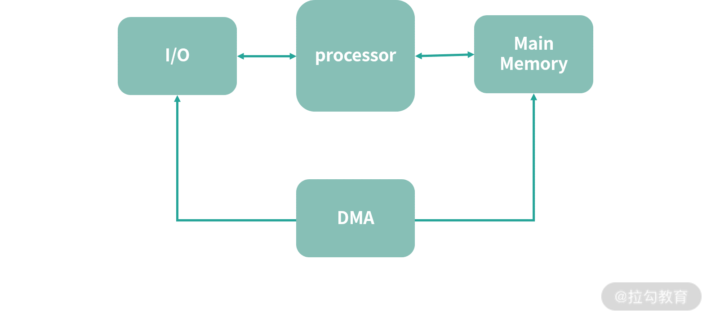

# 分析服务的特性: 服务应该开多少个进程、多少个线程

在平时工作中应该经常会遇到自己设计的服务即将上线，这就需要从整体评估各项指标，比如应该开多少个容器、需要多少 CPU
呢？另一方面，应该开多少个线程、多少个进程呢？——如果结合服务特性、目标并发量、目标吞吐量、用户可以承受的延迟等分析，又应该如何调整各种参数？

资源分配多了，CPU、内存等资源会产生资源闲置浪费。资源给少了，则服务不能正常工作，甚至雪崩。因此这里就产生了一个性价比问题——这一讲，就以"服务应该开多少个进程、多少个线程"为引，一起讨论如何更好地利用系统资源。

---
---

## 计算密集型和 I/O 密集型

通常会遇到两种任务，一种是计算、一种是 I/O。

计算，就是利用 CPU 处理算数运算。比如深度神经网络(Deep Neural Networks)
，需要大量的计算来计算神经元的激活和传播。再比如，根据营销规则计算订单价格，虽然每一个订单只需要少量的计算，但是在并发高的时候，所有订单累计加起来就需要大量计算。如果一个应用的主要开销在计算上，称为计算密集型。

再看看 I/O 密集型，I/O 本质是对设备的读写。读取键盘的输入是 I/O，读取磁盘(SSD)的数据是 I/O。通常 CPU 在设备 I/O 的过程中会去做其他的事情，当 I/O 完成，设备会给 CPU 一个中断，告诉 CPU 响应
I/O 的结果。比如说从硬盘读取数据完成了，那么硬盘给 CPU 一个中断。如果操作对 I/O 的依赖强，比如频繁的文件操作(写日志、读写数据库等)，可以看作 I/O 密集型。

读取硬盘数据到内存中这个过程，CPU 需不需要一个个字节处理？

通常是不用的，因为在今天的计算机中有一个叫作 Direct Memory Access(DMA)的模块，这个模块允许硬件设备直接通过 DMA 写内存，而不需要通过 CPU(占用 CPU 资源)。



很多情况下没法使用 DMA，比如把一个数组拷贝到另一个数组内，执行的 memcpy 函数内部实现就是一个个 byte 拷贝，这种情况也是一种 CPU 密集的操作。

可见，区分是计算密集型还是 I/O 密集型这件事比较复杂。按说查询数据库是一件 I/O 密集型的事情，但是如果存储设备足够好，比如用了最好的固态硬盘阵列，I/O 速度很快，反而瓶颈会在计算上(对缓存的搜索耗时成为主要部分)
。因此，需要一些可衡量指标，来确认应用的特性。

---

## 衡量 CPU 的工作情况的指标

先来看一下 CPU 关联的指标。如下图所示: CPU 有 2 种状态，忙碌和空闲。此外，CPU 的时间还有一种被偷走的情况。


忙碌就是 CPU 在执行有意义的程序，空闲就是 CPU 在执行让 CPU 空闲(空转)的指令。通常让 CPU 空转的指令能耗更低，因此让 CPU 闲置时，我们会使用特别的指令，最终效果和让 CPU 计算是一样的，都可以把 CPU
执行时间填满，只不过这类型指令能耗低一些而已。除了忙碌和空闲，CPU 的时间有可能被宿主偷走，比如一台宿主机器上有 10 个虚拟机，宿主可以偷走给任何一台虚拟机的时间。

如上图所示，CPU 忙碌有 3 种情况:

* 执行用户空间程序
* 执行内核空间程序
* 执行中断程序

CPU 空闲有 2 种情况。

* CPU 无事可做，执行空闲指令(注意，不能让 CPU 停止工作，而是执行能耗更低的空闲指令)
* CPU 因为需要等待 I/O 而空闲，比如在等待磁盘回传数据的中断，这种称为 I/O Wait

下面是执行 top 指令看到目前机器状态的快照，接下来就仔细研究一下这些指标的含义:

```shell
top - 14:19:09 up  3:49,  1 user,  load average: 0.87, 0.62, 0.51
Tasks: 334 total,   1 running, 333 sleeping,   0 stopped,   0 zombie
%Cpu(s):  8.4 us,  3.4 sy,  0.0 ni, 88.2 id,  0.0 wa,  0.0 hi,  0.0 si,  0.0 st
MiB Mem :  15897.2 total,   3823.7 free,   5906.6 used,   6166.8 buff/cache
MiB Swap:   2048.0 total,   2048.0 free,      0.0 used.   9511.4 avail Mem 
```

如上所示，可以细看下 %CPU(s) 开头那一行(第 3 行):

* us(user)，即用户空间 CPU 使用占比
* sy(system)，即内核空间 CPU 使用占比
* ni(nice)，nice 是 Unix 系操作系统控制进程优先级用的。-19 是最高优先级， 20 是最低优先级。这里代表了调整过优先级的进程的 CPU 使用占比
* id(idle)，闲置的 CPU 占比
* wa(I/O Wait)，I/O Wait 闲置的 CPU 占比
* hi(hardware interrupts)，响应硬件中断 CPU 使用占比
* si(software interrrupts)，响应软件中断 CPU 使用占比
* st(stolen)，如果当前机器是虚拟机，这个指标代表了宿主偷走的 CPU 时间占比。对于一个宿主多个虚拟机的情况，宿主可以偷走任何一台虚拟机的 CPU 时间

上面是用 top 看的一个平均情况，如果想看所有 CPU 的情况可以 top 之后，按一下 1 键。结果如下所示:

```shell
top - 14:20:50 up  3:51,  1 user,  load average: 0.79, 0.69, 0.55
Tasks: 334 total,   1 running, 333 sleeping,   0 stopped,   0 zombie
%Cpu0  :  9.4 us,  5.2 sy,  0.0 ni, 85.1 id,  0.0 wa,  0.0 hi,  0.3 si,  0.0 st
%Cpu1  :  8.8 us,  4.2 sy,  0.0 ni, 86.6 id,  0.0 wa,  0.0 hi,  0.3 si,  0.0 st
%Cpu2  :  9.9 us,  6.4 sy,  0.0 ni, 83.7 id,  0.0 wa,  0.0 hi,  0.0 si,  0.0 st
%Cpu3  :  7.5 us,  4.9 sy,  0.0 ni, 87.6 id,  0.0 wa,  0.0 hi,  0.0 si,  0.0 st
MiB Mem :  15897.2 total,   3807.4 free,   5916.6 used,   6173.2 buff/cache
MiB Swap:   2048.0 total,   2048.0 free,      0.0 used.   9501.5 avail Mem 
```

当然，对性能而言，CPU 数量也是一个重要因素。可以看到一共有 4 个核心。

---

## 负载指标

上面的指标非常多，在排查问题的时候，需要综合分析。其实还有一些更简单的指标，比如上图中 top 指令返回有一项叫作 load average——平均负载。负载可以理解成某个时刻正在排队执行的进程数除以 CPU
核数。平均负载需要多次采样求平均值。如果这个值大于 1，说明 CPU 相当忙碌。因此如果想发现问题，可以先检查这个指标。

具体来说，如果平均负载很高，CPU 的 I/O Wait 也很高，那么就说明 CPU 因为需要大量等待 I/O 无法处理完成工作。产生这个现象的原因可能是: 线上服务器打日志太频繁，读写数据库、网络太频繁。可以考虑进行批量读写优化。

为什么批量更快呢？我们知道一次写入 1M 的数据，就比写一百万次一个 byte 快。因为前者可以充分利用 CPU 的缓存、复用发起写操作程序的连接和缓冲区等。

如果想看更多 load average，可以去看 ```/proc/loadavg``` 文件。

---

## 通信量(Traffic)

如果怀疑瓶颈发生在网络层面，或者想知道当前网络状况。可以查看 ```/proc/net/dev```，下面是查询结果:

```shell
$ cat /proc/net/dev
Inter-|   Receive                                                |  Transmit
 face |bytes    packets errs drop fifo frame compressed multicast|bytes    packets errs drop fifo colls carrier compressed
    lo: 154799784  867245    0    0    0     0          0         0 154799784  867245    0    0    0     0       0          0
enp109s0f1:       0       0    0    0    0     0          0         0        0       0    0    0    0     0       0          0
wlp110s0: 118100887  110899    0    0    0     0          0         0 15244211   67335    0    0    0     0       0          0
mpqemubr0-dummy:       0       0    0    0    0     0          0         0        0       0    0    0    0     0       0          0
mpqemubr0:       0       0    0    0    0     0          0         0     1652      13    0    0    0     0       0          0
docker0:       0       0    0    0    0     0          0         0        0       0    0    0    0     0       0          0
tap-f56b9ce0ac6:       0       0    0    0    0     0          0         0        0       0    0    0    0     0       0          0
tap-868d74cdbe6:       0       0    0    0    0     0          0         0        0       0    0    0    0     0       0          0
```

一起看一下上面指标。表头分成了 3 段:

* Interface(网络接口): 可以理解成网卡
* Receive: 接收的数据
* Transmit: 发送的数据

然后再来看具体的一些参数:

* byte: 是字节数
* package: 是封包数
* erros: 是错误数
* drop: 是主动丢弃的封包，比如说时间窗口超时了
* fifo: FIFO 缓冲区错误
* frame: 底层网络发生了帧错误，代表数据出错了

如果怀疑自己系统的网络有故障，可以查一下通信量部分的参数，相信会有一定的收获。

---

## 衡量磁盘工作情况

有时候 I/O 太频繁导致磁盘负载成为瓶颈，这个时候可以用 iotop 指令看一下磁盘的情况，如下所示:

```shell
Total DISK READ:         0.00 B/s | Total DISK WRITE:         0.00 B/s
Current DISK READ:       0.00 B/s | Current DISK WRITE:       0.00 B/s
    TID  PRIO  USER     DISK READ  DISK WRITE  SWAPIN     IO>    COMMAND                                                                                                     
      1 be/4 root        0.00 B/s    0.00 B/s  0.00 %  0.00 % init splash
      2 be/4 root        0.00 B/s    0.00 B/s  0.00 %  0.00 % [kthreadd]
      3 be/0 root        0.00 B/s    0.00 B/s  0.00 %  0.00 % [rcu_gp]
      4 be/0 root        0.00 B/s    0.00 B/s  0.00 %  0.00 % [rcu_par_gp]
      6 be/0 root        0.00 B/s    0.00 B/s  0.00 %  0.00 % [kworker/0:0H-kblockd]
      9 be/0 root        0.00 B/s    0.00 B/s  0.00 %  0.00 % [mm_percpu_wq]
     10 be/4 root        0.00 B/s    0.00 B/s  0.00 %  0.00 % [ksoftirqd/0]
     11 be/4 root        0.00 B/s    0.00 B/s  0.00 %  0.00 % [rcu_sched]
     12 rt/4 root        0.00 B/s    0.00 B/s  0.00 %  0.00 % [migration/0]
     13 rt/4 root        0.00 B/s    0.00 B/s  0.00 %  0.00 % [idle_inject/0]
     14 be/4 root        0.00 B/s    0.00 B/s  0.00 %  0.00 % [cpuhp/0]
     15 be/4 root        0.00 B/s    0.00 B/s  0.00 %  0.00 % [cpuhp/1]
     16 rt/4 root        0.00 B/s    0.00 B/s  0.00 %  0.00 % [idle_inject/1]
     17 rt/4 root        0.00 B/s    0.00 B/s  0.00 %  0.00 % [migration/1]
     18 be/4 root        0.00 B/s    0.00 B/s  0.00 %  0.00 % [ksoftirqd/1]
     20 be/0 root        0.00 B/s    0.00 B/s  0.00 %  0.00 % [kworker/1:0H-kblockd]
     21 be/4 root        0.00 B/s    0.00 B/s  0.00 %  0.00 % [cpuhp/2]
     22 rt/4 root        0.00 B/s    0.00 B/s  0.00 %  0.00 % [idle_inject/2]
     23 rt/4 root        0.00 B/s    0.00 B/s  0.00 %  0.00 % [migration/2]
     24 be/4 root        0.00 B/s    0.00 B/s  0.00 %  0.00 % [ksoftirqd/2]
     26 be/0 root        0.00 B/s    0.00 B/s  0.00 %  0.00 % [kworker/2:0H-kblockd]
     27 be/4 root        0.00 B/s    0.00 B/s  0.00 %  0.00 % [cpuhp/3]
     28 rt/4 root        0.00 B/s    0.00 B/s  0.00 %  0.00 % [idle_inject/3]
     29 rt/4 root        0.00 B/s    0.00 B/s  0.00 %  0.00 % [migration/3]
     30 be/4 root        0.00 B/s    0.00 B/s  0.00 %  0.00 % [ksoftirqd/3]
     32 be/0 root        0.00 B/s    0.00 B/s  0.00 %  0.00 % [kworker/3:0H-kblockd]
     33 be/4 root        0.00 B/s    0.00 B/s  0.00 %  0.00 % [kdevtmpfs]
     34 be/0 root        0.00 B/s    0.00 B/s  0.00 %  0.00 % [netns]
     35 be/4 root        0.00 B/s    0.00 B/s  0.00 %  0.00 % [rcu_tasks_kthre]
     36 be/4 root        0.00 B/s    0.00 B/s  0.00 %  0.00 % [rcu_tasks_rude_]
     37 be/4 root        0.00 B/s    0.00 B/s  0.00 %  0.00 % [rcu_tasks_trace]
     38 be/4 root        0.00 B/s    0.00 B/s  0.00 %  0.00 % [kauditd]
     39 be/4 root        0.00 B/s    0.00 B/s  0.00 %  0.00 % [khungtaskd]
     40 be/4 root        0.00 B/s    0.00 B/s  0.00 %  0.00 % [oom_reaper]
     41 be/0 root        0.00 B/s    0.00 B/s  0.00 %  0.00 % [writeback]
     42 be/4 root        0.00 B/s    0.00 B/s  0.00 %  0.00 % [kcompactd0]
     43 be/5 root        0.00 B/s    0.00 B/s  0.00 %  0.00 % [ksmd]
     44 be/7 root        0.00 B/s    0.00 B/s  0.00 %  0.00 % [khugepaged]
     91 be/0 root        0.00 B/s    0.00 B/s  0.00 %  0.00 % [kintegrityd]
  keys:  any: refresh  q: quit  i: ionice  o: active  p: procs  a: accum                                                                                                     
  sort:  r: asc  left: SWAPIN  right: COMMAND  home: TID  end: COMMAND                                                                                                       

```

上面中是磁盘当前的读写速度以及排行较靠前的进程情况。

另外，如果磁盘空间不足，可以用 df 指令:

```shell
$ df
Filesystem     1K-blocks      Used Available Use% Mounted on
udev             8109228         0   8109228   0% /dev
tmpfs            1627872      2340   1625532   1% /run
/dev/sda2      229184876 119129660  98343576  55% /
tmpfs            8139340    170904   7968436   3% /dev/shm
tmpfs               5120         4      5116   1% /run/lock
tmpfs            8139340         0   8139340   0% /sys/fs/cgroup
/dev/loop2        101760    101760         0 100% /snap/core/11316
/dev/loop1          9344      9344         0 100% /snap/canonical-livepatch/99
/dev/loop0         10496     10496         0 100% /snap/canonical-livepatch/102
/dev/loop3        101888    101888         0 100% /snap/core/11420
/dev/loop5         56832     56832         0 100% /snap/core18/2066
/dev/loop4        166784    166784         0 100% /snap/gnome-3-28-1804/145
/dev/loop6         56832     56832         0 100% /snap/core18/2074
/dev/loop7         63232     63232         0 100% /snap/core20/1026
/dev/loop8        224256    224256         0 100% /snap/gnome-3-34-1804/72
/dev/loop9         80768     80768         0 100% /snap/flameshot/135
/dev/loop10       168832    168832         0 100% /snap/gnome-3-28-1804/161
/dev/loop12       224256    224256         0 100% /snap/gnome-3-34-1804/66
/dev/loop11       144128    144128         0 100% /snap/mathpix-snipping-tool/195
/dev/loop13       267008    267008         0 100% /snap/kde-frameworks-5-core18/32
/dev/loop14        63360     63360         0 100% /snap/core20/1081
/dev/loop15        82176     82176         0 100% /snap/shotcut/330
/dev/loop16        52224     52224         0 100% /snap/snap-store/547
/dev/loop17        86912     86912         0 100% /snap/shotcut/282
/dev/loop18       317440    317440         0 100% /snap/multipass/5087
/dev/loop19        66432     66432         0 100% /snap/gtk-common-themes/1514
/dev/loop20       113024    113024         0 100% /snap/xmind/10
/dev/loop21        80768     80768         0 100% /snap/flameshot/127
/dev/loop22       179584    179584         0 100% /snap/postman/133
/dev/loop23        52224     52224         0 100% /snap/snap-store/542
/dev/loop24        33152     33152         0 100% /snap/snapd/12398
/dev/loop25          256       256         0 100% /snap/gtk2-common-themes/13
/dev/loop27        66688     66688         0 100% /snap/gtk-common-themes/1515
/dev/sda1         523248      8036    515212   2% /boot/efi
/dev/sdb1      411792544 119046156 271758808  31% /home/user/extend_one
tmpfs            1627868        52   1627816   1% /run/user/1000
/dev/loop28        33152     33152         0 100% /snap/snapd/12704
```

其实 df 是按照挂载的文件系统计算空间。图中每一个条目都是一个文件系统。有的文件系统直接挂在了一个磁盘上，比如图中的 ```/dev/sda5``` 挂在了 / 上，因此这样可以看到各个磁盘的使用情况。

如果想知道更细粒度的磁盘 I/O 情况，可以查看 ```/proc/diskstats``` 文件。这里有 20 多个指标就不细讲了，如果将来怀疑自己系统的 I/O 有问题，可以查看这个文件，并阅读相关手册。

```shell
$ cat /proc/diskstats
   7       0 loop0 104 0 5984 281 0 0 0 0 0 520 281 0 0 0 0 0 0
   7       1 loop1 39 0 262 7 0 0 0 0 0 32 7 0 0 0 0 0 0
   7       2 loop2 312 0 3286 38 0 0 0 0 0 120 38 0 0 0 0 0 0
   7       3 loop3 749 0 24222 83 0 0 0 0 0 1196 83 0 0 0 0 0 0
   7       4 loop4 587 0 4184 33 0 0 0 0 0 144 33 0 0 0 0 0 0
   7       5 loop5 267 0 1666 15 0 0 0 0 0 80 15 0 0 0 0 0 0
   7       6 loop6 676 0 13142 58 0 0 0 0 0 736 58 0 0 0 0 0 0
   7       7 loop7 279 0 1724 16 0 0 0 0 0 76 16 0 0 0 0 0 0
   8       0 sda 135004 89359 7756200 38688 85700 97709 5868610 64427 0 103696 115825 0 0 0 0 13974 12710
   8       1 sda1 230 861 26142 70 2 0 2 0 0 116 70 0 0 0 0 0 0
   8       2 sda2 134437 88498 7725554 38067 83251 97709 5868608 62496 0 102820 100563 0 0 0 0 0 0
   8      16 sdb 3492 3087 90036 12867 51 34 498 1793 0 13364 15749 0 0 0 0 25 1087
   8      17 sdb1 2977 3087 70678 4162 37 34 498 291 0 4836 4454 0 0 0 0 0 0
   8      18 sdb2 156 0 12672 477 0 0 0 0 0 540 477 0 0 0 0 0 0
   7       8 loop8 1264 0 16118 109 0 0 0 0 0 968 109 0 0 0 0 0 0
   7       9 loop9 594 0 15690 55 0 0 0 0 0 752 55 0 0 0 0 0 0
   7      10 loop10 593 0 4204 25 0 0 0 0 0 120 25 0 0 0 0 0 0
   7      11 loop11 642 0 4454 135 0 0 0 0 0 244 135 0 0 0 0 0 0
   7      12 loop12 437 0 3658 44 0 0 0 0 0 132 44 0 0 0 0 0 0
   7      13 loop13 1139 0 23860 89 0 0 0 0 0 1124 89 0 0 0 0 0 0
   7      14 loop14 662 0 14136 162 0 0 0 0 0 908 162 0 0 0 0 0 0
   7      15 loop15 116 0 2420 34 0 0 0 0 0 56 34 0 0 0 0 0 0
   7      16 loop16 791 0 24644 77 0 0 0 0 0 1332 77 0 0 0 0 0 0
   7      17 loop17 124 0 2412 24 0 0 0 0 0 56 24 0 0 0 0 0 0
   7      18 loop18 868 0 41996 123 0 0 0 0 0 1936 123 0 0 0 0 0 0
   7      19 loop19 931 0 5410 43 0 0 0 0 0 152 43 0 0 0 0 0 0
   7      20 loop20 134 0 3342 32 0 0 0 0 0 56 32 0 0 0 0 0 0
   7      21 loop21 367 0 5272 20 0 0 0 0 0 76 20 0 0 0 0 0 0
   7      22 loop22 810 0 5136 31 0 0 0 0 0 168 31 0 0 0 0 0 0
   7      23 loop23 320 0 1736 17 0 0 0 0 0 64 17 0 0 0 0 0 0
   7      24 loop24 1181 0 85952 148 0 0 0 0 0 4124 148 0 0 0 0 0 0
   7      25 loop25 21 0 110 1 0 0 0 0 0 12 1 0 0 0 0 0 0
   7      26 loop26 49 0 724 6 0 0 0 0 0 20 6 0 0 0 0 0 0
   7      27 loop27 1046 0 6298 52 0 0 0 0 0 252 52 0 0 0 0 0 0
   7      28 loop28 549 0 35652 27 0 0 0 0 0 1608 27 0 0 0 0 0 0
   7      29 loop29 11 0 28 4 0 0 0 0 0 12 4 0 0 0 0 0 0
```

---

## 监控平台

Linux 中有很多指令可以查看服务器当前的状态，有 CPU、I/O、通信、Nginx 等维度。如果去记忆每个指令自己搭建监控平台，会非常复杂。这里可以用市面上别人写好的开源系统收集这些资料。比如 Taobao System
Activity Report(tsar)就是一款非常好用的工具。它集成了大量诸如上面使用的工具，并且可以定时收集服务器情况，还能记录成日志。可以用 logstash 等工具，及时将日志收集到监控、分析服务中，比如用 ELK 技术栈。

---

### 决定进程/线程数量

最后讲讲如何决定线程、进程数量。上面观察指标是必须做的一件事情，通过观察上面的指标，可以对开发的应用有一个基本的认识。

下面请思考一个问题: 如果线程或进程数量 = CPU 核数，是不是一个好的选择？

有的应用不提供线程，比如 PHP 和 Node.js。

Node.js 内部有一个事件循环模型，这个模型可以理解成协程(Coroutine)，相当于大量的协程复用一个进程，可以达到比线程池更高的效率(减少了线程切换)。PHP 模型相对则差得多。Java 是一个多线程的模型，线程和内核线程对应比
1:1；Go 有轻量级线程，多个轻量级线程复用一个内核级线程。

以 Node.js 为例，如果现在是 8 个核心，那么开 8 个 Node 进程，是不是就是最有效利用 CPU 的方案呢？ 乍一看——8 个核、8 个进程，每个进程都可以使用 1 个核，CPU 利用率很高——其实不然。不要忘记 CPU
中会有一部分闲置时间是 I/O Wait，这个时候 CPU 什么也不做，主要时间用于等待 I/O。

假设应用执行的期间只用 50% CPU 的执行时间，其他 50% 是 I/O Wait。那么 1 个 CPU 同时就可以执行两个进程/线程。

考虑一个更一般的模型，如果应用平均 I/O 时间占比是 P，假设现在内存中有 n 个这样的线程，那么 CPU 的利用率是多少呢？

假设一个应用(进程)，I/O 时间占比是 P，那么可以认为这个进程等待 I/O 的概率是 P。那么如果有 n 个这样的线程，n 个线程都在等待 I/O 的概率是 Pn。而满负荷下，CPU 的利用率就是 CPU
不能空转——也就是不能所有进程都在等待 I/O。因此 CPU 利用率 = 1 -Pn。

理论上，如果 P = 50%，两个这样的进程可以达到满负荷。但是从实际出发，何时运行线程是一个分时的调度行为，实际的 CPU 利用率还要看开了多少个这样的线程，如果是 2 个，那么还是会有一部分闲置资源。

因此在实际工作中，开的线程、进程数往往是超过 CPU 核数的。具体是多少最好呢？——这里没有具体的算法，要以实际情况为准。比如: 先以 CPU 核数 3 倍的线程数开始，然后进行模拟真实线上压力的测试，分析压测的结果。

如果发现整个过程中，瓶颈在 CPU，比如 load average 很高，那么可以考虑优化 I/O Wait，让 CPU 有更多时间计算。

当然，如果 I/O Wait 优化不动了，算法都最优了，就是磁盘读写速度很高达到瓶颈，可以考虑延迟写、延迟读等等技术，或者优化减少读写。

如果发现 idle 很高，CPU 大面积闲置，就可以考虑增加线程。

---

## 总结

那么通过这节课的学习，回到本节关联的面试题目: 服务应该开多少个进程、多少个线程？

计算密集型一般接近核数，如果负载很高，建议留一个内核专门给操作系统。I/O 密集型一般都会开大于核数的线程和进程。但是无论哪种模型，都需要实地压测，以压测结果分析为准；另一方面，还需要做好监控，观察服务在不同并发场景的情况，避免资源耗尽。

然后具体语言的特性也要考虑，Node.js 每个进程内部实现了大量类似协程的执行单元，因此 Node.js 即便在 I/O 密集型场景下也可以考虑长期使用核数 -1 的进程模型。而 Java 是多线程模型，线程池通常要大于核数才能充分利用
CPU 资源。

所以核心就一句，眼见为实，上线前要进行压力测试。

---

## 思考题

最后再给出一道思考题: 如果磁盘坏了，通常会是怎样的情况？

---
---

