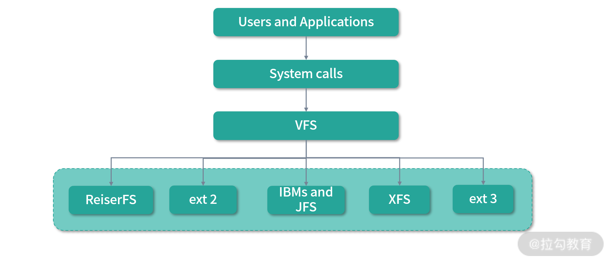
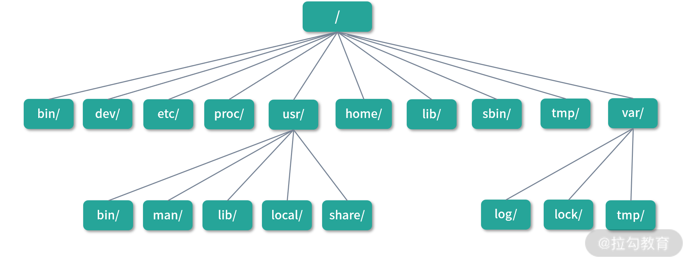

# 文件目录: Linux 下的各个目录有什么作用

本节开始学习模块六: 文件系统。学习文件系统的意义在于文件系统有很多设计思路可以迁移到实际的工作场景中，比如:

* MySQL 的 binlog 和 Redis AOF 都像极了日志文件系统的设计
* B Tree 用于加速磁盘数据访问的设计，对于索引设计也有通用的意义

特别是近年来分布式系统的普及，学习分布式文件系统，也是理解分布式架构最核心的一个环节。其实文件系统最精彩的还是虚拟文件系统的设计，比如 Linux
可以支持每个目录用不同的文件系统。这些文件看上去是一个个目录和文件，实际上可能是磁盘、内存、网络文件系统、远程磁盘、网卡、随机数产生器、输入输出设备等，这样虚拟文件系统就成了整合一切设备资源的平台。大量的操作都可以抽象成对文件的操作，程序的书写就会完整而统一，且扩展性强。

这一讲会从 Linux 的目录结构和用途开始，带你认识 Linux 的文件系统。Linux 所有的文件都建立在虚拟文件系统(Virtual File System ，VFS)之上，如下图所示:



当访问一个目录或者文件，虽然用的是 Linux 标准的文件 API 对文件进行操作，但实际操作的可能是磁盘、内存、网络或者数据库等。因此，Linux 上不同的目录可能是不同的磁盘，不同的文件可能是不同的设备。

---

## 分区结构

在 Linux 中，/ 是根目录。之前在 [08 讲](../module_2/lecture_8.md) 提到过，每个目录可以是不同的文件系统(不同的磁盘或者设备)。/ 是对应一个磁盘还是多个磁盘呢？在 /
创建目录的时候，目录属于哪个磁盘呢？

```shell
$ df -h
Filesystem      Size  Used Avail Use% Mounted on
udev            7.8G     0  7.8G   0% /dev
tmpfs           1.6G  2.3M  1.6G   1% /run
/dev/sda2       219G  115G   93G  56% /
tmpfs           7.8G  255M  7.6G   4% /dev/shm
tmpfs           5.0M  4.0K  5.0M   1% /run/lock
tmpfs           7.8G     0  7.8G   0% /sys/fs/cgroup
/dev/loop3       56M   56M     0 100% /snap/core18/2066
/dev/loop4      100M  100M     0 100% /snap/core/11420
/dev/loop2      100M  100M     0 100% /snap/core/11316
/dev/loop5       56M   56M     0 100% /snap/core18/2074
/dev/loop0       11M   11M     0 100% /snap/canonical-livepatch/102
/dev/loop6      163M  163M     0 100% /snap/gnome-3-28-1804/145
/dev/loop7       62M   62M     0 100% /snap/core20/1081
/dev/loop8       79M   79M     0 100% /snap/flameshot/135
/dev/loop1       11M   11M     0 100% /snap/canonical-livepatch/104
/dev/loop9       62M   62M     0 100% /snap/core20/1026
/dev/loop12     261M  261M     0 100% /snap/kde-frameworks-5-core18/32
/dev/loop10      66M   66M     0 100% /snap/gtk-common-themes/1515
/dev/loop11     219M  219M     0 100% /snap/gnome-3-34-1804/66
/dev/loop13     310M  310M     0 100% /snap/multipass/5087
/dev/loop14     165M  165M     0 100% /snap/gnome-3-28-1804/161
/dev/loop15      79M   79M     0 100% /snap/flameshot/127
/dev/loop17     219M  219M     0 100% /snap/gnome-3-34-1804/72
/dev/loop16      33M   33M     0 100% /snap/snapd/12704
/dev/loop18     256K  256K     0 100% /snap/gtk2-common-themes/13
/dev/loop19     141M  141M     0 100% /snap/mathpix-snipping-tool/195
/dev/loop20      85M   85M     0 100% /snap/shotcut/282
/dev/loop21      51M   51M     0 100% /snap/snap-store/542
/dev/loop22      65M   65M     0 100% /snap/gtk-common-themes/1514
/dev/loop23      81M   81M     0 100% /snap/shotcut/330
/dev/loop24      33M   33M     0 100% /snap/snapd/12398
/dev/loop25      51M   51M     0 100% /snap/snap-store/547
/dev/loop26     176M  176M     0 100% /snap/postman/133
/dev/loop27     111M  111M     0 100% /snap/xmind/10
/dev/sda1       511M  7.9M  504M   2% /boot/efi
/dev/sdb1       393G  114G  260G  31% /home/user/extend_one
tmpfs           1.6G   44K  1.6G   1% /run/user/1000
```

可以用 ```df -h``` 查看上面两个问题的答案，在上图中我的 / 挂载到了 ```/dev/sda2``` 上。如果想要看到更多信息，可以使用 ```df -T```，如下所示:

```shell
$ df -T
Filesystem     Type     1K-blocks      Used Available Use% Mounted on
udev           devtmpfs   8109228         0   8109228   0% /dev
tmpfs          tmpfs      1627872      2316   1625556   1% /run
/dev/sda2      ext4     229184876 120103692  97369544  56% /
tmpfs          tmpfs      8139340    260928   7878412   4% /dev/shm
tmpfs          tmpfs         5120         4      5116   1% /run/lock
tmpfs          tmpfs      8139340         0   8139340   0% /sys/fs/cgroup
/dev/loop3     squashfs     56832     56832         0 100% /snap/core18/2066
/dev/loop4     squashfs    101888    101888         0 100% /snap/core/11420
/dev/loop2     squashfs    101760    101760         0 100% /snap/core/11316
/dev/loop5     squashfs     56832     56832         0 100% /snap/core18/2074
/dev/loop0     squashfs     10496     10496         0 100% /snap/canonical-livepatch/102
/dev/loop6     squashfs    166784    166784         0 100% /snap/gnome-3-28-1804/145
/dev/loop7     squashfs     63360     63360         0 100% /snap/core20/1081
/dev/loop8     squashfs     80768     80768         0 100% /snap/flameshot/135
/dev/loop1     squashfs     10496     10496         0 100% /snap/canonical-livepatch/104
/dev/loop9     squashfs     63232     63232         0 100% /snap/core20/1026
/dev/loop12    squashfs    267008    267008         0 100% /snap/kde-frameworks-5-core18/32
/dev/loop10    squashfs     66688     66688         0 100% /snap/gtk-common-themes/1515
/dev/loop11    squashfs    224256    224256         0 100% /snap/gnome-3-34-1804/66
/dev/loop13    squashfs    317440    317440         0 100% /snap/multipass/5087
/dev/loop14    squashfs    168832    168832         0 100% /snap/gnome-3-28-1804/161
/dev/loop15    squashfs     80768     80768         0 100% /snap/flameshot/127
/dev/loop17    squashfs    224256    224256         0 100% /snap/gnome-3-34-1804/72
/dev/loop16    squashfs     33152     33152         0 100% /snap/snapd/12704
/dev/loop18    squashfs       256       256         0 100% /snap/gtk2-common-themes/13
/dev/loop19    squashfs    144128    144128         0 100% /snap/mathpix-snipping-tool/195
/dev/loop20    squashfs     86912     86912         0 100% /snap/shotcut/282
/dev/loop21    squashfs     52224     52224         0 100% /snap/snap-store/542
/dev/loop22    squashfs     66432     66432         0 100% /snap/gtk-common-themes/1514
/dev/loop23    squashfs     82176     82176         0 100% /snap/shotcut/330
/dev/loop24    squashfs     33152     33152         0 100% /snap/snapd/12398
/dev/loop25    squashfs     52224     52224         0 100% /snap/snap-store/547
/dev/loop26    squashfs    179584    179584         0 100% /snap/postman/133
/dev/loop27    squashfs    113024    113024         0 100% /snap/xmind/10
/dev/sda1      vfat        523248      8036    515212   2% /boot/efi
/dev/sdb1      ext4     411792544 119046156 271758808  31% /home/user/extend_one
tmpfs          tmpfs      1627868        44   1627824   1% /run/user/1000
```

/ 的文件系统类型是 ext4。这是一种常用的日志文件系统。关于日志文件系统，会在 [30 讲](lecture_30.md) 介绍。```/dev/sda5```
究竟是一块磁盘还是别的什么？这个时候可以用 ```fdisk -l``` 查看，结果如下:

```shell
Disk /dev/sda: 223.58 GiB, 240057409536 bytes, 468862128 sectors
Disk model: TOSHIBA Q200 EX 
Units: sectors of 1 * 512 = 512 bytes
Sector size (logical/physical): 512 bytes / 512 bytes
I/O size (minimum/optimal): 512 bytes / 512 bytes
Disklabel type: gpt
Disk identifier: C83C515C-9DB5-4AFD-8E81-7C829089535B

Device       Start       End   Sectors   Size Type
/dev/sda1     2048   1050623   1048576   512M EFI System
/dev/sda2  1050624 468860927 467810304 223.1G Linux filesystem

```

看到我的 Linux 上，有一块 223.58 的硬盘。然后这块硬盘下有 2 个设备(Device): ```/dev/sda1```, ```/dev/sda2```。在 Linux 中，数字 1~4
结尾的是主分区，通常一块磁盘最多只能有 4 个主分区用于系统启动。主分区之下，还可以再分成若干个逻辑分区，4 以上的数字都是逻辑分区。因此 ```/dev/sda2``` 和 ```/dev/sda5``` 是主分区包含逻辑分区的关系。

---

## 挂载

分区结构最终需要最终挂载到目录上。上面例子中 ```/dev/sda2``` 分区被挂载到了/下。这样在 / 创建的文件都属于这个 ```/dev/sda2``` 分区。另外，```/dev/sda2```
采用ext4文件系统。可见不同的目录可以采用不同的文件系统。

将一个文件系统映射到某个目录的过程叫作挂载(Mount)。当然这里的文件系统可以是某个分区、某个 USB 设备，也可以是某个读卡器等。可以用 ```mount -l``` 查看已经挂载的文件系统。

```shell
$ mount -l
sysfs on /sys type sysfs (rw,nosuid,nodev,noexec,relatime)
proc on /proc type proc (rw,nosuid,nodev,noexec,relatime)
udev on /dev type devtmpfs (rw,nosuid,noexec,relatime,size=8109228k,nr_inodes=2027307,mode=755)
devpts on /dev/pts type devpts (rw,nosuid,noexec,relatime,gid=5,mode=620,ptmxmode=000)
tmpfs on /run type tmpfs (rw,nosuid,nodev,noexec,relatime,size=1627872k,mode=755)
/dev/sda2 on / type ext4 (rw,relatime,errors=remount-ro)
securityfs on /sys/kernel/security type securityfs (rw,nosuid,nodev,noexec,relatime)
tmpfs on /dev/shm type tmpfs (rw,nosuid,nodev)
tmpfs on /run/lock type tmpfs (rw,nosuid,nodev,noexec,relatime,size=5120k)
tmpfs on /sys/fs/cgroup type tmpfs (ro,nosuid,nodev,noexec,mode=755)
cgroup2 on /sys/fs/cgroup/unified type cgroup2 (rw,nosuid,nodev,noexec,relatime,nsdelegate)
cgroup on /sys/fs/cgroup/systemd type cgroup (rw,nosuid,nodev,noexec,relatime,xattr,name=systemd)
pstore on /sys/fs/pstore type pstore (rw,nosuid,nodev,noexec,relatime)
efivarfs on /sys/firmware/efi/efivars type efivarfs (rw,nosuid,nodev,noexec,relatime)
none on /sys/fs/bpf type bpf (rw,nosuid,nodev,noexec,relatime,mode=700)
cgroup on /sys/fs/cgroup/net_cls,net_prio type cgroup (rw,nosuid,nodev,noexec,relatime,net_cls,net_prio)
cgroup on /sys/fs/cgroup/hugetlb type cgroup (rw,nosuid,nodev,noexec,relatime,hugetlb)
cgroup on /sys/fs/cgroup/freezer type cgroup (rw,nosuid,nodev,noexec,relatime,freezer)
cgroup on /sys/fs/cgroup/cpuset type cgroup (rw,nosuid,nodev,noexec,relatime,cpuset)
cgroup on /sys/fs/cgroup/devices type cgroup (rw,nosuid,nodev,noexec,relatime,devices)
cgroup on /sys/fs/cgroup/perf_event type cgroup (rw,nosuid,nodev,noexec,relatime,perf_event)
cgroup on /sys/fs/cgroup/cpu,cpuacct type cgroup (rw,nosuid,nodev,noexec,relatime,cpu,cpuacct)
cgroup on /sys/fs/cgroup/rdma type cgroup (rw,nosuid,nodev,noexec,relatime,rdma)
cgroup on /sys/fs/cgroup/blkio type cgroup (rw,nosuid,nodev,noexec,relatime,blkio)
cgroup on /sys/fs/cgroup/memory type cgroup (rw,nosuid,nodev,noexec,relatime,memory)
cgroup on /sys/fs/cgroup/pids type cgroup (rw,nosuid,nodev,noexec,relatime,pids)
systemd-1 on /proc/sys/fs/binfmt_misc type autofs (rw,relatime,fd=28,pgrp=1,timeout=0,minproto=5,maxproto=5,direct,pipe_ino=17339)
hugetlbfs on /dev/hugepages type hugetlbfs (rw,relatime,pagesize=2M)
mqueue on /dev/mqueue type mqueue (rw,nosuid,nodev,noexec,relatime)
debugfs on /sys/kernel/debug type debugfs (rw,nosuid,nodev,noexec,relatime)
tracefs on /sys/kernel/tracing type tracefs (rw,nosuid,nodev,noexec,relatime)
configfs on /sys/kernel/config type configfs (rw,nosuid,nodev,noexec,relatime)
fusectl on /sys/fs/fuse/connections type fusectl (rw,nosuid,nodev,noexec,relatime)
/var/lib/snapd/snaps/core18_2066.snap on /snap/core18/2066 type squashfs (ro,nodev,relatime,x-gdu.hide)
/var/lib/snapd/snaps/core_11420.snap on /snap/core/11420 type squashfs (ro,nodev,relatime,x-gdu.hide)
/var/lib/snapd/snaps/core_11316.snap on /snap/core/11316 type squashfs (ro,nodev,relatime,x-gdu.hide)
/var/lib/snapd/snaps/core18_2074.snap on /snap/core18/2074 type squashfs (ro,nodev,relatime,x-gdu.hide)
/var/lib/snapd/snaps/canonical-livepatch_102.snap on /snap/canonical-livepatch/102 type squashfs (ro,nodev,relatime,x-gdu.hide)
/var/lib/snapd/snaps/gnome-3-28-1804_145.snap on /snap/gnome-3-28-1804/145 type squashfs (ro,nodev,relatime,x-gdu.hide)
/var/lib/snapd/snaps/core20_1081.snap on /snap/core20/1081 type squashfs (ro,nodev,relatime,x-gdu.hide)
/var/lib/snapd/snaps/flameshot_135.snap on /snap/flameshot/135 type squashfs (ro,nodev,relatime,x-gdu.hide)
/var/lib/snapd/snaps/canonical-livepatch_104.snap on /snap/canonical-livepatch/104 type squashfs (ro,nodev,relatime,x-gdu.hide)
/var/lib/snapd/snaps/core20_1026.snap on /snap/core20/1026 type squashfs (ro,nodev,relatime,x-gdu.hide)
/var/lib/snapd/snaps/kde-frameworks-5-core18_32.snap on /snap/kde-frameworks-5-core18/32 type squashfs (ro,nodev,relatime,x-gdu.hide)
/var/lib/snapd/snaps/gtk-common-themes_1515.snap on /snap/gtk-common-themes/1515 type squashfs (ro,nodev,relatime,x-gdu.hide)
/var/lib/snapd/snaps/gnome-3-34-1804_66.snap on /snap/gnome-3-34-1804/66 type squashfs (ro,nodev,relatime,x-gdu.hide)
/var/lib/snapd/snaps/multipass_5087.snap on /snap/multipass/5087 type squashfs (ro,nodev,relatime,x-gdu.hide)
/var/lib/snapd/snaps/gnome-3-28-1804_161.snap on /snap/gnome-3-28-1804/161 type squashfs (ro,nodev,relatime,x-gdu.hide)
/var/lib/snapd/snaps/flameshot_127.snap on /snap/flameshot/127 type squashfs (ro,nodev,relatime,x-gdu.hide)
/var/lib/snapd/snaps/gnome-3-34-1804_72.snap on /snap/gnome-3-34-1804/72 type squashfs (ro,nodev,relatime,x-gdu.hide)
/var/lib/snapd/snaps/snapd_12704.snap on /snap/snapd/12704 type squashfs (ro,nodev,relatime,x-gdu.hide)
/var/lib/snapd/snaps/gtk2-common-themes_13.snap on /snap/gtk2-common-themes/13 type squashfs (ro,nodev,relatime,x-gdu.hide)
/var/lib/snapd/snaps/mathpix-snipping-tool_195.snap on /snap/mathpix-snipping-tool/195 type squashfs (ro,nodev,relatime,x-gdu.hide)
/var/lib/snapd/snaps/shotcut_282.snap on /snap/shotcut/282 type squashfs (ro,nodev,relatime,x-gdu.hide)
/var/lib/snapd/snaps/snap-store_542.snap on /snap/snap-store/542 type squashfs (ro,nodev,relatime,x-gdu.hide)
/var/lib/snapd/snaps/gtk-common-themes_1514.snap on /snap/gtk-common-themes/1514 type squashfs (ro,nodev,relatime,x-gdu.hide)
/var/lib/snapd/snaps/shotcut_330.snap on /snap/shotcut/330 type squashfs (ro,nodev,relatime,x-gdu.hide)
/var/lib/snapd/snaps/snapd_12398.snap on /snap/snapd/12398 type squashfs (ro,nodev,relatime,x-gdu.hide)
/var/lib/snapd/snaps/snap-store_547.snap on /snap/snap-store/547 type squashfs (ro,nodev,relatime,x-gdu.hide)
/var/lib/snapd/snaps/postman_133.snap on /snap/postman/133 type squashfs (ro,nodev,relatime,x-gdu.hide)
/var/lib/snapd/snaps/xmind_10.snap on /snap/xmind/10 type squashfs (ro,nodev,relatime,x-gdu.hide)
/dev/sda1 on /boot/efi type vfat (rw,relatime,fmask=0077,dmask=0077,codepage=437,iocharset=iso8859-1,shortname=mixed,errors=remount-ro)
/dev/sdb1 on /home/user/extend_one type ext4 (rw,relatime)
tmpfs on /run/user/1000 type tmpfs (rw,nosuid,nodev,relatime,size=1627868k,mode=700,uid=1000,gid=1000)
tmpfs on /run/snapd/ns type tmpfs (rw,nosuid,nodev,noexec,relatime,size=1627872k,mode=755)
gvfsd-fuse on /run/user/1000/gvfs type fuse.gvfsd-fuse (rw,nosuid,nodev,relatime,user_id=1000,group_id=1000)
nsfs on /run/snapd/ns/canonical-livepatch.mnt type nsfs (rw)
nsfs on /run/snapd/ns/multipass.mnt type nsfs (rw)
/dev/fuse on /run/user/1000/doc type fuse (rw,nosuid,nodev,relatime,user_id=1000,group_id=1000)
nsfs on /run/snapd/ns/snap-store.mnt type nsfs (rw)
```

上图中的 ```sysfs、proc、devtmpfs、tmpfs、ext4``` 都是不同的文件系统，下面来说说它们的作用。

* sysfs 让用户通过文件访问和设置设备驱动信息
* proc 是一个虚拟文件系统，让用户可以通过文件访问内核中的进程信息
* devtmpfs 在内存中创造设备文件节点
* tmpfs 用内存模拟磁盘文件
* ext4 是一个通常意义上我们认为的文件系统，也是管理磁盘上文件用的系统

可以看到挂载记录中不仅有文件系统类型，挂载的目录(on 后面部分)，还有读写的权限等。也可以用 mount 指令挂载一个文件系统到某个目录，比如说:

```shell
$ mount /dev/sda6 /abc
```

上面这个命令将 ```/dev/sda6``` 挂载到目录 abc。

---

## 目录结构

因为 Linux 内文件系统较多，用途繁杂，Linux 对文件系统中的目录进行了一定的归类，如下图所示:



最顶层的目录称作根目录， 用 / 表示。/ 目录下用户可以再创建目录，但是有一些目录随着系统创建就已经存在，接下来一起讨论下它们的用途。

* ```/bin``` (二进制)包含了许多所有用户都可以访问的可执行文件，如 ```ls, cp, cd``` 等。这里的大多数程序都是二进制格式的，因此称作 bin 目录。bin 是一个命名习惯，比如说 nginx 中的可执行文件会在
  Nginx 安装目录的 bin 文件夹下面
* ```/dev``` (设备文件)通常挂载在devtmpfs文件系统上，里面存放的是设备文件节点。通常直接和内存进行映射，而不是存在物理磁盘上。值得一提的是其中有几个有趣的文件，它们是虚拟设备。
* ```/dev/null``` 是可以用来销毁任何输出的虚拟设备。可以用 > 重定向符号将任何输出流重定向到 ```/dev/null``` 来忽略输出的结果
* ```/dev/zero``` 是一个产生数字 0 的虚拟设备。无论对它进行多少次读取，都会读到 0
* ```/dev/ramdom``` 是一个产生随机数的虚拟设备。读取这个文件中数据，会得到一个随机数。不停地读取这个文件，就会得到一个随机数的序列
* ```/etc``` (配置文件) ```/etc``` 名字的含义是 and so on，也就是"等等及其他"，Linux 用它来保管程序的配置。比如说 mysql 通常会在 ```/etc/mysql```
  下创建配置。再比如说 ```/etc/passwd``` 是系统的用户配置，存储了用户信息。
* ```/proc``` (进程和内核文件)存储了执行中进程和内核的信息。比如可以通过 ```/proc/1122``` 目录找到和进程 1122 关联的全部信息。还可以在 ```/proc/cpuinfo``` 下找到和 CPU
  相关的全部信息
* ```/sbin``` (系统二进制)和 ```/bin``` 类似，通常是系统启动必需的指令，也可以包括管理员才会使用的指令
* ```/tmp``` (临时文件)用于存放应用的临时文件，通常用的是 tmpfs 文件系统。因为 tmpfs 是一个内存文件系统，系统重启的时候清除 ```/tmp``` 文件，所以这个目录不能放应用和重要的数据
* ```/var``` (Variable data file，可变数据文件)用于存储运行时的数据，比如日志通常会存放在 ```/var/log``` 目录下面。再比如应用的缓存文件、用户的登录行为等，都可以放到 ```/var```
  目录下，```/var``` 下的文件会长期保存
* ```/boot``` (启动)目录下存放了 Linux 的内核文件和启动镜像，通常这个目录会写入磁盘最头部的分区，启动的时候需要加载目录内的文件
* ```/opt``` (Optional Software，可选软件)通常会把第三方软件安装到这个目录。以后安装软件的时候，可以考虑在这个目录下创建
* ```/root``` (root 用户 home 目录)为了防止误操作，Linux 设计中 root 用户的家目录没有设计在 ```/home/root``` 下，而是放到了 ```/root``` 目录
* ```/home``` (家目录)用于存放用户的个人数据，比如用户 user 的个人数据会存放到 ```/home/user``` 下面。并且通常在用户登录，或者执行 ```cd``` 指令后，都会在家目录下工作。用户通常会对自己的
  home 目录拥有管理权限，而无法访问其他用户的 home 目录
* ```/media``` (媒体)自动挂载的设备通常会出现在 ```/media``` 目录下。比如插入 U 盘，通常较新版本的 Linux 都会帮你自动完成挂载，也就是在 ```/media``` 下创建一个目录代表 U 盘
* ```/mnt``` (Mount，挂载)通常习惯把手动挂载的设备放到这个目录。比如插入 U 盘后，如果 Linux 没有帮你完成自动挂载，可以用 mount 命令手动将 U 盘内容挂载到 ```/mnt``` 目录下
* ```/svr``` (Service Data，服务数据)通常用来存放服务数据，比如说开发的网站资源文件(脚本、网页等)。不过现在很多团队的习惯发生了变化，有的团队会把网站相关的资源放到 ```/www```
  目录下，也有的团队会放到 ```/data``` 下。总之，在存放资源的角度，还是比较灵活的
* ```/usr``` (Unix System Resource)包含系统需要的资源文件，通常应用程序会把后来安装的可执行文件也放到这个目录下，比如说
    * vim 编辑器的可执行文件通常会在 ```/usr/bin``` 目录下，区别于 ls 会在 ```/bin``` 目录下
    * ```/usr/sbin``` 中会包含有通常系统管理员才会使用的指令
    * ```/usr/lib``` 目录中存放系统的库文件，比如一些重要的对象和动态链接库文件
    * ```/usr/lib``` 目录下会有大量的 ```.so``` 文件，这些叫作 Shared Object，类似 windows 下的 dll 文件
    * ```/usr/share``` 目录下主要是文档，比如说 man 的文档都在 ```/usr/share/man``` 下面

---

## 总结

这一讲了解了 Linux 虚拟文件系统的设计，并且熟悉了 Linux 的目录结构。

那么通过这节课的学习，对于本节标题中的题目: Linux下各个目录有什么作用了吗？相信你已经有了答案了。

---

## 思考题

最后再给出一道思考题: socket 文件都存在哪里？

---
---
